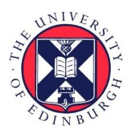
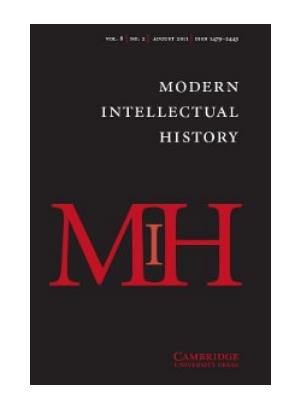

# Edinburgh Research Explorer

## **History as Form: Architecture and Liberal Anglican Thought in the Writings of E. A. Freeman**

**Citation for published version:**

Bremner, A & Conlin, J 2011, 'History as Form: Architecture and Liberal Anglican Thought in the Writings of E. A. Freeman', Modern Intellectual History, vol. 8, no. 2, pp. 299-326. <https://doi.org/10.1017/S1479244311000205>

**Digital Object Identifier (DOI):** [10.1017/S1479244311000205](https://doi.org/10.1017/S1479244311000205)

#### **Link:**

[Link to publication record in Edinburgh Research Explorer](https://www.research.ed.ac.uk/en/publications/af24b5c3-2c47-47ea-aa17-965053836695)

**Document Version:** Publisher's PDF, also known as Version of record

**Published In:** Modern Intellectual History

### **Publisher Rights Statement:**

With permisson copyright Cambridge University Press 2011. Bremner, A., & Conlin, J. (2011). History as Form: Architecture and Liberal Anglican Thought in the Writings of E. A. Freeman. Modern Intellectual History, 8(2), 299-326, doi: 10.1017/S1479244311000205

#### **General rights**

Copyright for the publications made accessible via the Edinburgh Research Explorer is retained by the author(s) and / or other copyright owners and it is a condition of accessing these publications that users recognise and abide by the legal requirements associated with these rights.

### **Take down policy**

The University of Edinburgh has made every reasonable effort to ensure that Edinburgh Research Explorer content complies with UK legislation. If you believe that the public display of this file breaches copyright please contact openaccess@ed.ac.uk providing details, and we will remove access to the work immediately and investigate your claim.

### **Modern Intellectual History**

http://journals.cambridge.org/MIH

Additional services for *Modern Intellectual History:*

Email alerts: Click here Subscriptions: Click here Commercial reprints: Click here Terms of use : Click here

### **HISTORY AS FORM: ARCHITECTURE AND LIBERAL ANGLICAN THOUGHT IN THE WRITINGS OF E. A. FREEMAN**

G. A. BREMNER and JONATHAN CONLIN

Modern Intellectual History / Volume 8 / Issue 02 / August 2011, pp 299 326 DOI: 10.1017/S1479244311000205, Published online: 28 July 2011

**Link to this article:** http://journals.cambridge.org/abstract\_S1479244311000205

#### **How to cite this article:**

G. A. BREMNER and JONATHAN CONLIN (2011). HISTORY AS FORM: ARCHITECTURE AND LIBERAL ANGLICAN THOUGHT IN THE WRITINGS OF E. A. FREEMAN. Modern Intellectual History, 8, pp 299326 doi:10.1017/ S1479244311000205

**Request Permissions :** Click here

# history as form: architecture and liberal anglican thought in the writings of e. a. freeman∗

### g. a. bremner and jonathan conlin

G. A. Bremner: Department of Architecture, University of Edinburgh Email: alex.bremner@ed.ac.uk Jonathan Conlin: School of Humanities (History), University of Southampton Email: J.Conlin@soton.ac.uk

*Traditionally viewed as one of the leading lights of Whig history in the High Victorian period, Edward Augustus Freeman (1823–1892) is best known for his* History of the Norman Conquest *(1865–1876). For all his reputation for scholarly pedantry, Freeman had wide-ranging interests, including architecture. His first book,*A History of Architecture *(1849), was both unique and controversial: unique in being the first history of world architecture in English, and controversial because its "philosophical" method differed so markedly from the two most common understandings of architecture in his own time (antiquarianism and ecclesiology). A closer look at Freeman's intellectual pedigree reveals links through Thomas Arnold to German idealist models of universal history. These links lead Freeman to open up a wider perspective on history by developing an understanding of the past based on an analysis of material culture. Architecture offered a window onto the "hidden law" by which human culture evolved. To study Freeman's historical writing on architecture is to gain a new insight into the development of the Liberal Anglican mind and its concern for a divinely ordained pattern in world history.*

We can trace in the arts and literature of a nation the mysterious symbolism of its inner mind, the unconscious expression of its position and tone of thought, according to the same hidden law which has caused those very diversities of which these works become the visible and tangible expression.1

Today the Victorian historian Edward Augustus Freeman (1823–92) is best known for his *History of the Norman Conquest, Its Causes and Results*

∗ The authors would like to thank Peter Mandler and the anonymous*MIH*reviewers for their comments on an earlier draft of this piece. Jonathan Conlin gratefully acknowledges the University of Southampton and in particular the Leverhulme Trust for funding research for this essay, as part of the latter's Early Career Fellowship scheme.

1 Edward A. Freeman, *A History of Architecture* (London, 1849), 13.

(1865–1876)—an opus, like its author, noted for being long-winded, pedantic and somewhat eccentric.2 Freeman's role as the self-appointed gatekeeper of rigorous, "scientific" history was rewarded in 1884, when his long-held dream of an Oxford professorship was finally realized. Opinionated as well as cantankerous, Freeman combined traditional heady scholarship with enthusiastic participation in contemporary debates concerning politics and empire. "History is past politics; politics is present history" is perhaps his most memorable quip. As a scholar, Freeman is often seen as taking his place alongside J. R. Seeley, William Stubbs, and J. R. Green in the rise of the Whig tradition of academic history.3 Supposedly un-Whiggish aspects of his historical method—most notably his racialism have either been ignored or downplayed as the personal eccentricities of a "Teutomaniac".4

More than two decades before the publication of his *Norman Conquest*, Freeman had already established himself in Oxford as an authority on architecture, having been an active member of the Oxford Society for Promoting the Study of Gothic Architecture. In this capacity he encouraged cooperation as well as a certain amount of frank dialogue between the Oxford society and its Cambridge counterpart, the Cambridge Camden Society (CCS, later the Ecclesiological Society). This led to his being commissioned to prepare a history of world architecture for Burns's Select Library, which appeared eventually with the publisher Joseph Masters as *A History of Architecture* in 1849. 5

4 Burrow, *A Liberal Descent*; and, more recently, Peter Mandler, *The English National Character: The History of an Idea from Edmund Burke to Tony Blair* (New Haven, 2006). For one exception, see C. J. W. Parker, "The Failure of Liberal Racialism: The Racial Ideas of E. A. Freeman", *Historical Journal* 24/4 (1981), 825–46. The "Teutomaniac" label was coined by Matthew Arnold.

2 As J. W. Burrow noted in his introduction to the abridged version of the *History*: "It would be absurd to deny that he can be crude, distasteful, silly, and even sheerly comic *...* Yet it is hard not to enjoy the cheerfully robust way in which Freeman enjoys his own prejudices, the genial unselfconsciousness and vigor and the slightly absurd combativeness." See editor's introduction to E. A. Freeman, *The History of the Norman Conquest*, ed. and abridged by J. W. Burrow (Chicago, 1974), xxv.

3 Above all J. W. Burrow, *A Liberal Descent: Victorian Historians and the English Past* (Cambridge, 1981). See also Philippa Levine, *The Amateur and the Professional: Antiquarians, Historians and Archaeologists in Victorian England, 1838–1886–*(Cambridge, 1986); and Peter R. H. Slee, *Learning and a Liberal Education: The Study of Modern History in the Universities of Oxford, Cambridge and Manchester, 1800–1914* (Manchester, 1986).

5 The change in publisher was motivated by James Burns's objections as a Roman Catholic to "a good many expressions here and there" in Freeman's manuscript of the *History*. Although the precise passages to which Burns objected are not identifiable it is clear that Burns already felt that "the High Ch[urch] Anglicans" had such animus towards him that it would be unwise to publish Freeman's work. James Burns to Freeman, 14 March

What makes Freeman worthy of study as an architectural writer is his understanding of architecture as a historical phenomenon whose institutional and aesthetic characteristics were shaped by "natural" processes of development. Central to this understanding was the idea of race. For Freeman, race acted as the underlying factor linking the natural, inborn intellectual aptitudes of a given people with their supposed artistic achievement. In taking this view, Freeman differed markedly from his contemporaries, divided on the one hand by attitudes to archaeological enquiry, represented by well-known antiquaries such as John Sell Cotman, John Britton, Thomas Rickman and Robert Willis, and on the other by the dogmatism of Tractarian fellow-travellers such as the CCS. In this context Freeman's *History of Architecture* represented a radical new perspective on architecture (at least in the English-speaking world). By marrying the comparative method in philology, politics, and history with the study of buildings, Freeman was able to arrive at an understanding of architecture that foreshadowed methods of interpretation based on anthropology and social science—methods more readily associated with scholarship in the twentieth century. John Ruskin's *Seven Lamps of Architecture*, although appearing in the same year as Freeman's *History*, presented architecture in a wholly different light, emphasizing the moral rather than historical nature of building. Unlike Ruskin, Freeman's aim was to codify architecture as a mode of analysis that would both reveal and substantiate the wider currents and patterns of human history. "The architectural monuments of every nation," Freeman asserts in the opening pages of his *History*, "cannot fail to throw light upon its history, institutions, and modes of thought".6 As far as Freeman was concerned, there was no merit in the study of architecture for architecture's sake; only architecture seen as evidence of something greater than its formal (i.e. stylistic) mutability—that is, as the "expression" of the character of man and his relative levels of cultural and spiritual attainment—was worthy of the historian's consideration.7

Race was doubly important to Freeman because it provided an alternative to the Whig idea that history was about mankind's march towards "civilization", a story of progress towards religious toleration, the nation state, and parliamentary

1848. John Rylands Library, University of Manchester (hereafter JRL), FA1/1/10. For other correspondence on this issue see FA1/1/9–12 (Burns) and FA1/1/72–3 (Masters).

6 Freeman, *History of Architecture*, 10.

7 In this his writing and its antagonism towards the archaeological tendency in architecture is reminiscent of Heinrich Hubsch and the "archaeology" versus "history" debate played ¨ out among German historians in the 1820s. Indeed, so close does Freeman's thinking on architecture come to Hubsch at times that one is left wondering if he did not know it. ¨ For Hubsch and the architectural debate in Germany see Barry Bergdoll, "Archaeology vs. ¨ History: Heinrich Hubsch's Critique of Neoclassicism and the Beginnings of Historicism ¨ in German Architectural Theory," *Oxford Art Journal* 5/2 (1983), 3–12.

democracy. Like his teacher at Oxford, the famous headmaster and Regius Professor of History, the Reverend Thomas Arnold (1795–1842), Freeman believed in the "unity of history"—the past understood as one, grand, unfolding drama in which various ethnic groups struggled in time to preserve and define their character and institutions within a divine order. Freeman believed that the rise and expression of Aryan culture was revealed through a series of conflicts with outside and opposing racial forces, such as "the Asiatic". Only by addressing such conflicts could the study of architecture be restored to its "proper position as a branch of mental philosophy".8

Arnold's influence on Freeman in this regard was considerable. Attending his inaugural lectures on modern history at Oxford in 1841–2, Freeman later described Arnold as "that great teacher of historic truth" from whom he "first learned what history is and how it should be studied".9 Arnold's underlying notion of "unity" is one that stayed with Freeman for the remainder of his life, forming the basis of his own approach to historical scholarship. In this respect, Freeman may be considered the intellectual progeny of Arnold. His *History of Architecture* is clearly haunted by Arnold's presence, thus making it a species of what Duncan Forbes has termed "Liberal Anglican" history.10 It is precisely this "idea" of history as defined by Forbes—this new *Weltanschauung*, inspired as it was by the anti-Rationalist "Germano-Coleridgean" tradition as filtered through Arnold—that influenced Freeman so profoundly and which opens a window onto his conception of architecture as a mode of historical analysis.

It is important to note, however, that Freeman was no blind disciple of Arnold. They may have shared a general idealist view of history, but they deviated on other points. Where Arnold believed the arts to be of only subsidiary importance to history, Freeman viewed them as essential to grasping its "pervading principles". The two men also differed on matters of theology and church organization. While Arnold abhorred Tractarianism, Freeman's aesthetic sensibilities naturally drew him to it. To be sure, Freeman was not seduced by the teachings of the Oxford reformers as many of his contemporaries were, but Tractarianism did alter and subsequently inform his understanding of the arts, especially architecture.11 This is where Freeman departed from Arnold's purely "liberal" perspective. For

8 Freeman, *A History of Architecture*, xi–xix. The label "philosophical architecturalist" was applied to Freeman by Beresford Hope. See Hope to Freeman, 17 Feb. 1853. JRL, FA1/1/50a.

9 W. R. W. Stephens, *Life and Letters of Edward Augustus Freeman*, 2 vols. (London, 1895), 1: 66.

10 Duncan Forbes, *The Liberal Anglican Idea of History* (Cambridge, 1952).

11 Stephens notes that the tone of Freeman's college (Trinity) was influenced significantly by Newman, Isaac Williams and Samuel Whyte. Freeman became especially intimate with Whyte. See Stephens, *Life*, 1: 43–4.

Freeman, Arnold's philosophical understanding of history and the "spirit" of Tractarianism were not necessarily incompatible. Both stemmed from certain Romantic impulses, and both contained aspects of "development" (in particular spiritual development) that Freeman was able to reconcile and synthesize in his own mind—the one concerning the "hidden laws" of human genius, the other its externalization.12 This allowed Freeman to see the world in a slightly different way to that of his master, but one no less spiritually determined, formulating what was less a history of past architecture than an architectural history of the past. This essay will consider the extent to which Freeman's approach to the understanding of architecture may be appreciated as a species of Liberal Anglican thought; or, put another way, how our interpretation of "Liberal Anglicanism" can (indeed should) be extended to include Freeman's writing on architecture.

### i

Before addressing the *History of Architecture*in detail it is important to appreciate the extent to which the project emerged from a set of debates that preoccupied Freeman and Oxford in the 1840s. Freeman came up to Trinity College in 1841, becoming a fellow after taking his degree. In 1844 he proposed to Eleanor Gutch. The pair wed in 1845, settling in Littlemore, a small village near Oxford where Freeman would write his *History*. Personal correspondence and unpublished poetry preserved among Freeman's papers at the John Rylands Library enable us to form a fuller picture of Freeman's search for a vocation in the 1840s than that presented by his nineteenth-century biographer, W. R. W. Stephens.

Even before he came up to Oxford, Freeman had been exploring the liturgical and historical traditions of Anglicanism in a Tractarian spirit, in correspondence with the Reverend Henry Thompson (1797–1878), author and curate of Wrington, Somerset. The pair first made contact in 1839, and Thompson became something of a mentor to the young Freeman. Thompson held that the Tractarians' views were "in the main *...* the views that have been ever entertained by all well-read Churchmen". "It was high time", Thompson believed, "to recal [*sic*] the wandering church to the settled principles of primitive and catholick Christianity—now called 'Puseyism', forsooth—it might as well be called Hookerism or Jewelism".13

12 Forbes is unwilling to make any connection between the Liberal Anglican tradition and Tractarianism; however, Romanticism affected both. See Stephen Prickett, *Romanticism and Religion: The Tradition of Coleridge and Wordsworth in the Victorian Church* (Cambridge, 1976). See also Owen Chadwick, *The Victorian Church*, 2 vols. (London, 1966), 1: 174.

13 Henry Thompson to Freeman, 2 Sept. 1839. JRL, FA1/7/733. A partial transcript is in Stephens, *Life*, 1: 24.

The Tractarians had indeed been claiming sixteenth- and seventeenth-century Anglican divines such as Richard Hooker (author of *Laws of Ecclesiastical Polity*) and John Jewel in support of their dogma. As Peter Nockles has argued, the strain of manipulating selective quotations to propagate the "myth of a unique Anglicanism" put terrible strain on Newman, who was complaining as early as 1836 that "Anglicanism" (i.e. Anglicanism as a discrete doctrinal corpus) was nothing but a "paper theory".14 Thompson felt no strain, however, and his views on the seventeenth-century Nonjurors and the sacral role of the King as supreme head of the church closely match those of "Old High Churchmen".15

Thus when Freeman arrived at Oxford in 1841 he was already an Anglo-Catholic. In his personal habits at Trinity he and his friends attended chapel twice a day and abstained from dinner on Wednesdays and Fridays, although they also abstained from the mortifications practised by others of the same persuasion. In the climate of the 1840s Freeman's behaviour would not have been viewed as peculiar, but it would certainly have put him in the "at-risk" category. In early 1846 his close friend Samuel Wayte saw Freeman's attitude to his church as having strong similarities to that of the high-minded Richard Hurrell Froude (1803–36), Tractarian firebrand and one-time fellow at Oriel College.16 Around the same time, Eleanor was worried that her fiance was spending so much time ´ with Wayte and other friends with "a leaning towards Rome".17

Among Freeman's papers in the Rylands Library is a bound manuscript collection of his poems from 1840 to 1844. Thanks to Henry Thompson, several of them were subsequently published.18 Thompson published translations of two of Schiller's plays in 1845, and doubtless encouraged Freeman's taste for sorrowful yet self-righteous admiration for the Middle Ages, expressed in a style redolent of the *Kunstfr¨ommigkeit* ("art-piety") of German Romantics such as Wilhelm Heinrich Wackenroder. Much like Froude's poetry, Freeman's ballads are steeped in nostalgia for a blissful medieval age of cathedrals, crusading knights and blushing maidens, when all altars were well garnished and all lances well lubricated with "paynim gore".

"A Rime of Old Things and New" (1842) is characteristic. After a rousing description of a battle during the crusades, in which "The Teuton's deathful

14 Peter Benedict Nockles, *The Oxford Movement in Context: Anglican High Churchmanship, 1760–1857* (Cambridge, 1994), 129, 130–33.

15 For his reaction to the controversies surrounding the appointment of Bishop Hampden of Worcester and H. G. Ward see Henry Thompson to Freeman, 29 Nov. 1847 and 1 May 1848. JRL, FA1/7/752 and 755.

16 Stephens, *Life*, 1: 72.

17 Freeman to Eleanor Gutch, 1 Feb. 1846. Stephens, *Life*, 1: 87.

18 In the anthologies he edited: *Poems Legendary and Historical* and *Original Ballads by Living Authors* (both 1850).

frown" glares "from double panoply of arms and prayers", Freeman turns wistfully to his own times:

O for the gold:decked shrines of other days, Chalice, and cross, and taper's mystick blaze, And windows pouring from their painted height Through saints of old their dim and trembling light, The clustered shafts, the arches spiring high, Each sculptured marvel pointing to the sky, The boundless temple's awe, as far and wide, Aisle, chapel, transept, rear their Gothick pride; The daily Host on each dread Altar laid, The seven:fold orison to Jesus paid. *...*

Where is thine Altar, where thy carved skreen? ¨ I see but relicks of what once hath been. The spoiler's hand hath seized what erst was thine, And deems it loss to deck thine holy shrine.19

Such verse's sacramentalism, liturgical appetites, and critique of latter-day "restorers" shows strong ecclesiological sympathies. Although he claimed to have abandoned such plans by May 1846, for several years Freeman considered taking up architecture as a profession, and may have prepared designs for a chapel at Wantage.

The poems also show Freeman's interest in the Norman Conquest, several years before his 1846 Oxford prize essay on the subject. Though it did not win, this essay, entitled "The Effects of the Conquest of England by the Normans", was a source of considerable pride to Freeman, and researching it played a crucial role in its author's decision to abandon ideas of a career in either the church or architecture. It sought to demonstrate "in what sense England has ever [i.e. always] retained independence", how "her successive conquests" by "strangers" were "territorial" rather than "political" ones.20 Freeman begins his essay with what seems to be a fairly typical "Norman yoke" interpretation of the Conquest: the "native English" degraded into "an inferior and vanquished race" by Norman lords, who import an oppressive feudal system, stamping out any spark of ancient Saxon liberties. But he then resolves this violent picture of total annihilation into a peaceful scene of total assimilation of two races which are really no "strangers" at all. By reuniting these two Teuton races and their political systems, "the overthrow of the English led to the greatness of England".21

19 Freeman, "A Rime of Old Things and New". JRL, FA3/3/2.

20 Freeman, "The Effects of the Conquest of England by the Normans", f. 1. JRL, FA3/3/4.

21 Freeman, "Effects of Conquest", f. 46. JRL, FA3/3/4.

As mentioned, Freeman attended Arnold's inaugural lecture series as an undergraduate in 1841–2, and both his unpublished essay and his 1849 pamphlet entitled *Thoughts on the Study of History* make his debt to Arnold clear. In his inaugural, Arnold made a distinction between the traditional understanding of history as an exercise in memorizing battles, which he called the "external" part of history, and the "inner life of a nation", centred around each nation's "main object": the "setting forth of God's glory by doing His appointed work".22 "Modern history" began with the collapse of the Roman Empire, and was modern precisely because it was in the Teutonic invasions that our story, that of "our blood, our language", began.23

Although there had been no mixture of blood, the Teutons had nonetheless picked up the torch of civilization from the Romans; in a sense "the German race" was the fertile soil in which the Roman civilizational "seed" had germinated.24 While the Teutonic races had thrived, other races had fallen out of God's Providential race due to "exhaustion", leaving "us" with no "soil" in which to deposit our seed. We were God's "last reserve"; our isolation was itself a sign of the "end times". Modern history, Arnold concluded, bore "marks of the fulness of time, as if there would be no future history beyond it".25

Through his working knowledge of German, Arnold had been exposed to the *Altertumswissenschaft* method of historical analysis by 1825, in particular the writings of Barthold Georg Niebuhr (1776–1831), a Danish bureaucrat in Prussian service who distinguished himself in retirement as a historian of ancient Rome. Arnold taught himself German specifically to read Niebuhr's *R¨omische Geschichte* (1811–32). His efforts did not go unrewarded. The work was a complete revelation, opening up a whole new "intellectual world" and laying "wide before my eyes the extent of my own ignorance".26 Niebuhr preferred to study Roman songs rather than legal or constitutional documents. For him it was language which evolved, not the constitution or constitutional principles. Poetry contained the *Saft und Kraft* (essence and strength) of a people's lived experience, and the historian's duty was to immerse himself in it totally, to forget his own time entirely.27 Niebuhr was adept at making analogies across the centuries with the histories of other

22 Thomas Arnold, *Introductory Lectures on Modern History, Delivered in Lent Term, 1842*, 2nd edn (London, 1843), 13.

23 Ibid., 24.

24 Ibid., 26 (Germanic race), 29 (seed).

25 Ibid., 28.

26 Arnold quoted in Arthur Stanley, *The Life and Correspondence of Thomas Arnold, D.D.* (London, 1844), 43.

27 Peter H. Reill, "Barthold Georg Niebuhr and the Enlightenment Tradition", *German Studies Review* 3/1 (Feb. 1990), 9–26, 16. Reill translates *Saft* as "flavour", when "essence" seems more apposite.

nations, including English history, though he drew the line at supposedly static non-European civilizations that had no history at all.28 It was the social evolution of nations that determined their particular character and gave their achievements meaning. Thus, following Niebuhr's lead, Arnold was able to present the idea of modern history in his Oxford lectures as one of process; that is, the rise, fall and assimilation of distinct cultural configurations. The ebb and flow of these patterns over time, along with their interconnectedness, is what gave history its apparent "unity".

Arnold and Niebuhr offered Freeman a way around the nostalgia that dogged "A Rime of Old Things and New" by means of historical analogy. For Arnold the analogy between the Spartans in Laconia and the Normans in England collapsed into identity: the Spartans *were* Normans, the Normans Spartans.29 Such superimpositions enabled us to do more than reconstruct the past in telling it; we could experience it on a level denied those actually present at the original event. Thus Freeman writes in his *Thoughts on the Study of History* that we are "more truly present" at Hastings than those who actually fought there.30

Alongside Arnold we should also consider John Henry Newman as an influence on Freeman's historical thought, and in particular Newman's concept of the "development of doctrine". Newman first advanced the concept in a sermon at St Mary's in February 1843, later expanded into the book-length *Essay on the Development of Doctrine* (1845). The manuscript of the *Essay* was completed shortly before Newman's conversion on 9 October, and appeared shortly afterwards. Although Owen Chadwick has drawn up a pedigree for "development" that goes back through German Liberal Catholics, he argues that Newman picked up the concept from W. G. Ward.31 Newman spoke of doctrine in quasi-architectural terms, as a "large fabric of divinity *...* irregular in structure". For all the apparent irregularity in its course, Newman insisted that doctrine "evolved" in the minds of Christians. Though the "common origin" that ultimately connected its manifold forms was always perceptible, "development" also involved reacting to alien or mutant strains of doctrine. Even heresy could function as a spur to "fresh forms" and "farther developments".32 The book proposed a series of seven tests by which true developments could be distinguished

28 Barthold C. Witte, *Der preussischer Tacitus: Aufstieg, Ruhm und Ende des Historikers Barthold Georg Niebuhr, 1776–1831* (Dusseldorf, ¨ 1979), 192.

29 E. A. Freeman, *Thoughts on the Study of History with Reference to the Proposed Changes in the Public Examinations* (Oxford, 1849), 35.

30 Ibid., 8.

31 Owen Chadwick, *From Bossuet to Newman: The Idea of Doctrinal Development* (Cambridge: Cambridge University Press, 1957), 116, 119.

32 J. H. Newman, *Fifteen Sermons Preached before the University of Oxford, between A.D. 1826 and 1843* (London, 1872), 317.

from false. As Chadwick has noted, the book met with confused embarrassment from Rome as well as from leading English Roman Catholics. Even today it is often misconstrued as justifying any and all innovations in doctrine, a misreading common among Anglican critics of Newman at the time (such as J. B. Mozley).

It must be admitted that Freeman's published writings do not acknowledge a debt to Newman as they do to Arnold. The ructions caused by Newman's conversion may have made it unwise to do so. Yet, as David Brownlee has noted, Newman's concept of the development of Christian doctrine must have seemed pregnant with explanatory potential for Freeman.33 Newman's book was a heroic attempt to find a *via media* between Anglican claims to embody the "primitive church" and Roman Catholic acceptance of Marian and other doctrines not supported by the letter of "primitive revelation". After Newman's conversion Thompson wrote to Freeman in terms that suggest that both were familiar enough with the idea:

It is my great comfort that Newman and his followers have not "developed" Church principles into Romanism, but have been obliged to abandon Church principles in order to be Romanists. The Development Theory places Romanism in bold and avowed opposition to Catholicism *...* Rome cannot stand upon antiquity.34

Unfortunately we do not have Freeman's reply to this letter. A closer discussion of Freeman's *History* suggests that he did not join Thompson and Mozley in dismissing "The Development Theory", but—like William Ewart Gladstone saw it as a spur to his own thought on "development".35

### ii

Just as Arnold had encouraged the student of history to immerse himself in the literature of a given period so that he might appreciate better its "prevailing tone of opinion and feeling," so too, he believed, should the student "enquire into the state of art, whether in painting, sculpture or architecture".36 This advice not only confirmed Freeman's instinctive prejudice for the true value of architecture

33 David Brownlee mentions the influence of Newman in Freeman's thinking on architecture but does not mention Arnold. See David B. Brownlee, "The First High Victorians: British Architectural Theory in the 1840s," *Architectura* 15/1 (1985), 35–7.

34 Henry Thompson to Freeman, St Stephen's Day (26Dec.)1845. JRL, FA1/7/749, underlining in original.

35 See Jonathan Conlin, "Gladstone and the Debate on Evolution", in David Bebbington, Roger Swift and Ruth Windscheffel, eds., *Gladstone: Bicentennial Essays* (Aldershot, forthcoming).

36 Arnold quoted in Forbes, *Liberal Anglican Idea*, 130.

as historical evidence, but also justified his close study of it.37 By Hilary Term of his first year at Oxford (1841–2) Freeman had already become an active member of the recently established Oxford Society for Promoting the Study of Gothic Architecture (commonly known as the Oxford Architectural Society, OAS).38 In the years that followed he would spend a considerable amount of time discussing architecture with his friends and going on excursions to historic sites in and around Oxfordshire, Northamptonshire and Leicestershire.39 These activities fed directly into his association with the society. He regularly gave lectures at its meetings and frequently contributed pieces to its journal, the *Rules and Proceedings*. 40

Founded in February 1839, the OAS was, in spirit at least, an outgrowth of the Oxford Movement. Many of its founding members were keen Tractarians who could see that architecture was essential to the full and thoroughgoing process of Anglican renewal.41 The society's remit was not merely the study of medieval architecture for its own sake—as meritorious as this was—but the promotion of a particular understanding of Gothic architecture that would lead to an appreciation of its "true" catholic and Christian principles. The activities and publications of the OAS quickly generated interest within Oxford and beyond, with its membership reaching over four hundred by the time Freeman became secretary in 1845, including a number of prominent clergymen and architects.

The general interest in medieval architecture and its revival in England at the time owed much to the agitations of the indefatigable A. W. N. Pugin (1812–52). However, as Pugin was a Roman Catholic, the enthusiasm he had whipped up in favour of the Gothic required a legitimate Anglican voice if it was to avoid

37 Freeman had always said that Arnold's "true" method "ought to be the centre and life of all our historic studies; the truth of the unity of history". Stephens, *Life*, 1: 66. It is possible that Freeman was also influenced in his "philosophical" approach to the understanding of architecture by the Rev. William Sewell, Dean of Exeter College (later president of the OAS). A staunch Tractarian, Sewell was among the first in the OAS to outline a theory concerning the principles and symbolic meaning of Gothic architecture along philosophical lines. See *Rules and Proceedings of the Oxford Society for Promoting the Study of Gothic Architecture* (June 1840), 44.

38 Freeman came up to Oxford in Michaelmas Term 1841 and joined the society in March 1842. He was twice secretary of the OAS, 1845 and 1846–7; librarian from 1847; and, in later life, president from 1886–91.

39 Stephens, *Life*, 1: 51.

40 For an in-depth account of Freeman's association with the OAS see Christine Dade-Robertson, "Edward Augustus Freeman and the University Architectural Societies", *Oxoniensia* 71 (2006), 151–73.

41 For the connection between the OSPSGA and the Oxford Movement see S. L. Ollard, "The Oxford Architectural and Historical Society and the Oxford Movement", *Oxoniensia* 5 (1940), 146–60.

being condemned as mere "Popery".42 This was in part the aim of the OAS. Although James F. White has observed that the society was not particularly concerned with modern church building, it nevertheless sympathized with this cause.43 In fact, as Freeman's diary reveals, the formation of the Brotherhood of St Mary—an obscure offshoot of the OAS comprising society members that was established in Freeman's rooms in 1844—considered its basic aim to be the study of "ecclesiastical art upon true and Catholic principles".44 Such thinking infused and influenced the outlook of the OAS in various ways.45

The OAS was not alone in advancing the cause of Gothic architecture. There was, of course, the Cambridge Camden (later Ecclesiological) Society. The CCS was formed shortly after the OAS in May 1839, and is now more widely recognized for its contribution to the practice and development of modern Anglican church design and restoration in the nineteenth century. Like the OAS, the CCS was inspired by the Oxford Movement and its reforming zeal. More so than the OAS, however, the CCS was the practical arm of Tractarianism.46 It soon assembled a coterie of designers that would became a veritable who's who of Victorian church architecture, including G. G. Scott, William Butterfield, G. E. Street, G. F. Bodley and William White.47

Following Pugin's lead, the CCS insisted upon a far more archaeologically accurate approach to the revival of Gothic architecture. They felt that much of what passed for modern church architecture in England (whether classical or Gothic) was nothing more than an insipid and fraudulent sham. They described their approach as ecclesiology, or the "science" of church design and restoration, and promoted it with vigour in the pages of their principal publication, the *Ecclesiologist*. For a number of years the CCS determined upon a version of late

44 As stated in Stephens, *Life*, 1: 58.

- 46 The CCS saw its remit as covering "Church Building at home and in the Colonies; Church Restoration in England and abroad; the theory and practice of ecclesiological architecture; the investigation of Church Antiquities; the connection of Architecture with Ritual; the science of Symbolism; the principles of Church Arrangement; Church Musick and all the Decorative Arts", *Ecclesiologist*, n.s. 1/1 (1845), 1.
- 47 For the history and wider influence of the CCS see Christopher Webster and John Elliott, eds., *"A Church as It Should Be": The Cambridge Camden Society and Its Influence* (Stamford, 2000). See also White, *The Cambridge Movement*.

42 John Ruskin had also played a crucial role in extricating the revival of medieval architecture from the idea of Roman Catholicism by taking it beyond a question of religion and transforming it into one of morality. See Michael Brook, *John Ruskin and Victorian Architecture* (London, 1987), 33–60.

43 James F. White, *The Cambridge Movement: The Ecclesiologists and the Gothic Revival* (Cambridge, 1979), 42–3.

45 Ollard, "The Oxford Architectural and Historical Society", 149. See also W. A. Pantin, "The Oxford Architectural and Historical Society, 1839–1939", *Oxoniensia* 4 (1939), 162–94.

thirteenth- and early fourteenth-century English Gothic, or "Middle Pointed," as the only sound and therefore acceptable model for modern church architecture.48 Anything prior to this date was considered too primitive, while anything much after it (especially Perpendicular) was perceived as whimsical and therefore debased.49

Freeman, who was a corresponding member of the CCS, had always railed against this narrow and restricted assessment of Gothic architecture. Although he too accepted medieval architecture as the only proper basis for modern church design, his own preferences regarding style occupied both ends of the CCS spectrum: Romanesque and Perpendicular. To Freeman, the true value of medieval architecture lay not in any one fixed or arbitrary point of "perfection" but, as with the comparative method, in the process of its development as a distinct cultural form. It was primarily this insight that enabled him to appreciate the whole of medieval architecture—what in essence was a continuous working out of the Teutonic spirit—in a way that the CCS could not.

Freeman first tested this idea in a paper he delivered at a meeting of the OAS in March 1843 entitled "On the Progressive Development of the Several Styles of Architecture, and the Connection of Each with the Spirit of the Age in Which It Arose".50 In this paper Freeman laid down the same thesis he would later develop in his *History*. As the paper's title suggests, his basic point was that architecture should be understood, and therefore appreciated, as a logical outgrowth or manifestation of the culture in which it was produced. This interpretation of architecture clearly exhibited the influence of Arnold, in particular his call to seek out the "tone of opinion and feeling" of a people through examination of its various forms of expression. Freeman's first attempt at relating this concept to architecture, however, fell on deaf ears. It was not until two years later, in November 1845, that he was able to restate his thesis in a lecture entitled "Development of Roman and Gothick Architecture, and Their Moral and Symbolical Teaching"—the title this time reflecting what had come to be expected of ecclesiological discourse, with key words such "moral" and "symbol". In this lecture Freeman was at pains to stress the underlying meaning of architecture (what he called its "philosophical principles") rather than its aesthetic or "outward beauties". "If Architecture, the first of arts, if Ecclesiastical Architecture, its noblest

48 See, for example, *Ecclesiologist* 1/6 and 1/7 (April 1842), 96–7.

49 By the late 1840s the CCS had relaxed its attitude on this point and was willing to look farther afield for inspiration, especially to continental Europe. One of the major turning points in this regard was the publication in 1848 of Benjamin Webb's *Sketches of Continental Ecclesiology*. For Webb see J. Mordaunt Crook, "Benjamin Webb (1819–85) and Victorian Ecclesiology", in R. N. Swanson, ed., *The Church Retrospective* (Melton, 1997), 423–55.

50 *Rules and Proceedings* (March 1843), 11–12.

form, be something more than a stock of details for antiquarian research, or of picturesque effects for the pencil, or of mere aestheticks in any shape", he insisted,

we must look on its successive changes not as the result of mere chance, or of the caprice or taste of individual architects, but as the developments of some great philosophical and moral principles, intimately connected with the spirit and feelings of the successive ages in which they arose; and not merely as arising from them, but as being best suited for them, best calculated, each in its own day, to produce that moral effect which is the end of all art *...* and, if art be moral, if Architecture be the chief of arts, thus to narrow and limit its teaching, shews as little perception of its inward depth of meaning, as of its merely outward beauties.51

In emphasizing "inward" content (a concept akin to Arnold's "inner life") over outward form, Freeman was extending a challenge to the doctrinaire position of the Cambridge Camden Society. He was criticizing not only its insistence on Middle-Pointed as the only style worthy of admiration (and imitation), but also its endorsement of the recent translation by John Mason Neale and Benjamin Webb of the thirteenth-century treatise on church symbolism by William Durandus, the *Rationale Divinorum Officiorum*. 52 Freeman believed the *Rationale* to be totally subjective and therefore groundless either as a record of the true meaning of medieval architecture or as an aid to modern design. To focus on the arbitrary and "over-minute allegorizing" of Durandus was, in Freeman's mind, to miss the wood for the trees. The real meaning of architecture lay not in "mere detail" on the surfaces of buildings but in "proto-symbolism".

Proto-symbolism was fundamental to Feeman's understanding of architecture. It represented an elemental, first-order symbolism evident only in the underlying mass and formal character of a building—what he later referred to in his *History* as the "grand features of outline and composition".53 This particular understanding of architecture demonstrated Freeman's distaste for the fetishization of extraneous symbolism to which many of his Anglo-Catholic colleagues were increasingly drawn. Like his initial interpretation of the Norman Conquest, Freeman's insistence on proto-symbolism was essentially idealist. It displays the hallmarks of a Liberal Anglican reading of the past that presupposes the true meaning of phenomena to be comprehensible only in the context of historical development. To Freeman, proto-symbolism was more significant than "aesthetick" symbolism precisely because it was a method of analysis that revealed

51 E. A. Freeman, "Development of Roman and Gothick Architecture, and Their Moral and Symbolical Teaching," *Rules and Proceedings* (Nov. 1845), 24.

52 John Mason Neale and Benjamin Webb, *The Symbolism of Churches and Church Ornaments: A Translation of the First Book of the Rationale Divinorum Officiorum, written by William Durandus ...* (Leeds, 1843).

53 Freeman, *History of Architecture*, 8.

in architecture the fundamental organizing principles of society. It had practical benefits too, for it was from this type of symbolism that the most immediate moral "lessons" might be gleaned, both historical and spiritual. Again, this appeal to the moral and spiritual capacity of history reveals the teaching of Arnold. "Romanesque Architecture has to convey the great lesson that the Church is everlasting on earth," explains Freeman,

that neither the storms of persecution, nor the subtler snares of internal corruption, can avail to overthrow her; that she is firm and immovable from her foundations. This is expressed by giving the building a character of physical firmness and immovability; huge, unbroken walls, massive columns, heavy arches, all combine to produce this effect.54

Unlike the previous occasion that Freeman presented his theory, this time the CCS sat up and listened. This no doubt had much to do with the fact that he had charged them with a particular "narrowness of conception". So incensed were the CCS by Freeman's jibe, and so desirous to repudiate it, that they attacked him for several months in the pages of the *Ecclesiologist*, printing an especially long-winded and devastating critique of his theories in the June edition of 1846. 55 Unwilling, or perhaps unable, to appreciate Freeman's ideas, the CCS countered his criticism by suggesting that proto-symbolism was no less arbitrary, describing it as nothing more than a "curious metaphysical process" applied *ab externo*. 56

Freeman and the CCS were not entirely at odds, however. A careful examination of their respective positions on symbolism reveals that neither completely dismissed the ideas of the other, only that they placed their emphases differently. For example, in its critique of Freeman, the CCS conceded that all true Christian architecture was a "compacture" of proto-symbolism and aesthetic symbolism, or what it called the "symbolism of Catholic dogma and practice". It was just that the latter of these two (according to the *Ecclesiologist*) was more significant because it offered access to the specific and peculiar nature of Christian architecture.57 Despite this apparent divergence of opinion, both Freeman and the CCS were moving firmly in the direction of a developmental theory by 1846.

Freeman, it must be said, had been grappling with ideas of development in architecture long before Neale, Webb and the CCS. One factor that may have hastened their apparent convergence over the matter was the intervention of the then chairman of the CCS (by now the Ecclesiological Society), A. J. B. Beresford Hope (1820–87).58 Hope had established an acquaintance with

54 "Mr. E. A. Freeman's Reply to the Ecclesiologist," *Ecclesiologist* 2/11 (May 1846), 181.

55 *Ecclesiologist*, n.s. 5 (1846), 53–5, 177–86, 217–49.

56 *Ecclesiologist*, n.s. 5 (1846), 220.

57 *Ecclesiologist*, n.s. 5 (1846), 220–22.

58 Beresford Hope was one of the earliest and most active members of the CCS. He was the youngest son of the noted antiquary and collector Thomas Hope (1769–1831), and

Freeman in September 1845, and the correspondence between the two reveals a far more friendly and respectful relationship than that conveyed in the pages of the *Ecclesiologist*. In reaching out to Freeman and the OAS in this way, Hope was admitting Freeman's desire to have his theories acknowledged and respected by the increasingly influential CCS, while garnering support for the Camdenians' reformed attitude towards modern church design.59

If Freeman's theory of development was concerned with the historical interpretation of architecture, then Beresford Hope's was associated more with contemporary design. Hope believed that modern British architecture had reached an impasse by the 1840s. It no longer appeared to bear the stamp of artistic progress, languishing as it was in a quagmire of recycled historic styles. It lacked the essential *animus* recognizable in past architectural epochs, whether medieval or classical. To counter this predicament Beresford Hope began encouraging British architects to create a new, "developed" style of architecture by synthesizing a wide range of forms and materials, not just from within Britain but from around the world.60

Hope may have aimed squarely at the problem of contemporary architectural design but his ideas nevertheless contained an air of that "philosophical" principle characteristic of Freeman's theories. As David Brownlee and Michael Hall have observed, it is indeed likely that Beresford Hope acquired this penchant for the notion of development from Freeman.61 But, again, such ideas were already in circulation more generally by 1846. This makes it difficult to pin Beresford Hope

someone who had already amassed a considerable knowledge of architecture by the time he joined the CCS in 1840. See H. W. Law and I. Law, *The Book of the Beresford Hopes* (London, 1925).

59 See JRL, FA1/1/38a–46 and 61a–66.

60 This process was imagined as a sort of cross-fertilization of stylistic pedigrees. The caveat, however, was that Gothic—preferably English Middle-Pointed Gothic—would remain the foundation style, or "main ingredient," as Beresford Hope described it, onto which the foreign elements would be grafted. J. Mordaunt Crook has described Beresford Hope's idea as "progressive eclecticism". See "Progressive Eclecticism: The Case of Beresford Hope", in J. Mordaunt Crook, *The Architect's Secret: Victorian Critics and the Image of Gravity* (London, 2003), 85–120.

61 Brownlee, "The First High Victorians," 42–3; Michael Hall, "'Our Own': Thomas Hope, A. J. B. Beresford Hope and the Creation of the High Victorian Style", *Studies in Victorian Architecture and Design* 1 (2008), 68. One can see this "doctrine" beginning to characterize Beresford Hope's writing in two articles that appeared shortly after his first meeting with Freeman. See A. J. B. Beresford Hope, "Past and Future Developments of Architecture," *Ecclesiologist*5(Feb. 1846),52; Anon. (A. J. Beresford Hope), *Saturday Review*, 29 Jan. 1856, 236.

and the CCS's change of heart down to any one source.62 There had not only been Robert Chambers's *Vestiges of the Natural History of Creation* (1844) and Newman's *Essay*, but also Charles Lyell's *Principles of Geology* (1830–33). Indeed, as Beresford Hope had indicated to Freeman in March 1846, the Ecclesiological Society was now "impressed with the feeling that Christian architecture must be developed to suit present exigencies".63 The idea of development was now exerting its influence with full force in the world of British architecture, and Freeman must have felt that the time was right to apply his method in a more extended and substantial manner.

### iii

"The term style is one in itself not very easy to define", Freeman writes in the introduction to his *History*, "and its use in architecture is more especially vague, as it serves to denote alike the most comprehensive and the most minute divisions under which architectural works may be arranged". He outlines three different ways of conceiving "style": as an antiquarian term serving to locate a building in a certain age and country; as a way of arranging buildings according to "some easily recognized circumstance of construction or detail"; and finally as exemplifying "some pervading principle, of which details are merely more or less perfectly developed instances". These three means of deploying style represented an "ascending scale", with the last being "the highest and most scientific".64 By "style" Freeman means all by which we recognize architecture as a cultural artefact: form and construction, as well as decor (i.e. "detail").

Like its author, *A History of Architecture* is caught between a desire to classify specific buildings by country or construction (deploying "style" in the first and second of the three senses of the term) and a fascination with tracing the process by which a "pervading principle" ("style" in the third sense) manifests itself in buildings spread across time and space. On the one hand, isolation, purity and stasis were necessary to identify the characteristics of a specific style, to make fine distinctions; on the other, juxtaposition, assimilation and change (what Freeman called "transition") were constantly blurring those distinctions. Freeman is pulled

62 Michael Hall, "What Do Victorian Churches Mean? Symbolism and Sacramentalism in Anglican Church Architecture, 1850–1870", *Journal of the Society of Architectural Historians* 59/1 (March 2000), 81–3.

63 Hope to Freeman, 31 March 1846. JRL, FA1/1/38a. The real turning point for the Ecclesiological Society on the matter of "development" was George Edmund Street's keynote address in 1852, "The True Principles of Architecture, and the Possibility of Development", *Ecclesiologist* 10/55 (Aug. 1852), 247–62.

64 Freeman, *History of Architecture*, 17–18.

both ways: the theorist speaks of styles as pure, fixed forms; the historian prefers to speak of styles as "streams" that divide and recombine, "sometimes remaining parallel and distinct, sometimes converging and commingling".65

This understanding of architecture has interesting parallels with the insights and concepts of natural science. The Liberal Anglicans recognized analogies between evolution in the natural world and the developmental processes of history, even if they understood them as distinct phenomena.66 Architects and antiquaries, too, had established theoretical and methodological connections between architecture and natural science by the 1840s.67 Indeed, if we were to use the scientific vernacular of Freeman's own day, then we might say that he was both a Cuvierite and a transmutationist. In a similar vein to the French comparative anatomist Georges Cuvier (1769–1832), Freeman positions style as a fixed, eternal archetype, understood as principles of construction. Where Cuvier classifies life into rough categories according to whether it has a shell (Mollusca), a radial form (Radiata) or a spinal chord (Chordata), Freeman classifies buildings by whether they are constructed around caves, entablatures or arches. He does, in fact, use the word "type" interchangeably with "style". Thus, for Freeman, resemblances between the buildings of widely scattered peoples are not indications that those peoples were of one race or even influenced each other. This is because "architecture is in most countries a plant of indigenous birth, and has everywhere passed through the same, or at least analogous, stages".68 Thus the similarities between Indian and Egyptian architecture reflect an "analogous origin", not imitation of one by the other.69 As one works one's way through the *History* from Incas and Aztecs through Greeks and Romans to the heights of Gothic, Freeman becomes more and more transmutationist; so much so that one begins to suspect that as far as its author is concerned *all* architecture is under "development", and the greatest architecture is "in a state of almost incessant flux".70 All styles are "transitional styles, periods of progress from one principle to another". Freeman's enthusiasm for them is clear:

65 Ibid., 164.

66 Forbes, *Liberal Anglican Idea*, 145.

67 See Carla Yanni, "On Nature and Nomenclature: William Whewell and the Production of Architectural Knowledge in Early Victorian Britain," *Architectural History* 40 (1997), 204–21.

68 Freeman, *History of Architecture*, 47. It was not uncommon for Freeman to use biological metaphors such as this in his writing on architecture. For example, in comparing English Perpendicular with French Flamboyant in his 1845 essay "Development of Roman and Gothick Architecture", 30, he observed that they did not differ essentially, but "only as species from species".

69 Freeman, *History of Architecture*, 52.

70 Ibid., 12.

The forms produced by these transitional periods are generally, in an aesthetical point of view, the most unsatisfactory of all *...* But in an investigation of the history of art no periods are so replete with interest; every stage, every minute detail, illustrates the combat of antagonist principles; the struggles of the decaying style, receding step by step from the scene of its ancient sovereignty; the sure though slow inroads of its successor, first grasping the main features of construction, then gradually bringing within its power the details of shaft, and capital, and moulding, till all are fused into a perfect whole; are at once a subject of most curious inquiry, and one tending to point out more strongly than any other part of their history, the real animating principles of successive styles, and to supply also a valuable commentary on the two great rival principles in the human mind itself.71

With the benefit of hindsight the historian is able to perfect or complete the "transitional" style in his own imagination.72

The *History* is divided into two books. The first is devoted to "Architecture of the Entablature" and begins by considering the ancient civilizations of Central and South America as well as India and Persia, whose architecture is seen as beyond or below discussion, due to insufficient evidence or "fixed depravity of taste".73 James Burns's original commission had been for a "'manual of architecture' *...* a well filled duodecimo vol[ume] of about 400 pages—which should embrace architecture generally, from the earliest ages and embrace every form of the art secular as well as ecclesiastical".74 In his introduction Freeman is candid enough to admit that he had to "get up" large parts of Book One in order to fill this brief, something he found "a wearisome task".75 He steers clear of historiographical minefields such as the debate over the degree of influence Indian and Egyptian architecture had on each other, and only espies his first "style" when he comes to the latter.

Already we get a fuller sense of how Freeman defines "style" (which does seem here to overlap significantly with "type"): it must express "an idea", protected by "laws of taste" and consistent expression from becoming "mere fancy". This is the moral imperative of Freeman's method making itself felt. Egyptian architecture is in "an excavated style", its buildings and their elements, such as their columns, with their "reverse diminution", are all related to the cave "type". Thus the use of bracket capitals betrays "the idea of original cohesion between the support and the mass supported", whereas "in a constructed style" such additional weights on

71 Ibid., 16.

72 Ibid., 163.

73 Ibid., 48.

74 James Burns to Freeman, 7 Dec. 1846. JRL, FA1/1/8.

75 Freeman, *History of Architecture*, viii.

the pillar are avoided, so as not to compromise the "appearance of security".76 Although this "particular origin" of a style in a type of construction could never be entirely obscured, "the fact of a style having one particular origin" did not prevent a certain amount of borrowing.77

Freeman thus begins by discussing style as a principle of construction, or perhaps a building "type". Unfortunately this suggests that Greek and Egyptian architecture on the one hand and Roman and Gothic on the other are in some way related. Freeman the Christian racialist refuses to accept this, and devotes several pages to proving that "there does not appear to be any resemblance between the two styles [Greek and Egyptian], beyond that which cannot fail to exist between any two which employ the same construction". Such resemblances that do exist are "details"—which, as already noted above, are of little interest to Freeman. Fundamental differences in religion and temperament were key to this interpretation. He also employs climate theory to widen the gap—a vestige of the Niebuhrian method as translated through Arnold.78 For Freeman, it is ultimately the higher "national character" and greater "national originality" which distinguishes the Greeks.79

Although he clearly admires Greek architecture, it is already clear from the second part of Book One that the agenda of the *History* is to propose that Gothic is "the most perfect form which the art [of architecture] can assume".80 If such a suggestion in itself was by no means controversial by 1849, the method by which he arrived at it certainly was. As with his preliminary essays on the topic of medieval architecture discussed above, Freeman was not only seeking to readjust the relative worth assigned each style in architectural history, but also proposing an entirely new system of assessing that worth. It is this approach that distinguishes Freeman from his contemporaries. Part of the problem, of course, was the Renaissance. In a passage reminiscent of Pugin, Freeman insists that the pedantries by which "generation after generation of paganizers" had characterized buildings by orders (Doric, Ionic, Corinthian) was reductive, imposing "unnatural shackles" of "artificial bondage". Freeman's squirming over suspected Egyptian influences shows the strain of treating style in abstract aesthetic terms.

76 Ibid., 79.

77 "An architecture then, which borrowed its principal forms, and above all, its general effect and character, from the one source, might, in the gradual progress of its development, derive both ornamental and constructive features from the other." Ibid., 60.

78 For example, see Arnold, *Introductory Lectures*, 157–67; Reill, "Barthold Georg Niebuhr", 21. Thomas Hope, whom Freeman praises in his *History*, also associated the causes of architectural formation with climate and geography. Thomas Hope, *An Historical Essay on Architecture* (London, 1835).

79 Freeman, *History of Architecture*, 98 (details), 99 (nationality).

80 Ibid., 27.

It is at this point that the transmutationist and, to some extent, the racialist and ecclesiologist begin to make their presence felt. Architecture, Freeman concedes, responds to a universal human need. Each style (qua building "type") is theoretically equal, with the same potential to incarnate "ideas", to achieve "perfection". Seen as "the legitimate adorning of a certain construction", however, a style may be "perfect" and yet not be "either mechanically, aesthetically, or morally, the best that has been produced".81 Whether certain "ideas" are expressed or not depends on who is thinking them, and some races seem to be better at thinking than others, their intellectual muscles toned by true faith. Differences of race, faith, and national character are thus superimposed on Freeman's neat classification of "architecture of the entablature" and "of the arch". Thanks to their influence, "all styles are not of the same merit, all do not equally contain a principle of life, all are not equally the expression of an idea".82 That Gothic reached "real perfection" as a style was due to its elements having been seized by the "plastic hand of the Northman".83

As already noted above, Freeman is aware of our tendency to view style as something alive ("something really existing *...* like a tree"), and in a certain context he is prepared to admit that this concept is useful, in so far as it makes a narrative and a certain sort of architectural knowledge possible. But that knowledge is ultimately antiquarian, not philosophical or scientific. A style may be alive, but its life is not its own; its life is literally inspired or breathed into it by race, and its degree of development is determined by the degree of intellect, nationality and faith exhibited by that race. Thus the introductory chapter on "division of styles in architecture" shows a tension between the classificatory task Freeman feels he has been set and the higher task he feels calling him, between constructing "a general arrangement of styles of architecture" and what he sees as that "deep and philosophical investigation into architecture", which takes the two styles of Greek and Gothic as its focus, "and of the two, Gothic, as the expression of the deeper and nobler idea, even more so than its rival".84 Whenever the "arrangement of styles in architecture" places the styles of different races in a potentially embarrassing juxtaposition (the Romans and the Teutons, for example), Freeman's "scientific" racialism asserts itself. "Wherever the two races are brought into contact with each other", Freeman writes, "the stern and hard virtues of the Northern conquerors bespeak a far higher standard, physical,

- 83 Ibid., 150.
- 84 Ibid., 19.

81 Ibid., 254.

82 Ibid., 18.

intellectual, and moral, than the worn out and enervated system of Rome could supply".85

Here style is seen to have a certain equivalency with language. Drawing on Niebuhrian philologic methodology, architectural style, like language, is interpreted by Freeman as an elemental form of cultural expression, one that is understood to embody the unique experiences and character of a people. If, for Niebuhr, words, metaphors and grammar were related to a definite historical context, then so too for Freeman were the "tall shaft, and the soaring arch, and the vault". However, it was not the mere presence of these elements that mattered, but the underlying "spirit" or principle that enabled their coming together in a unique and coherent form.86 Again, this was the genius of the Teuton.

The idea that a "germ" of civilization could be passed across racial divides underpinned the "unity of history", the scheme by which Arnold saw certain ideals as having been passed from Greek to Roman and then from Roman to Teuton. As with Arnold, in Freeman's case this transfer will only work if the race in question offers a fertile "soil". In Book Two Freeman turns to consider "the architecture of the arch", and starts with Romanesque, which might be called the quintessential transitional style. In Freeman's day it was common to deny that it was a style at all: it was seen either as "corrupted" Roman or as "imperfect" Gothic. This, as Freeman notes, enabled both the ecclesiologist and "the despiser of Gothic" alike to revile it: it "is looked on not as a distinct style, but as an imperfect form of Gothic, containing the same elements, but in a rude and undeveloped form".87 Freeman insisted that Romanesque was "a distinct form of Christian architecture", albeit one only perceptible to those able to think beyond archetypes, able to see a style in transition, to judge "without reference to a fixed standard either of Grecian or Gothic excellence".88 Freeman is able to perceive the Romanesque as emerging from a "germ" passed to the Teuton by the Romans along with the Christian faith. In both cases the Romans pass on this "germ" without even having been able to propagate it themselves, due to the "exclusively heathen" nature of their achievements.89 This is an instance of Freeman's protosymbolist concept at work. For the Roman Empire, Christianity "was but the

85 Ibid., 150.

86 Freeman describes the Romanesque and Gothic styles as "the architectural language of our own race and religion". *History of Architecture*, 8.

87 Ibid., 259–60.

88 Ibid., 261.

89 There are certain limits imposed, therefore, on translation or "transition" between styles. Here Freeman states that the "Saracens" borrow elements from Gothic, only to produce "a sort of dead Gothic". "We shall see however", he continues, "that many of these dead forms were grasped by the Teutonic architects, and by them endued with true life and vigour". Ibid., 27.

precursor of its fall"—to the Teutons it brought new strength.90 Thus it was possible to see Romanesque both as a distinct style and as one borrowed from the Romans, even while claiming that in Roman hands it had not in fact been a style at all.91

Transition is not, therefore, the result of "a direct and formal imitation", but requires a catalyst: "some great mechanical discovery, some mighty revolution in politics or religion, some complete revulsion in taste and feeling".92 It is unclear whether this trigger comes, as it were, from "outside" or "inside" architecture. In a passage from Book One where Freeman is insisting that the Greek style did not emerge from the Egyptian, he argues that "to suppose such an opposite style [i.e. Greek] to have grown up out of a direct and formal imitation, without any great innovation, like the arch, to revolutionize the whole, is contrary to all possibility".93 Thus a borrowed element of construction could be combined with traditional decoration in the established style, marking the beginning of a phase of transition which would itself give birth to a new style, to a "third form" that matched neither the form of the borrower nor the borrowed form. Freeman introduces this quasi-evolutionary process in his introduction, acknowledging a debt to Thomas Hope's *Historical Essay* and noting its similarities with that "progression by antagonism" which Lord Lindsay had advanced in his 1846 *Sketches of Christian Art.*94

Again, as in the case of his preliminary essays, the "truth" of this higher, proto-symbolist understanding of style as a question of principles more or less perfectly developed was noumenal, almost quasi-religious, based on "evidence of things not seen".95 At times in the *History* it can seem quite literally to melt into air, for all the characteristic mixture of breeziness and bluntness with which Freeman presents it. "Any one but an archaeologian knows that there is an indescribable something about buildings", he writes, "as about everything else, call it air, character, what you please, which stamps their style and date better than all the technicalities from one end of the Glossary to the other".96 But how could one capture this "air", how could would-be imitators capture a style and keep it alive?

90 Ibid., 147.

91 Ibid., 148.

92 Ibid., 16.

93 Ibid., 99.

94 Freeman incorrectly refers to *Sketches* as "Letters on Christian Art". See *History of Architecture*, xviii (Lindsay), 15 (Hope and "third form"). For Lindsay see Conlin, "Gladstone and Christian Art".

95 Hebrews 11:1.

96 Freeman, *History of Architecture*, 207–8.

### iv

Although Freeman would never be as influential as the Ecclesiologists, it is a mistake to think that he had no impact on the world of British architecture. Through his involvement with the OAS, and the publication of his *History*, Freeman's ideas percolated into contemporary thinking on architecture, particularly theories concerning the Gothic Revival. One such admirer was George Gilbert Scott (1811–78), a young designer who was soon to become one of Britain's premier architects. On 3 October 1849 Scott wrote to Freeman to congratulate him on his *History*, though he did suspect that it would "puzzle" the editor of the *Builder*, "it being so different from the common view". Scott was rather unenthusiastically preparing a paper for the following Tuesday's OAS meeting on the subject of his own restoration work at St Peter's, Northampton. His restoration there had been strongly criticized: as he wrote to Freeman, "they have nailed me to it". Apart from agreeing that he was wrong, however, Scott could see little sign of any consensus on how the balance between imitation and archaeology should be struck.97 For his part Freeman had insisted in his *History* that the question whether Romanesque was a "perfect or an imperfect style" had no place in "theories as to the preservation or destruction of ancient buildings".98

Restoration was not the only area of contention in British architecture over which Freeman and Scott ruminated; the rise of "secular Gothic" was another. As both were enthusiasts for the Gothic style, it is hardly surprising that their views on this matter coincided. To be sure, Freeman had argued for the revival of Gothic forms primarily with respect to religious buildings, but he was also aware of the potential it offered the secular domain. After all, a Christian nation ought to build in a Christian style, no matter what the occasion. But for Scott the synergies went further. Through exposure to Freeman and his ideas, it seems that Scott developed an appreciation for both the "philosophy" of architecture and racialist theory. Traces of both are evident in Scott's own writing, especially in *A Plea for the Faithful Restoration of Our Ancient Churches* (1850) and *Remarks on Secular and Domestic Architecture* (1857), where he can be found justifying Gothic architecture in terms that are palpably Freemanesque. For instance, in *Remarks*, Scott defends "our Gothic Renaissance" against what he considers to be the invidious "revived Roman", observing that the

Classicists fought hard against it, but—their own architecture being a Renaissance, and that of the style of a foreign land and of an old world—they failed to enunciate any philosophical argument against the revival of the native architecture of our own country and our own family of nations.

97 Scott to Freeman, 3 and 9 Oct. 1849. JRL, FA1/1/93a (quote), 94a.

98 Freeman, *History of Architecture*, 254.

"[O]ur aim must be a style of our own," he adds, "the indigenous style of our race must be our *point de depart*".99 Although these passages also exhibit the influence of Beresford Hope, to whom Scott dedicated *Remarks*, the association he makes between race, nation and architecture also reveals the impact of Freeman.100

Freeman's views on secular Gothic were to be put to the test in a way that he could scarcely have predicted. It was Scott who called upon him for moral and intellectual support during his ill-fated encounter with Lord Palmerston over the design of the new Government Offices in 1859–60. In this altercation Scott was forced to substitute his original Gothic Revival design for a classical one, owing to Palmerston's personal dislike of Gothic. Although Freeman's interjection came too late for Scott, the debate over style that gripped this project was both fierce and protracted, representing one of the most far-reaching and divisive debates in the history of British architecture. The terms of this debate (known as the "Battle of the Styles") were grist to the mill for Freeman, and one suspects that he had been looking for an excuse to wade in. In fact, the association between architecture and identity that had largely characterized this debate chimed perfectly with many of the arguments that he had made in his *History*. For a public building of such import, and one upon which the artistic merits of the British nation would be judged, "modern Gothic", as far as Freeman could see, was the only viable option.

To this end he penned two articles in June 1859 in which he raised the stakes of the debate considerably.101 These pieces gave Freeman the opportunity to reheat his Teutonic theory in what amounted to a heavy-handed appeal to nationalist sentiment.102 He began rather cautiously by reiterating a number of well-worn prejudices concerning the cultural origins of Gothic architecture that had been present in revivalist theory since the 1820s, especially those developed by John

99 George Gilbert Scott, *Remarks on Secular and Domestic Architecture Present and Future*, 2nd edn (London, 1858), 262–3.

100 In *A Plea for the Faithful Restoration of Our Ancient Churches* (1850), 7, Scott describes Freeman's *History* as a "masterly outline". In writing to Freeman, he also described the *History* as "the most masterly outline of the whole subject I have ever met with". See G. G. Scott to Freeman, 3 Oct. 1849. JRL, FA1/1/93a. Scott's lectures before the Royal Academy in 1855 also displayed the influence of Freeman in the way they presented the genius of Gothic architecture in cultural and nationalist terms. See George Gilbert Scott, *Lectures on the Rise and Development of Mediaeval Architecture*, 2 vols. (London, 1878), 1: 5, 7, 17, 217–19, 275; 2: 292–3, 309, 315.

101 David Brownlee has noted that Scott himself had made extensive comments on the draft version of at least one of these articles (*National Review*, Jan. 1860) and assisted in having the other one (*The Times*, 19 Oct. 1859) published. See Brownlee, "That 'Regular Mongrel Affair': G. G. Scott's Design for the Government Offices", *Architectural History* 28 (1985), 181 n. 89.

102 *The Times*, 19 Oct. 1859, 10–11; *National Review* 10 (1860), 24–53.

Henry Parker, William Sewell and the university architectural societies.103 But then he struck out in the only way he knew how, arguing, as he had in the *History*, that Gothic architecture had grown out of a certain kind of racial temperament and was not only the outward expression of English identity but also a ready and palpable source of historical continuity. Freeman sought to win back the moral high ground for the Goths by lending their argument a wider and more scholarly profile. "We, as Teutons prefer to cleave to Teutonic architecture", he declared; "as Englishmen, we select by special preference its English variety *...* Gothic architecture is the architecture of the Teutonic race". Peddling the idea that the unity of history was not just a phenomenon observable in the development of English culture but also one that ought to characterize English architecture, he added, "The architecture of England arose alongside of her laws, her constitution, her language. They are all the work of that wonderful thirteenth century, which made England what she still is".104

Unfortunately for both Freeman and Scott, Lord Palmerston did not have the same view. He forced Scott to change his original Gothic design for the Foreign Office to a classical one, threatening to dismiss him from the project unless he did so. Reluctantly, Scott presented a revised set of plans in April 1861. In July that year the House of Commons voted in favour of the revised plans, bringing an end to the saga and resulting in the building we see today.105

With the Gothic cause on the retreat, Freeman retired from the fray. Although he remained active in the OAS, he would not enter into public debate over architecture in the same way again. He continued to write on architecture but in terms that were considerably less high-minded and compelling. Gone was the desire to transform the way architecture was perceived and understood, sapped perhaps by the apparent indifference he sensed among the wider architectural community to his ideas. Nevertheless, one is left wondering why he believed that

103 J. M. Frew, "Gothic Is English: John Carter and the Revival of the Gothic as England's National Style", *Art Bulletin* 64 (1982), 315–19; S. Bradley, "The Englishness of Gothic: Theories and Interpretations from William Gilpin to J. H. Parker", *Architectural History* 45 (2002), 325–46.

104 *National Review* 10 (1860), 24–53. Much of the "unity" argument presented in this piece by Freeman can also be found in a similar piece written around the same time titled "The Continuity of English History", which appeared in the *Edinburgh Review* for July 1860. See "The Continuity of English History", in E. A. Freeman, *Historical Essays*, first series, 5th edn (London, 1896), 40–52.

105 For further discussion of this episode in British architectural history see G. A. Bremner, "Nation and Empire in the Government Architecture of Mid-Victorian London: The Foreign and India Office Reconsidered", *Historical Journal* 48/3 (2005), 703–42; Ian Toplis, *The Foreign Office: An Architectural History* (London, 1987); M. H. Port, *Imperial London: Civil Government Building in London, 1851–1915* (New Haven and London, 1995).

so abstract and academic a theory as his would receive widespread acclaim in the British architectural establishment. It seems clear that most British architects were not yet ready for architecture as a branch of "mental philosophy".

### v

Freeman wished his ideas had had a greater impact in the world of British architecture. He could see the huge influence that his rivals such as the CCS and John Ruskin had achieved, and maybe wondered what it was that prevented his own conclusions on symbolism and architectural nomenclature from being accepted more generally. Although Ruskin, Viollet le Duc and, later, William Morris followed Freeman in delivering architectural writing from the dry-as-dust antiquarian approach of the 1820s and 1830s, under their guidance the terms of debate shifted radically in the1850s and 1860s. No longer was symbolism a leading consideration. Architecture had become a means of diagnosing the moral and social ills of modern Britain, rather than embodying such abstract notions as the vitality of race. Indeed, Ruskin's *Seven Lamps of Architecture*, which appeared the same year as Freeman's *History*, made a direct appeal to the romantic, emotive, and somewhat pious inclinations of younger British architects. It, along with *The Stones of Venice* (1851–3), was a deeply engaging narrative that captured the imagination of a generation.106

But it should be remembered that architects and architecture did not represent Freeman's ultimate objective. If architects read his *History* and took something from it, as had Scott, then all well and good. The context in which the ideas underpinning it were developed was 1840s Oxford, and the OAS was an organization established more for the benefit of historians and other like-minded enthusiasts than for architects. These tensions highlight just how different, fundamentally, Freeman's ideas were to those of Beresford Hope and the CCS. Despite areas of overlap, particularly on the point of development, it is clear that Freeman's notion of proto-symbolism was essentially anathema to the Camdenians whose agenda revolved around ecclesiastical symbolism and the liturgical diktats of modern church design.

For Freeman, the study of architecture had a much higher and nobler aim. In reading his writings on the subject one gets the distinct impression that to study architecture for architecture's sake was limiting and tiresome, that architecture had a greater and more important story to tell about the history of man and

106 Indeed, in *Modern Painters* (vol. 3) Ruskin proudly confessed his ignorance of German philosophy. See Cornelius J. Baljon, "Interpreting Ruskin: The Argument of the Seven Lamps of Architecture and the Stones of Venice", *Journal of Aesthetics and Art Criticism* 55/4 (1997), 410.

his achievements. The idealist streak that so characterized the Liberal Anglican mind revealed to Freeman a whole new understanding of built form and the way it might be interpreted as evidence of the developmental and unifying processes of history. In this respect, he was ahead of his mentor and master Arnold, and stands out from other nineteenth-century British writers on architecture, who have often been characterized as eschewing the theoretical pretensions of their Continental counterparts.

Freeman is now all but forgotten to the world of architecture. His *History* may have been the first account of world architecture in the English language, but its conclusions can hardly be taken seriously. Nevertheless, to read Freeman's writings on architecture today is to rediscover the suppleness and wide-ranging grasp of the Liberal Anglican mind. At first glance Freeman may seem not to fit the Liberal Anglican mould. As a scholar he took the methodological tools developed by Arnold and adapted them to suit his own research agenda, opening up novel, if controversial, ways of viewing the past. But this application of the idealist method in its British guise does not make Freeman any less of a Liberal Anglican. Rather, it forces us to rethink the nature and extent of "Liberal Anglicanism" as an intellectual tradition. Can this tradition have been as limited or circumscribed as Duncan Forbes proposed? Freeman's development and articulation of it through his *History of Architecture* suggests not.

Finally, it is only in relatively recent times that the philosophical turn (i.e. postmodern theory) has come to shape the practise and "reading" of architecture in Britain, particularly in educational establishments. Cultural and "philosophical" interpretations of architecture are now*de rigueur*. Though largely neglected by his contemporaries, all those who think and write about architecture today are in a sense heirs of Edward Augustus Freeman.