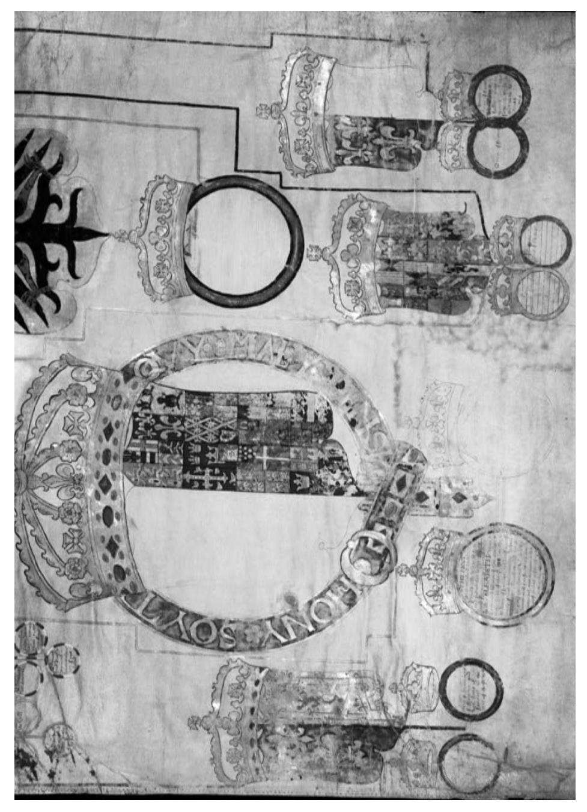

**Manuscript version: Published Version**

The version presented in WRAP is the published version (Version of Record).

# **Persistent WRAP URL:**

<http://wrap.warwick.ac.uk/104468>

# **How to cite:**

The repository item page linked to above, will contain details on accessing citation guidance from the publisher.

# **Copyright and reuse:**

The Warwick Research Archive Portal (WRAP) makes this work by researchers of the University of Warwick available open access under the following conditions.

Copyright © and all moral rights to the version of the paper presented here belong to the individual author(s) and/or other copyright owners. To the extent reasonable and practicable the material made available in WRAP has been checked for eligibility before being made available.

Copies of full items can be used for personal research or study, educational, or not-for-profit purposes without prior permission or charge. Provided that the authors, title and full bibliographic details are credited, a hyperlink and/or URL is given for the original metadata page and the content is not changed in any way.

### **Publisher's statement:**

Please refer to the repository item page, publisher's statement section, for further information.

For more information, please contact the WRAP Team at[: wrap@warwick.ac.uk](mailto:wrap@warwick.ac.uk)

Genealogy and Royal Representation: Edmund Brudenell's Pedigree Roll for Elizabeth I (1558–60)

Sara Trevisan

Huntington Library Quarterly, Volume 81, Number 2, Summer 2018, pp. 257-275 (Article)

Published by University of Pennsylvania Press *DOI: <https://doi.org/10.1353/hlq.2018.0011>*

*For additional information about this article* <https://muse.jhu.edu/article/700624>

# notes and documents

# Genealogy and Royal Representation: Edmund Brudenell's Pedigree Roll for Elizabeth I (1558–60)

Sara Trevisan

**abstract** This essay is the first study of a ninety-foot-long pedigree roll made for Elizabeth I in 1558–60 and now preserved at Hatfield House. Conceived and supervised by Edmund Brudenell of Deene Park—a Catholic gentleman and an amateur antiquary and genealogist—the pedigree traces Elizabeth's descent from the Creation, via Adam and Eve, to the mythical and historical British, Saxon, and Norman kings. It also features the genealogies of European royal houses, the descent of the most important English aristocratic families, numerous textual extracts containing historical information, and lavish heraldic decorations. In the present essay, Sara Trevisan explores the sources and content of the pedigree roll—an intersection between medieval and early modern traditions of royal genealogical discourse—and discusses its making, its social and political function, and the strategies it employed to construct a celebration of the queen's right to rule. **keywords:** sixteenth-century pedigree rolls; genealogy of Elizabeth I; William Cecil; heraldic drawings; Elizabethan gift exchange

l **One of the items** that visitors to Hatfield House in Hertfordshire are advised to see is an illuminated parchment roll of Queen Elizabeth I's genealogy. This ninetyfoot-long manuscript, now kept in a wooden cabinet, mounted on two rotating horizontal poles that allow the viewer to unroll it, was commissioned and supervised by Edmund Brudenell (1521–1585) of Deene Park, Northamptonshire, between 1558 and 1560.1 The pedigree traces Elizabeth's descent from the Creation via Adam, to Noah, to the mythical and historical British, Saxon, and Norman kings. The diagram also includes the genealogies of European royal houses, the descent of the most important

1. Although the cabinet seems to be a later addition, it is impossible to say whether it was made to replace an earlier structure devised to facilitate the reading of the pedigree.

Pp. 257–275. ©2018 by Henry E. Huntington Library and Art Gallery. issn 0018-7895 | e-issn 1544-399x. All rights reserved. For permission to photocopy or reproduce article content, consult the University of Pennsylvania Press Rights and Permissions website, http://www.upenn.edu/pennpress/about/permissions.html.

English aristocratic families, textual extracts containing historical information drawn from sixteenth-century chronicles, and lavish heraldic drawings. Although this pedigree may be among the most magnificent objects ever made to celebrate the queen, it has not been thus far examined in depth, due to its obscurity, size, and overall idiosyncratic nature.

The roll is briefly mentioned in the Historical Manuscripts Commission's *Calendar* of the Salisbury (Cecil) manuscripts.2 It is also referred to in the context of the sixteenth-century "pedigree craze" by J. Horace Round and Sir Anthony Wagner in their studies on English genealogical practice, but their dismissal of its nonhistorical content—including biblical ancestors, classical heroes, and mythical kings—did not foster any further study. Wagner associated the Brudenell pedigree roll with sixteenth-century specimens made for the gentry and nobility, showing "descent on many lines" and "decorated with paintings, not only of arms, but of the imagined figures of primitive ancestors."3 Round saw Brudenell's roll as an epitome of elaborate and much requested "false pedigrees" and "genealogical concoctions" based on a historical "tradition" unproven by tangible evidence, which could just be "the guess of some speculative antiquary or even of a member of the family itself."4

But Brudenell's genealogy is not a mere example of sixteenth-century "false pedigrees" prepared for the monarch. Because it was made early in Elizabeth's reign, under the supervision of a member of the gentry, the roll provides important evidence on the intersection between late medieval and early modern traditions of royal genealogical discourse, and on the ways in which, in the mid-sixteenth century, the gentry could engage with monarchical celebration and the national past through medieval models of royal praise that were still alive and meaningful.

### l **The Gift of a Catholic Gentleman?**

A few lines at the end of the pedigree roll reveal its date and origin: "Edmound brudenell Sone And heyre of Sr thos. Brudenell knight wch cawsed this bouke to by compiled in his house at dyne. Ao. Dni. 1558 & there endyd."5 Textual evidence confirms that the pedigree was begun in 1558, after Mary Tudor's death, and finished between July 1559 and March 1560. This makes it one of the earliest objects ever produced to celebrate Elizabeth I.

The Brudenells were a Catholic family. The patron of the genealogical roll, Edmund Brudenell, first became involved in politics during the reign of Queen Mary.

2. Royal Commission on Historical Manuscripts, *Calendar of the Manuscripts of the Most Honourable the Marquess of Salisbury* […] *Preserved at Hatfield House*, vol. 1 (London, 1883), 150: "Royal Genealogy of England" (Cecil Papers 357).

3. Anthony Wagner, *The Records and Collections of the College of Arms* (London, 1952), 16.

4. J. Horace Round, *Family Origins and Other Studies* (London, 1930), 5, 12–13.

5. The word *book* is used in the sense of a "list of names" or "register," and more specifically as "an account of a person's lineage or descent"—that is, a "book of the generations" or a "book of the pedigree" (*OED* 1.c).

He was appointed high sheriff of Rutland in the year of Elizabeth's accession, and he would later become high sheriff of Northamptonshire. He was knighted by the Earl of Leicester at Charlecote in 1566,6 the same year that Queen Elizabeth stayed for one night at Deene Park during her progress.7 Brudenell's continuing and generally successful political career during the Elizabethan period confirms that, although a Catholic, he was willing to pay homage to a Protestant monarch. His pedigree roll, which was begun right after Elizabeth's accession and in the same year as his first political appointment, may have been a gift devised to express his loyalty to the new queen.8

While there is no proof that the roll was ever received by Elizabeth, the amount of work and expense that went into its making and the uncommon presence of a signature at the end suggest that the genealogy was conceived as a high-profile gift and not for display at Deene Park. The fact that the roll has been preserved at Hatfield House, where the Cecils would move from Theobalds palace in 1606, suggests other scenarios. First, the owner of Theobalds, Sir William Cecil, may have been an intermediary between Brudenell and the queen.9 In the world of royal gift exchange, the provenance of a present could affect its essential value,10 and a royal pedigree endorsed by Cecil would have acquired greater significance. Nevertheless, the pedigree may have never reached the court. Second, if the roll was given to the queen, its presence at the Cecils' home may be additional evidence that gifts given to the monarch could end up in the houses of royal favorites.11 In the following decades, Cecil would develop an increasing interest in genealogy and antiquarianism, and Elizabeth might have presented him with the pedigree roll while he was still living at Theobalds, knowing that it would give him particular pleasure.12

6. Joan Wake, *The Brudenells of Deene* (London, 1954), 53.

7. Wake, *The Brudenells of Deene*, 66. See also *ODNB*, s.v. "Brudenell, Sir Robert (1461–1531)," by J. H. Baker, last modified January 2008, doi:10.1093/ref:odnb/3766.

8. In 1576–77, Francis Peto, an exiled Catholic Englishman in Milan, planned and supervised, with the assistance of local artists, a majestic genealogy intended as a gift to garner the queen's benevolence toward his situation. The genealogy, which remained unfinished, is not extant. See "Francis Peyto to Lord Burghley" (March 31, 1576), in *Calendar of State Papers Foreign: Elizabeth,* vol. 11, *1575–1577*, ed. Allan James Crosby (London, 1880), 293, British History Online, https://www.british-history.ac.uk/cal-state-papers/foreign/vol11/pp276-298: SP 70/137, fols. 319r–20v, National Archives, Kew.

9. Francis Peto (see note 8) corresponded briefly with Sir William Cecil to request the latter's assistance with the making of his genealogy, including Cecil's intercession with the College of Arms heralds for the retrieval of information on coats of arms.

10. Felicity Heal, *The Power of Gifts: Gift Exchange in Early Modern England* (Oxford, 2014), 51.

11. Heal, *The Power of Gifts,* 52.

12. Since Cecil's passion for genealogy developed only in his later years, it would be anachronistic to suggest that Brudenell made the pedigree for Cecil himself as early as 1558–60. See Norman Jones, *Governing by Virtue: Lord Burghley and the Management of Elizabethan England* (Oxford, 2015), 54–55.

### l **Brudenell's Pedigree Roll and Its Sources**

Like many of the gentry and aristocracy of the time, and as proved by their rich library, the Brudenells had a passion for antiquity and genealogy; these increasingly common interests "influenced their political choices, their own sense of family history, and of participation in local and national politics."13 Notes and signatures found on medieval royal pedigree rolls confirm that gentry and aristocratic families frequently preserved in their libraries genealogies dating back to the fifteenth century and even the thirteenth; these were inherited from ancestors or acquired after the dissolution of the monasteries.14

The fact that Brudenell's genealogy begins with the Creation and Adam and Eve, followed by the biblical, mythical, and historical ancestors of the English and European kings, reveals the influence of a diagrammatic model used in midfifteenth-century English royal genealogies, which traced the origins of the dynasty and the foundation of its power to Adam.15 These pedigrees were in turn influenced by medieval rolls with diagrams modeled on the biblical genealogies presented in Peter of Poitiers's twelfth-century *Compendium historiae in genealogia Christi* and on genealogical chronicle rolls of the kings of England from Egbert or Brutus of Troy, produced between the thirteenth and early fifteenth centuries.16 A comparison between Brudenell's roll and extant mid-fifteenth-century pedigrees highlights as a plausible model the diagram and decorations typical of rolls tracing the descent of Henry VI from Adam, such as the forty-two-foot-long Scroll "Considerans" (Magdalen College Oxford MS 248), made in the style of Roger of St. Albans's workshop (ca. 1450s).17 These genealogical rolls included figurative decorations, heraldry, and a

13. Raluca Radulescu, *The Gentry Context for Malory's "Morte Darthur"* (Cambridge, 2003), 70. See also Nicolas Barker and David Quentin, *The Library of Thomas Tresham and Thomas Brudenell* (London, 2006); Wake, *The Brudenells of Deene*, 46, 106; D. R. Woolf, *The Social Circulation of the Past: English Historical Culture 1500–1730* (Oxford, 2003), 73–140; and Felicity Heal and Clive Holmes, *The Gentry in England and Wales, 1500–1700* (London, 1994), 278–82.

14. See, for instance, *Handbook to the Maude Roll: Being a XVth Century MS. Genealogy of the British and English Kings from Noah to Edward IV., with a Marginal History,* ed. Arnold Wall (Auckland, New Zealand, 1919).

15. Christiane Klapisch-Zuber, *L'ombre des ancêtres* (Paris, 2000), 195; and Alison Allan, "Yorkist Propaganda: Pedigree, Prophecy, and the 'British History' in the Reign of Edward IV," in *Patronage, Pedigree, and Power in Late Medieval England,* ed. Charles Ross (Gloucester, U.K., 1979), 171–92. For further discussion on mythical ancestry in early modern Europe, see Roberto Bizzocchi, *Genealogie incredibili: Scritti di storia nell'Europa moderna* (Bologna, 2010).

16. See Olivier de Laborderie, *Histoire, mémoire et pouvoir: Les généalogies en rouleau des rois d'Angleterre (1250–1422)* (Paris, 2013); Olivier de Laborderie, "Les généalogies des rois d'Angleterre sur rouleaux manuscrits (milieu XIIIe siècle–début XIVe siècle). Conception, diffusion et fonctions," in *La généalogie entre science et passion*, ed. T. Barthélémy and M.-C. Pingaud (Aix-en-Provence, France, 1997), 181–99; and Alixe Bovey, *The Chaworth Roll: A Fourteenth-Century Genealogy of the Kings of England* (London, 2005).

17. *The Scroll "Considerans" (Magdalen MS 248) Giving the Descent from Adam to Henry VI*, trans. J. E. T. Brown, with an introduction by G. L. Harriss (Oxford, 1999), 3; Allan, textual commentary with didactic purposes drawn from chronicles in either Latin or English; the diagram of such pedigrees could be lengthened by their owners, following the succession of monarchs.18 The Brudenells owned one or more of these genealogies, at least one of which had been extended to the time of Henry VII. In the 1530s, Edmund's father had welcomed Henry VIII's antiquary, John Leland, to Deene Park and had shown him "an old record of the King's" and some pedigree rolls of Henry VII.19 Leland copied down parts of these rolls to integrate the historical information destined for his *Itinerary*, marking the sections as "Thinges excerptid out of rolle that Mr. Brudenel of Dene shewid me."20

l **Tracing Elizabeth's Descent: Universal History and English Nationalism** Brudenell's pedigree naturalized Elizabeth's status as part of the Tudor lineage through late medieval models of royal praise. At the top of the genealogy, seven roundels narrate the days of the Creation through quotations from Genesis, an incipit influenced by the structure of Peter of Poitiers's *Compendium* (fig. 1).21 Quite common in medieval rolls was the presence of Adam and Eve,22 whose roundels in Brudenell's pedigree are encircled by a quotation from John 1:1, taken from the Protestant Great Bible (1539)—a telling detail, considering that the patron of the genealogy was a Catholic. Although Brudenell sought to follow the traditional biblical diagram as faithfully as possible, his own differs from the previous genealogical tradition, in which Adam and Eve were often portrayed standing by the Tree of Knowledge, looking ashamed and being kept apart by the snake.23 Brudenell avoids illustrating the scene, preferring instead a cartouche devoted to the narration of their creation and moment of purity in the Garden of Eden (Genesis 2:7*–*9 and 18*–*25). The omission of

21. C. M. Kauffmann, "An Early Sixteenth-Century Genealogy of Anglo-Saxon Kings," *Journal of the Warburg and Courtauld Institutes* 47 (1984): 209–16 at 211.

22. Sydney Anglo, "The British History in Early Tudor Propaganda," *Bulletin of the John Rylands Library* 44 (1961): 17–48 at 41–48.

23. See, for instance, a fifteenth-century genealogical roll chronicle of the kings of England (Marston MS 242, Beinecke Library, Yale University); a roll chronicle for Henry VI (Harley Roll C.9, British Library); and two pedigree rolls for Edward IV (Unbound MSS 20/23 and 20/25, College of Arms, London).

&quot;Yorkist Propaganda," 173–74. For further discussion on these genealogies, see E. D. Kennedy, *Manual of the Writings in Middle English, 1050*–*1500,* vol. 8, *Chronicles and Other Historical Writing* (New Haven, Conn., 1989), 2675–79, 2888–91. A roll of this kind—now Royal MS 14 B VIII, British Library—was present in the library of another amateur antiquary, Lord Lumley. See *The Lumley Library: The Catalogue of 1609*, ed. Sears Jayne and F. R. Johnson (London, 1956), 1443, 1444, 1445, 1446.

18. Additional examples are King's MS 395, British Library, and MS O.5.54, Trinity College, Cambridge.

19. Wake, *The Brudenells of Deene*, 46.

20. John Leland, *The Itinerary of John Leland in or about the Years 1535–1543: Parts 1 to 3*, ed. L. Toulmin Smith (London, 1907), 307–8, 313.

Figure 1. The Creation and Adam and Eve (detail). Cecil Papers 357, 1558–60. Hatfield, Hatfield House. Reproduced with the permission of the Marquess of Salisbury, Hatfield House.

all references to original sin thus served to adjust the medieval template to the celebration of a female monarch.

As in fifteenth-century rolls, the queen's genealogical connection to biblical rulers highlighted the divinely sanctioned royal legitimacy she shared with them and strengthened her spiritual relationship to them. Comparisons to biblical patriarchs were employed to both flatter and counsel monarchs, and quite often, in Elizabeth's case, to remind her of her duty toward her country and the continuation of the royal line. In 1563, Parliament's second petition seeking to convince the queen to marry featured biblical episodes on hereditary succession and genealogies to illustrate the necessity of royal marriage and offspring. The petition stated that "God by the course of the Scriptures hath declared succession and having of children to be one of His principal benedictions in this life"—a point illustrated, for instance, through the example of Abraham, who is assured by God that his successor will be his natural heir.24 The petition also translated the interconnection of genealogical continuity and political stability from family to nation: whereas the kingdom of Israel was afflicted with intestine wars, being "often destitute of lawful heirs," the kingdom of Judah throve because "God gave lineal succession by descent of kings."25

This biblical framework contextualized English royalty within a Christian universal history that was also a history of dynasties and empires. Through a color illustration of the Ark and a cartouche narrating the episode of the Flood (Genesis 6–9), Noah is presented as a key figure in history—the father of three sons, from whom all nations are descended (Genesis 10).26 As in several mid-fifteenth-century rolls—which, following the tradition of medieval universal historiography, represented history in the form of an immense genealogy—Japhet is shown as the root of all European peoples and dynasties. His line is divided into those of the mythical ancestors of the Germanic peoples; the Greco-Roman ancestry of the kings of France from Hector of Troy, of the English kings from Brutus, and of the kings of Rome from Aeneas; and Alanus, a biblical ancestor who fathered all these peoples taken together.

The presence of the mythical Germanic ancestors in Brudenell's pedigree reflects the template of fifteenth-century rolls celebrating the Saxon ancestry of Henry VI and, less often, of Edward IV.27 Under the influence of Christianized genealogies of the Anglo-Saxon kings, the ancestry of the god Woden—the original forefather of the Germanic peoples and their kings—is traced down to Adam through pseudo-historical and euhemerized figures. Although the most common medieval source for this Germanic lineage was William of Malmesbury's

24. *Elizabeth I: Collected Works*, ed. Leah S. Marcus, Janel Mueller, and Mary Beth Rose (Chicago, 2000), 84.

25. *Elizabeth I*, ed. Marcus, Mueller, and Rose, 85.

26. M. D. Johnson, *The Purpose of the Biblical Genealogies* (Cambridge, 1998), 77–84, 139–252.

27. Alexander M. Bruce, *Scyld and Scef: Expanding the Analogues* (London, 2002), 53–54.

twelfth-century *De gestis regum anglorum*, 28 the full sequence of ancestors in Brudenell's roll—Streffius, Bodagius, Gwala, Hadra, Sterinodius, Stephius, Steldius, and Boerinus—contains additional names that only appeared in mid-fifteenth-century genealogies.29 The detail that can dispel any further doubts about Brudenell's source is the cartouche accompanying Strephius's roundel, which replicates verbatim a gloss added to some mid-fifteenth-century rolls, such as the Scroll "Considerans":

Of this Streffius is dessendyd the northe[rn] partes of the world that is to saye the Saxsones / the Englyshemen / Suti / Daci / Gothi / Norwayes / Wandali / and Fryselas. [Brudenell's roll]

From this Strepheus the son of Japhet are descended all those who inhabit the northern parts of the world: Saxons, Angles, Suevi, Danes, Goths, Norwegians, Vandals, and Frisians, who all in their time harried the kingdom of Britain with violent invasions.30 [Scroll "Considerans," English translation]

Interestingly, Brudenell omits all references to the "violent invasions" characterizing English history, highlighting instead the composite ancestry of the monarch.

To the traditional "British" descent from Brutus of Troy, derived from Geoffrey of Monmouth's *Historia regum Britanniae* (ca. 1136–38), Brudenell devoted a third of the roll (fig. 2). By surrounding it with cartouches containing detailed chronicle extracts—two of which, for instance, are entirely devoted to King Leir's story—Brudenell clearly sought to exploit the full narrative potential and national mythographic value of the British History.31 The extensive textual passages, drawn

28. William of Malmesbury, *De gestis regum anglorum*, ed. William Stubbs, 2 vols. (London, 1887–89), 1:120–21. These genealogies were drawn from Asser's *Life of King Alfred* and the *Anglo-Saxon Chronicle.*

29. "J. M. Kemble 1837," in *Beowulf: The Critical Heritage,* ed. Andreas Haarder and T. A. Shippey (London, 1998), 207–14 at 209–10.

30. The Latin original of the Scroll "Considerans" reads: "Ab isto Strepheo filio Japhet descenderunt omnes habitantes septentrionales partes mundi: Saxones Angli Suebi Daci Gothi Norvagenses Vandali et Fresi; qui omnes regnum Britannie suo tempore acerrimis irruptionibus infestabant"; and, further on, "Ab istis IX filiis Boerini descenderunt novem gentes septentrionalem partem inhabitantes qui quondam regnum Britannie invaserunt et optinuerunt; videlicet Saxones Angli Suthi Daci Norwagenses Gothi Wandali Geathi et Fresi." *The Scroll "Considerans,"* 9–10, 41; Bruce, *Scyld and Scef,* 53. The Latin original of the Scroll "Considerans" thus features both "Suebi" and "Suthi," the latter being the source for Brudenell's "Suti."

31. Before the union of the Crowns of England and Scotland in 1603, the adjective "British" referred to the ancient Welsh (or Briton) civilization. England's "British History" was identified with the period spanning the conquest of the island by the mythical Brutus of Troy whence the name "Britain"—and the Saxon invasions. The dynasty of the British kings, which included King Lear and King Arthur, was incorporated into that of the English kings in the medieval period.

Figure 2. Cartouche of the British king Cassibelan (left) and the invented coat of arms of Julius Caesar (right) (detail). Cecil Papers 357, 1558–60. Hatfield, Hatfield House. Reproduced with the permission of the Marquess of Salisbury, Hatfield House.

from Robert Fabyan's *Chronicle* (1516), John Rastell's *Pastyme of People* (1529), and Thomas Lanquet and Thomas Cooper's *Chronicle* (1549), were a remnant of the tradition of "commented genealogies" with didactic purposes—typical of medieval pedigree rolls.32 But there is no trace of Geoffrey's prophecies concerning a return to power of the British line; these had been used in pedigree rolls supporting Edward IV's right to the throne, and later on to celebrate the accession of Henry VII Tudor in the early years of his reign. By the end of Henry VIII's reign, new celebratory themes had emerged, highlighting Henry VII's prowess and the union of the roses of York and Lancaster.33 Both are present in Brudenell's pedigree, where the cartouche of Henry VII exalts his victory at Bosworth, while white and red lines trace the Yorkist and Lancastrian descent of Henry VIII.

Although the pedigree roll is pervaded by a general skepticism toward the British History, and two of Brudenell's sources—Fabyan's *Chronicle* and Rastell's *Pastyme of People*—were dubious of the Galfridian matter for its uncertain historical value,34 criticism is kept to a minimum.35 In fact, when necessary, Brudenell leaves aside Fabyan and Rastell in favor of Lanquet and Cooper's *Chronicle*, which, although inspired by Fabyan, was less overtly critical. For instance, Brudenell employed Lanquet and Cooper in the case of King Arthur: "Of this Arthur be written many thinges in the english cronicle, of small credence, and farre discordant from other writers. But yet all agree, that he was a noble and victorious prince in all his deedes."36 These lines were actually the beginning of a longer dismissal of the Arthur story written by Fabyan, the core of which Lanquet and Cooper, and Brudenell with them, omitted. Whatever Brudenell's opinion, the genealogy of the mythical kings of Britain in his pedigree roll is most carefully narrated, with red rubrics in the cartouches focusing the reader's attention on key information.

The second part of the pedigree increases in complexity, due to the sheer number of interweaving lines and the extensive use of heraldry. The main source for the textual extracts on the kings of England is Lanquet and Cooper's chronicle, which is sometimes quoted almost verbatim. However, not all the kings are accompanied by a commentary: for instance, the roundel of Richard III simply states that he "vsurped" the throne. Brudenell's genealogy shows Elizabeth I's descent from both the Lancastrian—via John of Gaunt and Lady Margaret Beaufort, wife of Edmund Tudor—and the Yorkist sides. The Tudor line acquires visual importance in the diagram only with the union of Catherine of Valois and Owen Tudor, father of Edmund

32. De Laborderie, "Les généalogies des rois d'Angleterre," 188.

33. Anglo, "The British History," 40.

34. Philip Schwyzer, *Literature, Nationalism, and Memory in Early Modern England and Wales* (Cambridge, 2003), 28.

35. The Brudenells' library contained copies of Polydore Vergil's *Anglica Historia*, a famously harsh scholarly critique of the British History; Barker and Quentin, *The Library*, 1444, 1820.

36. Thomas Lanquet and Thomas Cooper, *An Epitome of Cronicles* (London, 1549), 144.

Tudor, who was in turn Henry VII's father (fig. 3). What is highlighted is the importance of the Mortimer family within the royal genealogy—through the marriage of Ralph Mortimer to the Welsh princess Gwladus Ddu; the union of Edmund Mortimer to Philippa, daughter of the Duke of Clarence; and the Mortimer-Welsh ancestry of Edward's father, Richard, Duke of York. Only three of Henry VIII's wives are present—Catherine of Aragon, mother to Mary, said to have been "justeley divorced"; Jane Seymour, mother to Edward VI; and Anne Boleyn, mother to Elizabeth I. While this was done to maintain the linearity of the diagram and focus on the genealogical continuity, the lack of references to Anne Boleyn's execution was doubtlessly a conscious choice.

An interesting confusion concerning the children of William the Conqueror is further evidence not only of Brudenell's use of a mid-fifteenth-century source but also of the continuing role played by such royal pedigrees in the transmission of historical information, as proved by the fact that antiquary John Leland had consulted some of them in Brudenell's library for his research on national history. In the roll, an illustrated roundel just beneath the Conqueror's states that the figure portrayed is "Maud daughter of William Conqueror married to the earle of Bloyes father to kyng Stephen."37 In English historiography, the number of daughters of the Conqueror had traditionally ranged from four to six, and, since the twelfth century, few works of historiography had agreed on their number and names. Most medieval sources mention Cecily, abbess at Caen, and Ella, married to the Count of Blois and mother to King Stephen, but most early sixteenth-century printed sources barely mention any.38 It is instead in mid-fifteenth-century pedigree rolls (based on earlier ones) that we find a thorough, though not necessarily consistent, list. Like Brudenell's roll, these pedigrees usually featured Gundreda, absent from any other easily accessible sixteenthcentury source, and quite frequently Ella, Cecily, and another daughter who was

37. Beside Maud there are Gundreda, wife to William de Warenne; "a daughter promised to [King] Harold"; a daughter whose fate the faded ink cannot reveal; and another Maud, married to Hugh Mortimer.

38. Matthew Paris's *Flores historiarum* features Cecily, Adela, and "four other daughters"; *Flores historiarum*, ed. Henry Richards Luard, 3 vols. (London, 1853), 2:13. William of Malmesbury mentions Cecily, Constance married to the Earl of Brittany, and Adela, adding that the names of the last two "escaped" him; *De gestis*, 307. Orderic Vitalis cites Agatha and Adeliza; quoted in *De gestis*, 307. In the sixteenth century, Polydore Vergil listed Cecily, who became a nun; Constance, married to the Earl of Brittany; and Adela, married to the Earl of Blois, while "the names of the other two were obliterated by time, and they died before reaching a marriageable age," one of them having been promised and repudiated by King Harald; Polydore Vergil, *Anglica Historia* (London, 1555), bk. 9, sec. 11, http://www.philological.bham. ac.uk/polverg/. Lanquet and Cooper only mention Adela (*An Epitome of Cronicles*, 200), while Fabyan and Rastell do not mention any. However, John Leland—who was, as we have seen, much interested in medieval pedigrees—lists Cecily, Constantia, Adala, one daughter promised to Harold, and one married to the Duke of Castille; John Leland, *Joannis Lelandi Antiquarii de rebus britannicis collectanea*, ed. Thomas Hearne, 4 vols. (London, 1770), 1:325. In Brudenell's pedigree, the Maud said to be married to the Duke of Blois is a mistake for Ella.

Figure 3. Henry V's coat of arms (center) (detail). Cecil Papers 357, 1558–60. Hatfield, Hatfield House. Reproduced with the permission of the Marquess of Salisbury, Hatfield House.

betrothed to King Harold. Some medieval genealogies also contained a roundel with the words "filia miia" or "meia [*sic*]," as a placeholder for an unknown name.39 Its Latin abbreviation written in Gothic script, as found in the Scroll "Considerans," could be easily mistaken for "filia maud," and, if we consider that the Conqueror's wife was called Matilda, such a misunderstanding would not be surprising, due to the obscurity of these historical figures.

In addition to the wealth of information contained in the roundels and cartouches, the genealogy sought to present the history of Elizabeth I's line in relation to those of other English and European dynasties and aristocratic families. The second part of the pedigree is a visual rendition of their mutual competition in the course of history, as family coats of arms increase in size, shrink, or disappear altogether. Their political continuity is determined by the survival of their genealogical identity and their interconnections with the English line. The kings of Wales, initially so prominent, are gradually relegated to the side, while families like the Mortimers acquire increasing visibility in the last part of the roll, together with the Talbots, the Cliffords, and the earls of Rutland and Richmond, among others. The genealogical lines that reach the bottom of the pedigree are those of the kings of England, Scotland, and France, and that of the Habsburgs.

### l **Elizabeth I's Heraldic Marriage**

In Brudenell's roll, the genealogical and political continuity of the monarchical institution is understood not only in terms of mythical and historical ancestry but also through the visualization of blood ties in heraldic form. Elizabeth I is shown as the rightful descendant of Edward III. His colossal coat of arms reflects how, through his sons John of Gaunt and Lionel, Duke of Clarence, he was a common ancestor to the Houses of York and Lancaster, whose union was fulfilled in the blood of Henry VIII and of his daughter Elizabeth. This historical heritage is visualized in the queen's coat of arms through its subdivision into quarterings (fig. 4).40

Unlike in most medieval rolls, Elizabeth's heraldic device marks only a temporary end to the royal genealogy. In fact, the queen's coat of arms is depicted as "impaled"—a design reserved for married women, in which the wife's heraldic device occupies only the *sinister* side of a bigger escutcheon representing the marriage union. The *dexter* portion of the device is blank, waiting to be painted with the coat of arms of Elizabeth's consort, while a sketched roundel, decorated with a crown and linked to Elizabeth's own, is ready to welcome the new king's name.

The last membrane of the roll also displays, in diagrammatic and heraldic form, the fulfilled unions and potential political leagues of the late 1550s. It shows

39. George F. Duckett, *Observations on the Parentage of Gundreda, the Daughter of William Duke of Normandy and Wife of William de Warenne* (n.p., 1878), 1–19 at 13.

40. John Baker, "Tudor Pedigree Rolls and Their Uses," in *Heralds and Heraldry in Shakespeare's England*, ed. Nigel Ramsay (Donington, U.K., 2014), 125–65 at 132.

Figure 4. (Left) Mary Queen of Scots and Francis II; (center) Elizabeth I; (above right) Ferdinand I; (below right) Mary Tudor and Philip II; (far right) Henri II and Catherine de' Medici (detail). Cecil Papers 357, 1558–60. Hatfield, Hatfield House. Reproduced with the permission of the Marquess of Salisbury, Hatfield House.

Elizabeth's unmarried status alongside the unions of Mary Queen of Scots to Francis II, son of Catherine de' Medici, and of the late Mary Tudor to Philip II of Spain. But the genealogy also highlights Elizabeth's possible suitors and candidates to the throne of England. To the right of her coat of arms is that of Ferdinand I of the House of Habsburg, Holy Roman Emperor, while far right is the marriage union of Henri II of France and Catherine de' Medici. Although the diagram does not record any heirs to either Ferdinand I or Henri II,41 two of their sons—Archduke Charles and Charles of Valois, later Charles IX of France—were the most obvious foreign suitors to Elizabeth I at the time. Their Catholicism must have pleased Brudenell, and negotiations concerning a potential marriage between the English queen and Archduke Charles of Habsburg had begun in 1559,42 while the pedigree roll was being produced.

#### l **The Making and Purpose of Brudenell's Roll**

As suggested at the beginning of this essay, the roll may have been given to Elizabeth I as a present by Edmund Brudenell, who was seeking to provide a token of his willingness as a Catholic to pay homage to a Protestant monarch. As such, the roll might be the first of several pedigrees that were donated to the queen during her reign.43

All the genealogies given to Elizabeth I whose records have come down to us were in manuscript form, a medium that made them unique texts destined for private perusal. However, the patrons of these genealogies also hoped to advertise at court their loyalty to the Crown; their mastery of heraldry, history, and politics; and sometimes their own artistic skills. According to the Elizabethan New Year's Gifts rolls, manuscript books of arms and pedigrees were often donated to the queen, which suggests her interest in such material.44 In 1565, herald Robert Cooke gave her a now lost pedigree book, and a second one in 1567 (possibly King's 396, British Library). In 1575, Merchant Otto de Baehere petitioned Elizabeth I for a license to transport cloths, in consideration of his now lost pedigree with numerous illuminated coats of arms, tracing the genealogy and alliances of the kings of England and France since the time of Louis I.45 In 1576, the exiled Catholic Francis Peto wrote to William Cecil about a genealogy of the queen that he had planned and supervised to request the

41. The lines in Henri II's roundel, which are partly illegible, state that the king was slain in 1559 and that he was a "father."

42. Susan Doran, "Religion and Politics at the Court of Elizabeth I: The Habsburg Marriage Negotiations of 1559–1567," *English Historical Review* 104 (1989): 908–26.

43. These and others will be discussed as part of a monograph on the politics and materiality of royal genealogy between 1550 and 1700, which is currently in progress.

44. J. A. Lawson, "This Remembrance of the New Year: Books Given to Queen Elizabeth as New Year's Gifts," in *Elizabeth I and the Culture of Writing*, ed. Peter Beal and Grace Ioppolo (London, 2007), 133–71 at 152, 154.

45. *Calendar of State Papers, Domestic Series, of the Reigns of Edward VI., Mary, Elizabeth,* vol. 1, *1547–80*, ed. Robert Lemon (London, 1856), 512, British History Online, https:// www.british-history.ac.uk/cal-state-papers/domestic/edw-eliz/1547-80/pp508-513: SP 12/106/1, fol. 143r, National Archives, Kew.

reinstatement of his pension.46 And in 1585 Italian courtier, calligrapher, and illuminator Petruccio Ubaldini gave Elizabeth I an unidentified "pettygrye."47 What made these genealogies valuable was the complexity of the historical reconstruction, the fine decoration, the expensive material support, and the aesthetic value of the text as object.

The use of royal genealogies as gifts to display loyalty or request favors from the monarch rested on the idea that these were complicated and sophisticated texts that would impress the receiver with the labor and expense incurred by the patron. Such royal genealogies thus recall the category of "great gifts" used by Felicity Heal in her book *The Power of Gifts*—a category that includes "gift-books drawn in elegant scribal hands, or distinctively bound." These "great gifts," Heal explains, were complex luxury items, reminding the recipients that their future generosity toward the sender should not cease with a single returned favor. Elizabeth I was particularly interested in such "distinctive and glamorous" objects, an enthusiasm that provided "useful leverage for those beyond the immediate circle of courtiers who sought her attention."48

Brudenell's conscious choice of a medium so dated, sizeable, expensive, and time-consuming to produce as the parchment roll suggests that his pedigree may have been intended as a royal present—a magnified counterpart to the traditional gift of illuminated manuscript books and a conscious revival of the medieval royal genealogical tradition that had waned by the end of Henry VIII's reign.49 While the circumstances surrounding the making of the pedigree remain obscure, it is clear that the labor and expense incurred by Brudenell were extensive, not only due to the costly purchase of ninety feet of vellum, but also because the design of sophisticated pedigrees was most frequently a collaborative effort requiring the participation of several professionals. The planning and making of such genealogies was often shared between the patron, who could be not only the underwriter but also the provider of genealogical material and sometimes even one of the craftsmen; one or more artists skilled in heraldic painting; and possibly one or more professional heralds, who could provide information on coats of arms and assist with the drawing of heraldry.

Edmund Brudenell was clearly involved in the planning of the form and content of the pedigree. The choice of a fifteenth-century roll as a model was linked to the historical memory of his family and social class, and laden, as has been shown, with political significance. Although Brudenell was also wont to copy down coats of arms in private heraldry books,50 which suggests that he possessed, like many other gentlemen of his time, an average knowledge of heraldry and at least basic skills in heraldic drawing, it is unlikely that he played a primary role in the material production of the

46. See notes 8 and 9.

47. J. A. Lawson, *The Elizabethan New Year's Gift Exchanges, 1559–1603* (Oxford, 2013), no. 85.185.

48. Heal, *The Power of Gifts*, 97–99.

49. Heal, *The Power of Gifts*, 46.

50. Wake, *The Brudenells of Deene*, 106.

pedigree. The great number of coats of arms in the roll, their complexity, and their sometimes obscure provenance, suggest the assistance of professional heralds, who possessed thorough records of historical and current family lineages. The presence of sophisticated figurative portraits of ancestors, including King Arthur (fig. 5), William the Conqueror, and Arthegal, first Earl of Warwick,51 indicates that Brudenell may have hired one or more provincial artists trained in the execution of miniatures and heraldry.52 Extant evidence confirms that at least one was operating in Northamptonshire less than ten years after the roll was made.53 Whereas in London, professional heralds or "painter-stainers" were employed to devise and draw coats of arms,54 in provincial England, the artistic production of heraldry was assigned to variously skilled itinerant or local artists frequently registered with guilds. Wealthy patrons might even hire such painters as permanent members of their households, to take care of their picture collection and even assist in the making of genealogies, "using their painterly skills to embellish family trees on vellum and sometimes adding miniature portraits alongside entries on the family tree."55 Artists like these, of the kind most likely employed by Brudenell, have usually remained unknown, as they rarely signed or had any reason to sign their work; sometimes their names were registered in household accounts, yet no information of the sort seems to be extant in Brudenell's papers.

51. The roll follows the sixteenth-century tradition by which only the forefathers of a lineage were depicted in full. There are portraits of monarchs (Arthur, Egbert, Pharamond, Clovis, and William the Conqueror) and of the founding fathers of aristocratic houses (Ingelgerius, first Count of Anjou; Arthal or Arthegal, first Earl of Warwick; Rollo, Duke of Normandy and his wife Gylda; William de Percy, first Duke of Northumberland; Ranulph I de Mortimer; and Hugh Capet). Egbert—as the first king to unite the whole of England—is shown sitting in majesty on the throne, which recalls the illustrated roundels of medieval pedigrees based on royal seals. William the Conqueror is the biggest figure of all; the pose of his horse, the coat of arms, and the sword are reminiscent of early prints of the Nine Worthies.

52. In 1558, a former member of Brudenell's household, Robert Cooke, who would be employed as a heraldic artist by Robert Dudley in 1560 and would become Rose Blanche Pursuivant and Chester Herald in 1562, had just graduated from Cambridge. It is intriguing to hypothesize that he might have assisted Brudenell in the making of the pedigree roll. See *ODNB*, s.v. "Cooke, Robert (*d.* 1593)," by J. F. R. Day, last updated January 2008, doi:10.1093 /ref:odnb/6148; and Robert Tittler, "Regional Portraiture and the Heraldic Connection in Tudor and Stuart England," *British Art Journal* 10 (2009): 3–10 at 5.

53. Robert Tittler, *Portraits, Painters, and Publics in Provincial England 1540–1640* (Oxford, 2013), 105–9.

54. Tittler, *Portraits, Painters, and Publics*, 110; Elizabeth Goldring, "Heraldic Drawing and Painting in Early Modern England," in *Painting in Britain, 1500–1630*, ed. Tarnya Cooper et al. (Oxford, 2015), 262–77 at 271–72. For further discussion, see William A. D. Englefield, *The History of the Painter-Stainers Company of London* (London, 1923).

55. Tittler, *Portraits, Painters, and Publics*, 69, 71; Tittler, "Regional Portraiture and the Heraldic Connection," 5.

Figure 5. The portraits of King Arthur (center) and King Clovis (left) (detail). Cecil Papers 357, 1558–60. Hatfield, Hatfield House. Reproduced with the permission of the Marquess of Salisbury, Hatfield House.

### l **Conclusion**

Brudenell's pedigree roll is a unique object that, despite its idiosyncratic nature, can shed new light on the ways in which the gentry approached and politicized national history in the mid-sixteenth century. It can also illuminate the connections they made between contemporary and medieval modes of royal praise, which were still present in the historical memory of their families as well as in their private libraries in the form of medieval genealogical rolls of the kings of England. A masterful revival of fifteenth-century royal celebration and a possible token of loyalty to Elizabeth I, the roll was firmly rooted in the politics of the late 1550s. Its purpose was not simply to exalt the prestigious origins of a unique monarch, but to visualize, celebrate, and encourage Elizabeth I's active role in the genealogical and political continuity of the English royal line.

The author is grateful to Charlotte Brudenell for her generous help and priceless accounts of the Brudenells' family history, to Prof. James Knowles, to the archivists at Hatfield House, and to the Leverhulme Trust and the Institute for Research in the Humanities at the University of Wisconsin–Madison for granting research time and financial support for the writing of this essay.

l **Sara Trevisan** is a Leverhulme Early Career Fellow at the Centre for the Study of the Renaissance, University of Warwick. She is currently working on a book about the politics and materiality of royal pedigrees produced between 1550 and 1700.