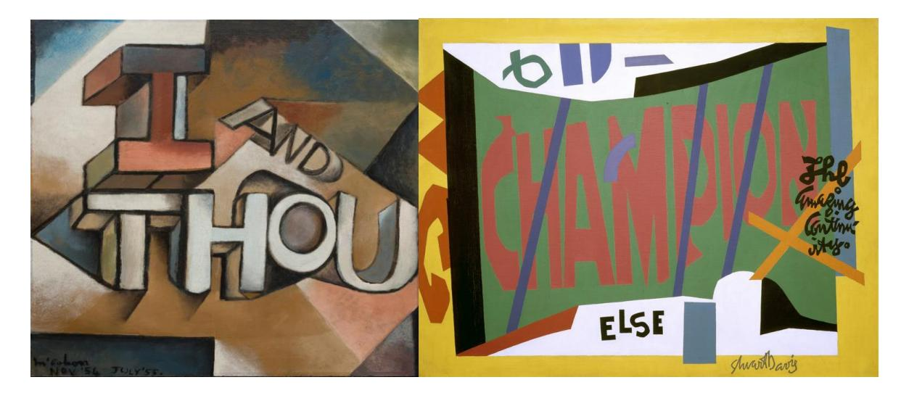
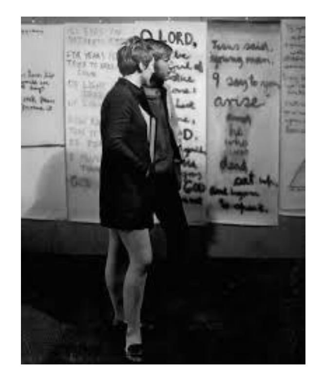

# **Mythologising McCahon: A Heretical View**

## LEONARD BELL

Mythologise: to create or promote an exaggerated or idealised image of a person or event.

Prophet: "I saw something logical, orderly and beautiful belonging to the land and not yet to the people. Not yet understood or communicated, not even yet really invented. My work is to communicate this vision and to invent a way to see it." (McCahon [1966] 1 )

#### **Abstract**

McCahon has frequently been characterised as a prophet, the greatest New Zealand artist, and exceptional, as if his works are somehow outside history and beyond criticism. This mythologisation has largely passed unquestioned in art critical and historical texts over the last sixty years. This essay views McCahon's work and mythologised persona from a different perspective. It emphasises art-making processes and the business of establishing a public profile that ground his work and person in the material, everyday world, rather than elevating them transcendentally. A different picture of McCahon's art and the means by which it came to be so idealised and hallowed emerges.

In 1953 Antony Alpers wrote, "[We] regarded ourselves as native New Zealanders, in no sense as exiles from the Old World . . . emerging among us for the first time collectively a brand of national self-consciousness [linked to] personal expression . . . we waited expectantly for the artist prophet who was to give expression to it in timeless works that the whole world would of course acknowledge. . . . Those who shared these hopes and feelings were haunted by a dilemma . . . [we] abhorred blatant materialism, lack of style . . . we acknowledged our land, but repudiated our society . . . [we had] our lofty ideals."2 One wonders whether Alpers even then had McCahon in mind. He certainly would have known about him.3

In an *Auckland City Art Gallery Quarterly* (1969), most of which was devoted to the Gallery's McCahon collection, he was characterised moderately: "There is an ever-increasing circle of thought that places his work amongst the most artistically significant being produced in this country today . . . a central figure in New Zealand painting."4 In contrast Hamish Keith's figuration of McCahon in the seminal *New Zealand Painting: An Introduction* (also 1969) is more effusive. It hints at the prophetic role that McCahon soon openly inhabited in his followers' minds. Keith reported McCahon's youthful "revelations" and his aim to communicate his "visions to its New Zealand people" in his first paragraph devoted to McCahon (a McCahon waterfall painting is the book's front cover image).5 McCahon too is quoted, from his 1966 "Beginnings" essay in *Landfall*.

The poet and messianically-inclined John Caselberg (1927–2004) had presaged this prophetic McCahon in his catalogue essay for the 1963 Woollaston and McCahon retrospective (his first): "Portraying paradise and hell, and the light and dark of our lives. . . . For twenty five years [McCahon] has spoken as the conscience of New Zealand. . . . [His paintings] derive . . . from a prophetic vision of the world, as it ought to be and as it will by grace become."6 But it was from the second McCahon retrospective exhibition (1972) that the idea of McCahon as prophet took firm root in the New Zealand art world, as he who taught us all how to really "see," not just the physical places of New Zealand as they (allegedly) essentially are, but also the metaphysics of place and the human condition. As Martin Edmond later recalled, "For my cohort the 1972 opening of Colin McCahon's retrospective exhibition . . . was an epochal event: overnight, as it were, we realised the stature of the man working in our midst. . . . The catalogue too was a revelation." McCahon published therein a commentary, showing himself to be "a writer of great acuity with a compressed poetic vision. We learned many of his koan-like remarks by heart and quoted them to each other . . . as if we had found the guru so many of us yearned for then."7 It was a timely coincidence that McCahon's once close friend and advocate, the poet, James K. Baxter, a self-appointed "holy man," with a cultic following, based in New Zealand's Jerusalem, died that year too.8

In Sheridan Keith's "Colin McCahon: A Rare Interview with Our Modernist Master" (1980), we read that "He has been referred to as New Zealand's only major painter, and as a prophet in our midst."9 That had become a default position. Numerous publications and exhibitions in the 1970s, 1980s and later through to his centenary year (2019), such as Justin Paton's fluently composed hagiography, *McCahon Country,* testified uncritically to McCahon's vision and eminence.10 David Eggleton (a touch irreverently) wrote of the 2019 McCahon exhibition at the Auckland Art Gallery: "it has been hung with a kind of due reverence, so that in entering in you feel you are joining a religious procession."11 Even Peter Simpson in his fair-minded, level-headed, intensively researched account of McCahon's work and career, *Colin McCahon: There is Only One Direction, Vol. 1 1916–1959* (2019) and *Colin McCahon: Is This the Promised Land? Vol. 2 1960–1987* (2020), slips into the hyperbolic mode in his last sentence: "New Zealanders (and some people elsewhere, especially Australians) know that Colin McCahon was, is, and will remain, one of the immortals"12—literally someone who is exempt from death or one of the gods of the ancient Greco–Roman pantheon. While Simpson's acclaim was figurative, it signals McCahon's status as New Zealand's Artist/Seer heralded by Alpers. McCahon's own various, sometimes gnomic published pronouncements contributed to this figuration**—**for instance, "As a painter I may often be more worried about you than you are about me and if I wasn't concerned I'd not be doing my job properly as a painter. . . . Do you believe in the sunrise?"13

# **Greatest New Zealand Artist**

McCahon'ssupposed superiority to other New Zealand artists was asserted from the late 1950s. For Nelson Kenny in Christchurch, for instance, he was "beyond doubt New Zealand's foremost painter . . . nothing on this level has been done in New Zealand."14 In 1972 Gerda Bell, while regarding McCahon as a central figure in contemporary New Zealand art, was sceptical about what she regarded as exaggerated acclaim, and characterised him as the "in" painter.15 Canonised as "the greatest" at the 1972 retrospective, subsequently superlatives abounded, so much so that it has become uncritically received opinion in much of the art world**—**for instance, in a free pamphlet for the Auckland Art Gallery's third McCahon retrospective (1988) "McCahon is the outstanding figure in New Zealand visual art in the twentieth century"16**—**a position he maintains still as "Aotearoa's most important twentieth century artist,"17 according to well-informed, leading art critics. 18

In tandem with McCahon as "the greatest," much has been, and still is, made of his suffering and struggle over the years, the hand-to-mouth existence he and his young family lived through at least until he was employed by the Auckland Art Gallery from 1953 to early 1964 and then from mid-1964 to 1971 by the University of Auckland. 19 In addition to the narrative of adversity and struggle are the frequent negative comments about his art right through to the late 1970s, culminating in then prime minister Robert Muldoon's derisive comments on the government's gifting of a large McCahon *Victory over death 2* (1970) to the National Gallery of Australia in 1978, as well as the occasional personal vilification he received from members of the general public because of his manner of life. Consequential heavy drinking and periodic suicidal thoughts have enhanced the image of an artist suffering for his art. McCahon's close friend Gordon Brown reports that McCahon read the polemical essay by French *poet maudit* Antonin Artaud, "Van Gogh: Suicided by Society," in 1969 and self-identified with Artaud and Van Gogh.20 Coincidentally, I bought the book of Artaud's writings (published by City Lights in 1965) with this essay in late 1969 at Paul's Book Arcade, High Street, Auckland. Artaud was a big "hit" among the disaffected in the mid- to late 1960s.

In essence McCahon was cast as an antipodean "eternal" outsider, faced by widespread philistinism and misunderstanding, even after his art was meeting more and more critical success in the 1960s and 1970s and widening acceptance among the general public in the 1970s and 1980s. Accounts of McCahon's religious paintings attest further to hisstruggle with doubts and his anguished faith, which continues to the end of his career with such last paintings as *Storm Warning* (1980) and *I considered all the acts of oppression* (1981) from the Biblical *Ecclesiastes*; from a Christian perspective (if not from a Judaic one), an Old Testament cry of fatalism, pessimism and the vanity of human and earthly wishes. Perhaps the popularity in the 1960s, and even earlier, of the nineteenth-century Danish philosopher and theologian's *Journals of Kierkegaard 1834–1854* (Fontana paperback, 1954) among those likewise struggling with the question of continuing faith in a rapidly secularising 1960s New Zealand society was not coincidental.

### **Different Perspectives**

**"**Works of art . . . are not closed, self-contained and transcendent entities, but are the products of specific historical practices on the part of identifiable social groups in given conditions, and therefore bear the imprint of the ideas, values and conditions of existence of those groups, and their representatives, in particular artists." (Janet Wolff [1981]21)

Regard McCahon and his work from a harder perspective grounded in the material actualities of establishing a career and public profile, rather than in purported universal and transcendental values and meanings, in which McCahon's works are consecrated, and a very different "picture" emerges. He is no longer an exceptionalist figure celebrated with hyperbolic encomiums as if his work is beyond criticism, oddly outside history. The figuration of McCahon in terms of suffering, struggle, vilifications and disregard carries associations of Christ-like martyrdom, to which some of McCahon's own published remarks contributed. This characterisation offers a New Zealand example of a longstanding trope in Euro-American culture, originating in the Romanticism of the late-eighteenth and early-nineteenth centuries. "Embodiments" are found among numerous artists and writers**—**for instance, the precocious English poet and suicide, Thomas Chatterton (1752–1770). 22 The figure reappears in the adversarial avant-gardism of the mid-nineteenth century. Gustave Courbet in France was the progenitor. This mythologised type reached its apex in the late-nineteenth and early-twentieth centuries with the likes of poets Arthur Rimbaud and Paul Verlaine and artists Vincent Van Gogh, Paul Gauguin, Amedeo Modigliani and Jules Pascin, for example. The archetype, which became a stereotype (depending on one's sympathies) of the suffering, misunderstood "outsider" artist was well entrenched by the time it was written into the "McCahon" narrative. In *ARTnews* (December 1955), to which McCahon had access (more on this later), Alfred Werner wrote that poets and artists *maudit* (from Baudelaire to Pascin) "repelled by the matterof-factness of bourgeois society . . . all attempted to break through the limits of everyday experience to a higher reality, to attain the essence of things. . . . Many a gifted man deliberately ruined himself in order to accomplish this task."23 Does that sound familiar?

Colin [Wilson'](https://www.goodreads.com/author/show/9016.Colin_Wilson)s (1931–2013) *The Outsider* (1956), widely read in the 1960s, may well have contributed to the mythologisation of McCahon as it got underway then. *The Outsider* was a seminal work on alienation. Its author became England's most controversial intellectual. Wilson's "Outsider" engaged in intense self-examination, lived on the edge, strove for the "Truth" in an unsympathetic sociocultural environment, and sought not only the transformation of self, but also of society. Wilson's examples included T. E. Lawrence, Van Gogh, Nijinsky, Blake, Nietzsche and Dostoyevsky. Wilson was convinced, like McCahon, that "a new religion is needed."24

The formulations of the French sociologist, Pierre Bourdieu (1930–2002) may well help elucidate aspects of the careers of McCahon and his paintings, in particular how his status as a "prophet" and "the greatest" New Zealand artist was constructed. Bourdieu argued that the values, meanings and status art works acquire develop in the specific sociocultural circumstances of a particular time and place, of which social relationships in both the art milieu (a subculture) and the broader society are integral. Representations of the artist in terms of autonomous individuality and uniqueness tend to lose sight of that fundamental context. Bourdieu postulated the notion of the "artistic field," constituted by the relationships between people and institutions, who and which have stakes in the production of art. In such a field, artists, whether "geniuses" or journeymen, are not the only creators of the particular work as it functions in a particular society. Others participate in the constructions of meaning, value and status of works: critics, curators, academics, collectors, museum and public galleries, private dealer galleries, educational institutions, libraries, books, periodicals and newspapers.25

For all the negative criticisms (hardly unusual for modernist-informed art anywhere in the early to mid-twentieth century) and institutional negativity his art received, McCahon always had well-placed and influential supporters and artist friends**—**for example, early on, Mario and Hilde Fleischl, Ernst Plischke and Anna Plischke-Lang, Charles Brasch, Patrick Hayman, Toss Woollaston, Rodney Kennedy, James K. Baxter and Doris Lusk; in the 1950s and 1960s, the first and second professional directors of the Auckland City Art Gallery, Eric Westbrook and Peter Tomory, art critics and other writers and curators such as Imric Porsolt, John Caselberg, Walter Auburn, Gordon Brown and Hamish Keith. Laudatory support and advocacy from prominent art writers and curators proliferated in the 1970s and 1980s**—**for instance, Ron O'Reilly, Gil Docking, Professor Tony Green, Wystan Curnow, Luit Beiringa, Terence Maloon (Art Gallery of New South Wales) and Francis Pound. It did not stop after McCahon's death for instance, in the later 1980s, 1990s and beyond, Alexa Johnston, Peter Simpson, Laurence Simmons, Tina Barton, William McAloon, Murray Bail and Rex Butler (both Australia), later Thomas Crow (USA). Theses abounded from the 1990s**—**at the University of Auckland by Stephen Zepke, Richard Lummis, Annette Edwards, Greg Anderson (all Masters) and Jan White (PhD). Zoe Alderton's PhD thesis in Sydney became a book.26

Negative attention can be beneficial too. For instance, A. R. D. Fairburn's "notorious" remarks about McCahon's biblical paintings in 1947 (*Landfall*) as "graffiti on the walls of some celestial lavatory,"27 so flippantly amusing, but, even if wounding at the time, consequently and paradoxically have been deployed to enhance McCahon's standing in his struggle with the wilfully ignorant and philistine**—**rather like John Ruskin's remarks in the 1870s did for Whistler, when he described him as "flinging a pot of paint at the public" with his paintings.28 More has been written about McCahon's work and career than any other artist in New Zealand. Besides exhibition catalogues, especially those of the McCahon retrospectives at the Auckland Art Gallery in 1963, 1972, and 1988, and the 1969 *Auckland City Art Gallery Quarterly* largely devoted to his work, the first monograph was initiated by the leading publisher A. H. and A. W. Reed, which approached McCahon himself about who should write it. McCahon chose his close friend Gordon Brown and appeared to have quite a lot of control on what and how it was written.29 The 1988 retrospective was accompanied by an excellent film.30 There were also Wystan Curnow's I *Will Need Words* (1984 Sydney Biennale), plus Marja Bloem and Martin Browne's (eds.) *Colin McCahon: Question of Faith* (Amsterdam's Stedelijk Museum, 2002), as well as further books by Gordon Brown, Rex Butler, Martin Edmond in the 2000s, as well as substantial sections in Francis Pound's *The Invention of New Zealand* (2009).31 The edifice of publications culminated in the centenary year and 2020 with Peter Simpson's magisterial two volume monograph and Justin Paton's *McCahon Country* (2019), which was blessed with the imprimatur of the Auckland Art Gallery.32 Titles can say a lot.

The Auckland Art Gallery, where McCahon worked from 1953 to mid-1964, leads the way in the number of McCahon exhibitions and group shows including McCahons in public art galleries and museums throughout New Zealand since the early 1940s and in Australia since 1984. The number of one person and group shows including his work increased once McCahon shifted to Auckland. There were 27 one-person McCahon exhibitions from 1960, including those in the dedicated McCahon Room in the New Gallery from 1994, as well as twelve group shows at the Auckland City Art Gallery with McCahons between 1953 and 1964 (some of which he curated or co-curated) and more in later years.33 There was a huge increase in oneperson shows generally from the 1960s, with the emergence of new dealer galleries, compared with the few before. There were 98 one-person McCahon exhibitions throughout the country from 1960 to 2019. 34 The McCahon House in Titirangi (their residence from 1953 to 1959) is now a site to be visited, with artists in residence.35

From the mid-1950s McCahon became a powerful figure in the art world apparatus; as a curator at the Auckland Art Gallery, where he had a studio for a while and was a kind of gatekeeper, so some fellow artists claimed. For example, Eric Lee-Johnson, prominent in the 1940s and 1950s art world, thought that Tomory, the gallery director from 1956, "appeared to become influenced" by McCahon and that "Painters not approved by McCahon and Tomory ceased to be invited to submit paintings for major exhibitions, and several left the country in disgust."36 Lee-Johnson continued "Colin, with his genius confirmed by writers like Gordon Brown and Hamish Keith, had taken courage to use his gallery position to highlight his own work, having no compunction about giving his paintings the most commanding place in every show." Whether or not this was so, Lee-Johnson's claims exemplify how McCahon's place and the kind of power it accrued could be perceived by fellow artists.37 Anecdotally, some claim that Lee-Johnson's own star waned as a result, as well as that of John Weeks (1886–1965), who right through to the mid-1950s was widely regarded as New Zealand's premier modernistinformed artist. Simpson notes that McCahon could be tough on other artists**—**for instance, Don Binney.38 As a lecturer at Elam School of Fine Arts, University of Auckland, from 1964– 1971, McCahon also had a very prominent and influential position, which served to heighten the position of his own art. I recall well the multiple kudos that went his way. He appeared to be the most authoritative teacher there.

The increasing public visibility of McCahon's paintings in the 1960s and 1970s in public and private galleries, along with the expanding volume of writing about his work and prominent roles he had a curator and teacher, intersected and combined to create the almost cultic figure of "McCahon." The works of this "McCahon" had a prophetic, for some even mystical quality, so that his "pulling power" (even more so after his death) was unequalled by far in New Zealand. The commercial world of private art dealersin New Zealand and Australia was central to this extraordinary success, too. McCahon was able to become a fulltime artist in 1971 and was doing so well sales-wise by the late 1970s, that he became uneasy with the intensifying commodification of his art and person. The sale prices of his paintings took off after his death, so that his works were the highest priced of any contemporary New Zealand artist. McCahon was well served by the advocacy of his dealers from the 1960s onwards, such as Auckland's Ikon Gallery, Barry Lett Galleries, Peter Webb and Wellington's Peter McLeavey Gallery (from 1968), and most notably in the new millennium by Martin Browne, a gallerist in Sydney, and also a co-author and producer with Marja Bloem (Netherlands) of the big travelling exhibition and catalogue, *A Question of Faith*. The latter sought to establish McCahon in Europe as a great artist by international standards, as well as a prophetic figure with his religious works, which were the primary focus of the show.39 Browne, McCahon's dealer in Australia, has been described as "one of the fifty most powerful people in the Australian art world."40 He promoted McCahon's painting most assertively. For instance, he wrote in the catalogue for the 1998 "Three Paintings by Colin McCahon" show at his Sydney gallery, "As the decade draws to a close the position of the New Zealand painter Colin McCahon as the preeminent modern artist in Australasia is assured."41 No substantiating evidence for this claim was offered.

With all the support, institutional, critical, personal, that McCahon received, both during his lifetime and for his art after his death, he was a lucky man. Is there another Euro-American country in which a single modernist artist/hero has been so elevated by so much advocacy and promotion? I can't think of one. If it is unique to New Zealand, it begs the question, "Why?" McCahon was also a lucky man in that he simply could not have achieved what he did without the career-long support of Anne (nee Hamblett), his wife and also an artist. William McCahon, the artist's eldest son, goes further: neither McCahon nor the family would have survived without Anne'sstrength and the putting aside of her own career prospects as an artist. He thinks she should be regarded as the co-author of the work attributed solely to him. Others close to McCahon, on whom he depended like William and Gordon Brown, should be seen as coauthors at times too.42 Invariably, "heroic individualism" is built on the backs of others.

#### **Self-Construction**

McCahon's public commentaries about his art and career effectively constitute a construction of a self, which contributed to his mythologisation**—**notably in his biographical essay, "Beginnings" (1966), the 1969 *Auckland City Art Gallery Quarterly,* the 1972 retrospective catalogue, and Sheridan Keith's 1980 interview with him. While we do not necessarily experience our lives as unified wholes,43 according to neurologist and writer Oliver Sachs "Each of us [or some of us] constructs and 'lives' a narrative."44 Psychotherapist Jerome Bruner argues: "self is a perpetually rewritten story . . . in the end we *become* the autobiographical narrative we 'tell about' our lives."45 Certainly McCahon's "Beginnings" essay now reads as a story of a boy who becomes a kind of seer, whether the author intended that or not. His much-quoted "I saw something logical, orderly and beautiful belonging to the land and not yet to the people. Not yet understood or communicated, not even yet really invented. My work is to communicate this vision and to invent a way to see it,"46 further amplified in the 1972 catalogue, perfectly exemplifies this condition. From another perspective these sorts of pronouncements**—**"I saw an angel in this land. Angels can herald beginnings"47**—**could be seen as grandiose, even delusional, but McCahon was a compelling declamatory writer and, reportedly, conversationalist. His prose is simple, concise and poetic, the high flown passages (as quoted) mixed with (deceptively) down to earth observations,48 so that what might come across as preposterous from another person, sounds quite reasonable as in these remarks from the 1980 interview: "I [Sheridan Keith] asked what he painted. He said that he painted beauty, and that he thought a lot about Christ and Christ's life, and that he painted that. He said, 'No-one seems to know what I'm on about. . . . No-one seems to know that I'm painting Christ.'"49

Was McCahon a reliable self-narrator, though? It has been remarked many times that autobiographies are the least reliable accounts of a person's life, that autobiographers almost invariably construct narratives that best suit their self-interests. There is not the space to deconstruct McCahon's autobiographical accounts in detail, so a couple of instances will have to suffice. In his published writings there are several fascinating echoes of pre-existing texts and images, so close, either specifically or generally, that one wonders how they could possibly be just coincidental. A longstanding trope in artists' biographies going back to Vasari's *Lives of the Artists* (first edition 1550) is the picture of the boy predestined to become an artist, precociously demonstrating extraordinary skills. Here is Vasari on Giotto, "One day Cimabue [artist], going on business from Florence to Vespignano, found Giotto, while his sheep were feeding, drawing a sheep from nature upon a smooth and solid rock with a pointed stone, having never learnt from anyone but nature. Cimabue, marvelling at him, stopped and asked him if he would go and be with him."50

In the 1972 catalogue we read: "I [McCahon] was very lucky and grew up knowing I would be a painter. I never had any doubts about this. I knew it as a very small boy and I knew it later. I know it now when it is too late to turn back and I only wish I were a better painter"(17)51**—**as if predestined like the boy Giotto in Vasari's story.

The youthful McCahon of "Beginnings" also experiences several crucial epiphanies (bringing to mind Stephen Daedalus in James Joyce's much-read in the 1960s *Portrait of the Artist as a Young Man*). For example, he encounters a sign in a Dunedin street window on which is written "HAIRDRESSER AND TOBACCONIST" in gold and black lettering on a red ground, which took on life: "I watched from outside as the artist worked inside slowly separated himself from me (and light from dark) to make his new creation."52 What comes to mind is the American artist Charles Demuth's painting *I Saw the Figure 5 in Gold* (Metropolitan Museum, New York**,** 1928), also gold, red and blacks, which was inspired by William Carlos Williams's famous poem "The Great Figure": "Among the rain / and lights / I saw the figure 5 / in gold / on a red / firetruck / moving / tense / unheeded / . . . / rumbling / through the dark city."53

In the 1972 catalogue McCahon places himself, via casual anecdote, in a lineage that includes "greats," like Michelangelo, van Gogh and Mondrian: "As a painter how do you get round either a Michelangelo or a Mondrian" and "The black crows of Van Gogh hovered over this landscape too [McCahon's *The Fourteen Stations of the Cross*, 1966]."54 McCahon's selfmythologisation could be engaging.55 Consider American former academic Larry Rosenberg's observation: "[You] take materials from the past, first just 'factual,' then used for the present, the present sense or construction of one's self . . . to build itself up . . . what the ego does . . . straight report of facts becomes a promotion of self. I started here, did or saw this and this, and now I'm this guy . . . implicitly important."56

A curious element in McCahon's own self-mythologising tendencies was his telling, or hinting to, several people that he was of Jewish descent (see Martin Edmond's essay in this volume), as if, by implication, this "Jewishness" somehow was a factor in the shape his art took.57 This Jewish descent was variously linked to his mother's side**—**and there were people with the surname "Ferrier" (his mother's pre-marriage surname), derived from a once-Sephardic Jewish name Ferrer, who were Jewish**—**and to his father's. McCahon reportedly punned his surname as "Mick Cohen," from time to time.58 One wonders why McCahon would have claimed or implied Jewish descent, insofar as few benefits derived from such a lineage during the midtwentieth century of widespread and murderous anti-Semitism. Perhaps it may have enhanced a self-perceived "outsider" status and existential "difference"; both fundamental components of nineteenth- and twentieth-century modernist avant-gardism.59 Perhaps his periodic Jewish identifications were a mark ofsolidarity with his close friends and critical supporters, who were Jewish or of Jewish descent, such as Mario and Hilde Fleischl, Walter Auburn, Imric Porsolt, Gerhard Rosenberg and Anna Lang-Plischke, all of whom were refugees from Nazism, as well as Charles Brasch and John Caselberg.60 It is difficult to see anything Jewish or Judaic in McCahon's art. Hisreligious works are thoroughly Christian and supercessionist theologically, with a primary emphasis on Christ and the Christological, which are antithetical to Judaism. His few Old Testament (a.k.a. Hebrew Bible) references or topics, such as those including passages from Ecclesiastes, are driven by the Christian appropriation and consequent misreading of that originally Jewish text**—**for Christianity pessimistic and fatalistic, though not so from a Jewish perspective, in which recognition of the "abyss" and transience of life should stimulate us to value life in the here and now, make the most of it, and not waste it or despair. This odd element in McCahon's self-narrative perhaps exemplifies the frequent unreliability of the autobiographical and that commonplace human tendency to add elements of the imagined or fictional to self-histories, a common element in self-mythologizing. Another remark by McCahon suggests that the purported Jewish affiliation is questionable. When his painting of a Virgin and Christ child was exhibited in Christchurch in 1947, he wrote that it was "reported in the *Press*" that it showed them "as Jews. This I [McCahon] thought odd."61 But Mary and Jesus were Jews.

# **Exceptionalism?**

"These paintings [*The Wake*] represent the beginning of a new stage [as if unique and innovative] in New Zealand art, because they are so remarkable and because they are at the same time completely drawn from the New Zealand landscape and character . . . they surpass any painting ever done in this country; but he has virtually created a new art form. I know of nothing similar in European art." (J. N. K. [1959]62)

"They [Woollaston and McCahon] both share an experience that is rare amongst creative artists in New Zealand, in that neither has made a prolonged visit overseas. So that their work has been evolved entirely within a New Zealand environment." (Peter Tomory [1963]63)

"This medievalising [in McCahon's art] itself is just one of the many -isings**—** Mondrian, Cezanne, Picasso, Michelangelo, Titian. . . . It would be absolutely wrong to regard these stylisings as artificial inseminations of the imagination . . . [rather, they] are deliberate tests of the painter's own ability to digest influence." (Imric Porsolt [1963]64)

Here we have opposing perspectives. J. N. K. and Tomory voiced a characterisation of McCahon as an exceptional figure. This view generally became widespread and commonplace in the "art world." McCahon's exceptionalism, whether in relation to his early religious paintings**—**nothing like it before or since in New Zealand art**—**or his supposed distillation of an essence of New Zealand landscape and place, persists through to Justin Paton's 2019 monograph. The *Wake* series and paintings deploying numerals and words, to the extent that the pictorial field is occupied almost entirely, and ultimately, exclusively, by numbers or, especially, words and passages of texts have been couched in exceptionalist terms too.

Porsolt (of whom McCahon had a high opinion 65 ), who arrived in New Zealand from Czechoslovakia via England in 1939, situated McCahon's art inter- or transnationally, rather than nationally. For instance, for him, those figures in his early religious paintings were "medieval." More broadly, far from being confined to New Zealand references, McCahon's art was, and always had been, embedded in a matrix of motifs and stylistic traits, both "high" and "low," as well as formal and conceptual references and borrowings, from diverse kinds of art from Antiquity to the present elsewhere in the world, though predominantly Euro-American, with touches of Chinese and Japanese. David Eggleton in a recent article described McCahon's practice as "magpie"-like**—**that is, picking and choosing for his own purposes whatever took his fancy (cultural nationalists might prefer "kea").66

When Porsolt was writing, McCahon had spent all his life in New Zealand, apart from a short Australian trip in 1951 and six monthsin USA in 1958. Otherwise, his knowledge of art outside New Zealand derived almost entirely from books and periodicals and reproductions therein, in which the quality of those reproductions was generally poor and mostly black and white. McCahon himself acknowledged how important the Phaidon series on Old Masters had been for him in the 1940s in particular, though he tended to refer to the Renaissance art as if he had actually seen it in the flesh. He clearly had a very active and illuminating imagination, necessary of course to produce forceful paintings such as his.

Michel Foucault characterised Edouard Manet (1832–1883) as the "first museum painter,"67 by which he meant the first European artist the creation of whose paintings was integrally connected to, and referenced, the art to be found in the then new public museums and art galleries. That is, Manet's paintings, in their particular forms, could not have come into existence otherwise. This conceptualisation of an artist's oeuvre can be extended to McCahon's, though in his case it would be as (not necessarily the first) "library, book and periodical painter"**—**an artist whose works could not have come into being, without his extensive knowledge of multiple kinds of art and ideas derived from books and periodicals imported into New Zealand and found in the country's excellent public libraries. Such references, allusions, quotations, borrowings abound in his art, probably more so than from art he had actually seen. That is a fundamental structural feature of McCahon's work. What he found enabled innovative works in New Zealand contexts.

More than a "magpie," McCahon was a *bricoleur*, a practitioner of *bricolage*, a term largely unknown in New Zealand in relation to the arts, which originates in the writings, notably *The Savage Mind* (1966), of Claude Levi-Strauss (1908–2009), the eminent anthropologist with a keen interest in the visual arts, who hobnobbed with avant-gardists. A bricoleur uses whatever is available in her (and his) environment to put together a particular thing.68 So bricolaged artworks are composed from bits and pieces from various sources, which may or may not look familiar, even if you can't recognise immediately where the various bits and pieces came from. The numerous parts that populate McCahon's art predominantly derive from what he had seen or read in books and periodicals. Bricoleurs are unconcerned about the "purity" of or "truth" to the source in their own works.69 Manet was a bricoleur, as various art historians have intensively demonstrated, 70 as was Gauguin, one of McCahon's inspirational progenitors, lifting elements, ancient and contemporary, from all over the place, Europe, Asia, Polynesia.

#### *ARTnews***, for Example**

Moscow-born American art historian Leo Steinberg (1920–2011) observed (1954), "History is a chorus of numberless voices, alternately clamorous and hushed, but all ever-present, coexisting in perpetual simultaneity"71**—**invaluable for the artist if she/he could access them, whether in the flesh or through reproductions in books and periodicals. Steinberg's essay was in the American periodical *ARTnews*, a storehouse of reproduced images and objects, motifs and ideas from antiquity through to the then-present "coexisting in perpetual simultaneity" for readers to draw upon, whether consciously or not, the "traces" or parallelssometimes "hidden," sometimes overt. The magazine's articles**—**for example, "Franz Kline Paints a Picture," or "Jack Tworkow Paints a Picture"**—**and multiple reviews showed what was happening in contemporary, "progressive" art in the big cities of America. Otherwise, its articles also explored art history, going back to the Renaissance and beyond, authored by leading historians and critics**—**Robert Goldwater, Harold Rosenberg, Clement Greenberg, Andre Chastel, Herbert Read and Bernard Berenson, for example. The historical and the contemporary came together, as they did in McCahon's paintings.

*ARTnews* was available in New Zealand at least from the 1940s**—**the University of Auckland Library's run starts from 1947 and the Auckland Art Gallery Library's from 1953, for example. Various artists**—**for instance, Gordon Walters and Anne McCahon, notably**—**spoke of their reading (as well as McCahon's) of *ARTnews*. *72* Browsing the magazine from March 1952 to February 1956, for example (time constraints prevent a more extensive investigation, to which one could add *Art in America* and *Magazine of Art*, also available in New Zealand), there are numerous echoes of aspects of McCahon's practice and thinking, which may well help elucidate how particular elements in his work originated**—**for instance, pages from William Blake's painted poem, "Jerusalem" (March 1952), Malevichian abstract painting by Lorser Feitelson (April, 1952), Edgar Wind, "Traditional Religion and Modern Art" (May 1953), Dorothy Seckler, "Stuart Davis Paints a Picture" (Summer 1953),73 Frank O'Hara, "George [Grace] Hartigan" (February 1954), "The Jazzy Formalism of Stuart Davis" (March 1954), George Heard Hamilton, "Object and Image" (May 1954, and the title of a September 1954 Auckland City Art Gallery exhibition, which McCahon curated and including his work), Stuart Davis's *Visa* (Museum of Modern Art, 1951) featuring the single word, "CHAMPION," occupying most of the picture space in the front plane, and a Malevich suprematist abstraction (December 1954), L. C., "Grace Hartigan" (March 1955), Thomas B. Hess, "Artists/Writers: An Impure Excursion" (December 1955), and a Stuart Davis painting as the cover image (January 1956).

Figures 1–2. Left: Colin McCahon, *I and Thou*, 1954–1955. Oil on hardboard, 559 × 533 mm. Auckland Art Gallery Toi o Tāmaki. Right: Stuart Davis, *Visa*, 1951. Oil on canvas, 1016 × 1321 mm. Museum of Modern Art, New York.

From *ARTnews* alone McCahon was able to learn a lot about contemporary American art before he went to the USA in 1958.74 Consider several of these and other echoes in more detail in relation to McCahon's paintings of, or with, words, as they emerged, seemingly innovatively and more programmatically in the New Zealand context, from the late 1950s, while recognising those earlier manifestations like the speech bubbles in his mid- to late 1940s biblical paintings and the occasional "outliers" like his *I and Thou* (1954–1955). In the March 1953 *ARTnews* there is a small black and white reproduction of Robert Neuman's (1926–2015) *Apple Town*, "one of the talked about 'shockers' in the San Francisco Art Association's annual show": "with a light and dark bituminous pigment, painted on a panel many times gobbed over, made the first big impression with dynamic plane configurations larger and bolder than Franz Kline's."75 *Apple Town* features large letters, "K," "T," "H" and "C," in the front plane, filling much of the picture space. Davis's "CHAMPION" has already been noted, and other paintings and drawings (going back to the 1920s, at least) of his featured the same word or several words as primary formal and iconographic elements; words as shapes and forms in the composition and signs76**—**like McCahon's *I and Thou* (in which there are also echoes of the prominent letters in a wide range of Cubist paintings, especially those of lesser-known figures such as Marcoussis and Gleizes, Art Deco 3D lettering and book covers77—blown up—composed solely of large words, including the cover of an edition of Martin Buber's *I and Thou*). The speech "bubbles" in McCahon's 1940s biblical pictures are usually regarded as primarily inspired by comic strip speech balloons, with a nod to the words that pop up in Renaissance religious paintings. Speech scrolls were in fact commonplace in visual art from the latemedieval and early-Renaissance periods in Europe, as well as in British and French cartooning, for example, from the late-eighteenth century onwards, notably in James Gillray's (1756–1815) famous and much reproduced images.

Figure 3. Marti Friedlander, Untitled [Opening of Colin McCahon, *Written Paintings and Drawings*, Barry Lett Galleries, Auckland, 1969] (Courtesy of the Gerrard and Marti Friedlander Charitable Trust).

As is well known, McCahon's paintings, with increasingly more words, began to proliferate from the late 1950s, culminating in large paintings comprised solely of words, predominantly, but not only, from biblical texts**—**as with such late works as *Storm Warning* (1980) and *I considered all the acts of oppression* (1981), for example. The word paintings are central to McCahon's status as a prophet figure, the greatest New Zealand artist, conceptually and formally innovative in ways that aligned him with leading Euro-American avant-gardists of the mid-twentieth century (albeit unrecognised in the northern hemisphere). Where did those pictures come from? They are less surprising when a list of parallels with, and echoes of, other art works and texts is drawn up. Poet and art critic Frank O'Hara (1926–1966), who wrote and worked for *ARTnews* and then the Museum of Modern art in the 1950s, is probably most pertinent in relation to McCahon's later-1950s to early-1960s paintings with words, such as the *Elias* and *Wake* series. O'Hara collaborated with New York artists Grace (initially "George" for purposes of exhibiting her work) Hartigan in the early 1950s and Norman Bluhm (late-1950s to early-1960s) in paintings in which passages of painted text were primary and integral to the composition and image overall. The formal and conceptual (though not thematic) parallels and affinities between the McCahons and Hartigan (paint) and O'Hara's (words) twelve *Orange* paintings (1951) are uncanny, were it just a matter of coincidence. For such an avid reader of visual arts periodicals as McCahon, it is strongly likely that these exemplify not just his "magpie" inclinations, but more so his bricolage (whether he knew the term or not); his skills in absorbing, synthesising and reshaping bits and pieces from all over. That practice firmly embeds him in a Euro-American modernist lineage, rather than resulting from any homegrown, New Zealand DYI, No. 8 wire pragmatism**—**McCahon as a transnationalist, rather than cultural nationalist.78

Figures 4–5. Left: Grace Hartigan and Frank O'Hara, *Oranges No. 6*, 1952. Gallery K, Washington D.C. Right: Norman Bluhm and Frank O'Hara, *Untitled*, 1960. New York University.

Figure 6. Wen Zhengming, *At Leisure in My Studio at Year's End*, early sixteenth century. Ink on paper, 349 × 1008 mm. Freer Gallery of Art, Washington D.C.

While art writers in New Zealand, such as Gordon Brown, Peter Simpson, Francis Pound and Wystan Curnow, have noted various earlier artists and kinds of art in which words and passages of text featured prominently, the extent of the precedents, some of them very close to McCahon's word–pictures, warrants more intensive investigation, which I can only sample here. For instance, consider these in relation to his large paintings comprised entirely of words, often unstretched and unframed, "draped" on gallery walls: Chinese painted scrolls, some several metres in length and hung on walls79; Tristan Tzara's Dadaist posters in the later 1910s80; the American poet Kenneth Patchen's (1911–1972) drawn or painted poems (noting in particular that reproduced on the cover of his 1943 *The Journal of Albion Moonlight*); McCahon's close friend Patrick Hayman's word paintings, first in the 1940s and more programmatically in the 1950s and 1960s81; and the word–pictures on large unframed swathes of paper that Allan Kaprow worked on from the late 1950s and which featured in his installation/performances, such as *Words* (1962).82 McCahon met Kaprow in New York in 1958,83 and he had read some of Patchen's poetry, which was certainly readily available in Paul's Book Arcade in the 1960s.84 The parallels between both Patchen's word–pictures or poems with images, and McCahon's word–pictures, as well as Patchen and McCahon as selfappointed visionaries are intriguing. Patchen's output was enormous; prose and poetry driven by anti-establishment protest and spiritual fervour, akin, it has been claimed, to an "Old Testament prophet" condemning the materialism of the secular world and advocating a just and sacred kingdom of God.85 And let's not forget Frank Tosswill, Woollaston's uncle, whom McCahon met in the 1940s, whose word–pictures geared to his evangelising and proselitysing Christian mission were seen by McCahon, and to whom one of McCahon's last word paintings is dedicated; *A Painting for Uncle Frank* (1980).86

Figure 7. Left: Kenneth Patchen, *The Journal of Albion Moonlight*, 1943 (1961 edition). Right: Allan Kaprow, *Words*, 1962. Smolin Gallery, New York.

#### **Restricted Fields**

Why, despite several attempts and with some exceptions, have McCahon's paintings not "caught on" or "taken off" in Europe, Britain and America? Why hasn't he been recognised there as one of the "greats" of twentieth-century art? Bourdieu's notion of the "restricted field," in contrast to "large scale fields" of cultural production, might assist an answer.

Bourdieu's restricted artistic field is one in which the art, such as McCahon's, is produced for a discrete or small public of consumers and other producers, all or many of whom share the necessary knowledge and evaluative criteria that enables them to understand and respond to the work, in contrast to those of the broader public of mainstream society, who don't. The latter's perspectives conflict with those of the specialist and relatively autonomous art world, or parts thereof. That was the case with McCahon from the 1940s through to the 1970s in varying ways. In New Zealand and later in Australia changes in conditions of production and consumption facilitated the acceptance of McCahon's work, first within the art worlds generally and then within the wider societies, via exhibitions, books, catalogues, art history courses in universities and schools, newspaper articles and reviews, all of which provided explanation and advocacy. What was once not understood and valued became so. The strikingly increasing, then escalating, market values**—**what his art sold for**—**especially from the 1980s, probably carried a lot of weight too. Money speaks powerfully, especially among those for whom monetary value is the prime value of art. That has happened with McCahon's work. It has been fetishized as a marketable commodity and financial instrument.87 That dynamic has not developed with McCahon's art in Europe, Britain and America. Interpretive communities that respond to McCahon's work, in the ways evident in Australasia, have not emerged there. The artistic field for McCahon remains "restricted."

The word–pictures, Christological and religious pictures, much praised in the Antipodes, despite the predominant secularity of the art world, do not appear to have impacted with any urgency in the also almost entirely secular northern hemisphere contemporary art worlds. Back in 1984 I reflected on the much-praised exhibition of McCahon's art, *I Will Need Words*, at the Sydney Biennale: "set against the Kiefers, Nahers . . . the McCahonsin their assertion of things spiritual radiated a quality almost of naivete**—**attractive, but perhaps also a mark of insularity, of a pre-nuclear remoteness from the urgencies on the other side of the world. Could such paintings have come out of post-World War II Europe,"88 after its 1914–1945 "journey to Hell"? I suspect not. McCahon and those fellow New Zealand artists, who did not see service overseas during World War II, inhabited a social world, not just geographically, but also psychologically, remote from the Hell spawned by Nazism, as both refugees from Nazism like philosopher Karl Popper and academic Peter Munz, and local observers like journalist and novelist Ruth Park have remarked. 89 In 1972 another pre-World War II German-Jewish refugee, Gerda Bell (formerly Eichbaum), the first person in New Zealand with a PhD in Art History and intensely attuned to the European catastrophe, dismissed McCahon's "large paintings covered with writings of biblical texts in capricious calligraphy," as well as the attribution of "deeply spiritual, even mystical qualities to his work."90 A year or so before, Bell wrote, "Everyone gushed about the deep religious experience that [McCahon's] paintings convey, but I saw nothing in them except a number of (painted) blackboards with stories written on them . . . in white chalk and in a primary school teacher's hand"91**—**implying that if you didn't share McCahon's apparent religious beliefs and zeal, the paintings were meaningless.92 Bell otherwise recognised quality and strength in other McCahon paintings.

Of course, McCahon produced many outstanding paintings, but everything he touched didn't turn to gold (though recent art market sales might belie that in a monetary sense). In my opinion, he also produced, especially in the 1970s and as his health deteriorated, more than a few paintings that are not very good, even "failures." It is worth remembering that McCahon was often a tough critic of his own work. McCahon, like most of us, was a flawed human being. His art too, like that of all artists and writers, was a mixed bag (though better than the "curate's egg"). The effusive mythologising that has accompanied McCahon's art, particularly since the 1960s, does not necessarily serve it or him well. In deploying lines of thought from Bourdieu, Foucault and Levi-Strauss my aim has been to explicate aspects of McCahon's work and career that cut against the grain of this mythologisation, without diminishing his obviously important contributions to art in New Zealand. This essay emphasises art-making processes so as to ground his work in the material, "everyday" world (rather than elevate it transcendentally), as well as in the apparatus of the post-War "art world," of which he was a key player.

1 Colin McCahon, "Beginnings," *Landfall* 20, no. 4 (December 1966): 364.

2 Antony Alpers, *Katherine Mansfield: A Biography* (London: Cape, 1953), 6.

3 In 1953 Alpers reviewed Louise Henderson's (a close associate of McCahon) exhibition at the

Auckland City Art Gallery for the *Auckland Star*, 7 November 1953.

4 *Auckland City Art Gallery Quarterly* 44 (1969): 2.

5 Hamish Keith, "Colin McCahon," in Gordon H. Brown and Hamish Keith, *New Zealand Painting: An Introduction* (London and Auckland: Collins, 1969), 181.

6 John Caselberg in *A Retrospective Exhibition: M. T. Woollaston, Colin McCahon* (Auckland: Auckland City Art Gallery, 1963), 4. McCahon and Caselberg had collaborated on several previous projects, such as "On the Nature of Art" (1953) for the unpublished third issue of a periodical they produced together, *Issue*. For McCahon and Caselberg's relationship in the 1950s and early 1960s, see Peter Simpson, *Answering Hark: McCahon/Caselberg, Painter/Poet* (Dunedin: Hocken Library; Nelson: Craig Potton Publishing, 2001) and Martin Edmond, *Endless Yet Never* (Auckland: McCahon House, 2020), 36–40.

7 Martin Edmond, *Dark Night. Walking With McCahon* (Auckland: Auckland University Press, 2011), 11.

8 Note James K. Baxter's eloquent essay on McCahon's painting, "Salvation Army Aesthetic," *Canta*, 21 July 1948, in which he claimed that "the art of Colin McCahon has a fire and originality that sets it apart from that of most New Zealand painters."

9 Sheridan Keith, "Colin McCahon: A Rare Interview with Our Modernist Master," *New Zealand Listener*, 17 May, 1980.

10 Justin Paton, *McCahon Country* (Auckland: Penguin New Zealand, 2019).

11 David Eggleton, "Colin McCahon in Auckland: The Painter as Furnace Stoker," *Art New Zealand* 172 (Summer 2019–2020): 88.

12 Peter Simpson, *Colin McCahon: Is This the Promised Land? Vol. 2 1960–1987* (Auckland: Auckland University Press, 2020), 359.

13 Colin McCahon, his last words in *Colin McCahon: A Survey Exhibition* (Auckland: Auckland City Art Gallery, 1972), 38.

14 J. N. K., *Press*, 30 April 1959, cited in Francis Pound*, The Invention of New Zealand: Art and National Identity 1930–1970* (Auckland: Auckland University Press, 2009), 350.

15 Gerda Bell, "The Arts in Wellington," *Home and Building* 36, no. 2 (October 1973): 61.

16 Cited in Simpson, *Is This the Promised Land*, 348.

17 Andrew Paul Wood, "Simpson's Second Volume of McCahon Bio," *EyeContact*, May 2020, http://eyecontactsite.com/2020/05/simpsons-second-volume-of-mccahon-bio.

18 See also, for instance, Anthony Byrt, *This Model World: Travels to the Edge of Contemporary Art* (Auckland: Auckland University Press, 2016), 61, 171–72.

19 Simpson (*There Is Only One Direction*, 101) cites a review by Allen Curnow, "Painting in Canterbury," *New Zealand Listener*, 8 December 1954, in which Curnow wrote in relation to McCahon's paintings, "At present the artist can only suffer and record his suffering."

20 Gordon Brown, "Colin McCahon: The Autobiographical Factor," *Towards a Promised Land: On the Life and Art of Colin McCahon* (Auckland: Auckland University Press, 2010), 97.

21 Janet Wolff, *The Social Production of Art* (London: MacMillan, 1981), 49.

23 Alfred Werner, "The Suave Passion of Pascin," *ARTnews*, December 1955: 44. Note Linda Herrick, "Looking Back in Anger: Colin McCahon's Family Portrait," *New Zealand Herald*, 29 August, 2002. William McCahon's harrowing account is quoted—for instance, "I believe that was when he [McCahon] committed himself to poverty in defiance of his family and so we were brought up in a poverty that was not necessary. It was self-imposed—I call it class-suicide. Colin suicided his family because it was the only way to get back at his own family."

http://www.nzherald.co/lifestyle/news/article.cfm?c\_id=6&objected=2351929.

24 Colin Wilson, *The Outsider* (London: Victor Gollancz Ltd, 1956). "Colin Wilson's glumness entranced me as a budding teenage existentialist," wrote British academic Terry Eagleton, *The Guardian*, 4 August 2013. In Auckland my enlightened seventh form English teacher, otherwise an Oxford rugby Blue, gave me *The Outsider* to read in November 1963. It was "required reading" for 1960s suburban youth kicking over the traces.

25 See Pierre Bourdieu, *The Field of Cultural Production: Essays on Art and Literature* (New York: Columbia University Press, 1993), and Michael Grenfell and Cheryl Hardy, *Art Rules, Pierre Bourdieu and the Visual Arts* (Oxford and New York: Berg Publishers, 2007). See too Maria E. Brown, "Art and Artists in Perth [Western Australia] 1950–2000" (unpublished PhD thesis, The University of Western Australia, 2018), in which she analyses developments in Perth's art world from Bourdieu's perspective.

26 For the then most comprehensive bibliography of writings on McCahon's art and career, see Zoe Atherton, *The Spirit of Colin McCahon* (Newcastle [UK]: Cambridge Scholars Publishing, 2015), the published version of her PhD from the University of Sydney. See too, Simpson, *Is This the Promised Land*.

27 A. R. D. Fairburn, "Art in Canterbury: Some Notes on the Group Show," *Landfall* 2, no. 1 (March 1948): 50.

28 See, for example, Linda Merrill, *A Pot of Paint: Aesthetics on Trial in "Whistler v. Ruskin"* (Washington, D.C.: Smithsonian Institution Press in collaboration with the Freer Gallery of Art, 1992).

29 Gordon Brown, "Introduction," *Towards a Promised Land*, 3–4. Gordon Brown's monograph (*Colin McCahon: Artist* (A. H. and A. W. Reed, 1984) has been through several editions.

30 Judie Rymer (director) and Francis Pound (script), *Victory over Death: A Film about Colin McCahon, New Zealand's Most Controversial Painter*, 1988.

31 I've contributed my small bits too with sections on McCahon in my *The Maori in European Art* (Wellington: A.H. and A.W. Reed, 1980), *Jewish Lives in New Zealand: A History* (Auckland: Random House, 2012) and *Strangers Arrive: Emigres and the Arts in New Zealand 1930–1980* (Auckland: Auckland University Press, 2017).

32 And, presumably, Wystan Curnow's long awaited book on McCahon will eventually be published—a taste of which, "Salvation Army Aesthetics: The Politics of Colin McCahon's 'Early Religious Paintings,'" was published in Auckland Art Gallery's periodical *Reading Room*: *A Journal of Art and Culture: Politics in Denial* 8 (2018): 8–29.

33 Simpson, *Is This the Promised Land*, "Exhibition Record, 1960–2019", 368–73, includes both oneperson and group exhibitions.

34 Simpson, *Is This the Promised Land*, 368–73.

35 See mccahonhouse.org.nz.

36 Eric Lee-Johnson, *No Road to Follow: Autobiography of a New Zealand Artist* (Auckland: Godwit Press Limited, 1994), 155.

37 Lee-Johnson, *No Road to Follow*, 155.

38 Simpson, *Is This the Promised Land*, 76.

39 *Colin McCahon: Question of Faith*, ed. Marja Bloem and Martin Browne (Amsterdam and Nelson: Stedelijk Museum/Craig Potton Publishing, 2002).

22 See, for example, Linda Kelly, *The Marvellous Boy: The Life and Myth of Thomas Chatterton* (London: Wiedenfeld and Nicholson, 1971).

40 See "The Power Trip 2014: The 50 Most Powerful People in Australian Art," 21 September 2013, http://theartlife.com.au/2013/the-power-trip-2014/.

41 Martin Browne, "Three Paintings by Colin McCahon" (Sydney: Martin Browne Fine Art, 1998), 3. 42 William McCahon, as reported by Herrick, "Looking Back in Anger."

43 Galen Strawson, "The Unstoried Life," in *On Life Writing*, ed. Zachary Leader (Oxford: Oxford University Press, 2015), 284–302. According to Strawson, shaping one's life's events as a story may well be primarily an attempt to exert control over one's self and what happens to it.

44 Cited in Strawson, "The Unstoried Life," 284–302.

45 Jerome Bruner, "Life as Narrative," *Social Research* 71, no.3 (Fall 2004): 694.

46 McCahon, "Beginnings," 364.

47 McCahon, "Beginnings," 364.

48 For example: "I painted this [*The Marys at the Tomb*, 1950] in Christchurch, but the landscape comes from Dunedin, behind Ross Creek. I visited it about a year ago—still windswept, eroded and austere." (McCahon, *A Survey Exhibition*, 20.)

49 McCahon in Keith, "A Rare Interview." Artist Eric Lee-Johnson recalled visiting McCahon in Christchurch in 1949 and "being left" in his studio where he examined a painting "portraying the discovery of Christ's empty tomb" with "the McCahon's little boy," who reportedly said, "My father loves Jesus—he paints him all the time". (Lee-Johnson, *No Road to Follow*, 134.)

50 Giorgio Vasari, *Lives of the Most Excellent Painters, Sculptors and Architects* [*The Lives of the Artists*], first published 1550, with numerous subsequent editions. There was a Penguin Classics edition in 1965.

51 McCahon, *A Survey Exhibition*, 17.

52 McCahon, "Beginnings," 361.

53 William Carlos Williams, "The Great Figure," in Williams's *Sour Grapes*, 1921.

54 McCahon, *A Survey Exhibition*, 28, 33.

55 For example, McCahon, *A Survey Exhibition*, 38, in his last entry in the catalogue: "As a painter I may often be more worried about you than you are about me and if I wasn't concerned I'd not be doing my work properly. Painting can be a potent way of talking."

56 Larry Rosenberg in Lewis Hyde, *A Primer for Forgetting: Getting Past the Past* (Edinburgh: Canongate, 2019), 10.

57 The theatre director Chris Cathcart was one source of these claims. See Edmond, *Dark Night*, 72, 194, and Simpson, *Is This the Promised Land*, 316. Edmond (194) cites Agnes Wood, *Colin McCahon: The Man and the Teacher* (Auckland: David Ling, 1997) as the source for the Cathcart story. Edmond had found "no corroborating evidence for McCahon's Jewishness."

58 As several people who knew McCahon have claimed.

59 For Nazism and other fascist groups, as well as "conservatives" in liberal democracies, European modernism was often characterised as "Jewish." Closer to New Zealand, for instance, in can be seen in a letter to the editor, "Addled Art," by Lionel Lindsay (1874–1961), of the then well-known Lindsay artistic dynasty (*Sydney Morning Herald*, 16 October 1940).

60 See, for example, Bell, *Strangers Arrive*; Simpson (*Is This the Promised Land*, 17, 88) details the friendship of McCahon and Auburn, an honorary curator at the Auckland City Art Gallery. Simpson quotes McCahon in the late 1970s: "I have painted one of them [one of the *Angels and bed* series] as a Jewish painting" for Dr. Auburn, though what he meant by that was not articulated.

61 Colin McCahon, Letter to Malcolm Ross, 27 March 1973**,** cited in Peter Simpson, *Candles in a Dark Room*

(Auckland: Auckland Art Gallery, 1996), 14.

62 J. N. K., *Press* [Christchurch], 30 April 1959.

63 Peter Tomory, "Foreword," in *A Retrospective Exhibition: T. M. Woollaston, Colin McCahon* (Auckland: Auckland City Art Gallery, 1963), 1.

64 Imric Porsolt, "Retrospectives: M. T. Woollaston and Colin McCahon," *Landfall* 17, no. 3 (September 1963), 274.

65 "Before the advent of Mr Porsolt there was no [art] criticism in New Zealand." Colin McCahon, cited in Imric Porsolt, "New Zealand's *Landfall*—and Mine," in *Landfall: The Fifties Issue* 185 (April 1993): 15.

67 Michel Foucault, "Fantasia of the Library," in *Language, Counter-Memory, Practice* (Ithaca: Cornell University Press, 1980), 92–93. Foucault claimed Manet had done for painting what Flaubert did for literature, which depended for its meaningfulness and semantic density upon libraries. 68 See Claude Levi-Strauss, *The Savage Mind* (London: Wiedenfeld and Nicholson, 1966); initially

published as *La Pensee Sauvage*, 1962.

69 See "Claude Levi Strauss' Concept of Bricolage/ Literary Theory,"

https://literariness.org/2016/03/21/claude-levi-strauss-concept-of-bricolage/.

70 See, for example, Michael Fried, "Manet's Sources: Aspects of his Art 1859–1865," *Artforum International* (March 1969): https://www.artforum.com/print/196903/manet-s-sources-aspects-of-hisart-1859-1865-36510; and Jean Clay, "Ointments, Makeup, Pollen [Re. Manet]", *October* 27 (Winter 1983): 3–44.

71 Leo Steinberg, "Undying Antiquity," *ARTnews,* January 1954, 53.

72 Pound, *The Invention of New Zealand*, 247–49. Pound cites a range of contemporary American artists, whose reproduced works McCahon could have seen in 1950s issues of *ARTnews* in the Auckland City Art Gallery Library—Jackson Pollock, Clifford Still, William de Kooning, Franz Kline, Mark Rothko, Robert Rauschenberg, Helen Frankenthaler, Robert Motherwell and Ad Rheinhardt—as well as an article by T. B. E., "Manny Farber: Writing and Painting," *ARTnews*, December 1956. Pound cites Brown (*Colin McCahon: Artist,* 89) as the source for Anne McCahon's report of McCahon's reading of the periodical.

73 Note too that Davis's *Rapt on Rappaport* (De Young Museum, San Francisco, 1951–1952), in which painted words are crucial, was reproduced in full page colour in *ARTnews*, Summer 1953. 74 As noted by Pound, *The Invention of New Zealand*, 247.

75 Erle Loran, "We Are Eager to Be Shocked," *ARTnews*, March 1953: 101.

76 See, for example, *Stuart Davis*, ed. Philip Rylands (New York: Little, Brown and Company, 1997), especially Lewis Kachur, "Stuart Davis's Word Pictures," 29–40. Once one starts digging round all sorts of word–pictures or paintings with large words turn up among Davis's colleagues too—for instance, Charles Demuth's poster portraits of the 1920s, and Marsden Hartley's *Handsome Drinks* (Brooklyn Museum, 1926). All of them were involved with writers and writing, as well as musicians. "Cross-medium" works were far from uncommon in the interwar period.

77 Those of German refugee typographer to USA, George Salter, for instance: see Thomas S. Hansen, *The Design Legacy of George Salter: Classic Book Jackets* (New York: Princeton Architectural Press, 2005). Salter (1897–1967) was probably the best-known and most highly-regarded book cover designer from the 1920s in Germany through to his death in USA.

78 For Hartigan and O'Hara's *Oranges,* see, for example, Marjorie Perloff, *Frank O'Hara: Poet Among Painters* (New York: George Braziller, 1977), 75–80; Terence Diggory, "Questions of Identity in *Oranges* by Frank O'Hara and Grace Hartigan," *Art Journal*, 52, no. 4 (Winter 1993): 41– 50; and Robert Saltonstall, *Grace Hartigan: A Painter's World* (New York: Hudson Hills Press, 1990). Hartigan, a prominent and controversial figure, was written up in various periodicals in the 1950s. O'Hara was certainly well known in New Zealand in the 1960s in poetry and art circles and, I suspect, also in the 1950s. McCahon was a keen reader of poetry, as well as *ARTnews*, and probably *Art in America* and the *Magazine of Art*. Is it possible he could *not* have known about O'Hara, Hartigan and Bluhm?

79 McCahon was knowledgeable about Chinese and Japanese art, largely from books (as in the Elam School of Fine Arts Library in the 1960s). Several of his students there and then (e.g. Francis Pound and Bob Stewart) told me of his enthusiasm for Chinese scroll painting. McCahon had a particular interest in Japanese artist Tomioka Tessai (1837–1924). See Matthew Larking, "Reticence Despite Ratification: McCahon's Take on Tessai," *Journal of New Zealand Art History* 33 (2012–2013): 44– 59.

66 Eggleton, "Colin McCahon in Auckland," 89.

80 There were multiple possible interwar sources of inspiration readily available for artists' word– pictures, besides Cubist pictures; for instance, work by Kurt Schwitters, Theo van Doesburg, Tristan Tzara, as well as from De Stijl and Bauhaus typography.

81 For Hayman see Bell, *Strangers Arrive*, 88–97; and Mel Gooding, *Patrick Hayman: Visionary Artist* (London: Belgrave Gallery, 2005).

82 See Giorgio Maffei, *Allan Kaprow: A Bibliography* (News York: Mousse Publishing, 1992), 82.

83 Both Simpson, *Is This the Promised Land*, and Thomas Crow*, No Idols: The Missing Theology of Art* (Sydney: Power Publications, 2017) note McCahon's interactions with Kaprow. Crow has been "spreading the word" about McCahon's painting in the USA since the early 2000s.

84 Kenneth Patchen (1911–1972) was creating "painted poems" from the early 1940s. The University of Rochester had an exhibition of Patchen's work in in 2011. See "Beyond Words: Kenneth Patchen's Vibrant Designs Fuse Poetry and Image," http://www.rochester.edu/news/show.php?id=3924. 85 See, for instance, Nasrullah Mambrol, "Analysis of Kenneth Patchen's Poems,"

https://literariness.org/2020/07/15/analysis-of-kenneth-patchens-poems/. Simpson, *There Is Only One Direction*, 23, notes that Patchen was among the poets McCahon had read in the 1940s, and in an

email to me (12 August 2020) he cited a letter from McCahon to his parents, 24 March 1947, in which he notes that he had acquired Patchen's *Outlaw of the Lowest Planet* (1947) and that the book was "almost certainly in the public library." Thanks to Peter Simpson for this advice.

86 See Gerald Barnett, *Toss Woollaston: An Illustrated Biography* (Wellington: National Art Gallery/Random Century, 1991), 55, for an account of McCahon's early 1940s encounters with Frank Tosswill, an evangelising devotee of Moral Rearmament, and his (McCahon's) apparent fascination with his teaching and teaching aids, notably his large text-covered diagrams or drawings. The lower section of one is visible in a photograph of Tosswill on p. 54. According to Woollaston, Barnett writes "McCahon preferred Tosswill's painting to his [Woollaston's]." See also Simpson, *Is This the Promised Land*, 326.

87 For instance, houses in expensive locations have been bought from the sale of McCahon paintings. More precisely, in 2009, a McCahon painting fetched \$1,100,000.00 at auction; in 2016, *Canoe Tainui* sold for \$1,350,000.00; and in 2019, Art and Object's solo McCahon works auction brought in \$1,700,000.00 (*New Zealand Herald*, 5 November 2019). See

https://www.mutualart.com/Artist/Colin-McCahon/7D353B080E3556CC. See too Simpson, *Is This the Promised Land*, 350.

88 Leonard Bell, "Thinking Big and Thinking Grim," *New Zealand Listener*, 14 July 1984, 39. 89 "Christchurch was a very quiet place during the war and it is no great exaggeration to say that we knew of the impact of war and the great political debates only by hearsay," in *The Feel of Truth: Essays in Pacific and New Zealand History*, ed. Peter Munz [Wellington: A. H. and A. W. Reed, 1969], 12); "But the Continent of Europe was infinitely remote. . . . New Zealand had no contact with the rest of the world except through England, five weeks away" (Karl Popper, regarding the late 1930s and war years, *Unended Quest: An Intellectual Autobiography* [London: Routledge, 1992], 112); "All through the decade [1930s] of our growing up, the black cloud of Nazism had hung over Europe. . . . Yet there was a dreamlike quality about those stories, as though they had happened long ago, as well as far away. There was not only a great distance between us and Europe, but a time-span incomprehensible today" (Ruth Park, *A Fence Round the Cuckoo* [Melbourne: Text Publishing, 2015 (firs published 1992)], 309).

90 Gerda E. Bell, "The Arts in Wellington," *Home and Building* 34, no. 9 (April 1972): 53.

91 Gerda E. Bell, "The Arts in Wellington," *Home and Building* 32, no. 5 (October 1969): 79. Charles Brasch wrote in his journal (29 June 1970): "Colin McCahon *Gate* series and his written scrolls with Biblical texts: it seems a defeat of painting to have to use words to convey meaning which the painter cannot find images for."

92 It has been observed that Euro-American modernist art was generally secular and non-religious in its various manifestations—see, for example, James Elkins, *On the Strange Place of Religion in Contemporary Ar*t (New York and London: Routledge, 2004). However, there was a Christological "stream" of which McCahon was well aware, from Gauguin, the Nabis and Rouault, for instance,

through to Chagall and the American artist Abraham Rattner (1895–1978), whose work was very well-known and reproduced widely in books and periodicals from the 1940s. See, for example, Samuel M. Kootz (also a New York gallerist), *New Frontiers in American Painting* (New York: Hastings House, 1943), which was available in New Zealand, and included reproductions of Chagall, Rattner and Stuart Davis's work. Eggleton writes about how deeply embedded various denominations of Christianity were in everyday life and society in New Zealand in the 1930s, 1940s and 1950s ("Colin McCahon in Auckland"). During the 1960s and 1970s, though, Christian religious observance and affiliation declined enormously. In contrast, McCahon's biblical and Christological zeal and the quantity of so-inspired paintings he produced intensified in the same period. Otherwise the modernistinformed art world in New Zealand was almost exclusively secular then, so that McCahon's religious works, in particular his word paintings, stood out even more starkly.