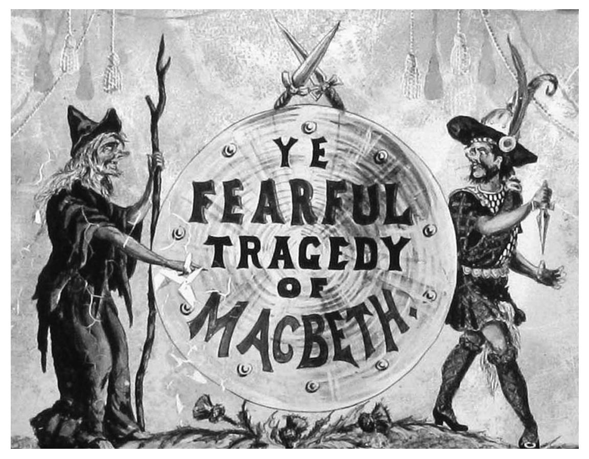
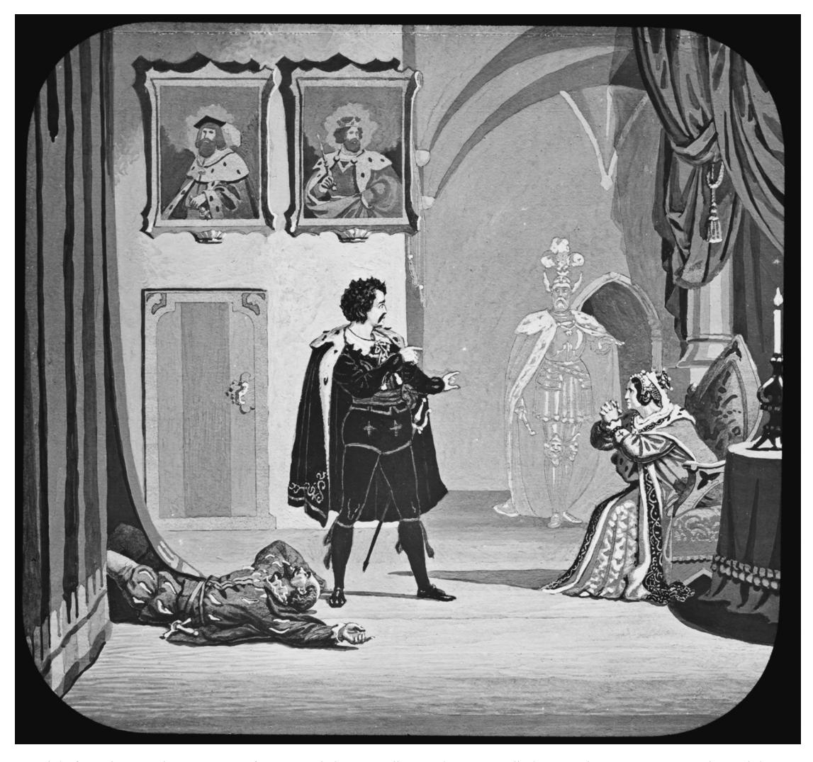
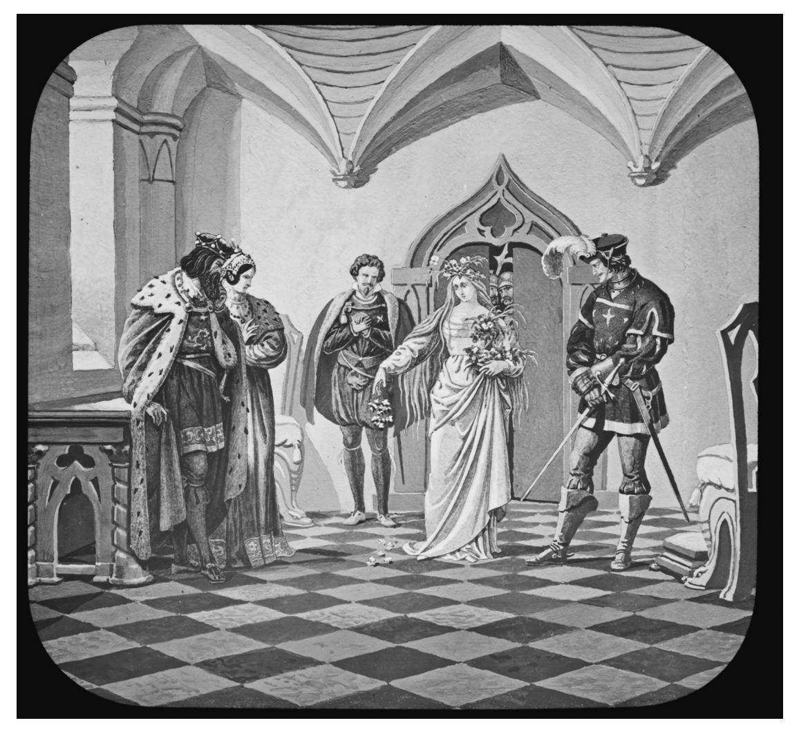
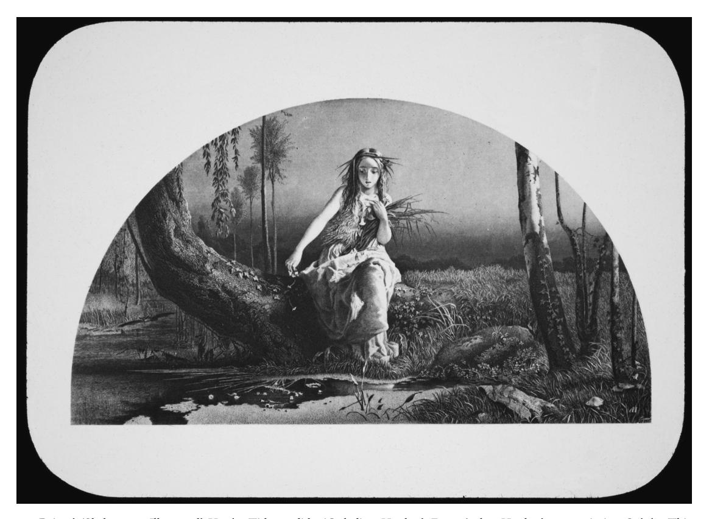
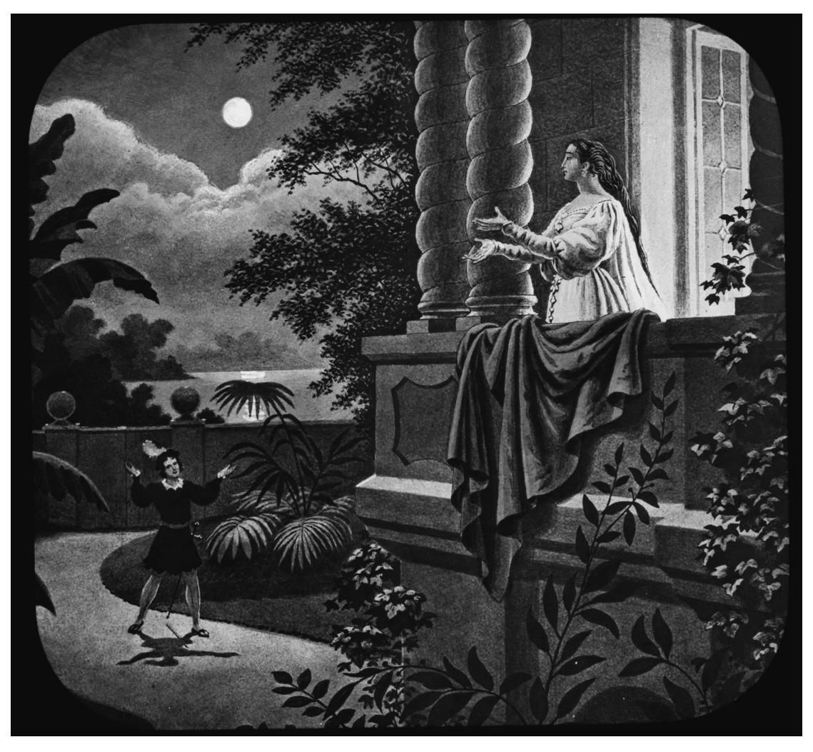
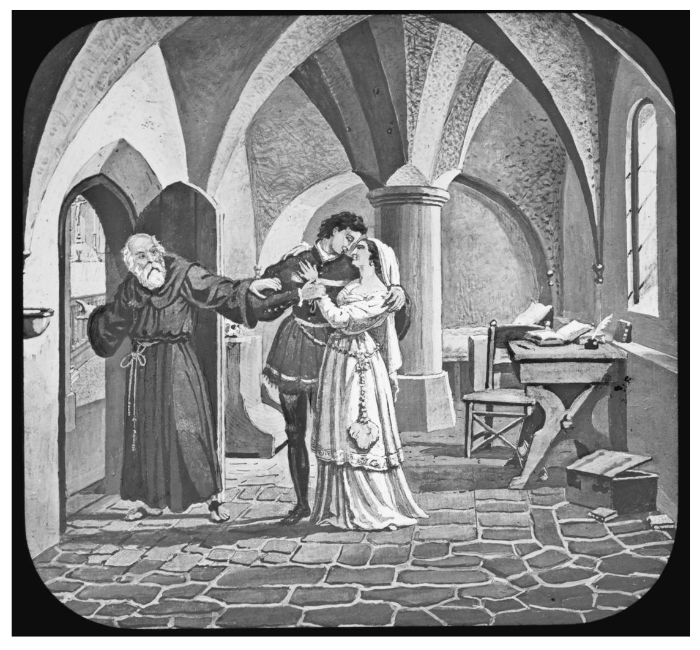
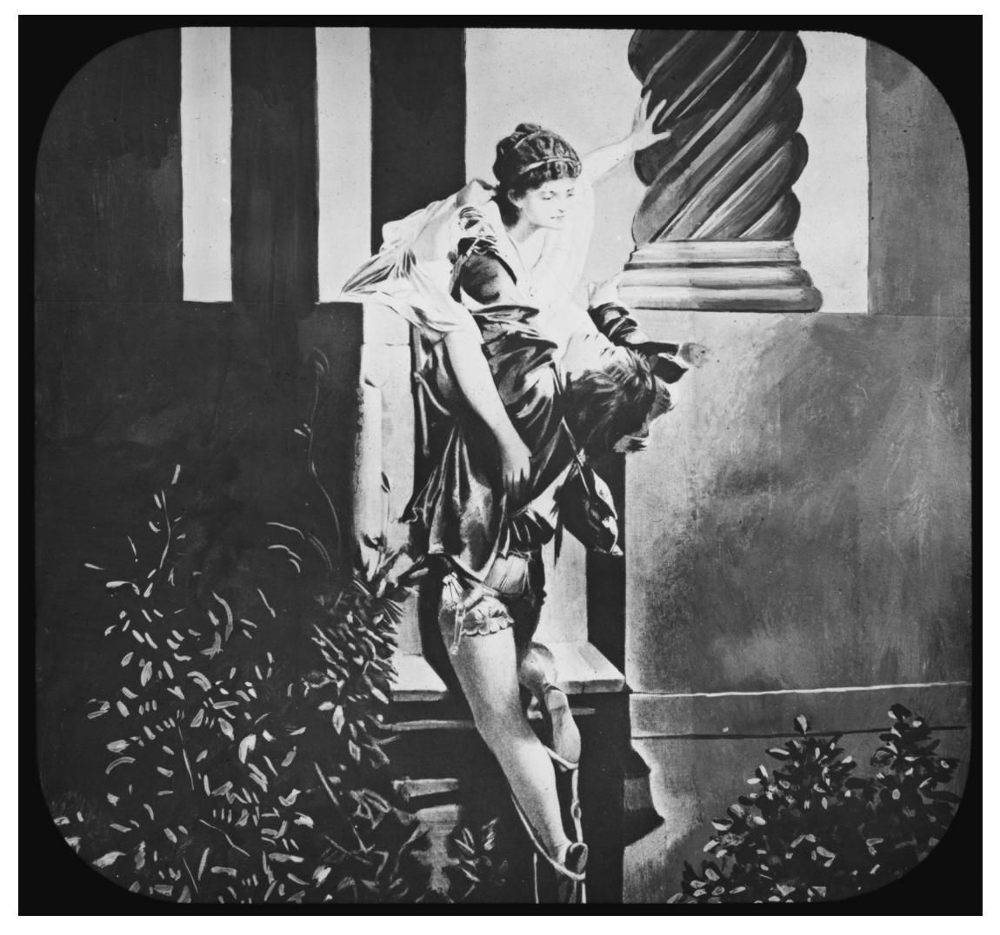

# SHAKESPEARE AND THE MAGIC LANTERN JUDITH BUCHANAN

In 1841/2, a magic lanternist calling himself 'Timothy Toddle' wrote down, for his own reference, the running order for his slides. Alongside each numbered and titled slide, he scripted an accompanying commentary. Toddle, it seems, wanted to ensure both the correct sequencing of his material and the fluency of his public patter. His show opened, as was customary, with an introductory 'Welcome' slide and closed with one reading 'Good Night' and another 'God Save the Queen'. Between these end points, the show consisted of approximately 180 other slides, ranging significantly in theme and tone. The surviving running order reveals that in the midst of slide sequences such as 'A very clever trick of clowns', 'Miss Lucy swinging from a Walnut tree', 'Punch and Judy', 'Mr Pickwick running after his hat' and 'Lord Byron – a poet of the first rate talent but of the most seductive & dangerous principles', Toddle also dropped in slides illustrating two dramatic moments from *Macbeth*, each accompanied by a summarized narration of the relevant section of the drama and some select Shakespearian quotation.1

Subsequently, Toddle's script passed to another lantern-lecturer who, in *c.*1870, made some modifications and additions to it in a discernibly different hand.2 This later lanternist's additions included two further Shakespearean sequences, from *Hamlet* and *Richard III* respectively. As had been the case for the original *Macbeth* section, both additional Shakespearian sequences were accompanied by some scripted narration and gobbets of appropriate quotation.

The Toddle document is, as far as I am aware, unique in the insight it offers into the flavour of a nineteenth-century magic lantern show in its totality.3 It tells of the variety of types of slide that could be included in a single show, the extent and tenor of the commentary that might accompany them and, through its passage down the century and subsequent modification, the adaptability of such shows according to the preferences of the lanternist, the prevailing cultural climate and the current availability and modishness of particular slides. Later in this article, in the context of a discussion of other uses

1 This surviving hand-written lantern reading consists of six sheets of paper folded and sewn into a booklet of 24 pages. Topical news items mentioned in the script (the recent birth of the Prince of Wales and the imminent opening of the Thames Tunnel) help to date it to 1841 or early 1842. The surviving manuscript, complete with later additions, is now held by the Magic Lantern Society of Great Britain (MLS). A helpful transcription of it is reproduced in Dennis Crompton, David Henry and Stephen Herbert, eds., *Magic Images: The Art of Hand-Painted and Photographic Lantern Slides* (London, 1990), pp. 47–53. 2 This later lanternist also had the revised manuscript booklet

bound (or rebound), presumably to ensure its continued usefulness as a blueprint for entertaining lantern shows. Given the surviving evidence about known lanternists, it seems reasonable to assume that Toddle's successor was also male. I take the *c*.1870 date of the later handwritten modifications from Crompton, Henry and Herbert. The slides themselves from the Toddle collection have not, as far as we know, survived. 3 Many slide readings produced by slide manufacturers to

accompany the sale of particular themed sequences (typically of ten to fourteen slides each) survive. However, the scope of Toddle's script surpasses these, designed as it was to incorporate such mini-stories within a script for the entire show.

of Shakespeare within the institutional life of the magic lantern, I discuss the particular, and evolving, contribution of Shakespeare to the scripted lantern entertainment originally designed by Toddle. Two fundamental pieces of evidence provided by this manuscript of relevance to the current enquiry are, however, worth noting at this introductory stage: first, Shakespeare's presence within magic lantern shows at all, as one in an eclectic mix of narrative and non-narrative subjects; and second, the augmentation of the Shakespearian aspects of the show later in the century as a greater range of such slide sequences became available and their popularity increasingly assured.

∗∗∗

The nineteenth century witnessed a diverse range of engagements with Shakespeare, both earnest and satiric. Many of these forms of Shakespearian cultural expression have been well documented and discussed.4 This is not, however, the case for Shakespeare in the magic lantern. On the few occasions when nineteenth-century Shakespearian lantern sequences have been discussed, they have tended to be cited (including by me) principally to compromise the claim that 1899 (when Herbert Beerbohm Tree made his pioneering film of *King John*) constituted a definitive beginning for the history of 'screened Shakespeare'.5 In this article, I treat Shakespeare and the magic lantern as a subject in its own right rather than as an introductory tool for retrospectively redefining the history of Shakespeare in another medium. To clarify the import and profile of Shakespeare's presence in the magic lantern, I begin with an account of the culture and operations of the lantern *per se*. I then turn to the particular, and ranging, uses to which the lantern put Shakespeare as one element within its considerable and influential repertoire of entertainment and edification.

# the lantern: mechanisms, uses, profile

A technological curiosity in the latter half of the seventeenth century, through the eighteenth and nineteenth centuries the magic (or optical) lantern then became a well-established, and increasingly influential, part of European education and socially diverse entertainment. By the 1890s, it had accrued a rich technological, artistic and sociological history on both sides of the Atlantic.6 Lanterns formed part of ghostly exhibitions, church meetings, travelling shows, variety divertissements and special lectures.7 For those who could afford such things, the lantern also formed an increasingly regular part of domestic entertainments.8 For present purposes, however, it is public lantern shows, and the

see David Robinson, ed., *The Lantern Image* (London, 1993). 8 For Samuel Pepys's 19 August 1666 account of a lantern show in his home, see Robert Latham and William Matthews, eds., *The Diary of Samuel Pepys,* vol. 7 '1666' (London, 1972), p. 254; for Charles Dickens's plans to host a lantern exhibition at home for his son's birthday party, see letter of 31 December, 1842, reproduced in M. House, G. Storey, K. Tillotson *et al.*, eds., *The British Academy Pilgrim Edition of the Letters of Charles Dickens*, vols. 1–12 (Oxford, 1965–2002), vol. 3 (1974), p. 416. For advice to amateur lanternists on subjects suitable for a 'parlour entertainment' for 'the domestic circle', see Anon, 'The Magic Lantern: Its Construction, Illumination, Optics & Uses', *The Optical Magic Lantern Journal and Photographic Enlarger*, vol.1 no.1 (15 June, 1889), pp. 2–4 (3).

4 See, for example, the exploration of the Victorian predilection for puncturing the cultural sanctity of Shakespeare through burlesques, comic songs, cartoon sketches and skittish poems in Richard W. Schoch, *Not Shakespeare: Bardolatry*

*and Burlesque in the Nineteenth Century* (Cambridge, 2002). 5 Discussions of Shakespeare lantern exhibitions as context for the story of Shakespeare on screen include John Collick, *Shakespeare, Cinema and Society* (Manchester, 1989), pp. 12–32 and Judith Buchanan, *Shakespeare on Silent Film: An Excellent Dumb Discourse* (Cambridge, 2009), pp. 25–42. The current

article subsumes and develops that section. 6 An estimated 75,000–150,000 lantern shows of varying styles were on offer in America each year in the latter half of the nineteenth century. See Terry Borton, *Cinema before Film: Victorian Magic Lantern Shows and America's First Great Screen Artist, Joseph Boggs Beale* (forthcoming). Pre-publication excerpts posted at: www.magiclanternshows. com/filmhistory.htm, hereafter Borton online. For a history of American lantern shows, see also Charles Joseph Pecor, *The Magician and the American Stage* (Washington, DC, 1977) and Xenophon Theodore Barber, 'Evenings of Wonders: A History of the Magic Lantern Show in America', unpublished PhD dissertation, New York University (1993). 7 For an iconographic history of lantern shows and audiences,

varied audiences that attended these, that will be of interest.

The lantern worked by projecting onto a wall or screen images drawn, painted or eventually printed onto glass slides. These slides were inserted in turn into a slot in the side of a box (lantern) illuminated from behind first by a candle and then, as the technology developed, by a paraffin flame, a carbon arc, a gas discharge lamp and, in time, an electric bulb. The projection could be in vivid colour and the projected image sharp and clear. The use of more than one lantern trained on the same point on the screen, or a lantern that contained multiple slideloading points (a diunial or triunial) enabled images to replace each other in rapid succession, creating the impression of movement. As early as 1713, Jonathan Swift had reported of a lantern show that 'I went afterwards to see a famous *moving* picture, and I never saw anything so pretty'9 (my emphasis) and, by the mid-nineteenth century, the lantern's range of possible effects simulating movement was striking. It was, for example, possible to create the popular 'dissolving views' by bringing up the light on one slide while simultaneously taking it down on another, the transition from one version of a scene to another (a winter landscape transmuting 'magically' into a summer one, a dormant volcano into an erupting one, a dancing beauty into a dancing skeleton and so on) being timed to best effect by the accomplished expertise of the lanternist himself. Some slides ('slip' or 'slipping' slides) also included adjustable mechanical sections that could be moved or removed mid-projection and/or a pulley system that enabled a section of the slide to circulate repeatedly. In this way, for example, a fountain could be seen spouting water continuously, a sleeping man could accidentally swallow a rat each time he opened his mouth to snore, a rosebud could open into bloom and return to bud, or bathing beauties could be seen alternately dipping into and emerging from the water.10 By the deft manipulation of the effects levers, pulleys or turning handles on the slides and by the changing of the slides themselves, therefore, the sudden or gradual animation of a person or transformation of a scene could be implemented by the lanternist.11

A lantern presentation would typically incorporate both a musical accompaniment (most frequently from a piano), and a vocal commentary provided by a live lecturer. The commentary was sometimes offered by the lanternist himself from his slide-loading position behind the lantern, sometimes by a separate lecturer at the front of the hall. In some cases, it would have been scripted ahead of time; in others it was extemporized. And sometimes (as may have been the case for Toddle), a prepared script would have allowed a confident lecturer then to extemporize at will from a scripted prompt. Writing in 1889, Henry Cooper argued that the chief determinant of a successful lantern exhibition was the quality of the commentary:

The lecture must be the backbone of the entertainment. The slides may be as good as possible. The lenses of the best construction, but if the description of the pictures be faulty, they will avail nothing to satisfy modern taste.12

Styles of commentary varied from the flippantly jocular to the designedly edifying and educative. Nevertheless, there was general agreement that the level of preparation of the spoken accompaniment, and the degree of fluency and interest with which it was delivered, was a key influence in making or marring a show:

p. 10. 12 *The Optical Magic Lantern Journal and Photographic Enlarger*, vol. 1 no. 1 (15 June, 1889), p. 8.

9 Swift, *The Journal to Stella*, ed. George A. Aitken (London, 1901), Letter 62 (March 1713), p. 530. Quoted in Laurent Mannoni, *The Great Art of Light and Shadow: Archaeology of the Cinema* (Exeter, 2000), p. 121. 10 A single, exquisitely painted, English 'wreck and rescue'

slide from *c*.1840, for example, showed a small rowing boat moving across a troubled sea from a foundering vessel to the shore, while the waves moved up and down threateningly around it. This effects slide combined lateral movement (of the boat) with vertical movement (of the waves) – a bravura example of the lanternist's art. I am grateful to Richard Manwaring Baines for showing me this delightful effects slide from his collection. 11 For a mid-nineteenth-century description of the various

ways in which movement on the screen could be generated in lantern shows, see Benjamin Pike Jr., *Catalogue of Optical Goods* (1848), quoted in George Kleine, 'Progress in Optical Projection in the Last Fifty Years', *Film Index* (28 May, 1910),

let the slides of some interesting story be passed through the lantern in succession without a word of context, what is the result? – Weariness and yawning. Here is the secret, then – the story behind.13

A lantern show working at its best, of course, allowed the linguistic elements to work in sympathetic collaboration with visually pleasing slides to create a bright and engaging composite presentation.

The stock-in-trade lantern sequences in need of enlivening commentary tended to fit the following broad types: phantasmagoria, morality tales warning against the dangers of drink, Bible stories, travel narratives/geography lessons/missionary reports (lantern tours of the Holy Land were a favourite), tales for children (*Cinderella, Dick Whittington, Little Red Riding Hood, Aesop's Fables* and *Alice's Adventures in Wonderland* were all popular), adventure stories (notably *Robinson Crusoe, Robin Hood* and *Don Quixote*)*,* sentimental melodramas (tales of penury, bereavement, personal sacrifice and cold weather), comic sketches (with titles such as 'Lady on kicking donkey', 'Punch with growing nose', 'Monkey riding cat'), grand historical subjects (Wellington's battles, the death of Nelson, kings and queens of England), and pictorial accompaniment to wellknown stories, poems and songs (in addition to the ever popular Defoe, authors such as Bunyan, Milton, Swift, Dickens, Longfellow, Coleridge and Tennyson were also regularly plundered as a source for slide sequences).14

# shakespearian excerpts in the magic lantern

Though not central to this stock repertoire, Shakespeare nevertheless made many appearances in the Magic Lantern and, reciprocally, enlisted the lantern in more traditional theatrical Shakespearian productions on occasion too. As early as 1821, for example, Edmund Kean included lantern slides in his stage *King Lear* at Drury Lane to augment the visual effects of the production.15 Moreover, the memorializing of celebrated theatrical performances was sometimes aided by projecting images of famous stage actors in Shakespearean roles as part of touring, culturally edifying or more tonally varied lantern lectures. Slides of paintings such as 'Mrs. Siddons in the Character of Queen Catherine', 'Mr. Kean in the Character of Richard the 3rd' or 'Ellen Terry, as Lady Macbeth' helped to promote and sustain the celebrity of Shakespearian players by bringing their image to larger and more diverse audiences than could have attended the performance of place-specific and time-bounded theatre productions.16 And while theatrical culture was being given a wider profile in this way, in a mutually beneficial exchange of cultural authority, the lantern was thereby acquiring kudos as a vehicle both for celebrating, and reflecting upon, artistic greatness. Such culturally respectable fare might even have helped provide the compensation for, or wholesome distraction from, some of the more frivolous, or slightly saucy, slides that sometimes appeared on lantern programmes.

In the various collaborations between the lantern and Shakespeare, however, the lines of appropriation were usually more unilaterally drawn as the lantern adopted and adapted Shakespearian material for its own satirical, visually diverting or educational purposes. A single Shakespearian image was even occasionally used as an economical point of collective recognition to illustrate a lantern lecture about something else entirely: Lady Macbeth in night-gown bearing dagger and drugged posset could, for example, contribute to phantasmagoria horror shows as a signifier of

- 1978), pp. 81–3. 16 Crompton, Henry and Herbert, *Magic Images*, p. 53. The
- Ellen Terry slide is from the author's private collection.

13 Amy Johnson, 'Is the Lantern Played Out? No', *The Optical Magic Lantern Journal and Photographic Enlarger*, vol. 5 no. 67 (1 December, 1894), pp. 208–9 (209). 14 In a further article entitled 'Is the Lantern Played Out? –

No', Albert Tranter specifically extolled the virtues of the lantern 'as an aid in illustrating imaginative poetry', citing examples from Coleridge and Shelley: *The Optical Magic Lantern Journal and Photographic Enlarger*, vol. 7 no. 80 (January, 1896), p. 10. 15 See Terence Rees, *Theatre Lighting in the Age of Gas* (London,

night-time terror or metaphysical torment; Lear and Poor Tom could emblematize 'delusional insanity' and 'feigned insanity' respectively as part of a lantern lecture on mental illness.17

The approach of Toddle and his successor, however, was less brazenly utilitarian than this. Rather than raiding a Shakespeare play for a tropic character to serve as passing illustration for something else, they allowed a series of Shakespearian dramatic moments a life of their own. In line with the comparable treatment accorded *The Pickwick Papers*, for example, they worked on the assumption that their audience had some prior knowledge of the source text.18 Reference to one or two celebrated dramatic moments from a play could, therefore, through the evocative use of a few slide images, be assumed sufficient to conjure the broader drama. Moreover, the accompanying commentary could attach the dramatic excerpt – if in slightly perfunctory manner – to the language and narrative context of its Shakespearian origins.

In the following extract from the Toddle manuscript (with spelling, lineation, punctuation and introductory titles retained), the sections from either side of the Shakespearian sequences are also quoted, to showcase not only the quantity and character of the scripted commentary but also the local specifics of the exhibition context:

36. Elegant Flower call'd the Turks Cap – See how nicely they fit a Turks Hd. The Turks are proud of their Caps & are looking

Round for Admiration.

∗37 Artificial Ice at the Colosseum Regents Park

∗37a Scene from Hamlet – Whither will thou lead me Speak Ill go no further Mark me – I will – I am thy fathers Spirit – Now Hamlet hear 'tis given out that sleeping in mind orchard A Serpent stung me, but know thou noble youth the Serpent that did sting thy fathers life now wears his Crown.

King Richard The King enacts more wonders than a Man – His horse is slain – but all on foot he fights seeking for Richmond in the throat of Death

The Death of Richard God & your Arms be praised victorious friends the Day is ours the Tyrant Dog is dead

38. The Combat between McDuff & Mackbeth. Mackbeth had surprised McDuffs Castle during his absence & had barbarously murdered his wife and Children – Macduff exclaims Gentle Heaven – front to front bring thou this fiend of Scotland & myself – within my swords length let him, and if he scape then Heaven forgive him too

At length they meet in Battle. McDuff cries out Then yield ye Coward & live to be the Show & Gaze of time

I will not yield & so lay on McDuff – and death to him who first cries hold enough

38A Paul Pry – I hope I don't intrude – Ive just lookd in to see whats going forward and hope to have a slice of Cake bye & bye

17 The hand-coloured slide of 'Lady Macbeth' is reproduced in Mervyn Heard, *Phantasmagoria: The Secret Life of the Magic Lantern* (Hastings, 2006), p. 290. The line-drawn slides of Lear and Poor Tom, drawn by 'A.J.C.', are held in the Archive of the Bethlem Royal Hospital, Box A07/1, inventory nos. LSC-090 and LSC-091 respectively. 18 On the prevalence of 'Shakespearean phrases, aphorisms,

ideas, and language' within the nineteenth-century imagination, see Lawrence W. Levine, *Highbrow/Lowbrow: The Emergence of Cultural Hierarchy in America* (Cambridge, MA, 1988), pp. 31, 37–8. On how well Shakespeare was known and how frequently quoted in nineteenth-century America, see also pp. 27–8.

38B Hodge giving his dog a bone Well then jump & you shall have it.

38C The Escape of Mary Queen of Scotts for Lochleven Castle19

Even where, as here, there were minor inaccuracies in a quoted script, accompanying the projection with a few choice Shakespearian quotations had the advantage of licensing the lantern lecturer to display both his erudition (real or assumed) and, in the interests of the entertainment, his declamatory power (hammed or otherwise). The tenor of Toddle's commentary across the manuscript as a whole suggests he was well versed in extracting maximum comic potential and dramatic excitement from his slides. The choice of Shakespearian sections certainly makes provision for an accompanying oratorical flair. The appearance of the ghost on the battlements (37a), for example, allowed for the heightened drama of some ghostly vocals in the commentary ('I am thy fathers [sic] Spirit . . . '). The script for the two scenes from *Macbeth* (the attack on Macduff's castle and the slaying of Macbeth) called both for a steeliness in delivery ('bring thou this fiend of Scotland . . . ') and for a resolute exchange, ideally to be conducted between differently modulated voices ('Then yield ye Coward . . . ', 'I will not yield . . . '). Although constituting only a fraction of the play, these two *Macbeth* scenes, as exhibited in the lantern, constituted their own contained mini-drama of action and consequence, the slaying of Macbeth coming as a focused act of revenge for the earlier slaughter of Macduff's family. Despite their brevity, therefore, these two scenes are allowed some narrative autonomy, implicitly standing as synecdochic reference to the play as a whole.

The scenes labelled 'King Richard' and 'The Death of Richard', showing the horseless Richard fighting on and dying, again provided the opportunity for some exclamatory drama in the commentary ('the Day is / ours the Tyrant Dog is dead'). It is, perhaps, notable that the script omits the line we might think almost required in this context – 'A horse! a horse! my kingdom for a horse!' (a line with a significantly popular profile, then as now).20 While, however, its omission from the script may indeed mean that this line was never uttered as part of the show, it is also possible that the lanternist simply did not feel the need to script it in order to be able to produce it when the occasion demanded. Since the lanternist's booklet constituted, in effect, an aide-memoire rather ´ than necessarily a fully prescriptive script, it would have allowed for embellishment of exactly this sort. Indeed, it was fundamental to the identity of a lantern show that there was always the possibility of a joyous opportunism (or hapless meandering) in the way it progressed, depending on the flippant or learned digressions the individual lecturer chose to insert, the improvisatory flourish or dragging ponderousness with which he did so, and the receptivity or otherwise of the audience at any given show.

Since the Shakespeare slides from the Toddle lantern show have not survived, we cannot know precisely what they might have looked like.21 Nevertheless, we can be fairly confident about their twofold function as inclusions on the programme: they both added dramatic excitement to the lineup and lent at least the semblance of cultural elevation to proceedings. However, sandwiching the culturally elevating material between a visual gag about the Turk's Cap (36) and a slipping slide showing a dog jumping for a bone (38B) would, presumably, also have ensured that the balance of the show as a whole did not in the process become too burdened by educational weight.22

19 The slide sequences numbered 37 and 37a (marked ∗) were amongst those interpolated by the subsequent lanternist. Crompton, Henry and Herbert, *Magic Images*, p. 51. 20 On the history of the pantomimic celebrity of this line, see

Julie Hankey, *Richard III: Plays in Performance* (London and Totowa, NJ, 1981), p. 15. 21 The precedent provided by other surviving slides suggests

these would have been sparely executed, line-drawn illustrations, hand-coloured prior to sale. Their primary purpose was to evoke the dramatic moment and clarify plot details

pertinent to that moment. 22 It was, of course, a pattern of tonal variety on an exhibition programme that the moving picture industry would in due course emulate.

Brief excerpts from *Macbeth*, *Hamlet* and *Richard III* were not the only Shakespearian gobbets to be absorbed into a divertingly unfocused rag-bag of lantern offerings of this kind. From 1850 onwards, for example, several different English versions of slide-sets illustrating Jacques's 'Seven Ages of Man' speech from *As You Like It* became available for inclusion in variety lantern shows. These slide-sets were each structured as seven-slide sequences, with a scripted reading from *As You Like It* produced by the slide producer to be read alongside the projection and the possibility of accompanying light animation effects to enliven some of the ages.23 Such sequences provided a contained brush with Shakespeare while combining the considerable virtues of reassuring familiarity, a ready-made internal structure (from first to last age) and, significantly in the context of the broader show, winning brevity.

# abridged shakespeare in the magic lantern

In the latter half of the nineteenth century, however, the engagements of slide-manufacturers with Shakespeare became more narratively ambitious as they turned their attention to representing whole Shakespearian plots in compressed form. Each lanternized sequence adapted from a single Shakespeare play was composed of between eight and fourteen plot-evocative slide images. Typically, these were sequenced so that one charged dramatic moment ceded to the next without any plotretarding, or tension-easing digressions into inconsequential business along the way. The chosen slide images served as the graphic hooks upon which the narration of the story could then be hung. Wherever possible, slide artists seem to have chosen their individual images to resonate with the pictorial version of the play that already had a profile in the public imagination. This existing profile drew upon well-known Shakespearian paintings, engravings, edition illustrations and memorable tableaux from theatre productions that iconized select moments from the plays. Even within the constraints ofˆ the eight to fourteen slide format, it would, for example, have been unthinkable to produce a lanternized *Romeo and Juliet* that omitted an image of Romeo scaling Juliet's balcony, an *Othello* without the visual sensationalism of the murder of Desdemona, or a *Hamlet* that ignored the indulgent popular romantic imagery of Ophelia in the brook (a dramatic moment whose rich graphic life derived entirely from its extra-theatrical expressions). In referencing the broadly conventionalized visual identity of 'peak moments' from the plays, slide artists were also reaffirming the summarized version of each play this came to represent.24 Late nineteenth-century lantern Shakespeare, therefore, both drew upon and contributed to an analogue, abbreviated visualized and narrativized version of the best-known plays – a version of manageable proportions in which the plays could circulate easily and intelligibly in consensually recognizable form.

In the nineteenth century, encountering Shakespeare in a partially allusive or vigorously abridged form was not an experience particular to the magic lantern. In fact, only a minority of people would have encountered a Shakespeare play principally either through reading an unexpurgated version or attending a full, worded production. In the mid-late nineteenth century, this was Shakespeare for the purists and the cultural elite only. Others certainly met Shakespeare, but their sites

23 Multiple versions of a *Seven Ages of Man* 7-slide sequence were issued, each with a published one-page version of the speech from *As You Like It* 2.7, to be read in conjunction with the exhibition of the slides. The MLS's Slide Readings Library holds three lantern scripts for *The Seven Ages of Man*: Millikin and Lawley of London's pre-1872 script (serial no. 91903); York and Sons of London's pre-1887 script (serial no. 90802); and Alfred Pumphrey of Birmingham's post-1875 script (serial no. 91677). It has not as yet proved possible to date these slide readings precisely. However, the active trading years of the issuing company in each case narrows the window of possibility. 24 The 'peak moment' approach to literary adaptation, accord-

ing to which only the most dramatic moments are selected for representation in another medium, is discussed in Tom Gunning, 'The Intertextuality of Early Cinema: A Prologue to *Fantomas ˆ* ', in Robert Stam and Alessandra Raengo, eds., *A Companion to Literature and Film* (Oxford, 2004), pp. 127– 143 (128).

of encounter were less rarefied: in popular songs, through the Lambs' simplified *Tales from Shakespeare* or in the more rough-and-tumble variety theatres and vaudeville houses on both sides of the Atlantic where Shakespeare had long been offered in truncated, simplified and often skittish versions.25 Lanternized Shakespeare therefore joined a range of other pictorialized, dramatized, distilled and otherwise reduced retellings of Shakespeare in finding a form in which the plays could connect quickly with a popular audience.

The most popular of Shakespearean subjects for lantern treatment in the final quarter of the nineteenth century seems to have been *Romeo and Juliet*. 26 Theobald and Company of London, for example, produced a twelve-slide hand-painted sequence depicting a compressed version of the play with an accompanying scripted reading.27 Another twelve-slide chromo-litho *Romeo and Juliet* slide sequence, 'splendidly coloured', is advertised by the culturally aspirational manufacturer, Robert H. Clark, in the January 1896 issue of the *Optical Magic Lantern Journal and Photographic Enlarger* as one in a list of slide sets for sale for four shillings each (a price suggestive of a premium product).28 Three richly drawn *Romeo and Juliet* slides from a sequence produced by Newton and Company of London are in my own collection, and further versions survive in other collections, though the manufacturers in those cases have proved more difficult to trace.

*Macbeth* was also considered both sufficiently dramatic and sufficiently well known to be amenable to compressing for lantern treatment. In one skittish English lantern version from *c.*1880 entitled, as its opening slide colourfully announces, 'Ye Fearful Tragedie of Macbeth' (Illustration 40)*,* an effects slide shows the three hand-drawn, handpainted witches seen in profile and pointing in a chirpy parody of Fuseli's well-known painting. A superimposition lever enables these to appear as if from nowhere at the will of the lanternist. In a later slide from the sequence, a duelling Macduff cuts off Macbeth's head by means of a further mechanical effects lever. The appeal of this sequence could always then be comically enhanced by moving the lever forwards and backwards in quick succession causing Macbeth's head to be alternately severed from and returned to his neck.29

# brigg s's ' shake speare illustrated' lantern slide series

It was, however, an American family firm of slide manufacturers and slide painters, Casper W. Briggs and Company of Philadelphia, that showed the most applied commercial interest in telling Shakespearian tales through the lantern. Briggs released two separate series of Shakespearian painted slide sequences, the first in the early 1890s, the second in 1908. The earlier of these went under the series title 'Shakespeare Illustrated'. The plays lanternized for this series included *Romeo and Juliet*,

- relative production rates. 27 The MLS's Slide Readings Library holds a script for the Theobald 12-slide *Romeo and Juliet* lantern sequence (serial no. 90478). On Theobald and Company's role in introducing chromolithography to English slide-production for their 'sets of twelve slides, the subjects including topographical scenes, nursery tales, and episodes from the Scriptures', see Stephen Herbert, *A History of Pre-Cinema*, vol. 3 (London, 2000),
- p. 90. 28 Whole-page advertisement, *The Optical Magic Lantern Journal and Photographic Enlarger*, vol. 7, no. 80 (January, 1896), p. vii. Other available subjects advertised in the same issue that help to identify Clark's cultural placement in the market include: 'The Pilgrim's Progress', 'Red Riding Hood', 'Pictures from the Old Testament', 'Cinderella', 'The Slaves of Drink', 'Marley's Ghost', 'Punch and Judy', 'Pictures from the New Testament', 'Discovery of America by Columbus'
- and 'Scenes from Pickwick, &c'. 29 I am grateful to the eminent lanternist and lantern historian Mervyn Heard for providing details about, and generously giving me access to, some of his remarkable nineteenthcentury Shakespearian slides.

25 See Schoch, *Not Shakespeare* and Levine, *Highbrow/Lowbrow*, pp. 18–23. The popularity of the Lambs' *Tales from Shakespeare* (1807) gave their accessible version of Shakespearian 'stories' an important place in the education of many

Victorians. 26 The surviving slides, slide readings and other documentary records of manufacturers' slide catalogues point to the unrivalled popularity of *Romeo and Juliet* in this respect. However, the vagaries of what survives and what does not of this body of material should properly temper any absolute claim about

40. The introductory slide to a satirical lantern version of *Macbeth c*.1880?

*A Midsummer Night's Dream*, *The Taming of the Shrew*, *The Merchant of Venice*, *As You Like It*, *Timon of Athens*, *The Merry Wives of Windsor*, *Twelfth Night*, *Hamlet*, *Othello*, *King Lear*, *Macbeth*, *Cymbeline*, *The Winter's Tale* and *The Tempest*. 30 Each was represented by a set of (eight to fourteen) slides that, when projected in sequence with suitable narration and musical accompaniment, succinctly pictorialized the plot. The artist for Briggs's later 1908 Shakespearean series was one of America's most prolific and prominent lantern artists, Joseph Boggs Beale (1841–1926), employed by Briggs in the years after 1900. Titles from this second series included *The Merry Wives of Windsor*, *Hamlet*, *Romeo and Juliet* and *Othello*. 31 The slides from both series were mass-produced line-drawn images, collodion

- 30 The 1890s dating of the 'Shakespeare Illustrated' series is not definitive, but the mahogany of the wooden frame surrounds, the weight of the glass, the collodion used to coat the slides and the dates of the reproductions of the paintings from the *Art Journal* on which they draw, help identify the
- decade. 31 I am grateful to Terry Borton, the distinguished lanternist and lantern historian of the American Magic Lantern Theater, for kindly showing me his Joseph Boggs Beale Shakespearian slides of *Romeo and Juliet, Hamlet* and *The Merry Wives of Windsor* in Baltimore, NJ. Each sequence is a beautifully coloured, crisply worked plot compression celebrating the iconic 'moments' of each play while omitting sub-plots and suppressing complexities that might detract from the energetic forward trajectory of the pictorialized account. Beale and Briggs together made it their project 'to make great literature, history, and religion available on [the lantern] screen' for the benefit of a wide audience. See Borton online.

on glass, which were then hand-coloured for those customers who could afford the premium edition. Appropriate lines from Shakespeare have been hand-written onto the slide frame of some of the surviving slides. It is not clear whether this was done by Briggs before the point of sale, or by a particular lanternist who subsequently owned them, to help prompt his memory during the exhibition of his slides. Though plenty of published lecture scripts were marketed alongside dramatic slide sequences in this period to guide the lanternist in preparing the show, I have found no surviving trace of any such readings to accompany these particular sequences.

A remarkable collection of surviving Briggs Shakespearian slides is held in George Eastman House (Rochester, NY). By way of sample illustration of these, here I discuss the *Hamlet* sequence from the 1890s series and the *Romeo and Juliet* sequences from both the 1890s and the 1908 series.32 After a brief descriptive introduction to the sequence as a whole in each case, I concentrate principally, for present purposes, on the striking effect of the single slide included in the run that is an artistic anomaly in the context of the rest of the sequence.

#### i) *Hamlet*

Ten slides survive specifically from Briggs's *Hamlet* sequence from the 'Shakespeare Illustrated' series. However, there is also another surviving slide entitled 'Shakespeare Reading Hamlet to his Family' which comes from a contemporary Briggs series released in parallel called 'English History: 1486– 1603'. This slide would have formed an appealingly neat introduction (and/or conclusion) to the *Hamlet* sequence for any lanternist who owned both Briggs sequences. It shows a recognizably 'Droeshoutian' Shakespeare sitting at home in doublet and ruff recounting the story of *Hamlet* to his rapt and attentive family. The action of the *Hamlet* sequence itself is simply and clearly illustrated through a well-chosen series of exemplary, plot-packed cameo moments from the play: 'Hamlet – Ghost Scene', 'Hamlet's Soliloquy', 'Hamlet's advice to the players', 'Hamlet surprising the king at prayer', 'Hamlet's interview with his mother', 'Ophelia scattering flowers', 'Ophelia', 'Hamlet – a Church Yard', 'Duel between Hamlet and Laertes', 'Hamlet kills the king'.33 In addition to these extant slides, there may also have been a couple more that have not survived: perhaps one of the play-withinthe-play and/or one of Hamlet's body being borne aloft as a suitable closing image for the story. Whatever the missing slides depicted, sufficient numbers survive to demonstrate clearly the manner in which the story was compressed for lantern projection – a distillation of a succession of iconic moments, each one densely packed with economically encoded narrative information. A description of the single slide 'Hamlet's interview with his mother' (Illustration 41) can serve as sample illustration of how much plot could be inventively condensed into one 'action image'.

In this one slide, Hamlet, in doublet, sword and cloak, though bare-headed, stands in the middle of his mother's room beneath the two giltframed portraits of King Hamlet and King Claudius respectively, which hang, square-on to our gaze, on the wall above the door. Hamlet points towards an arched alcove at the back right corner of the room where the translucent ghost of his father stands. The ghost is in armour with an erminetrimmed kingly robe draped about his shoulders – the same robe that appears in both portraits and that Claudius himself wore in the previous slide. Despite being set back, the ghost seems larger than Hamlet – a colossus of a man (take him for all in all). His ghost, in Hamlet's vision and ours, is perspective-defyingly imposing, even from afar. Gertrude sits before Hamlet in right of frame, her hands clasped together and raised towards him

32 It has occasionally been necessary to make an inferential discrimination to place a particular slide as part of the 1890s or the 1908 sequence. Such discriminations are not fail-safe but have been based on style of illustration, character of slide

mount and placement of image within a run. 33 These titles are taken from the (unprojected) edge of the slide. They were probably inserted by the manufacturer prior to sale, and would also have been used to advertise the sequence in the company's catalogue of commercially available slides.

41. Slide from the 'Hamlet' sequence of Briggs's 'Shakespeare Illustrated' series. Collodion on glass, 3.25 × 4 in. Title on slide: 'Act III, Scene 4 – Hamlet's interview with his mother'.

pleading, presumably, for his sanity and her life. She ignores his imperiously gestured suggestion that she should look upon the ghost. At Hamlet's feet in the left of the image lies Polonius's body, which has evidently recently fallen through the arras that hangs there.

In sum, therefore, this slide presents an economically organized pictorial account of the entire closet scene telescoped into one encapsulating moment, the narrative implications of which the lanternist-narrator could then embellish at will. For this slide, as for most in the sequence, aesthetics are clearly subservient to plot, and the aesthetics, though not crude, certainly lack nuance. Even the details of perspective, for example, can be compromised if this allows for greater narrative communicativeness.34

34 Unlike some other slides of a similar date, Briggs did not make use of an appearing/disappearing lever-operated

42. Briggs's 'Shakespeare Illustrated' *Hamlet*. Title on slide: 'Act IV, Scene 5 – Ophelia scattering flowers'.

Distinguished clearly from this dominant storytelling mode, however, is the slide entitled 'Ophelia' (Illustration 43). Rather than having been specifically drawn by one of Briggs's slide artists for inclusion in this set, it is, by contrast, a reproduction of English painter Arthur Hughes's 1852 painting *Ophelia* – copied onto glass directly from a photographic plate taken of the *Art Journal*'s printed lithograph.35 Unsurprisingly, given its provenance, the image differs decisively in style and treatment from all others included in the sequence. It is

'effect' for their ghost. For a disappearing Shakespearian ghost, see the effects slide from an unidentified version of *Hamlet* reproduced in Crompton, Henry and Herbert, *Magic Images*, p. 51. 35 I am grateful to the distinguished lantern historian Stephen

Herbert for discussing this process with me. He tells me there may have been a copyright arrangement made between Briggs and the *Art Journal* for reproduction rights. Equally, however, Briggs may simply have taken copies of the images from the *Art Journal* without paying. There was precedent for both approaches. I have found no surviving evidence to suggest one way or the other in this case.

43. Briggs's 'Shakespeare Illustrated' *Hamlet*. Title on slide: 'Ophelia – Hughes'. From Arthur Hughes's 1852 painting *Ophelia*. This slide shows an Ophelia markedly different in style, presentation and associations from the Ophelia who appears elsewhere in the sequence.

conspicuously spare on narrative detail but rich in unexpected associations, technical acumen and significant whimsical charm. The Ophelia it presents is one who, unlike her more prosaic counterpart in the preceding slide (Illustration 42), for example, is appealingly suggestive of multiple other presences. Elaine Showalter has described the painting as showing:

a tiny waiflike creature – a sort of Tinker Bell Ophelia – in a filmy white gown, perched on a tree trunk by the stream. The overall effect is softened, sexless, and hazy, although the straw in her hair resembles a crown of thorns.

Showalter sees Hughes's Ophelia as a 'juxtaposition of childlike femininity and Christian martyrdom'.36 There is certainly a spiritual quality to the painting. Ophelia's face is serene, abstracted, even Madonna-like, and her waiflike fragility is emphasized by her delicately outstretched arm and by the isolation of her figure in a landscape so much bigger than herself. The straw in her hair is incidentally evocative of a crown of thorns, but also, perhaps, of a halo. She is victim and saint, child and sprite, Ophelia and Madonna, and a complex anomaly as included in this pictorial sequence.

In the context of the projected show as a whole, the effect of this anomalous insertion must have been striking. Hughes's pre-Raphaelite Ophelia

36 Elaine Showalter, *The Female Malady: Women, Madness, and English Culture, 1830–1980* (London, 1987), pp. 84–5.

inevitably differs markedly from the more pared down, na¨ıve style of the same character's other appearances in the slide run. It is true that Ophelia's trailing, extended right arm in the 'Ophelia scattering flowers' slide might perhaps be seen as an anticipatory mimicking of the yet more delicately extended right arm of Hughes's Ophelia, so constituting a suggestive bridge into the succeeding slide. In practice, however, that single echoed gesture across slides serves, if anything, simply to draw attention to the markedly different character of the two images as a whole, and of the two versions of Ophelia on offer within them. The daring disruption of stylistic consistency across slides robs the sequence of a sense of artistic unity, and even of character stability. In doing so, however, it confirms the iconic status of the character whose role in the narrative transcends any single manifestation, or even style of presentation. Ophelia, that is, can look like this or she can look like that. She can inhabit this or that sort of landscape. She can be eroticized, infantilized or idealized. Throughout all such variations in interpretive emphasis, however, the mythic dimensions of the story she occupies enable her to remain incontrovertibly 'Ophelia', possessed of a range of accumulated dramatic and artistic meanings. The progress of the story can, therefore, accommodate the stylistic adjustments without dislocating.

Briggs and Company made a habit of appropriating existing works of art for their slide narratives, often embedding them, as here, in broader, linedrawn sequences as an unprepared-for visual treat to be happened upon unexpectedly in the midst of more ordinary artistic fare. The Hughes painterly insert is, therefore, just one of several artistic surprises to have been culled from the pages of the *Art Journal* and implanted in one of the 'Shakespeare Illustrated' sequences. The inclusion of a known work of art in such sequences may, of course, have served as a gratifying nod to the artistic cognoscenti who, having recognized its provenance, might murmur modestly to their neighbour of their familiarity with it.37 The copying of works of art (woodcuts, engravings, half-tones and coloured prints) for lantern exhibition was, at any rate, a standard part of the repertoire for the major slide manufacturers. By the 1890s, the *Optical Magic Lantern Journal and Photographic Enlarger* was even issuing advice to the private collector about how best to do this. Published reproductions of works of art, the journal enthused, offer the lanternist 'an inexhaustible store from which to draw if due care is taken in the selection'. The journal did take the precaution of issuing the selfindemnifying caveat that '[i]n the first place, it is just as well to be on the safe side and not make copies of copyright pictures'38 – advice that was by no means, however, always followed in practice. I do not know, for example, whether Briggs and Company requested copyright permission for their reproduction of paintings from the *Art Journal*. It would not, however, be entirely surprising if they did not.

#### ii) *Romeo and Juliet*

All fourteen of the slides from Briggs's 1908 *Romeo and Juliet* lantern sequence have survived, all drawn by slide artist Joseph Boggs Beale. Beale's lantern scenes have little interest in psychological depth or emotional intensity, but they do tell the story both clearly and prettily. They appear in the following sequence: 'The quarrel in the street', 'Romeo and others in mask', 'Juliet at the balcony', 'Romeo and Juliet at the Friar's', 'Romeo's duel with Tybalt', 'Romeo and Juliet at window', 'Juliet beseeching her father', 'Juliet drinking the sleeping draught', 'Capulet and family weeping over Juliet', 'Romeo and the Apothecary', 'Duel between Paris and Romeo', 'Romeo drinking the poison', 'Death of Juliet', 'Reconciliation of Capulets and Montagues'.

37 As such, it would have fulfilled a similar function to the *tableaux vivants* on the nineteenth-century stage, which made recognizable artistic allusions for the gratification of those whose range of cultural reference allowed them to identify the visual quotation.

38 Duncan Moore, 'Copying Printed Matter for the Lantern', *The Optical Magic Lantern Journal and Photographic Enlarger*, vol. 5, no. 67 (1 December, 1894), pp. 215–7 (216, 217). For coloured prints, the use of orthochromatic plates with a screen was recommended.

44. Briggs's 1908 *Romeo and Juliet*. 'Juliet at the balcony'. Collodion on glass with applied colour. 3.25 × 4 in.

In the third slide in the sequence, 'Juliet at the balcony' (Illustration 44), Juliet stands between twisted Grecian columns in the foreground, her poised upright stance, semi-coiled hair and the drapes in her white dress aligning her tonally with the classical and heroic status of the columns that frame her. Although her arms are outstretched before her as she apostrophizes the Romeo she believes absent, everything about her suggests a woman fully under control. Romeo is visible at a significant remove down the garden, too distant for any facial expression to be clearly discerned. His arms too are raised, but without that potentially charged gesture communicating passionate investment. In contrast to Romeo's remoteness and Juliet's careful restraint, however, a luscious drape hangs unchecked over the edge of the balcony in the foreground of the image. The slide painter – typically separate from the slide artist – has painted this drape a suggestive deep pink, distinguishing it

45. Briggs's 1908 *Romeo and Juliet*. Friar Laurence's Cell. Collodion on glass. 3.25 × 4 in.

clearly from the night-time pale blues, pale greens and silvers of the rest of the image. Given Juliet's classical poise and Romeo's distance, the deeply coloured, haphazardly draped cloth invitingly suggests the potential for a passionate intensity that might otherwise be thought beyond the emotional range of these central figures. It is, in fact, a balcony scene of careful spatial choreography but of only symbolically displaced passion.

Given the self-possession of this scene and the fact that the whole sequence emerges from the designing vision of a single artist, it is perhaps no surprise that later images from the same sequence are comparably restrained.

At Friar Laurence's cell, for example, the young lovers embrace decorously, her head leaning on his shoulder and his head inclined gently towards hers as his arm gently encircles, and his hand rests gently upon, her shoulder (Illustration 45). The accompanying quotation, hand-written onto the lower frame of this slide, remembers the Friar's rather breathless words: 'FRIAR: "Come, come with me,

and we will make short work, for by your leaves, you shall not stay alone till holy church incorporate two in one."' Though the lovers are fully attentive to one another in Beale's pictorialized imagining of it, nevertheless the embrace we *see* is considerably more chaste in character than might be supposed from the Friar's evident impatience to see them married.

Across the entire slide sequence, in fact, Romeo and Juliet are presented as conventionally fetching figures, conducting a conventionally fetching Victorian love affair – if one with a (decorously enacted) tragic end. Despite the energy of the Shakespearian lines suggested as suitable accompanying quotation by the inscriptions on the frame, and despite the significant drama of the Shakespearian moment referenced in each case, the images themselves consistently temper the heightened feelings that drive the play. For all their narrative clarity and pretty arrangements of characters and scenery, these images are, in fact, emotionally tepid.

Another slightly anodyne visual rehearsal of *Romeo and Juliet* is on offer in a late nineteenthcentury slide sequence from English slide manufacturers Theobald and Company. In the Theobald balcony scene, Romeo is dandified in blue hose, burgundy doublet, Victorian moustache and feathered cap as he is suspended rather stiffly on a ladder approaching Juliet's parapet, while Juliet herself is scarcely present as a character at all – just visible, if slightly hazily, in the orangeate glow from the casement window. It is a scene which would clearly have served its purpose to facilitate a lively accompanying narration or recitation. However, while colour has been used with vibrant intensity on the slide, in other artistic respects it is conspicuously bland.

Whereas emotion seems absent from the Theobald balcony scene and is only emblematically suggested in the Joseph Boggs Beale one, it is, by contrast, potently and centrally present in the balcony scene slide from Briggs's earlier *Romeo and Juliet* sequence (from the 1890s 'Shakespeare Illustrated' series). As Arthur Hughes's painting of Ophelia was invited to disrupt the pretty artistry, and stylistic consistency, of the otherwise unchallenging *Hamlet* sequence, so here an imported artistic insert injects some heightened emotional cadence into the story of *Romeo and Juliet*. The image 'Romeo At Balcony' (Illustration 46) is borrowed from the celebrated Viennese artist Hans Makart's remarkable 1860s painting *Romeo and Juliet*. 39 Unlike in the Theobald and the Beale balcony slides discussed above, this balcony scene depicts Romeo's reluctant departure after his night with Juliet rather than his first, less sexually expressive approach. But the Makart image is also stylistically clearly distinguished from the other two *Romeo and Juliet* balcony slides. Such is the strikingly realistic artistry in the portrayal of the two central figures, that – though painted by Makart – the image initially deceives the eye into believing it a photographic slide employing life models (a common device in the lanternizing of morality tales and of Dickens, for example). A fully engaged, and utterly believable Juliet leans over the edge of the balcony in order to embrace her departing lover. She steadies herself on the adjacent pillar with her left hand in order to use her right to keep her hold on his precariously balanced figure. He, meanwhile, appears to hang from her grasp, precariously kneeling on the rung of a rope ladder thrown over the side of the balcony parapet. His head is thrown sensuously and uncompromisingly back that he might gaze on Juliet. His physical dependence upon her seems total, and he apparently gives himself to it, and to the moment, without qualification. The light – presumably from the rising sun – falls transcendently upon both of their faces, locked together as they are in an exchange of desirous gazes.

In the degree of the passion so transparently on display and in its arresting reversal of gender roles, it is a striking image. This Romeo is no swashbuckling antecedent to Errol Flynn scaling the walls to hop manfully into Olivia de Havilland's castle

39 At the time of writing, a photographic image of the Makart painting is available to view online at, for example: www. photographersdirect.com/buyers/stockphoto.asp?imageid= 657464

46. Title on slide frame: 'Romeo At Balcony – Makart'. Series Title: 'Shakespeare Illustrated'. Collodion on glass. 3.25 × 4 in.

bedroom in Warner Brothers' *Adventures of Robin Hood* (Michael Curtiz, 1938), nor of any of the later agile filmic Romeos adept at displaying their effortless manhood on ivy-clad walls. Rather, this Romeo's arched back, thrown back head, balletically languid legs and evident need of physical assistance patently feminize him. Correspondingly, though her own feminine grace is not thereby compromised, Juliet's physical poise and solicitous care for the physical welfare of her lover seem to cast her in the role of protector. As projected to lantern audiences of the late nineteenth century, it must have seemed a decisive rejection of the prettier and more decorous Shakespearian images of insipid balcony encounters being peddled elsewhere. In its unapologetic concentration on two young lovers whose bodies are visibly finding it tormenting to be torn from each other, the image is bodily, sensual and daring. As inserted into the midst of a run of plot-clarifying, line-drawn *Romeo* *and Juliet* lantern slides from which it is sharply distinguished in tone, detail and emotional force, the inclusion of this Makart painting constitutes an arresting injection of passionate animation.

∗∗∗

Across the nineteenth and into the twentieth century, Shakespeare was used in magic lantern shows for a range of purposes: as a plunderable source for illustrations for lectures on other subjects; in excerpted form as part of divertingly mixed lantern shows; and in abridged form as whole Shakespeare plots were compressed into the requisite eight to fourteen slide format for pictorialized retelling. The lantern medium offered slide artists and painters the opportunity to produce bright, beautiful and occasionally partially animated 'action-images' from the plays, and these decorative artistic dalliances with Shakespeare in turn gave the lantern-showmen the pretext, and illustration, for a scripted recitation from, or extemporised retelling of, a Shakespearian play to an assembled audience. In peddling simplified, abridged and illustrated Shakespeare in this way, the lantern collaborated with a series of other media in consolidating an implicitly agreed truncated form in which Shakespeare could circulate intelligibly and accessibly.

The diverse range of other cultural forms upon which the lantern drew in its responses to Shakespeare, however, made of it a territory where approaches otherwise considered at odds might encounter one another in striking proximity. In mimicking the forms of satirical sketches, burlettas and cartoons, for example, and in embedding Shakespearian excerpts within a variety programme of self-consciously skittish lantern sequences, the lantern was implicitly puncturing the perceived dignity of its source. However, by inviting reflection on the projected image of Mrs Siddons as Queen Catherine or of Mr Kean as Richard III, in absorbing paintings by Hughes or Makart into its Shakespearian sequences and in accompanying its Shakespearian images with charged poetic quotation, the lantern could also participate in sustaining and promoting the cultural elevation of the material that it was elsewhere satirizing.

The dual tug of the reverential and the parodic in lantern approaches to Shakespeare serves well to remind us of one of the crucial conditions of lantern exhibition – namely, that no show had a fixed tonal character but was rather made, and remade, on each occasion by a lanternist's deft management of the technology (both the hardware of the lens and lamp and the software of individual slides and slide sequences), and by his rhetorical dexterity in mediating engagingly between the slides and the audience. Thus it was, for example, that material that might play earnestly in one show could potentially play satirically in the next, depending on the manner in which the slides were shown and the inflection given to the commentary by the lanternist (working in tune with the mood of the audience). A lanternized *Macbeth* for one audience, for example, could end with the gaspworthy effects slide by which Macbeth's head was severed from his neck, while for another that same slide could gleefully return the severed head to its neck for anarchic or comic effect; the account of Hamlet's ghost could be presented as chilling to one audience but entertainingly hyperbolic to another; Romeo and Juliet's balcony encounter could be made to inspire a sigh or a giggle. It was not only, therefore, in the particularity of its cultural references that the lantern found itself caught between approaches. It was, in itself, a medium always in the balance, always dependent upon the particularities of the lanternist's use of his slides and of his accompanying performance to determine its tonal character.

In its weaving together of the exhibition of Shakespearian fine artistry with the retelling of Shakespeare narratives and the sampling of live Shakespearian language, the lantern's engagements with Shakespeare were unique. In time, however, this delicately poised, interestingly mutable medium that combined the dexterous use of technology with the unpredictable glories (and/or disappointments) of an individual performance would, as discussed elsewhere, be replaced by a different version of screened Shakespeare. The

new medium of cinema would forego the pretty but frequently slightly saccharine Victorian and Edwardian artistry of painted slides in favour of the weight and interest of real, and often famous, Shakespearian actors enacting grand passion and dramatic moment. Even in its processes of institutional displacement, however, early cinema looked to the lantern as a model for emulation in various respects – and the lantern's established popularity as a vehicle for Shakespeare confirmed its worth in this respect. In 1908, for example, an article in the *Moving Picture World* reported that Shakespearian lantern shows were attracting audiences of 'thousands'.40 This report specifically threw down the gauntlet to the film industry in the hope of inspiring it to attract yet greater crowds for filmed Shakespeare than had been possible for lanternized Shakespeare.

Part of the moving picture industry's response to that challenge involved appropriating some of the lantern's successful exhibition conventions. The lantern's legacy is, for example, particularly conspicuous in the presence of the moving picture lecturers who provided live commentary on Shakespearian (and other) moving pictures in some exhibition venues in the years between 1908 and 1914. 41 During that period, there was a lively and ongoing debate in the film trade press not only about the rhetorical competence or otherwise of the available speakers on the moving picture lecture circuit but, more fundamentally, about whether an accompanying commentary was needed at all in a medium such as the cinematograph. This was a debate that had never been pertinent in relation to lantern shows whose projected visuals, however beautifully painted, had never been expected to carry the burden of stand-alone meaning. Cuing an audience to gaze in particular ways at targeted aspects of the projected images was explicitly part of the lanternist's brief as he mediated between image and audience. It was against precisely this intimate co-dependence and mutual accommodation between words and images that the film industry, by contrast, chafed. There, in time, the interposing presence of the lecturer became considered a cumbersome impediment to the medium's visual autonomy – a symbolic admission that the images themselves lacked sufficient clarity or eloquence to be able to communicate without linguistic supplementation.

By 1914, that debate was resolved and the style of film production had moved on so as to render the figure of the moving picture lecturer redundant – an antiquated reminder of a style of production and a mode of exhibition no longer *au courant*. At that point, the moving picture lecturer joined the host of lantern showmen who had preceded him – the dull and the charismatic alike – in being largely consigned to the historical record. But whereas the moving picture lecturer proved an expendable element of a medium that then had the gall to thrive without him, Timothy Toddle and his fellow lanternists had always been fully integral to what a lantern show was, a crucial part of that excitingly unpredictable triangulation of meaning-making between twodimensional image, live commentary and audience that played its institutional part in the dissemination, promotion and sympathetic satirizing of Shakespeare for approximately a hundred years.

40 W. Stephen Bush, 'Shakespeare in Moving Pictures', *Moving Picture World*, vol. 3, no. 23 (5 December 1908), pp. 446–7 (447). 41 On the uses of lecturers in Shakespeare moving pictures of

the early cinema period, see Buchanan, *Shakespeare on Silent Film*, pp. 10–13.