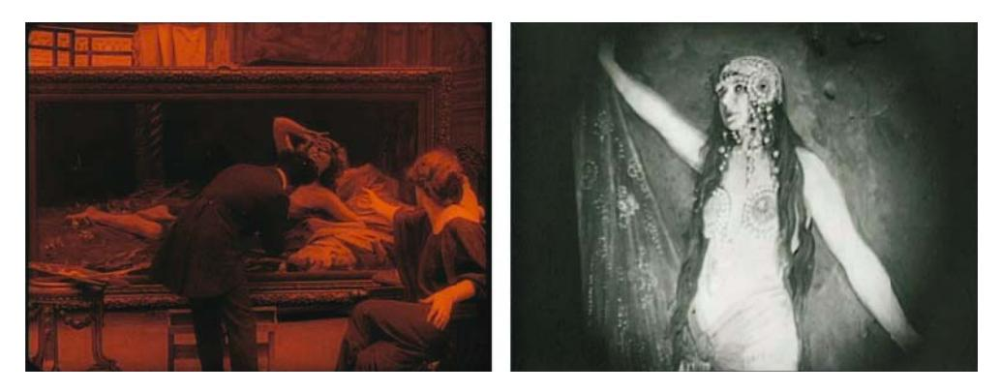
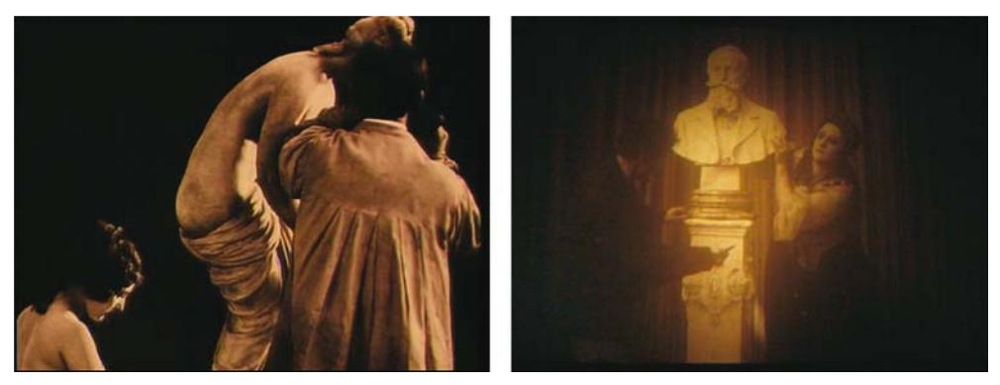
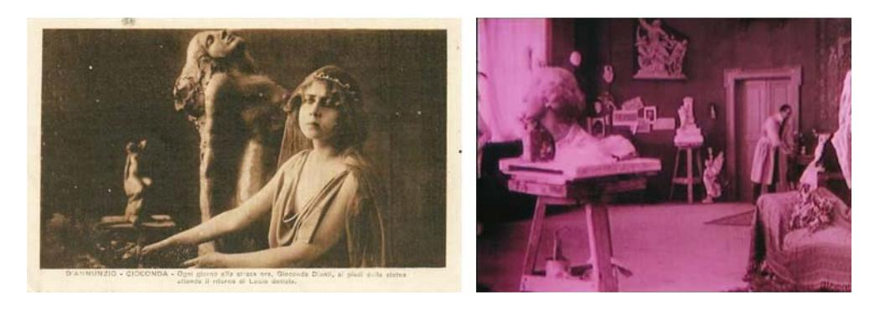
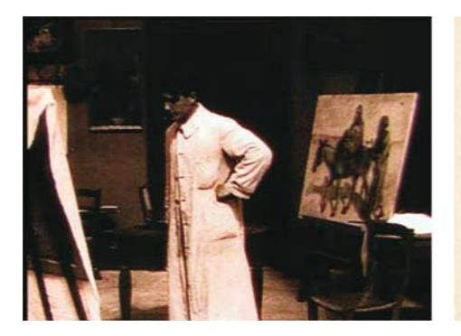
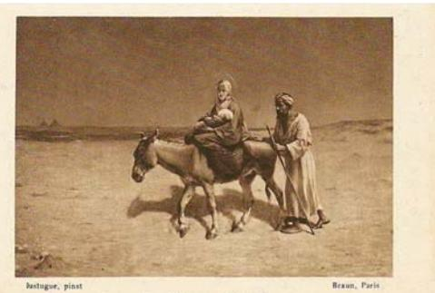
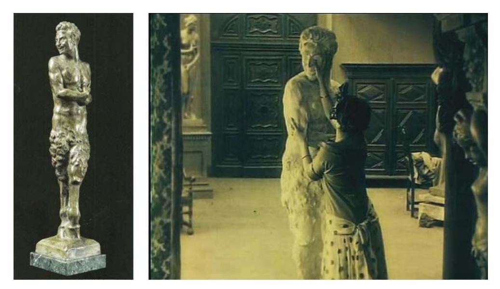
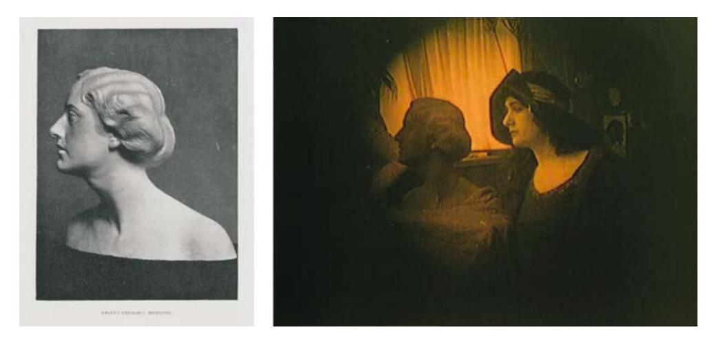

DOI: 10.2478/ausfm-2014-0017

# **Of Artists and Models. Italian Silent Cinema between Narrative Convention and Artistic Practice**

Ivo Blom VU University Amsterdam E-mail: il.blom@let.vu.nl

**Abstract**. The paper presents the author's research on the representation of painters and sculptors, their models and their art works in Italian silent cinema of the 1910s and early 1920s. This research deals with both the combination of optical (painterly) vs. haptical (sculptural) cinema. It also problematizes art versus the real, as well as art conceived from cinema's own perspective, that is within the conventions of European and American cinema. In addition to research in these l lmic conventions the author compares how the theme manifests itself within different genres, such as comedy, crime and adventure l lms, diva l lms and strong men l lms. Examples are : *Il trionfo della forza* (*The Triumph of Strength*, 1913), *La signora Fricot è gelosa* (*Madam Fricot is Jelous,* 1913), *Il fuoco* (*The Fire*, Giovanni Pastrone, 1915), *Il fauno* (*The Faun*, Febo Mari, 1917), *Il processo Clemenceau* (*The Clemenceau Affair*, Alfredo De Antoni, 1917) and *L'atleta fantasma* (*The Ghost Athlete*, Raimondo Scotti, 1919). I will relate this pioneering study to recent studies on the representation of art and artists in Hollywood cinema, such as Katharina Sykora's *As You Desire me. Das Bildnis im Film* (2003), Susan Felleman's *Art in the Cinematic Imagination* (2006) and Steven Jacobs's *Framing Pictures. Film and the Visual Arts* (2011), and older studies by Thomas Elsaesser, Angela Dalle Vacche, Felleman and the author.

**Keywords:** Italian cinema, art in l lm, representation of painters in l lm, intermediality.

The spectators and in particular the women seeing the l lm shed torrents of tears, and didn't see the l lm just once but twice, three times or more. The world lived in happy times then, when the only preoccupation was love. (Nicula 1995, 61.)1 This

1 I owe thanks l rst to Giovanna Ginex, and then to Claudia Gianetto (Museo Nazionale del Cinema, Torino), Mario Musumeci, Franca Farini (Cineteca Nazionale, Roma), Anna Fiaccarini, Andrea Meneghelli (Cineteca di Bologna), Livio Jacob (Cineteca del Friuli), Rommy Albers (EYE Filmmuseum, Amsterdam), and Ágnes PethŐ (Sapientia Hungarian University of Transylvania).

example of the emotional, even tactile l lm experience stems from the Romanian collector Emil Constantinescu. He refers to the success of the Italian silent l lm *Odette* (Giuseppe De Liguoro, 1916), starring Italian diva Francesca Bertini. She was the most popular Italian l lm actress of the 1910s and early 1920s, especially in Romania, as Romanian l lm historian Dinu-Ioan Nicula has shown. Nicula writes that though Transylvania could not see these l lms during the war, as it was part of the Austrian-Hungarian Empire then, the rest of Romania could. And so they cherished the epic *Cabiria* (Giovanni Pastrone, 1914), adventure l lms with l gures like Maciste, and the diva l lms with Bertini.

One particular aspect within the highly emotionally charged l eld of Italian silent cinema is its relationship to the representation of art and artists during cinema's transition from fairground amusements to entertainments for middle-class audiences in fashionable movie palaces, and from vaudeville style to one closer to theatre and painting. In particular, Italian silent cinema was typical in its dynamic of explicitly referring to and appropriating such former media as the theatre and visual arts. Two main topics will be treated here, l rst the *narrative conventions* around the representation of art and artists, and second, the relationship between the off-screen, "real" *art world and its visual representation* in l lm. I will treat both *painting* and *sculpture* here which, despite their *formal* differences, are quite close in the ways that they are *narratively* treated. How did Italian silent cinema represent art and artists? What does this tell us about cinema's own perspective and problematization of art versus the real? How are art objects treated as physical, touchable objects? And how do these objects function as stand-ins for characters out of reach (the Pygmalion effect), no longer alive (the ancestors' portrait gallery), or destined to die (Oscar Wilde's *The Picture of Dorian Gray* or Edgar Allen Poe's *Oval Portrait*)? And secondly, what happens when we correlate the *l lmic* conventions of representation with *art historical* investigation? As this territory is rather new for Italian silent cinema, it might be useful to have a brief look at an area that has been thoroughly researched by scholars: classical Hollywood's representation of artists and their works. (See Sykora [2003], Felleman [2006], and Jacobs [2011].)

#### **Narrative Conventions: Dangerous Portraits**

In *Hitchcock's Motifs* (2005), Michael Walker categorizes the meaning of painted portraits in l lm: 1) the power of the patriarchal (sometimes matriarchal) character or portraits of fathers who founded empires; 2) the power of the family tradition, as with the gallery of ancestors; 3) the lost love (like a lost wife); and 4) the desire of the beholder (Walker 2005, 320). Such connotations often occur when the portrait is a young woman and the spectators admiring her are men, as in *Laura* (Otto Preminger, 1944) or *The Woman in the Window* (Fritz Lang, 1944). When the portrait is painted within the l lmic narrative, desire is the most usual association, even when the classic gender division of male artist and female model is reversed. Within all these categories, the dominant idea is that the portrait's subject is of lasting importance. In order to obtain this status, however, the character needs to die l rst, either before or during the l lmic narrative. In the American cinema of the 1940s the painted portrait is often linked to murder and suicide. Painters kill their models, in particular when the latter are young, and thus murdered victims remain visible by their portraits. Suicide occurs just as often with painters as with their models.

The association of painted portraits with violent deaths was a central theme at the 1991 conference "Le portrait peint au cinéma/The Painted Portrait in Film," held at the Louvre, whose proceedings were published in the journal *Iris*. Thomas Elsaesser (1992) emphasized here the feeling of fatality that looms over so many painted portraits in l lms. Having a painted portrait is a hazardous enterprise for a young female character. The portrait ignites passions in the painter or in other men, which may lead to violence or self-destruction. Other men can observe the woman of their dreams without limitation and this may be more embarrassing when they are not her choice.2 This was recently conl rmed in Susan Felleman's book, *Art in the Cinematic Imagination* (2006), where she takes a gendered perspective of male necrophilic desire in classical Hollywood cinema.

#### **Dangerous Portraits in Italian Silent Cinema**

Now I wish to turn to some examples of Italian l lms from the 1910s, and *their* conventions of representing art and artists. This is the result of screening l lm prints in Rome, Turin, Bologna, and Amsterdam in 2011. On basis of the excellent reference books on Italian silent cinema by Aldo Bernardini and Vittorio Martinelli (1991¥1996), I established beforehand which l lms were important to my research. Like most silent era l lms, just a few titles in my long list survived in Italian and foreign l lm archives.

First: a few l lms in which the painting or the sculpture creates mishap, just like in the American l lms of the 1940s. In the drama *Il fuoco* (*The Fire*, 1915) by

2 See in the same issue also Felleman (1992), who deals with American cinema of the 1940s as well.

Giovanni Pastrone, a poor painter (Febo Mari) falls in love with a *femme fatale*like rich poetess (Pina Menichelli). She takes him to her castle and has him paint her portrait, lying on a sofa and teasingly covering her face, as if not wanting to be painted [Fig. 1].3 The undulating pose is clearly inspired by Alexandre Cabanel's *Venus* (1863), but it is also close to a long series of dressed and undressed women stretching themselves out on a sofa, bed, ocean wave, etc., both in painting and in cinema, offering themselves to the observer (e.g. Pedro Almodóvar's recent *La piel que habito* [*The Skin I Live In*, 2011] and its quotations from Titian's *Venus*, Goya's *Maya*, Manet's *Olympia*, and so on). Within the plot of *Il fuoco* the portrait functions as *catalyst*. It is crowned with a l rst prize at a Salon, the model thus inspiring the artist to make a masterpiece (a typical narrative convention in the examples I viewed). But soon after, the lady is warned that her husband is returning, so she m ees the castle, drugging the painter. He is desperate, even though she warned him previously that their affair would be passionate but short, like a m ame. When they meet again by chance, she refuses to recognize him, causing him to go mad.4 Another good example is *Il quadro di Osvaldo Mars* (*The Painting by Osvaldo Mars*, 1921) by Guido Brignone. His sister, Mercedes, plays a countess who discovers that a daring painting is about to be exposed publicly, showing her in a Salome outl t and not much more [Fig. 2]. When the painter, Osvaldo Mars (Domenico Serra), refuses to withdraw his new masterpiece, she slashes the canvas to pieces, but is also accused of murdering the painter afterwards. In the end, we learn that the painter loved a lookalike of the countess (also played by Brignone), a farmer's wife who leaves her husband and child to climb the social ladder. It is this woman whom Osvaldo Mars painted and over whom he committed suicide.5

In both *Il fuoco* and *Il quadro di Osvaldo Mars*, the painted portraits are *negative* catalysts. In *Il fuoco* the artistic triumph means the end of the painter's love affair,

3 See my own article (Blom 1992).

4 The narrative convention of an artist going mad over a *femme fatale* was repeated by Febo Mari in his l lm *Il tormento* (*The Torment*, 1917) with Helena Makowska as the *femme fatale* and Mari himself as the artist. Makowska was often type-casted as *femme fatale* in the Italian cinema of those years. The press praised her beauty but condemned her rather inexpressive acting. In real life she must have been a kind of *femme fatale* as well. The Argentinian sculptor César Santiano, collaborator of Bistoll , made a daring, lascivious nude sculpture of her in 1916, but in 1919 he committed suicide because of her (Audoli 2008, 26–29).

5 The Salome attire seems to have been inspired by theatrical costumes of Salome performances in the Belle Époque, or at least by their depictions by painters such as Vladislav Ismaylovich, Leopold von Schmutzler, and Clemens von Pausinger. One is also reminded of an inter-l lmic relationship with actresses wearing Salome attire in earlier l lms such as Lyda Borelli in *Ma l'amor mio non muore* (*Love Everlasting*, Mario Caserini, 1913) and *Rapsodia satanica* (*Satanic Rhapsody*, Nino Oxilia, 1917).

while in *Il quadro di Osvaldo Mars* the scandalous painting is destroyed because of its potentially damaging implications for a noble lady's reputation. This latter narrative trope is also present in an earlier short l lm, *Il ritratto dell'amata* (*The Portrait of the Beloved*, Gerolamo Lo Savio, 1912), in which a painter named Alma (a hint at Alma Tadema?) l nishes a historical portrait of a lady by giving it the face of an English diplomat's wife with whom he has fallen in love. She notices it and quickly paints the face black, though the artist manages to wash the paint away. When unpacked at the lady's home, everybody is embarrassed, and the husband explodes and chases his wife out of her home and away from her child. Their child creates a reconciliation in the end – a classic narrative convention. So the message here is that even if legitimized because of a historical or mythological setting, portraits of the well-to-do in daring outl ts risk ruining one's reputation *and* that of one's family. Thus, the model, too, may risk both this symbolic and physical loss. In the short, *La modella* (*The Model*, Ugo Falena, 1916), a non-professional model (Stacia Napierkowska) is picked up from the street because she is more genuine, more authentic, and more honest than a professional model – a common *topos* in silent cinema. She poses for a statue of an almost naked woman holding a chalice, set on a pedestal, and falls in love with the sculptor, who is also her protector [Fig. 3].6 When the statue, however, is publicly exposed, the girl is mocked – another common occurrence in silent l lms dealing with artists7 – by a former model l red by the artist and now taking revenge by slandering the newcomer. Fortunately a painter friend mediates, restoring both the girl's honour and her relationship with the sculptor. In both *Il ritratto dell'amata* and *La modella*, then, the artwork may damage one's reputation and one's lover, but the mutual restoration of honour *and* love remains a narrative possibility.

## **Destructive Art Works**

Paintings or sculptures might also mean the end of life, though, in a more irreparable way, causing death and mutilation. Their physical presence, their literal weight has serious consequences for protagonists and/or antagonists. First, paintings and sculptures may function as avenging saviours of damsels in distress. Often the artwork is venerated by the protagonists as it portrays

6 I noticed that the statue was recycled one year after in the sculptor's workshop in *Il processo Clemenceau* (Alfredo De Antoni, 1917), shot at the Caesar Film studios of Rome.

7 Another example of a model jealous of a newcomer is *Amore sentimentale* (*Sentimental Love*, Cines, 1911).

deceased heroes. In the Francesca Bertini vehicle, *Il nodo* (*The Knot*, Gaston Ravel, 1921), the poor girl Agnese (Elena Lunda) is adopted by the painter Lelio Salviati (Carlo Gualandri), who paints her portrait featuring her holding m owers. Agnese sacril ces herself for the good of the painter and his lover, the marchioness Della Croce (played by Bertini), whose mean and unfaithful husband (Giorgio Bonaiti) tortures her and refuses a divorce. Knowing she has a terminal disease, Agnese pretends to be the lady and dies in the burning of the marchioness's garden house. The lovers are temporarily freed, until the husband discovers his wife hasn't died when hearing her sing a familiar tune. Here, *sound* betrays her ¥ a curious plot device for a silent l lm. The l lm concludes with a struggle in which a rim e accidentally shoots the cord of the life-size painting, killing the evil marquis, allowing the absent girl to save the lovers a second time from beyond the grave.8 Likewise in *La notte che dormii sotto le stelle* (*The Night I Slept Under the Stars*, Giovanni Zannini, 1918) – a l lm that survives only in an incomplete print – the girl, Fiamma (Lina Pellegrini), is abducted and raised by gypsies following a l re in her home when she is a child. She ends up being raised by her uncle, both being unaware that they are family. The brutal gypsy foster father, Giacomo (Sergio Mari), pursues the girl, however, and pushes her into helping him to rob the family. When she refuses, a statue of a bearded old man that the girl has been cherishing, and for which she feels an inexplicable attachment, saves her from being molested by the bad guy.9 She throws the bust on the villain, killing him [Fig. 4]. Of course the bust is a portrait of the girl's dead father (whom we never see in the l lm). Through its physical weight, the artwork here too liberates the protagonist from the clutches of evil, allowing the good supporting character to help beyond death.

In contrast to the trope of artwork as moral avenger, the physical weight of the statue may also have a negative effect on the *protagonist*. In *La Gioconda* (Eleuterio Rodoll , 1916), based on a play by D'Annunzio, Mercedes Brignone is Sylvia, the wife of sculptor Lucio Settala (Umberto Mozzato). He has fallen in love with his *femme fatale*-like model Gioconda Danti (Helena Makowska), who models for an ecstatic, Symbolist-like statue [Fig. 5]. The women l ght over the same man, but when the enraged Gioconda throws Sylvia against the sculpture for which she has modelled, the poor wife tries to save her husband's work from

8 The l lm has been restored by the Cineteca Nazionale in Rome.

9 While the style of the bust is quite general and even banal for late 19th century sculpture, Fiamma's pose when she venerates the statue is more striking and is reminiscent of paintings commissioned to commemorate lost relatives, such as those by Francesco Hayez. It is also similar to late 19th century funeral sculpture.

falling, ruining her hands forever. This extreme sacril ce makes the sculptor repent and return to her.10

In considering the destructive force of artwork in Italian silent cinema, there are a number of l lms in which the efl gy of the model causes her serious trouble, with even stronger consequences than in *Il ritratto dell'amata* and *La modella*. 11 Here the artist confuses his work with the model, or he believes himself entitled to create and also to destroy it; and, likewise, to give life to his model, launch her image, but also to destroy her when she becomes unworthy. So when the model becomes spoiled and a spend-thrift as a result of her artist's success, and cruelly dumps him for a richer protector, the artist goes berserk and takes revenge. This narrative convention recurs in a few Italian silent l lms. In the short, *L'idolo infranto* (*The Broken Idol*, Emilio Ghione, 1913), the artist (Alberto Collo) has become poor and a drunk after the loss of his model/lover, but is unable to sell the bust with her likeness as it represents his work – and his love. The once gold-digging model (Bertini) now feels sorry for the man's downfall and wants to surprise him, so she secretly replaces the bust with herself. When the drunken artist comes in and sees her smiling in the rem ection of a mirror, he thinks even the model's bust mocks him; so he destroys the "sculpture," realizing too late what he has done. In a later l lm with Bertini, *Il processo Clemenceau* (*The Clemenceau Affair*, Alfredo De Antoni, 1917), a similar scenario, though more complex, was devised. Here the sculptor Pierre Clemenceau (Gustavo Serena) confesses in a m ashback how he met his model, the impoverished aristocrat Iza (Bertini); how she dropped him l rst for a rich count before returning, marrying and having a child with him; but then how she cheated on him again because of her lust for money and adventure and her disgust over a morally restricted middle class life (represented by the artist's mother). This function of the artist's mother is also a recurring *topos* in many Italian silent l lms.12 First, the man destroys the bust he made of her, as it functions

10 Despite the opening of l lm archives around the globe, no print of the l lm has yet been found, but extant original postcards provide a visual impression. I hold many of these in my own collection.

11 This was a *topos* rather common in the cinema of the 1910s, also outside of Italy. In the Russian silent l lm *Umirayushchii lebed* (*The Dying Swan*, Yevgeni Bauer, 1917) an artist obsessed by death in art is inspired by a ballerina dancing the Dying Swan. But when she is too cheerful as a model, he kills her, permitting him to pose her correctly for his artwork.

12 A good example is *La madre* (*The Mother*, Giuseppe Sterni, 1917), starring Vitalia Italiani. It was based on the play *La madre* by the Catalan writer Santiago Rusiñol, which Vitaliani had performed with great success all over Spain in 1907, before having it adapted for the screen a decade later. Actually, Vitaliani had been a regular performer of Rusiñol's plays around the 1900s, to great acclaim in Spain, and in particular in Barcelona. The l lm *La madre* was rediscovered at the EYE Filmmuseum not too long ago.

as a stand-in for her physical presence but also as a symbol of his love [Fig. 6]. Then when the model returns to him a second time (in torment over her conduct and desperately missing her child), he kills her since he cannot cope with her behaviour and is unwilling to believe in her moral contrition. Just like in *L'idolo infranto*, the man realizes afterwards what he has done in blind rage. So the artist creates and destroys the model, just like he creates and destroys the artwork.13

## **Narrative Convention vs. Artistic Practice**

Of course, the above-mentioned narrative conventions are not just cinematic conventions, but have predecessors in art, as Steven Jacobs has explained in *Framing Pictures: Film and the Visual Arts* (2011), in his analysis of the narrative conventions in artists' biographies by, for example, Kris and Kurz, Von Schlosser and Wittkower (Jacobs 2011, 43–47). Still, afte r discussing all these narrative conventions on the l lmic representation of art and artists, one wonders: do these l lms still have some correlation with the off-screen, real art world, or are they only *simulacra* – self-contained, l lmic clichés alive only within the diegesis of the l lms? When starting this research, my hypothesis was that most of what I would encounter would be just *cinema's perspective* of art and the art world, a very coloured and biased perspective, using that world to create a milieu in which things were permitted which ordinary mortals – that is, the cinema spectators – were not supposed to do. Relatively few props were necessary to express this milieu, to stage a set recognizable as an artist's workshop. Sometimes these props were copies of famous classical sculptures, such as the *Capitoline Venus*, the *Laocoön Group*, Giambologna's *Rape of the Sabine Women*, or copies from 19th century popular sculptures once famous and now forgotten. Other props were just coarse, hastily made artworks, only serving to decorate the set of the artist's studio. This generalization of the artist's studio in Italian silent cinema characterizes short *comedies* in particular. As the comedy genre represents the world in a farcical way, this is expressed in the set design of the artist's workshop or in the art that he makes. Modern art is often ridiculed.14 Representational strategies in the dramatic

13 We see this narrative convention of the artist who creates and destroys his model in the Italian silent l lm *La chiamavano Cosetta* (*They Called Her Cosetta*, Eugenio Perego, 1917). Here a sculptor (Amleto Novelli) is devastated when he discovers his *femme fatale*-like model (Soava Gallone) has caused his only son to commit suicide over her, at the foot of the father's statue representing her beauty. The artist crushes his model under his own statue.

14 Examples are a.o. *La signora Fricot è gelosa* (Ambrosio, 1913) and *Robinet è geloso* (*Tweedledum is Jelous*, *Ambrosio*, 1914).

features of the 1910s and early 1920s are, however, more complex. Not only do we see more diversil cation in the workshops of poor and established artists, but both are also more closely modelled on images of real workshops, though rather those of non-avant-garde artists of the turn-of-the century or even before.

The emphasis on the non-avant-garde workshops also goes for the art represented in the l lms. The paintings and sculptures in dramatic features of the 1910s are mostly not the art of that decade but the later decades of the 19th century, either the more naturalist styles in painting or sculpture or the more Salon-like academic versions. This is perhaps not surprising as cinema needed a conventional, reassuring version of art for its lower and middle class audiences, who were mostly little acquainted or favourable to the many -isms of the 1910s: Cubism, Futurism, etc. Moreover, naturalist art was itself strongly based on and aided by photography in order to "catch reality" as closely possible. Naturalist art was widely visible in public buildings such as city halls (Weisberg 2010). Moreover, the established art of the late 19th century, the academic art of orientalists and idealists, as well as those of the naturalists had been massively reproduced and distributed through the rise of illustrated postcards from the 1890s onwards, as well as by illustrated magazines, thanks to the introduction of half-block reprography. Paintings and sculptures hitherto visible only to social elites were now freely available everywhere, even more than during the introduction of the etching.15 They were now used on the covers of matchboxes, cigarette and chocolate boxes, etc., and thus transformed into iconic images. They became part of the collective memory, providing a repertoire of images for l lmmakers to draw upon (nowadays we no longer have any notion of that collective memory.) Just to give an example, when in *La madre* (Giuseppe Sterni, 1917), the artist (played by Sterni himself) is working in a shared studio, he is working on a painting that depicts the biblical *Flight to Egypt*. It is a copy of naturalist painting by Maxime Dastugue, *La Fuite en Egypte* (1889), made after Dastugue's trip to Egypt the same year [Figs. 7–8]. Dastugue's painting was popular well into the 1910s and 1920s through reproductions on postcards and in illustrated magazines. There is also a practical explanation. Within a l lm's plot, paintings and sculptures were often used as portraits of characters, so audiences had to be able to recognize them otherwise their function as meaningful props would be lost.16 To

15 It sufl ces to have a glance at modern digital shops like eBay and Delcampe to notice the enormous divulgation of these postcards of late 19th century and early 20th century painting and sculpture.

16 This goes both for short comedies like *La signora Fricot è gelosa* and *Robinet è geloso* and dramatic features such as *Il processo Clemenceau*. The plot would fail if recognition of the statue as a portrait of one of the characters was not possible.

l nd the pictorial equivalents of paintings or sculptures represented in the Italian cinema of the 1910s, one has to look therefore at late 19th century portraits or even at the monumental sculpture in Italian graveyards, such as that by Giulio Monteverde (*Angel*, 1882). There is, however, a m ipside to this. In the 1910s and early 1920s several Italian artists collaborated with the Italian cinema industry, either as set and costume designers (such as Duilio Cambellotti and Camillo Innocenti), as poster designers, or as creators of the art works visible in l lms. Thus, contemporary artists created art for l lm sets. While l lm historical research has focused too narrowly on the infrequent collaborations between the avant-garde of the Italian Futurists and the professional l lm industry, this other, vaster territory has hardly been explored. Let me provide two examples. For *Il fauno* (1917) by Febo Mari, a kind of reversed Pygmalion story – a woman falling in love with the statue of a male faun – the Piemontese sculptor Giuseppe Riva made the statue, even in multiple versions (Audoli 2008, 18–61) [Figs. 9–10].17 Riva stood in a late nineteenth-century representational tradition of the Faun that was present not only in Stéphane Mallarmé's famous poem, but also in sculptures in- and outside of Italy like Antonio Bezzola's *The Idol* (1891). Thus, an iconography was already there, only the form was altered. Finally, the bust of Francesca Bertini's character in *Il processo Clemenceau* that was destroyed by its creator, was based on an identical real bust of Bertini made by the Neapolitan sculptor Amleto Cataldi which was published in the renowned Italian art journal *Emporium* in 1917, the same year the l lm was released [Figs. 11–12]. (See Geraci [1917]. The bust of Bertini is depicted on pages 166 and 170.)

In conclusion, we can say that, while more research is necessary, Italian silent cinema was surely not only looking backwards but also keeping an eye on the artistic present as well. In that sense the presence of art works and artists in Italian silent cinema was not only linked to particular narrative conventions, but also to the art world outside of the l lmic diegesis. Following Jens Schröter's categorization of intermediality, we can del ne the representation of one medium (art) in the other (cinema) as *transformational intermediality*, but intrinsically we are also dealing with *ontological intermediality* as well, as the cinema is redel ned through its comparison with painting and sculpture (Schröter, 1998). While the pictorial invites us to make a comparison between the cinema and the framing and deep staging in l gurative painting, the sculptural refers to cinema's ability to sculpt as well – but with light rather than stone.

17 Actor turned director Febo Mari had often scripts about artists such as *La gloria* (*The Glory*, 1916), in which a sculptor ruins his own statue, and *Il tormento* (1917), see note 5.

### **References**

- Audoli, Armando. 2008. *Chimere. Miti, allegorie e simbolismi plastici da Bistoll a Martinazzi.* [*Chimeras. Myths, Allegories, and Painterly Symbolism from Bistoll to Martinazzi*]. Torino: Weber & Weber.
- Bernardini, Aldo and Vittorio Martinelli. 1991–1996. *Il cinema muto italiano, 1905–1931.* [The Italian Silent Cinema, 1905–1931]. Rome: Nuova ERI/CSC.
- Blom, Ivo. 1992. *Il Fuoco* or the Fatal Portrait. The XIXth Century in the Italian Silent Cinema. *Le portrait peint au cinéma. Iris* no. 14–15 (Autumn): 55–66.
- Elsaesser, Thomas. 1992. Mirror, Muse, Medusa: Experiment Perilous. *Le portrait peint au cinéma. Iris* no. 14–15 (Autumn): 147–159.
- Felleman, Susan. 1992. The Moving Picture Gallery. *Le portrait peint au cinéma. Iris* no. 14–15 (Autumn): 193–200.
- Felleman, Susan. 2006. *Art in the Cinematic Imagination.* Austin: University of Texas Press.
- Jacobs, Steven. 2011. *Framing Pictures. Film and the Visual Arts.* Edinburgh: Edinburgh University Press.
- Geraci, Francesco. 1917. Artisti contemporanei: Amleto Cataldi. [Contemporary Artists: Amleto Cataldi], *Emporium*, vol. 267 no. 45 (March): 163–175.
- Nicula, Dinu-Ioan. 1995. Film italiani in Romania. Dagli anni '10 alla Seconda Guerra Mondiale. [Italian Films in Romania. From the 1910s to the Second World War], In *Cinema italiano in Europa, 1907–1929, II*, ed. Francesco Bono, 59–67. Rome: Associazione Italiana per le Ricerche di Storia del Cinema.
- Schröter, Jens. 1998. Intermedialität. Facetten und Problemen eines aktuellen medienwissenschaftlichen Begriffes. *Montage a/v*, vol. 7 no. 2: 129–154.
- Sykora, Katharina. 2003. *As You Desire me. Das Bildnis im Film.* Cologne: Walther König.
- Walker, Michael 2005. *Hitchcock's Motifs.* Amsterdam: Amsterdam University Press.
- Weisberg, Gabriel P., et.al. 2010. *Illusions of Reality*. *Naturalist Painting, Photography, Theatre and Cinema, 1875–1918.* Brussels: Mercatorfonds.

# **List of Figures**

**Figure 1.** *Il fuoco* (Giovanni Pastrone, 1915). Courtesy Museo nazionale del cinema, Turin. **Figure 2.** *Il quadro di Osvaldo Mars* (Guido Brignone, 1921). Courtesy Cineteca di Bologna.

**Figure 3.** *La modella* (Ugo Falena, 1916). Courtesy Cineteca di Bologna. **Figure 4.** *La notte che dormii sotto le stelle* (Giovanni Zannini, 1918). Courtesy Cineteca Nazionale, Rome.

**Figure 5.** *La Gioconda* (Eleuterio Rodoll , 1916). Postcard. Collection Ivo Blom, Amsterdam. **Figure 6.** *Il processo Clemenceau* (Alfredo De Antoni, 1917). Courtesy Cineteca di Bologna.

**Figure 7.** *La madre* (Giuseppe Sterni, 1917). Courtesy EYE Filmmuseum, Amsterdam. **Figure 8.** *La fuite en Egypte* (Maxime Dastugue, 1889). Illustration. Collection Ivo Blom, Amsterdam.

**Figures 9–10.** Giuseppe Riva: *Fauno* (1917) (courtesy Armando Audoli), and the sculpture in *Il fauno* (Febo Mari, 1917). Courtesy Museo nazionale del cinema, Turin.

**Figures 11–12.** Amleto Cataldi: *Francesca Bertini* (1917), and a still from *Il processo Clemenceau* (Alfredo De Antoni, 1917). Courtesy Cineteca di Bologna.

