# Università degli studi di Udine

## Patrons and artists on the move: New light on Matteo Giovannetti between Avignon and Rome

Original

Availability:

This version is available http://hdl.handle.net/11390/1174028 since 2020-11-25T09:26:53Z

Publisher:

Published DOI:10.1017/S0068246219000370

Terms of use:

The institutional repository of the University of Udine (http://air.uniud.it) is provided by ARIC services. The aim is to enable open access to all the world.

Publisher copyright

(Article begins on next page)

## PATRONS AND ARTISTS ON THE MOVE: NEW LIGHT ON MATTEO GIOVANNETTI BETWEEN AVIGNON AND ROME

## by Claudia Bolgia1

This article reassesses artistic production in Rome at the time of the temporary return of Pope Urban V, between 1367 and 1370, after a lengthy period of absence of the papacy in Avignon, and offers new insights into the long-term impact of this production. It does so by starting from a thoroughly neglected artwork now in the Museo Storico Artistico del Tesoro di S. Pietro, a victim of the traditional interpretative dichotomy as either a work by Giotto or not. By taking a different methodological approach, which is to think in terms of movement of patrons and artists, and on the basis of combined technical/visual analysis and documentary sources, the article sheds new light on this painting, offering new proposals concerning its dating, attribution, original location and function. It then addresses its historical contextualization and significance, allowing us to rethink art in Rome in the fourteenth century by discussing the role that the circulation of patrons and artists played in creating new forms. This discussion not only contributes to a better understanding of the art produced in Rome in the Trecento but also throws some light on the very origins and nature of Renaissance art.

Questo articolo riesamina alcuni aspetti della produzione artistica a Roma all'epoca del temporaneo ritorno di Urbano V, tra il 1367 e il 1370, dopo il lungo periodo di assenza del papato avignonese, e mette in luce l'impatto che questa produzione ha avuto nel secolo successivo. Il punto di partenza è lo studio di un'opera poco nota, che si conserva nel Museo Storico Artistico del Tesoro di S. Pietro, vittima della dominante dicotomia interpretativa Giotto o non-Giotto. Partendo da un diverso approccio metodologico, che pone l'accento sulla circolazione di committenti e artisti, e associando un'analisi tecnica e visiva al riesame delle fonti testuali, l'articolo pone questo dipinto in una nuova luce e offre nuove proposte sulla sua datazione, attribuzione, collocazione originaria e funzione. L'articolo mette inoltre a fuoco il contesto storico e il significato dell'opera, consentendoci di ripensare l'arte del Trecento romano attraverso la discussione del ruolo svolto dalla circolazione di committenti e artisti nella creazione di nuove forme. Questa discussione non solo contribuisce ad offrire una migliore comprensione dell'arte prodotta a Roma nel XIV secolo, ma serve anche a fornire nuovi spunti per chiarire le complesse origini e la natura dell'arte del Quattrocento.

1 This article stems from research for a book-length project, The Long Trecento: Rome without the Popes (c. 1305–1420), undertaken while Samuel H. Kress Senior Research Fellow (2016–17) at CASVA, the Center for Advanced Study in the Visual Arts in Washington, DC, and in Rome and Avignon as Leverhulme Trust Research Fellow (2017–18). My gratitude goes to both institutions for their support. An earlier version of this essay was presented at the International Medieval Congress in Leeds on 3 July 2019, within four sessions on 'A Global Trecento: Objects, Artists, and Ideas across Europe, the Mediterranean and Beyond', co-organized with Luca Palozzi. I am grateful to that audience and the anonymous peer-reviewers of the Papers of the British School at Rome for their thought-provoking comments. I also wish to thank Pietro Zander at the Fabbrica di San Pietro, and Dominique Vingtain and Julien Gallon in Avignon, for their assistance in the search for the photographs used as figures 1–2, 7 and 3–6, 8, respectively.

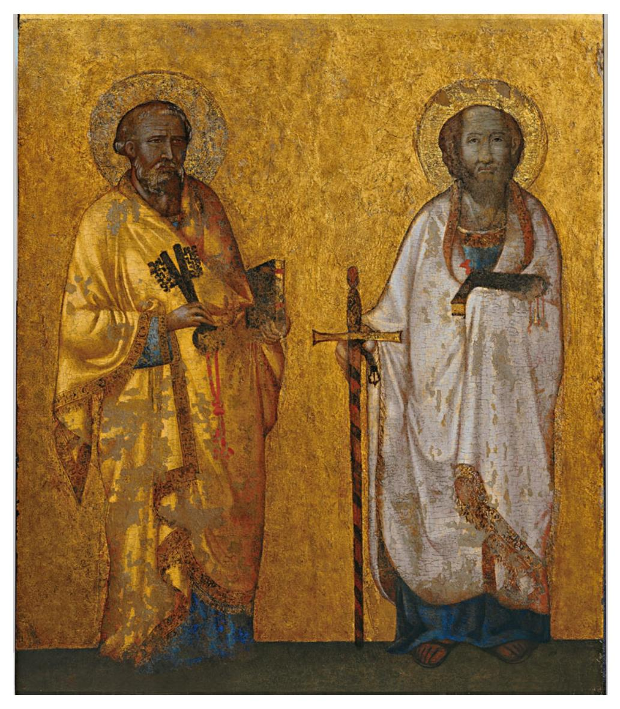

Fig. 1. Vatican City, Museo Storico Artistico del Tesoro di San Pietro, Sts Peter and Paul. Tempera on copper (formerly on walnut wood). Photo: per gentile concessione del Capitolo di S. Pietro in Vaticano.

The Museo Storico Artistico del Tesoro di S. Pietro in the Vatican houses an enigmatic painting (Fig. 1) depicting images of the Apostles Peter and Paul, each holding a book in the left hand and the traditional attributes of keys and sword in the right. What makes the work so enigmatic is its considerable size (130 × 95 cm), its unknown original location and function, and its formal/ stylistic appearance which hitherto has defied both dating and attribution. This 'painting', in fact, turns out to be a combination of two separate panels, originally of tempera on walnut wood, both of which were transferred to copper and turned into one single painting in 1862.2 The transfer has been explained by the fact that copper may have been considered a better support in terms of hygrometric resistance at a period of experimentation in conservation techniques (D'Alessandro, 2009: 17–18). Such a drastic intervention, however, had unexpected and traumatic consequences. Not only was the painting deprived of all its preparatory layers but it also suffered craquelures and losses of the pictorial surface, caused by the immediate surfacing of the resin ( pece greca) used to make the layer of tempera adhere to the copper (D'Alessandro, 2009: 17). In turn, the losses and craquelures prompted heavy repainting, which fatally distorted the appearance of the artefact, and unquestionably contributed to its critical misfortune. What survives today is not merely a mutilated painting but rather a medieval artwork which has been almost entirely stripped of its original materiality, and thus of that 'matter' which plays such an important part in our understanding of its original appearance, significance and use.

The over-painting was removed in the conservation campaign of 2009, at least in so far as removal was possible without further damaging the work.3 The conservator's report clarifies that earlier restorations lie beneath that of 1862 and that, in some parts of the painting, no trace of any original layer survives under the pictorial surface. These parts include the head of St Peter, the robe and feet of St Paul, and the dark green band where the figures stand, all of which are, therefore, the result of reworking (D'Alessandro, 2009: 18). The cleaning and removal of later additions has, however, also brought to light what survives of the original painting, which has not yet received the attention it deserves.

The reason for such damaging neglect lies within that same historiographical tradition which obsessively seeks out Giotto whenever considering Italian Trecento painting. This attitude owes much to the influential view of Vasari and continues to permeate modern art historical scholarship. It is also responsible for undervaluing the significance of the work in question — or rather, the works since we are discussing two discrete panels. This article aims to shed light on these paintings, beginning with their attribution and dating. It then addresses their contextualization and significance, allowing us to rethink art in Rome in the Trecento by discussing the role that the movement of patrons and artists played in creating new forms. This in turn will throw some light on the long-term impact of such movement, especially on the very origins and nature of Quattrocento art.

2 As we learn from the account of the sub-archivist of the Chapter of St Peter's in the Diario della Basilica Vaticana (27 June 1862), preserved in the Archivio Capitolare di S. Pietro, and cited by Stocchi, 2009: 13. This piece of information, without reference to the source, had already

appeared in Cascioli, [1925]: 44. 3 The report of the campaign, promoted by the Administration of the Vatican Chapter, is published by the conservator Lorenza D'Alessandro, 2009: 16–23.

188 CLAUDIA BOLGIA

To re-examine the panels without preconceptions, it is necessary to start with a

brief review of relevant literature. The 'panel' of the Apostles was first brought to scholarly attention by two authoritative art historians, Wolfgang Fritz Volbach and Albert Maria Ammann, who together visited the Treasury of the Basilica of St Peter's under the guidance of Canon Monsignor Ludwig Kaas in 1942. The Chapter of the Canons had recently created a Museum-like arrangement for the Treasury in two rooms on the ground floor of the present sacristy (Cascioli, 1912: 294–319; Lipinsky, 1950: 23–4). It is probable that the reason for their visit was an examination 'in the flesh', de visu, of the so-called icona paleoslava, a thirteenth-century icon on which Volbach had written the previous year, and to which Ammann was about to add his Nachträge und Ergänzungen (Volbach, 1941: 480–97; Ammann, 1942: 457–68; Stocchi, 2009: 9). Towards the end of their visit the two scholars noticed a painting above the door of the Sacristy of the Beneficiates and requested that it be taken down for closer examination. Their close-up analysis resulted in Volbach's proposal to identify the work as a commission to Giotto by Cardinal Jacopo Caetani Stefaneschi for the main altar of Old St Peter's, a commission attested in the Liber Anniversariorum of the Vatican Basilica (Volbach, 1947: 369–75; 1979: 55–6). As is well known, the passage — recording the cardinal's donation of a 'tabulam depictam de manu Iocti super eiusdem bas[ilice] sacrosanctum altare' 4 — is today understood by most scholars as referring to the so-called Stefaneschi polyptych now in the Pinacoteca Vaticana, even if some scholars still continue to afford credibility to Volbach's suggestion.5 Volbach also attempted to reconstruct the 'life' of the paintings by identifying references to them in the inventories of the Basilica and other sources (1947: 369–75; 1979, 55–6), but most of these 'identifications' — subsequently repeated by other scholars have convincingly been demonstrated as incorrect in the rigorous study by Arnold Nesselrath and Serena Romano for the sixth volume of the Corpus of the Pittura Medievale a Roma (Nesselrath and Romano, 2017: 333–4).

Although the identification with Giotto's painting recorded in the Liber Anniversariorum has unsurprisingly found little support in scholarship, the association with Giotto has tenaciously remained, with some scholars firmly placing the painting in a Giottesque artistic milieu, and others — more wisely — rejecting the attribution.6 In other words, the debate over this painting has always revolved around whether it is or is not by Giotto. Yet, this traditional interpretative dichotomy has long since hindered our consideration of other

4 'Panel painted by the hand of Giotto above the holy altar of the said basilica': 'Liber

Anniversariorum della basilica vaticana', in Egidi, 1908, I: 222–3. 5 For instance, Stocchi, 2009: 10. On the Stefaneschi polyptych, see, from an extended bibliography, Gardner, 1974: 57–103; Kempers and De Blaauw, 1987: 83–113; Romano and

Zander, 2017: 281–5, with full bibliography. 6 In favour of Giotto, see Stocchi, 2009, 8–15; Tomei, 2009a, II: 169–70; 2009b: 4–7; for the not-Giotto party, see Nesselrath and Romano, 2017: 334, describing the attribution as 'bold to say the least' ('l'attribuzione a Giotto appare quanto meno ardita').

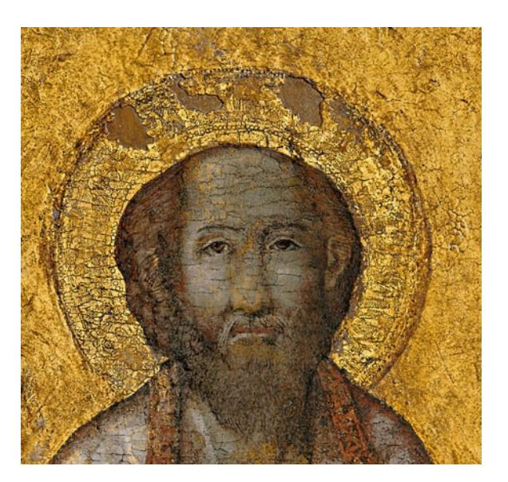

Fig. 2. Vatican City, Museo Storico Artistico del Tesoro di San Pietro, Sts Peter and Paul. Tempera on copper (formerly on walnut wood), head of St Paul. Photo: per gentile concessione del Capitolo di S. Pietro in Vaticano.

possibilities. We should now reconsider the question with a broader horizon in mind. And we ought to begin by concentrating our attention on the head of St Paul (Fig. 2), an area for which no over-paintings have been signalled by the conservator (indeed the saint's halo is described as the best-preserved part of the work) (D'Alessandro, 2009: 19–20). A series of three photographs, taken before, during and after the 2009 campaign, clearly shows how the head has resurfaced following the removal of layers of over-painting (D'Alessandro, 2009: 22, figs 14–16). It is almost certainly not in pristine condition (no medieval painting ever is), but, thanks to its recovery, it is clearly legible.

In the best analysis of the painting to date, Serena Romano and Arnold Nesselrath observe that the head of St Paul has a 'curiously snub-nosed physiognomy' and 'does not match any known painting by Giotto, either in style — and we use the word with great reticence — or in its iconographical and physiognomical details' (Nesselrath and Romano, 2017: 333–4). With regard to the dating, Romano and Nesselrath generally refer the painting to the Trecento, primarily on the basis of the silhouettes of the figures, and seem to favour a date around Giotto's time. Only towards the end of their analysis do they suggest that we cannot exclude 'other hypotheses, such as the period of the papacy's return from Avignon and the work at the Vatican of Giovanni da Milano, whose figures may perhaps be suggestive in this respect (see, for instance, the Saint Nicholas currently in the Corsini Gallery in Rome)'. 7 Whilst

7 Nesselrath and Romano, 2017: 334: '... altre ipotesi, per esempio al momento del ritorno da Avignone e dei lavori in Vaticano di Giovanni da Milano, le cui figure potrebbero forse essere in questo senso suggestive (si veda ad esempio il San Nicola attualmente nella Galleria Corsini, Roma)'.

190 CLAUDIA BOLGIA

the reference to Giovanni da Milano is only vaguely evocative by explicit admission of the proposers (and still depends on Giotto's authority since Giovanni's formation is usually associated with the former's activity in northern Italy), the possibility of a date subsequent to the papal return following the lengthy period of absence in Avignon — left up in the air by these two scholars — is of interest.

Indeed, an even more specific possibility, worthy of serious consideration, is that the two panels were made at the time of the 'temporary' return of the pope to Rome, that is, during the pontificate of Urban V (1362–70), who moving to the city in 1367 intended to transfer the papal see there permanently, only to abandon the idea and return to Avignon on 16 April 1370.8 That this hypothesis has not previously been considered is presumably owing to the fact that nothing survives of the monumental pictorial enterprises promoted by the pope upon his return. At first glance it would seem that we are left with no comparative material to test our hypothesis and no artistic context in which to place our paintings. However, the Register of Expenses concerning one of the most important undertakings — the decoration of the Vatican Palace, chosen as the papal residence — is extant, and attests that the leading painter in the pope's service was Matteo Giovannetti da Viterbo, accorded the title of pictor sacri palatii. 9 As remarked upon by various scholars, this suggests that Matteo was responsible for, and in charge of, the team working on the main pictorial enterprises in the Vatican Palace before 18 October 1367 (when he is first recorded in a payment alongside his socii) until at least 29 April 1369, the date of his last recorded payment.10 Such enterprises included the decoration of the camera paramenti, two papal upper rooms (duae camerae superiores domini nostri), the staircase leading to them and a linking upper portico (either a corridor or, more probably, a loggia).11 Matteo himself most probably died in the summer of 1369 (Castelnuovo, 1991: 151).

Highly relevant to our discussion is that Matteo had been a major painter in the papal palace of Avignon too, and for more than twenty years: his first record as pictor papae dates to 17 March 1346 (Castelnuovo, 2004: 168).12 He was probably already active in Avignon towards the end of the pontificate of Benedict XII (1334–42), but his main commissions date from the pontificate of Clement VI (1342–52) (Castelnuovo, 1991: 38–40; 2004, 169–74). Of these,

8 As a reference point for the pontificate of Urban V see Hayez, 2000: 542–50. On his patronage

in Rome: Bolgia, 2016: 343–50. 9 Most entries in the Register, preserved in the Vatican Archives (ASV, Camera Apostolica, collectoriae), are published in Kirsch, 1898. See also Monciatti, 2005: 239–41. For the appellation pictor sacri palatii see ASV, Camera Apostolica, collectoriae 450, fol. 147r, cited in

Monciatti, 2005: 240. 10 For the first payment see Kirsch, 1898: 111; for the second (ASV, Camera Apostolica,

collectoriae 450, fol. 147r), see Monciatti, 2005: 240. 11 See entries in Kirsch, 1898: 111, 115 and, especially, 116. On Matteo Giovannetti the reference monograph is Castelnuovo, 1991. 12 On the papal palace at Avignon, see Vingtain, 1998.

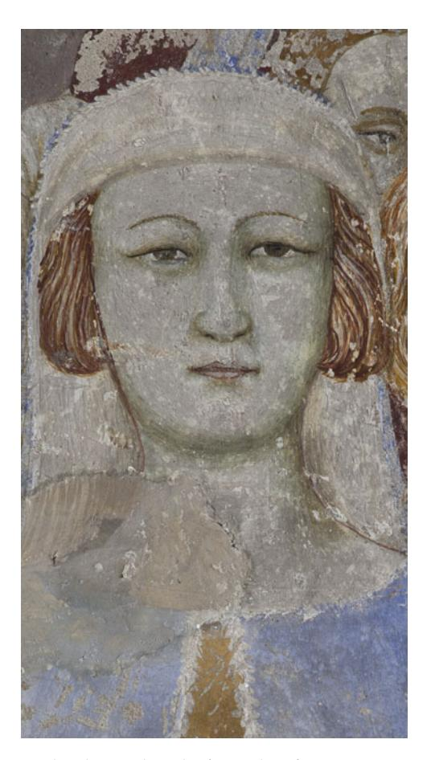

Fig. 3. Avignon, Papal Palace, Chapel of St John, frescoes. Matteo Giovannetti da Viterbo, 1346–8, Resurrection of Drusiana, detail. Photo: Fabrice Lepeltier.

the frescoes of the chapels of St Martial (1344–6) and of St John (1346–8) are still extant, as is part of the decoration of the Great Audience Hall (c. 1353). He also worked for Innocent VI in 1355 at the Chartreuse of Villeneuve-lès-Avignon (where portions of his frescoes are still visible), and for Urban V, who commissioned from him the decoration of the newly built part of the palace, the so-called Roma (1365–6), and 56 painted linen canvases with legends of St Benedict for the eponymous college in Montpellier (1366–7) (Castelnuovo, 1991: 151). Neither the Ala Roma nor the canvases survive. As a favourite painter of Urban V, Matteo moved to Rome when, in 1367, the pope brought the Holy See back to the Eternal City.

If, as Serena Romano reminds us, we should be cautious of any stylistic analysis, an iconographical and physiognomical analysis still remains viable. The snub-nosed physiognomy is a characterizing feature of Matteo Giovannetti's painting, as is evident in many of his figures, such as the group of women witnessing the Resurrection of Drusiana in the chapel of St John (Fig. 3), to mention just one example. The wide and high forehead, the bald

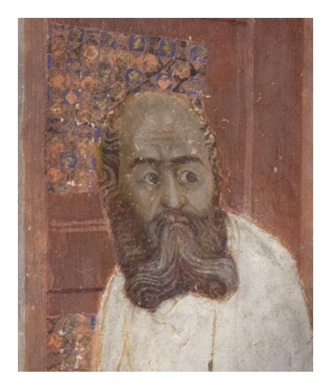

Fig. 4. Avignon, Papal Palace, Chapel of St Martial, frescoes. Matteo Giovannetti da Viterbo, 1344–6, Christ Blessing St Martial, detail. Photo: Fabrice Lepeltier.

and round top of the head, with hair gathered on the sides, are also typical (Fig. 4), as are the prominent ears (Fig. 5). Figures, such as that of Moses in the vault of the Prophets in the Great Audience Hall, combine several such characterizing elements (Fig. 6) and offer a good comparison for the head of St Paul in the Vatican (Fig. 2). Other figures in the same vault, such as Solomon, show a partially turned head with a nose in half-profile, which finds a parallel in St Peter's nose. Although his head has been repainted, it is possible that the original outline of head and nose was retained by the restorer: particularly distinctive is the lower line defining the nostrils (Fig. 7), which can be paralleled with that in the sinopia of the head of St John the Evangelist in the Great Audience Hall (Fig. 8): their almost perfect matching, if superimposed, suggests more than a coincidence. The idea of pairing 'iconic' frontal standing figures with those that are partially turned is also typical of Matteo Giovannetti. Additionally, if we compare the silhouettes or outlines of the figures — ignoring the drapery which has been altered or entirely remade — we can observe further similarities. For instance, the flying pointed portion of cloak hanging down the right arm of St Peter finds several parallels in Matteo's surviving work in Avignon, including a figure of the Prince of the Apostles himself in the vault of the chapel of St Martial (in the scene depicting St Peter handing the pastoral staff to St Martial). Of course, parallels are difficult as we are comparing works that are technically different (frescoes and panel paintings,

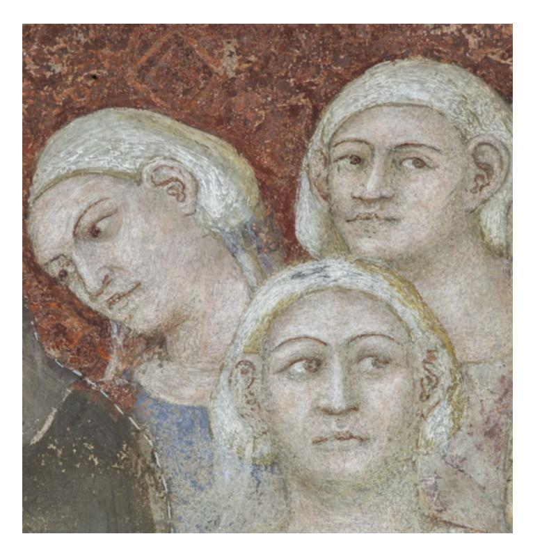

Fig. 5. Avignon, Papal Palace, Chapel of St Martial, frescoes. Matteo Giovannetti da Viterbo, 1344–6, Healing of Sigisbert, Count of Bordeaux, detail. Photo: Fabrice Lepeltier.

the latter almost entirely deprived of their very matter) and which may be dated between fifteen and twenty years apart, provided that we are correct in ascribing the Vatican panels to the period 1367–9. And yet, these considerations serve only to reinforce the parallels.

It is also worth bearing in mind that medieval artists usually led workshops and that Matteo Giovannetti was no exception, according to the reference to his socii in the payment records. The collaborative nature of the medieval cantiere complicates problems further since the leading master tended to impose a standardized and uniform mode of painting on the pictorial enterprise, including consistency in proportions, modes of depicting flesh, and even physiognomies.13 Thus, any discussion of a 'hand' (and related parallels) needs also to take into account the organization of a medieval workshop and the many hands of the assistants. These often worked in a specialization — one may have painted heads, another clothing, and yet another architectural structures. As Zanardi observed, 'one could say that the problem a master faced then was the exact opposite of what an art historian faces today: the medieval

13 The phenomenon is well studied. Amongst the many publications, see, in particular, Zanardi, 1996, 2002; 2004: 32–62. On Giovannetti's workshop, Denifle, 1888: 602–30.

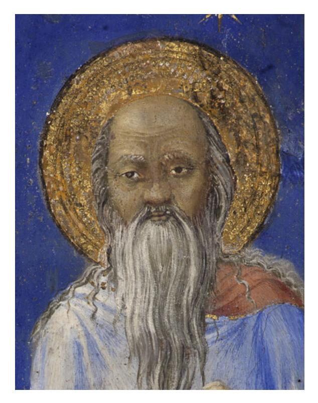

Fig. 6. Avignon, Papal Palace, Great Audience Hall, frescoes. Matteo Giovannetti da Viterbo, c. 1353. Vault of the Prophets, detail of Moses. Photo: Fabrice Lepeltier.

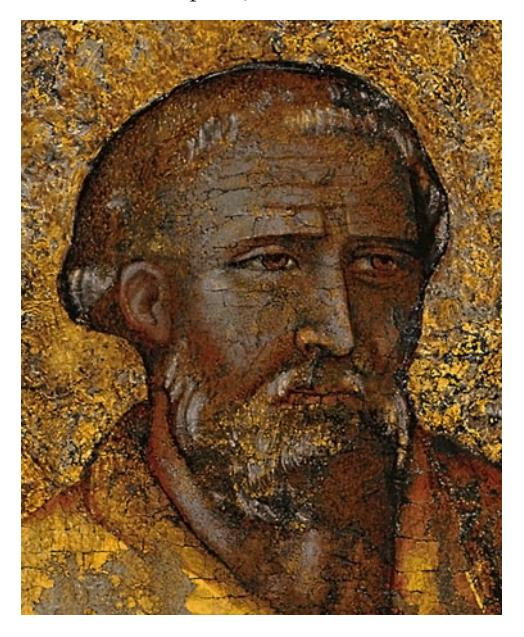

Fig. 7. Vatican City, Museo Storico Artistico del Tesoro di San Pietro, Sts Peter and Paul. Tempera on copper (formerly on walnut wood), head of St Peter. Photo: per gentile concessione del Capitolo di S. Pietro in Vaticano.

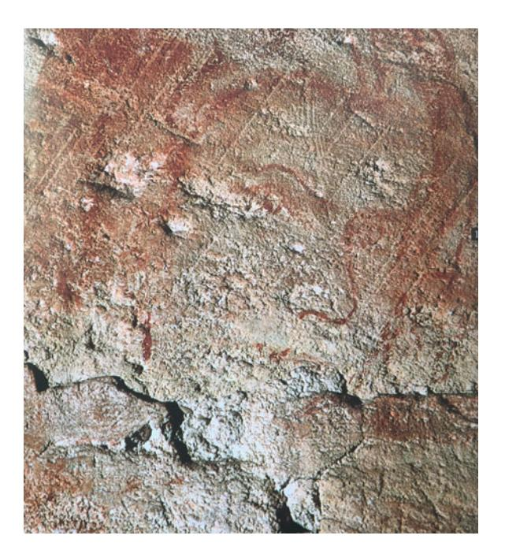

Fig. 8. Avignon, Papal Palace, Great Audience Hall, frescoes. Matteo Giovannetti da Viterbo, c. 1353. Sinopia of the head of St John the Evangelist from the Calvary scene. Photo: Fabrice Lepeltier.

master needed to know how to conceal as much as possible the individual artistic personalities of his assistant painters; the modern art historian seeks to reveal them' (Zanardi, 2004: 61). And yet, it is vital that a modern art historian attempts to identify the master and related workshop responsible for any given artefact as a starting point for a wider contextualization; otherwise such an artefact might remain a silent ghost, as was the case of the Vatican panels.

The size of these panels suggests an important commission, and a relevant destination. Unfortunately, the very nature of an Expense Register means that Matteo Giovannetti's actual activity is only partially recorded. Indeed, in two instances in which Matteo is mentioned in the Register, there is a reference to more detailed forms of written documentation, dubbed 'cartabulum' and 'cedula'. In an entry of 11 January 1368, it is said that Matteo is paid for various colours according to what had been set down in writing and commissioned 'in quadam cedula'. 14 An entry of the following 30 January makes reference to various works listed in a 'cartabulo dato per supradictum dominum Matheum a supradicto domino Gaucelino' (the latter — as we know

14 Document transcribed in Kirsch, 1898: 115: 'I. in coloribus diversis preter superius expressos per dictum dominum Gaucelinum sibi traditis per dominum Matheum de Viterbio archipresbiterum Certellensem fuit in quadam cedula scriptum et ordinatum in summa 116 flor. auri, 7 sol. prov.'

from other entries in the same Register — was Gaucelin de Pradelhe, the director of the work).15

Nevertheless, it remains a fact that the panels are not explicitly mentioned in the surviving documentation concerning work at the Vatican Palace. It is possible, therefore, that the paintings were not designed for it, and we shall return to this point. Their monumental size and presumably high value (if only for the generous use of gold) raise the question of their original function. If we virtually split the current painting on copper in two, we obtain two panels of 130 by 47.5 cm each. This may not have been their original exact size as the dismantling of their first setting may well have caused some alteration in the size of their support, but it is fair to start our discussion from an approximate reconstructed size of c. 130 by 47.5 cm.16

Rectangular panels of a similar size are not common, but are attested primarily in the fifteenth century, when they were deployed for the promotion of the cult of saints in the making or recently canonized. A number of such panel paintings survive depicting St Bernardino of Siena (d. 1444), a recently deceased saint-inthe-making, whilst the panel of the 'blessed' Giovanna Felici formerly in the Locatelli Milesi Collection (but originating from Rome and dating c. 1433–40) is a good example of attempted 'canonization through images', albeit a failed one (Fig. 9).17 Such paintings provided a smart answer to the functional exigencies of commemoration, cult and sanctification, serving either as potential miracle-working images that replaced the actual miraculous bodies or as valuable assets for the canonization process (Israëls, 2007: 77–114; Bolgia, 2013b: 52–60). These panels were primarily hung on pillars or columns in churches, as 'mobile' equivalents of images frescoed there, and their function was likewise related to cult promotion. The Chronica fratrum minorum observantiae of Bernardino Aquilano, for instance, attests that painted portraits of Bernardino of Siena were hung on columns within churches before his canonization.18 Albeit more rarely, similar paintings are also found in the Duecento and Trecento, as is the case with the extant portraits of St Francis of Assisi. An example of these is the panel (c. 1270) in the Upper Chapel (cella of St Francis) in S. Francesco a Ripa in Rome (Fig. 10), measuring 129 × 52 cm, whilst the images of St Louis of Toulouse and St Anthony of Padua in the same

15 Kirsch, 1898: 116. Indeed, one of Matteo's own account books (dated 1347, and recording expenses concerning the decoration of the Concistoro in the Avignon Palace) survives, thus constituting an invaluable source for the organization of a painter's workshop in the papal palace. Denifle, 1888: 602–30. On Gaucelin see, for instance, the entry of 28 October 1368 in

Kirsch, 1898: 136: 'Gaucelino de Pradallo directori operum palacii Romae'. 16 The conservator's report (D'Alessandro, 2009: 16–23) does not include any indication of the measures of the panels before 1862.

17 On S. Bernardino, see Israëls, 2007: 77–114; Cobianchi, 2009: 55–83. On Giovanna Felici, Bolgia, 2013b: 52–60. On the creation of beati and the phenomenon of canonizations through images, see Vauchez, 1988: 109–20. 18 '...quia pinguntur plures figurae sancti et in columnis appenduntur ecclesiae': Lemmens, 1902:

37; Cobianchi, 2009: 57.

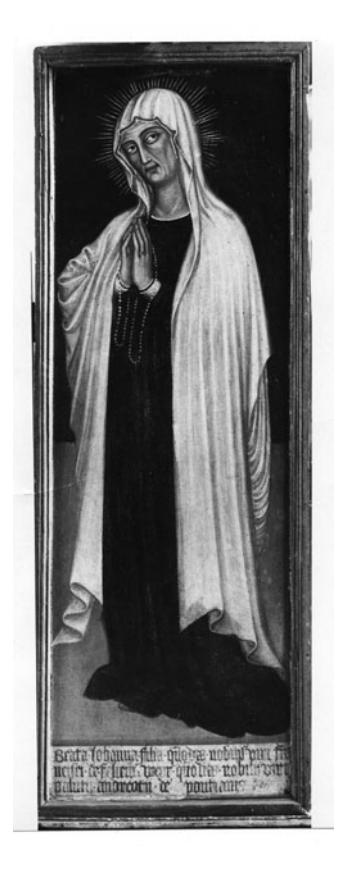

Fig. 9. Unknown location, formerly Bergamo, Achille Locatelli Milesi Collection, the 'blessed' Giovanna Felici. Tempera on wood (?), c. 1433–40. Photo: Biblioteca Berenson, Fototeca, Villa I Tatti — The Harvard University Center for Italian Renaissance Studies.

convent, datable to c. 1325, measure 129 × 24 cm, a size that may have been dictated by the earlier St Francis's panel (the reduced width depending on the hierarchy of sainthood within the Order).19 In this case, the 'portrait' of St Francis may have originally hung either in the church or in the cella where the saint-to-be had allegedly lived during his Roman residence, while the later panels were probably conceived as a pendant, perhaps to transform the original single panel into a triptych. All these cases feature either the portrait of a recent saint or of a saint-in-the-making.

Examples portraying already established or traditional saints are also known, but are rarer and primarily of the type often referred to as 'devotional paintings', that is, commissioned by a clerical or lay devotee, whose tiny image in prayer appears at the feet of the saint. These paintings are not often studied with

19 Queijo, 2012: 303–4, with bibliography on this and other similar portraits of St Francis; Sgherri, 2017: 308–9, with full bibliography.

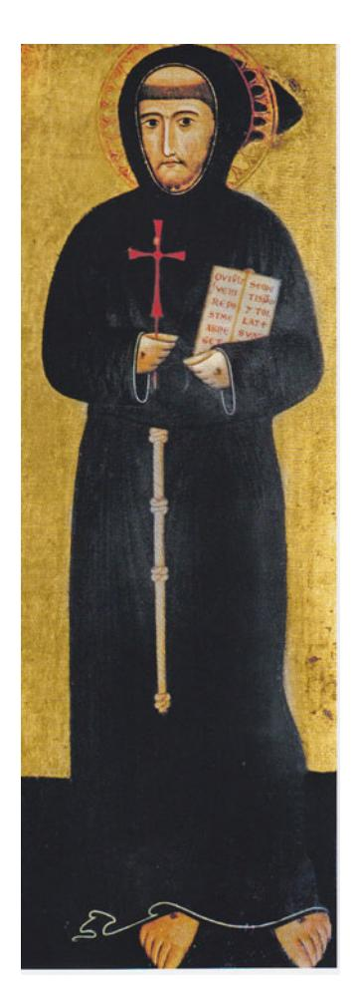

Fig. 10. Rome, S. Francesco a Ripa, Upper Chapel, St Francis. Tempera on wood, c. 1270 (heavily repainted). Photo: author.

attention to their original location and function, but it seems probable that they too were hung on columns or pillars, and were the expression of intense devotion, sometimes even of thanksgiving for a received miracle. One such case should be seen in the image of St Lucy (170 × 64 cm), formerly in the Roman church of S. Lucia in Selci (Fig. 11), variously dated between the end of the thirteenth and the mid-fourteenth century, and commissioned by the wife of a member of a prominent Roman noble family, 'Angila uxor Odonis Cerronis', according to the inscription flanking the minuscule donor.20 That the image

20 For the earlier dating, based on stylistic analysis, see Romano, 2017: 37–8; for the later dating, grounded in a possible identification of the donor in archival documents, see Barry, 2003: 111–39. The hinges on the sides of the panel are later and should not be seen as evidence that the panel was the central component of a triptych originally. On sacred images and devotional practices, see Bacci, 2000.

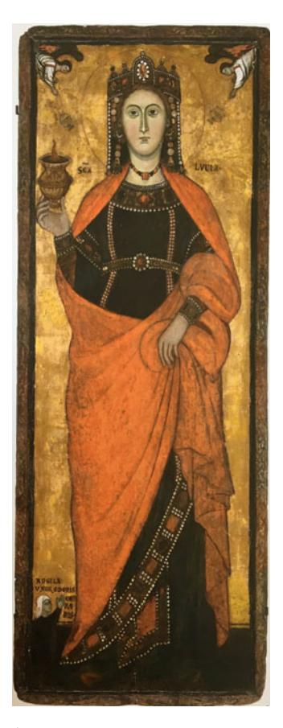

Fig. 11. Grenoble, Musée des Beaux Arts, St Lucy. Tempera on wood, from S. Lucia in Selci, Rome. Photo: © Ville de Grenoble/Musée de Grenoble.

was a private commission, not destined for the high altar — contrary to what some scholars have proposed — is indicated by the fact that the saint is holding a vase with a flame, symbol of the Wise Virgin, in the one hand, and a fold of her cloak in the other: a private and intimate gesture, unusual for 'official' public images, in which the saints typically hold the cross or the attribute of their martyrdom in the left hand and make a gesture of testimony/prayer palm frontally outward — with the right hand.

Examples of large individual rectangular panels displaying more traditional images of well-established saints appear to be unprecedented in Rome, and very rare throughout Italy. Those that survive are primarily in museums where their original provenance and function are unknown. In the church of S. Maria Nuova in Viterbo there survives a twelfth-century folding tabernacle, measuring 150 by 100 cm in total (that is, when open), showing Christ enthroned in the centre, and the Virgin and John the Evangelist in the intercessory gesture of the 200 CLAUDIA BOLGIA

Deesis on the rectangular side panels.21 When these are closed, their backs are on display, featuring standing images of St Peter and St Paul with their attributes, acting as authoritative guardians to the holy trio inside. A seraph holding a sword on the back of the central panel further enhances the shrine effect. In this case, the width of the rectangular images of Peter and Paul is only 25 cm, that is, exactly half of the size of the Saviour whom they protect. The proportion is therefore very different from our panels (even taking into account that the current support presumably does not correspond precisely to the original size). Furthermore, the images are set against a blue background, the golden background being reserved to the internal central image of the blessing Christ. Thus, it is unlikely that the Vatican panels had a similar function. So then, what function did they actually perform?

Before addressing this question, we ought to consider the germane issue of original location. According to Romano and Nesselrath, the earliest mention in the Vatican of two paintings which may arguably be recognized as those under consideration is found in Torrigio (1618: 44) who saw 'due antichissime tavole lunghe ove sono dipinti questi due santi Apostoli [Pietro e Paolo]' ('two most ancient long panels in which these two holy Apostles are depicted') in the Clementine Chapel in the Vatican Grottoes, on the altar which was believed to house half of the bodies of Peter and Paul. The two scholars additionally observe that the panels may be the same as those described in the inventory of 1603–16 as located on the altar under the confessio of St Peter's, which is indeed convincing since the altar of the Clementine chapel is situated exactly under the confessio of St Peter's, but this anticipates their first mention by only a few years.22 It is puzzling that Torrigio does not record the provenance of the panels before their arrival in the Clementine chapel (dating around 1592, under Clement VIII). He is usually very accurate on this type of information in his work on the Vatican Grottoes, the main raison d'être of which was, after all, to document the movement of relics and artworks from Old St Peter's to the newly constructed Grottoes. It is even more surprising that the panels are recorded in neither literary nor documentary sources accounting for the removal of relics and artworks at the time of the demolition of Old St Peter's. Romano and Nesselrath observed that 'no specific tradition accompanied them' (Nesselrath and Romano, 2017: 334). The lack of a tradition or a legend associated with them is rather perplexing, especially considering the wealth of information that survives for other monuments or artworks now in the Grottoes and originally in the Vatican basilica. A plausible explanation might be that the panels were not originally conceived for Old St Peter's and were only transferred there at a later stage, perhaps when their original setting was dismounted.

21 Leone, 2012, I: Cat. no. 39, on 86–7, figs 22a–c, on 123–4. 22 BAV, Archivio Capitolare di S. Pietro, Inventario 18: 'Altare sotto la Confessione di S. Pietro. Quadri due antichi dove sono depinte l'imagini di S. Pietro e di S. Paolo' (Altar under the Confessione of St Peter. Two ancient paintings in which the images of St Peter and St Paul are depicted). Nesselrath and Romano, 2017: 334.

Furthermore, the difficulty of finding comparative material for the size (and iconography in relation to size) as well as related function of the paintings may be an indication that they originally belonged to an unusual type of monument. In Rome, a single example survives of paintings similar in size and iconography, and yet these paintings are much later, generally dated to the late fifteenth or early sixteenth century, and ascribed to the school of Antoniazzo Romano.23 What is interesting for our discourse, however, is that these form part of an earlier monument, dating precisely to 1368–9, and that they replace earlier paintings, presumably of the same or similar subject, and contemporary to the monument. I am referring here to the paintings which decorate the base of the platform for the display of the reliquaries of Sts Peter and Paul in the tabernacle over the high altar of St John Lateran (Fig. 12), the cathedral of Rome. Each side of the tabernacle displays three paintings (Fig. 13), featuring a pair of saints in each of the side panels, and a Coronation of the Virgin, a Crucifixion, an enthroned Virgin and Child with a kneeling donor, and Christ as Good Shepherd, in the central panels. Their size is 94 by 156 cm, which means 47 by 156 if we ideally split the panel with a pair of saints into two separate panels, each featuring one saint only. Their width is therefore almost identical to the approximately reconstructed width of the Vatican panels (47.5 cm). The height of the latter panels is less than that of the paintings currently on the tabernacle, but, in these, the saints appear under a round arch, which occupies some space (c. 25 cm) in the upper part of the composition. If we posit the existence of a similar arch or simply more golden background above the heads of the saints in the Vatican Treasury panel (corresponding to the space occupied by the arch in the paintings on the tabernacle), we obtain a height of c. 155 cm, which is remarkably similar to that of the tabernacle's paintings (156 cm). Indeed, Peter and Paul now appear rather squat, which may well be the consequence of a reduction in height of the background behind their heads.

With all necessary caution, I would therefore like to suggest that the painting now in the Vatican Treasury originally pertained to the decoration of the base of the relic chamber of the tabernacle commissioned by Urban V and realized c. 1368–70.24 Within Urban V's artistic policy, this was the most important commission, aimed at refocusing attention on the Lateran, the cathedral of Rome, as the centre of Western Christendom, and the pope as its very leader.25 It was indeed rather successful in this respect, to the extent that hundreds of

23 Monferini, 1962: 210 follows Longhi's suggestion that they may be the work of a 'seguace umbreggiante di Antoniazzo' ('an Umbrianish follower of Antoniazzo'). Luciani, 2009: 182 ascribes them to Antoniazzo himself and Fiorenzo di Lorenzo.

24 The tabernacle was completed under Gregory XI (1370–8), as attested by the presence of his coat of arms in one of the crowning gables. The shrine, however, must have been in an advanced stage in April 1370, when the reliquaries of Sts Peter and Paul were ceremonially installed.

Bolgia, 2018: 187–8. 25 Bolgia, 2018: 177–92. For a subsequent episode of the 'Tabernacles' War' (that is, the use of monumental tabernacles to shape and express relics' and icons' embodiments of papal and civic identities), see Bolgia, 2019: 311–40; Bolgia, forthcoming.

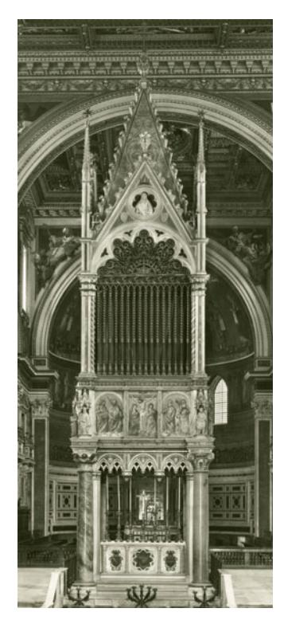

Fig. 12. Rome, St John Lateran, high altar, tabernacle for the relics of St Peter and St Paul. Giovanni di Stefano da Siena and assistants, c. 1368–72. Photo: author.

images of Urban V, holding either the tabernacle or the reliquaries it housed, were depicted in Rome and across Italy as part of a propaganda campaign in favour of the re-establishment of the papal residence in Rome during the pontificate of Gregory XI (1370–8) and in support of a 'Roman' pope in the course of the following Great Schism (1378–1417) (Bolgia, 2002: 562–74; 2016: 343–50). The monument is ascribed to the Sienese architect and sculptor Giovanni di Stefano, who was responsible for building activity in the basilica, assisted by a team of sculptors working under his direction (Monferini, 1962: 182–212). Despite some restorations, the most visible of which dates to 1851, the monument is in relatively good condition.26

Already by the late fifteenth or early sixteenth century a need must have arisen to replace the paintings, presumably more damaged and darkened by smoke and candles than the sculptures. Although the early modern paintings are in fresco, there is some physical evidence to suggest that the originals were on panels. The

26 The nineteenth-century restoration is not only attested by the inscription running under the relic chamber (visible in our Fig. 13), but also documented in Martinucci, 1854. An article on the Lateran tabernacle in the context of Urban V's patronage and its broader impact outside Italy is in preparation.

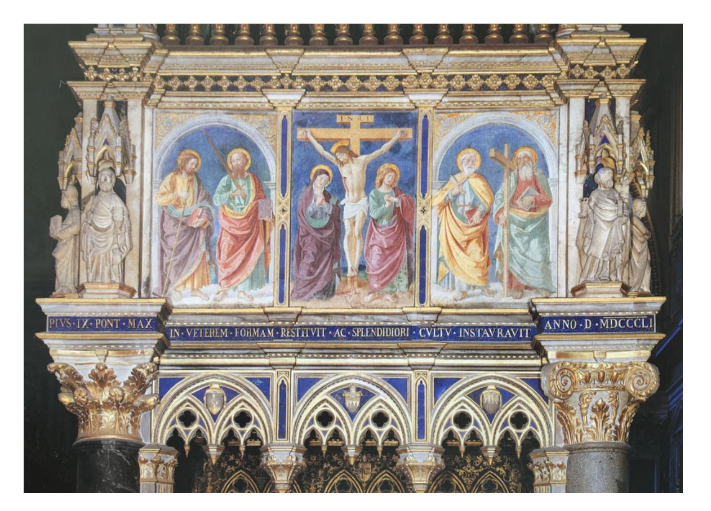

Fig. 13. Rome, St John Lateran, high altar, tabernacle for the relics of St Peter and St Paul. Giovanni di Stefano da Siena and assistants, c. 1368–72, base of the relic chamber, late fifteenth-/early sixteenth-century paintings by Antoniazzo Romano's school. Photo: author.

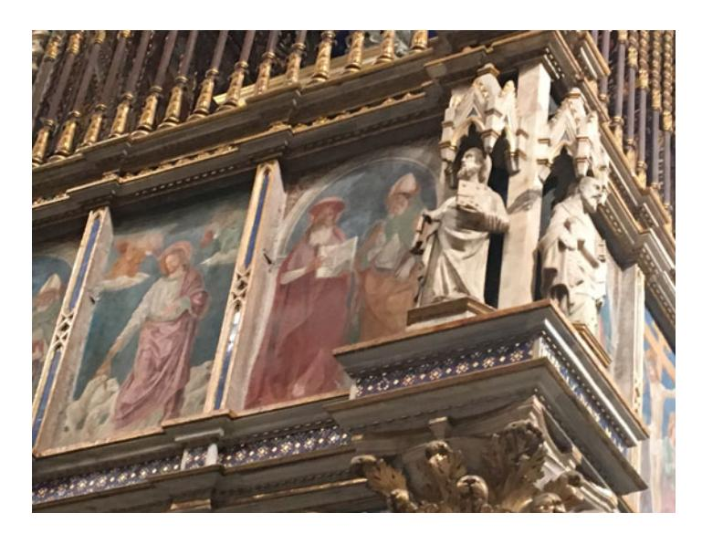

Fig. 14. Rome, St John Lateran, high altar, tabernacle for the relics of St Peter and St Paul. Giovanni di Stefano da Siena and assistants, c. 1368–72, detail of the base of the relic chamber. Photo: author.

small Gothic pilasters framing the images protrude visibly by c. 8 cm (Fig. 14), indicating that they originally framed images of greater depth, which supports the hypothesis that the latter were on wooden panel.

As the original decoration of the base of the relic chamber was replaced very early in the history of the monument (that is, less than a century and a half after it was realized), it is unsurprising that no description or reference to its appearance has survived. There is, nevertheless, one controversial exception, namely a mid-eighteenth-century note by Guglielmo Della Valle (1785: 116) according to which the seventeenth-century erudite Giulio Mancini had ascribed the paintings to a certain Barna da Siena. Monferini (1962: 211), who recorded the attribution, was sceptical as she could not find the reference in Mancini's work. The passage, however, is found in Mancini's Considerazioni sulla Pittura and reads: 'One may believe that the paintings commissioned by Urban V for the ciborium of the heads of Saints Peter and Paul in St John Lateran are probably by the hand of the aforementioned Berna because this artist spent such a short time in his own land, and lived during those times, and could have had people who would have brought him close to the said pontiff, who was very dear to the Sienese...' 27 The passage is highly problematic, not only as

27 Marucchi, 1956, I: 179: 'Di questo Berna probabilmente si può credere che siano le pitture del ciborio, dove stan le teste di Ss. Pietro e Paolo in S. Giovanni Laterano fatte fare da Urbano V, perché questo artefice fu poco nella patria, e visse in questi tempi, e poté aver genti che lo portassero appresso al detto pontefice il quale era molto ben affetto ai Senesi ...'

Mancini's argument is very flimsy (a point already noted by Della Valle),28 but also as the attribution came at a time when the original decoration had already been replaced by the fifteenth-century frescoes, whilst Mancini seems to ascribe to Berna the decoration visible in his time. Perhaps, even more importantly, most scholars have reached the conclusion that the mysterious Berna or Barna da Siena, for whom there is no certain documentary evidence, is 'an historical fiction' (Hourihane, 2012: 246–7). If Mancini's attribution is to be discounted, it nevertheless indicates that in early modern times the decoration of the base of the chamber was associated with a Trecento painter, which in its turn suggests that there may have been some knowledge that it was originally pictorial. This should not surprise us since tabernacles of this type were 'multimedia' monuments, and the area where a different medium is attested for earlier similar examples was precisely the base of the relic chamber: both the Veronica tabernacle in Old St Peter's (1197) and the relic tabernacle in S. Maria Maggiore (1256) employed yet another 'pictorial' medium, that is, mosaic.29

It is probable that, at least in part, the original choice of saints and images was repeated in the late fifteenth-century frescoes but rendered in what was considered to be a more updated style. Whether or not the panels of Peter and Paul belonged originally to the tabernacle, its later frescoes are an 'anachronic' work, to use the term coined by Alexander Nagel and Christopher S. Wood for fifteenth- and sixteenth-century works that replaced earlier ones, works that 'repeated' and 'remembered', but also projected a 'future or an ideal' (Nagel and Wood, 2010: 13). It is worth bearing in mind such theoretical context in order to appreciate the extent to which the Renaissance is indebted to what is usually considered the dark void of Trecento Rome. It is interesting that, from an iconographic point of view, the images of Peter and Paul in the Vatican Treasury compare well with the statuettes of the same saints in the small Gothic ciboria at the corners of the tabernacle. Both figures of St Paul (Figs 1 and 15), in particular, hold the book vertically on a veiled left hand while, in the right, they clutch a similar long sword, tip downward to touch the pavement, a far less common attribute than the shorter one held tip upwards.

Unfortunately, an Expense Register of the type extant for the Vatican has not survived for the Lateran, where building activity was buoyant after the return of Urban V and undertaken at his behest. The name of Giovanni di Stefano as the architect in charge of building activity in St John Lateran is known only through an occasional letter of Urban V to the Signoria of Florence (Milanesi, 1854–6, I: 269). Other incidental pieces of information, concerning the work of

28 Della Valle, 1785: 116: 'Veramente la conseguenza che Mancini deduce da questa premessa viene troppo di lontano: egli sarà sempre poco creduto, scrivendo così alla buona, e non curandosi di studiare gli autori nelle opere loro' ('In fact the result that Mancini deduces from this premise is based on too weak an argument: he will always be disbelieved, writing thus in

such a simplistic way and not bothering to study the artists through their own works'). 29 On this type of tabernacle see Bolgia, 2013a: 114–42. On the tabernacle of S. Maria Maggiore, Gardner, 1970: 220–30.

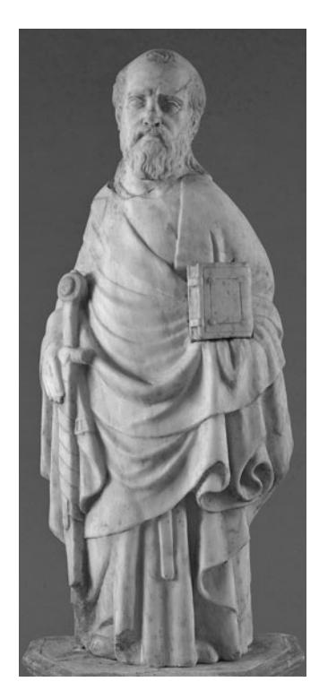

Fig. 15. Rome, St John Lateran, high altar, tabernacle for the relics of St Peter and St Paul. Giovanni di Stefano da Siena and assistants, c. 1368–72, St Paul. Photo: © Musei Vaticani, Governatorato S.C.V.

Giottino in 1369, for instance, come from occasional documentary survivals (Müntz, 1890: 1–11). As Matteo was a favourite painter of Urban, it would not be surprising if he was working both at the Lateran and the Vatican. This was certainly the case for Giottino in 1369.30 After all, had not the pope commissioned the reliquaries of Peter and Paul from his favourite goldsmith, the Sienese Giovanni di Bartolo, who, like Matteo, had followed the pope from Avignon to Rome?31 In the present frescoes (Fig. 13), Peter and Paul are not paired; instead St Peter is paired with St Andrew, and St Paul with St James. It is possible that Peter and Paul now in the Vatican Treasury originally formed single unities with analogous pairs and were split into single panels only at the moment of their removal from the tabernacle. The combinations Peter/Andrew and Paul/James allow Peter and Paul to occupy the most central position to the

30 For his activity at the Vatican, see the Register of payments in the Vatican Archives discussed by Müntz, 1890: 1–11. For his work at the Lateran, see Il libro di Antonio Billi, Benedettucci, 1991: 41–2. This Florentine source, datable to the second/third decade of the sixteenth century and comprising brief lives of artists (one of Vasari's sources), makes reference to Giottino painting in Rome 'in Santo Janni, la storia di uno papa in più quadri' ('in St John, the story of a pope in various scenes'). 31 On these reliquaries, see Mondini, 2011: 265–96.

side of the Crucifixion scene. Once dismantled in the late fifteenth or early sixteenth century (when the extant paintings were realized), Peter and Paul, separated from Andrew and James and turned into single saints, may have been kept at the Lateran or already moved to the Vatican, only to find an appropriate — and, presumably, more prominent — location on the altar that was believed to house half of the bodies of Peter and Paul, whose memory or dedication was transferred to the newly constructed Clementine chapel in the late sixteenth century, perhaps for the Jubilee of 1600.32

Lacking any conclusive evidence, the proposal that the panels formed part of the Lateran tabernacle must remain a matter of conjecture for the moment, but the attribution of the paintings to Matteo Giovannetti is the best that can be offered. The head of St Paul in the Vatican Treasury should thus be seen as a missing link in a chain of artistic production that connected Avignon and Rome, and therefore as an important, albeit small, window into the pictorial world of Rome in the dynamic and vibrant years of artistic activity following the 'first' papal return. This re-examination of the Vatican panels also reminds us that, instead of thinking simply in terms of losses and voids (as is usual for Trecento Rome) or in the light of the all-too-present ghost of Giotto, a different methodological approach may bear more fruit, and this is to think in terms of movement of patrons and artists. This is important as scholars have discussed the impact of Matteo's pictorial language on the art of Avignon between the 1340s and the 1360s, but not the impact of his language (as developed in France in those decades) on the art produced in Rome after the papal return.33 In this specific case, we may understand the lost pictorial cycles in Rome in the years 1367–9 as being profoundly informed by the leading role played by Matteo Giovannetti and his assistants, and we may attempt to grasp at least a sense of his lost enterprises in Rome by considering his earlier extant work in Avignon and Villeneuve-lès-Avignon.

32 This altar was formerly in Old St Peter's, as we read in a Liber Indulgentiarum of 1364 (BAV, Ms Vat. Regin. 520, published in Hülsen, [2000] 1926: 138), among various sources. No painted panels with images of the saints are, however, ever recorded in connection with that altar in the pre-modern period. In the Clementine chapel, the altar came to be associated with a porphyry slab bearing an inscription according to which Pope Sylvester had split the bodies of Peter and Paul on that very same slab, kept half there and sent the other half to the basilica of St Paul. The inscribed slab was formerly on the church's counterfaçade, near the Porta Santa. Amongst the many sources, see Torrigio, 1618: 43. It seems clear that in the Clementine chapel (dedicated to Sts Peter and Paul) pieces of different provenance (the altar, the inscription and the images) were gathered together to create a 'narrative' of the presence of half of the bodies of Peter and Paul under the altar. The fact that the panels with these two Apostles may be the only survivors of a much more complex panel-ensemble should not surprise. The history of medieval Rome is punctuated by similar individual survivors. The most outstanding case is probably Giotto's Navicella mosaic for Old St Peter's, the most famous work of the artist, much praised and copied throughout the Renaissance, of which only two marginal Angel's heads seem to have survived. 33 Castelnuovo, 1991, 2004. The valuable collection Brilli, Fenelli and Wolf, 2015, deals only

with the first half of the Trecento. For the impact of the circulation of patrons and artists between Rome and Avignon on tomb sculpture, see Gardner, 1992.

208 CLAUDIA BOLGIA

We ought to remember that Matteo Giovannetti was a highly influential artist, with a reputation that lasted for a considerable time after his death. A letter of 4 September 1406 attests that the king of Aragon, Martin I, asked the bishop of Lerida to act as an agent in commissioning a good artist (bon maestre) to make parchment copies of the frescoes with the story of the Angels painted by Matteo Giovannetti in the chapel of St Michael in the papal palace of Avignon (Rubió y Lluch, 1921: 384; Castelnuovo, 1991: 160). A second letter of the following 30 October reveals that the king was most eager to receive these copies as he aimed to use them as a model for the decoration of a chapel he was building in honour of the Archangel (Rubió y Lluch, 1921: 385). It has hitherto not been noticed that the letters make specific reference to the frescoes

as depicting the 'whole story of the Angels of all provinces' (September letter) and 'the Angels and the provinces' (October letter).34 I would like to suggest that these expressions indicate that the frescoes depicted the Principalities, that is, the custodian Angels of nations, who inspired and directed the good rulers, according to a long-standing medieval tradition based on pseudo-Dionysus (De Coelestis Hierarchia, chapters 6 and 9), and embraced, amongst others, by Thomas Aquinas (Summa Theologiae, I, 108).35 The idea that St Michael himself was a Principality is found in the work of Thomas Aquinas and is based on a passage in the book of Daniel (12:1) according to which Michael was the custodian of Israel. The wording of the October letter ('la ystoria dels angels et de le provincies') suggests that the Angels were indeed depicted with the provinces/nations they protected, a rare if not unique iconography. Thus, it was probably not only the quality of Matteo Giovannetti's work, but also its unusual content (perhaps devised in conversation with Pope Clement VI and his entourage) that was considered so original and worthy of copying by the king of Aragon, arguably for its political overtones. Whatever the reason, it is unquestionable that Matteo's frescoes in the chapel of St Michael, dated to 1344 by an inscription, were still seen as a model to be followed 60 years later.36

To attempt to form an idea of Matteo's painting in Rome by considering his earlier Avignonese work and the recovered Vatican panels is neither an idle nor

34 Rubió y Lluch, 1921: 384: '... en la qual capella es pintada tota la ystoria dels angels de totes les provincies'; 385: '... la ystoria dels angels et de le provincies'. Dominique Thiébaut (Laclotte and Thiébaut, 1983: 165) following Digonnet (1907), suggested that the chapel may have been decorated with a representation of the triumph of the good Angels, led by St Michael, over the fallen Angels. Neither the text of the letters nor the very few extant traces of sinopiae support this interpretation.

For the sinopiae, see Toracca, 2002: 77–9. 35 The Principalities belonged to the third Sphere (the one closest to the men) of the Angelic Hierarchy as devised by Pseudo-Dionysus and Thomas Aquinas by drawing on passages from the New Testament. Such Hierarchy included three Spheres, each of three Orders or Choirs: (1) Seraphims, Cherubims and Thrones, (2) Dominions, Virtues and Powers, (3) Principalities, Archangels and Angels.

36 The source for the date is a note by the French erudite Joseph-Marie Suarès in a 1635 letter to Cardinal Francesco Barberini, cited in Castelnuovo, 1991: 164; and Castelnuovo, 2004: 170.

a useless exercise. It is, instead, extremely valuable in helping to throw light on the context in which major representatives of Quattrocento art in Rome, such as Antoniazzo Romano, grew and, therefore, to revise some commonplaces about the roots of Renaissance art. It has been observed — and demonstrated through a broad range of examples — that Antoniazzo Romano drew considerably on Trecento art for the iconography of his works. Several parallels have been drawn with Florentine fourteenth-century artworks as possible sources of inspiration (De Simone, 2014: 99–113). Yet, we need to be reminded that 'Florentine' artists — Giovanni da Milano, Giovanni Gaddi and Agnolo Gaddi, in addition to Giottino, as well as other lesser-known painters — are documented as working in Rome in 1369 (Müntz, 1890: 1–11; Monciatti, 2005: 241–2). And, of course, Matteo Giovannetti and his workshop were active in Rome and highly influential. It is therefore probable that the sources of inspiration for Antoniazzo lay also in Rome, perhaps primarily in Rome, where the artist is mainly documented and conducted almost his entire career. It is not only the iconography, but also the form and distinctive style of Antoniazzo — with his round figures, his sober simplicity and intense spirituality — that seems to have its roots in Trecento art, and especially the art produced by Matteo Giovannetti, rather than the Tuscan tradition. This is, of course, mediated and developed through the production of Antoniazzo's contemporaries, such as Melozzo da Forlì and Benozzo Gozzoli, whose formative role for Antoniazzo has long been recognized by scholarship.37 Yet, a strong Trecento aura appears in his paintings, which makes him seem somewhat retardataire, especially in his early works, such as the cycle of the Life of S. Francesca Romana in the monastery of Tor de Specchi (1468). It is presumably this aura (which may have derived, amongst other sources, from his early exposure to the art produced in Rome in the last quarter of the Trecento for papal patronage) that made his style so attractive to the popes of the fifteenth century, securing him commissions in the Vatican Library (1481) and Vatican Palaces (1483). Amongst the artists of the time it was he who would have fitted best within the local tradition. Thus, the 'recovery' of the Vatican panels as a work by Matteo Giovannetti not only contributes to filling a gap in the artistic production of Rome in the immediate aftermath of the Avignon absence but also enhances our understanding of what was to be created more than a century later.

Address for correspondence: Prof. Claudia Bolgia Dipartimento di Studi umanistici e del patrimonio culturale, Università degli Studi di Udine, Palazzo Caiselli, Vicolo Florio 2/b, 33100 Udine, Italy [claudia.bolgia@uniud.it](mailto:claudia.bolgia@uniud.it)

37 On Antoniazzo, see Cavallaro, 1992; Paolucci, 1992; Rossi and Valeri, 1997; Cavallaro and Petrocchi, 2013.

### REFERENCES

### Primary sources

ASV, Camera Apostolica, Collectoriae 450.

- BAV, Archivio Capitolare di S. Pietro, Inventario 18.
- BAV, Ms Vat. Regin. 520 (Liber Indulgentiarum of 1364).
- Benedettucci, F. (1991) (ed.) Il libro di Antonio Billi. Anzio, De Rubeis.

Della Valle, G. (1785) Lettere Senesi sopra le belle arti II. Venice, Pasquali.

- Egidi, P. (1908) (ed.) Necrologi e libri affini della Provincia romana I (Necrologi della città di Roma). Rome, Forzani e c. tipografi del Senato.
- Hülsen, C. (2000) Le chiese di Roma nel Medio Evo. Cataloghi e appunti. Rome, Quasar (first edition Florence 1926).
- Kirsch, P. (1898) Die Rückkehr der Päpste Urban V. und Gregor XI. von Avignon nach Rom. Auszüge aus den Kameralregistern des Vatikanischen Archivs. Paderborn, F. Schöningh.
- Lemmens, L. (1902) (ed.) Bernardino Aquilano, Chronica fratrum minorum observantiae. Rome, Typis Sallustianis.
- Martinucci, F. (1854) Intorno le reparazioni eseguite all'altare papale lateranense e suo tabernacolo. Rome.
- Marucchi, A. (1956) (ed.) Giulio Mancini, Considerazioni sulla pittura, 2 vols. Rome, Accademia Nazionale dei Lincei.
- Rubió y Lluch, A. (1921) Documents per l'historia de la cultura catalana mig-eval II. Barcelona, Casa de Caritat.
- Torrigio, F.M. (1618) Le Sacre Grotte Vaticane. Viterbo, Appresso i Discepoli.

### Secondary sources

- Ammann, A.M. (1942) Die Ikone der Apostelfürsten in St. Peter zu Rom (Nachträge und Ergänzungen). Orientalia Christiana Periodica 8: 457–68.
- Bacci, M. (2000) 'Pro remedio animae'. Immagini sacre e pratiche devozionali in Italia centrale (secoli XIII e XIV). Pisa, Edizioni ETS.
- Barry, F. (2003) The late antique 'domus' on the clivus Scauri, the early history of S. Lucia in Selci, and the Cerroni altarpiece in Grenoble. Papers of the British School at Rome 71: 111–39.
- Bolgia, C. (2002) Cassiano's popes rediscovered: Urban V in Rome. Zeitschrift für Kunstgeschichte 65: 562–74.
- Bolgia, C. (2013a) Icons 'in the Air': new settings for the sacred in medieval Rome. In P. Davies, D. Howard and W. Pullan (eds), Architecture and Pilgrimage, 1000–1500: Southern Europe and Beyond: 114–42. Farnham, Ashgate.
- Bolgia, C. (2013b) Two enigmatic portraits of the 'blessed' Giovanna Felici, sister-in-law of St Francesca Romana: family promotion and sanctity through images in fifteenth-century Rome. In M. Israëls and L. Waldman (eds), Renaissance Studies in Honor of Joseph Connors I: 52– 60 plus plates 778–81. Florence, Villa I Tatti.
- Bolgia, C. (2016) Il XIV secolo: da Benedetto XI (1303–4) a Bonifacio IX (1389–1404). In M. D'Onofrio (ed.), La committenza artistica dei papi a Roma nel Medioevo: 331–59. Rome, Viella.
- Bolgia, C. (2018) The 'Tabernacles' War', c. 1367–77: civic versus papal authority in popularregime Rome. In H. Flora and S.S. Wilkins (eds), Art and Experience in Trecento Italy (Proceedings of the Andrew Ladis International Conference, New Orleans, 10–12 November 2016), 177–92. Turnhout, Brepols.

- Bolgia, C. (2019) Strategie di riaffermazione dell'autorità papale. Bonifacio IX e il tabernacolo per l'icona di S. Maria del Popolo. In S. Romano and W. Angelelli (eds), La Linea d'ombra. Roma 1378–1417: 311–40. Rome, Viella.
- Bolgia, C. (forthcoming) The 'Tabernacles' War' II, c. 1400: new light on the competition between icons and relics in late-medieval Italy. In J. Luxford (ed.), Tributes to Paul Binski. Studies in Gothic Art, Architecture and Ideas. Turnhout, Harvey Miller.
- Brilli, E., Fenelli, L. and Wolf, G. (2015) (eds) Images and Words in Exile. Avignon and Italy during the First Half of the 14th Century. Florence, SISMEL — Edizioni del Galluzzo (Millennio Medievale 107, Strumenti e Studi 40).
- Cascioli, G. (1912) Il Tesoro di S. Pietro in Vaticano. Bessarione 9, 3rd ser., 121–2: 294–319.
- Cascioli, G. [1925] Guida illustrata al nuovo Museo di S. Pietro (Petriano). Rome, Tipografia Editrice Laziale.
- Castelnuovo, E. (1991) Un pittore italiano alla corte di Avignone. Matteo Giovannetti e la pittura in Provenza nel secolo XIV. Turin, Einaudi (new revised edition; first edition 1962).
- Castelnuovo, E. (2004) Matteo Giovannetti: il pittore dei papi. In E. Castelnuovo (ed.), Artifex bonus: il mondo dell'artista medievale: 168–76. Bari, Laterza.
- Cavallaro, A. (1992) Antoniazzo Romano e gli antoniazzeschi. Una generazione di pittori nella Roma del Quattrocento. Udine, Campanotto.
- Cavallaro, A. and Petrocchi, S. (2013) (eds) Antoniazzo Romano, pictor Urbis 1435/40–1508, exhibition catalogue (Rome, Palazzo Barberini, 1.11.2013–2.02.2014). Cinisello Balsamo (Milan), Silvana Editoriale.
- Cobianchi, R. (2009) Fashioning the imagery of a Franciscan observant preacher: early Renaissance portraiture of Bernardino da Siena in northern Italy. I Tatti Studies 12: 55–83.
- D'Alessandro, L. (2009) I santi Pietro e Paolo. Il restauro. In I Santi Apostoli Pietro e Paolo. Museo Storico Artistico del Tesoro di San Pietro: 16–23. Vatican City, Edizioni del Capitolo Vaticano.
- Denifle, H. (1888) Ein Quaternus Rationum des Malers Matteo Gianotti von Viterbo in Avignon. Archiv für Literatur- und Kirchengeschichte des Mittelalters 4: 602–30.
- De Simone, G. (2014) The use of Trecento sources in Antoniazzo Romano and Lorenzo da Viterbo. Predella 35: 99–113.
- Diggonet, F. (1907) Les Palais des papes d'Avignon. Paris, Seguin.
- Gardner, J. (1970) The Capocci Tabernacle in S. Maria Maggiore. Papers of the British School at Rome 38: 220–30.
- Gardner, J. (1974) The Stefaneschi Altarpiece: a reconsideration. Journal of the Warburg and Courtauld Institutes 37: 57–103.
- Gardner, J. (1992) The Tomb and the Tiara. Curial Tomb Sculpture in Rome and Avignon in the Later Middle Ages. Oxford, Clarendon Press.
- Hayez, M. (2000) Urbano V, beato. In Enciclopedia dei Papi, 3 vols, II: 542–50. Rome, Treccani.
- Hourihane, C. (2012) (ed.) The Grove Encyclopedia of Medieval Art and Architecture I. Oxford, Oxford University Press.
- Israëls, M. (2007) Absence and resemblance: early images of Bernardino da Siena and the issue of portraiture (with a new proposal for Sassetta). I Tatti Studies 11: 77–114.
- Kempers, B. and De Blaauw, S. (1987) Jacopo Stefaneschi, patron and liturgist: a new hypothesis regarding the date, iconography, authorship and function of his altarpiece for Old St Peter's. Mededelingen van het Nederlands Instituut te Rome, 47: 83–113.
- Laclotte, M. and Thiébaut, D. (1983) L'École d'Avignon. Paris, Flammarion.
- Leone, G. (2012) Icone di Roma e del Lazio, 2 vols. Rome, "L'Erma" di Bretschneider.
- Lipinsky, A. (1950) Il Tesoro di S. Pietro. Guida-Inventario. Vatican City, Rev.mo Capitolo Vaticano.
- Luciani, R. (2009) Il complesso lateranense. La Basilica, il Palazzo Apostolico, la Scala Santa. Rome, Prospettiva.

- Milanesi, G. (1854–6) Documenti per la storia dell'arte senese, 3 vols. Siena, Presso Onorato Porri. Monciatti, A. (2005) Il Palazzo Vaticano nel Medioevo. Florence, L.S. Olschki.
- Mondini, D. (2011) Reliquie incarnate. Le 'sacre teste' di Pietro e Paolo a S. Giovanni in Laterano a Roma. In D. Scotto (ed.), Del visibile credere: pellegrinaggi, santuari, miracoli, reliquie: 265–96. Florence, L.S. Olschki.
- Monferini, A. (1962) Il ciborio lateranense e Giovanni di Stefano. Commentari 13: 182–212.
- Müntz, E. (1890) Les archives des arts. Recueil des documents inédits ou peu connus. Paris, Librairie de l'Art.
- Nagel, A. and Wood, C.S. (2010) Anachronic Renaissance. New York, Zone Books.
- Nesselrath, A. and Romano, S. (2017) Scheda nr. 85 (Pittore trecentesco (?) I Santi Pietro e Paolo). In S. Romano (ed.), La pittura medievale a Roma. Corpus VI (Apogeo e fine del Medioevo), 333–4. Milan, Jaca Book.
- Paolucci, A. (1992) Antoniazzo Romano. Catalogo completo dei dipinti. Florence, Cantini.
- Queijo, K. (2012) L'icona di San Francesco a San Francesco a Ripa. In S. Romano (ed.), La pittura medievale a Roma. Corpus V (Il Duecento e la cultura gotica): 303–4. Milan, Jaca Book.
- Romano, S. (2017) Jacopo Torriti (?). La tavola con Santa Lucia e donatrice da Santa Lucia in Selci, In S. Romano (ed.), La pittura medievale a Roma. Corpus VI (Apogeo e fine del Medioevo), 37– 8. Milan, Jaca Book.
- Romano, S. and Zander, P. (2017) Scheda nr. 61 (Giotto Il polittico Stefaneschi). In S. Romano (ed.), La pittura medievale a Roma. Corpus VI (Apogeo e fine del Medioevo), 281–5. Milan, Jaca Book.
- Rossi, S. and Valeri, S. (1997) Le due Rome del Quattrocento: Melozzo, Antoniazzo e la cultura artistica del '400 romano (Atti del Convegno internazionale di studi, Università di Roma "La Sapienza", Rome 21–24 February 1996). Rome, Lithos Editrice.
- Sgherri, D. (2017) 'Lello'. Le tavole con S. Ludovico da Tolosa e S. Antonio da Padova. In S. Romano (ed.), La pittura medievale a Roma. Corpus VI (Apogeo e fine del Medioevo), 308–9. Milan, Jaca Book.
- Stocchi, M. (2009) I santi Pietro e Paolo. Appunti per una storia esterna del dipinto. In I Santi Apostoli Pietro e Paolo. Museo Storico Artistico del Tesoro di San Pietro: 8–15. Vatican City, Edizioni del Capitolo Vaticano.
- Tomei, A. (2009a) Giotto e bottega. I santi apostoli Pietro e Paolo. In A. Tomei (ed.), Giotto e il Trecento. 'Il più Sovrano Maestro stato in dipintura', exhibition catalogue (Rome, Complesso del Vittoriano, 6.03–29.06.2009), 2 vols, II: 169–70. Milan, Skira.
- Tomei, A. (2009b) I santi Pietro e Paolo. Giotto nella Basilica Vaticana. In I Santi Apostoli Pietro e Paolo. Museo Storico Artistico del Tesoro di San Pietro: 4–7. Vatican City, Edizioni del Capitolo Vaticano.
- Toracca, D. (2002) Sinopie et dessins de Matteo Giovannetti (1344–53). In D. Vingtain and F. Baron (eds), Monument de l'histoire. Construire, reconstruire le Palais des Papes, XIVe–XXe siècle, exhibition catalogue (Avignon, Palais des Papes 29.06–29.09.2002): 77–9. Avignon, Palais des Papes.
- Vauchez, A. (1988) La sainteté en Occident aux derniers siècles du Moyen Age: d'après les procès de canonisation et les documents hagiographiques (revised edition). Rome, École française.
- Vingtain, D. (1998) Avignon. Le Palais de Papes (with photos by C. Sauvageot). Saint-Léger-Vauban, Zodiaque.
- Volbach, W.F. (1941) Die Ikone der Apostelfürsten in St. Peter zu Rom. Orientalia Christiana Periodica 7: 480–97.
- Volbach, W.F. (1947) Tabula cum imaginibus apostolorum Petri et Pauli. Orientalia Christiana Periodica 13: 369–75.
- Volbach, W.F. (1979) I dipinti dal secolo X fino a Giotto. Vatican City, Libreria Ed. Vaticana (Monumenti, Musei e Gallerie Pontificie, 1).

Zanardi, B. (1996) Il cantiere di Giotto. Le storie di S. Francesco d'Assisi. Milan, Skira.

- Zanardi, B. (2002) Giotto e Pietro Cavallini. La questione di Assisi e il cantiere medievale della pittura a fresco. Milan, Skira.
- Zanardi, B. (2004) Giotto and the St Francis Cycle at Assisi. In A. Derbes and M. Sandona (eds), The Cambridge Companion to Giotto: 32–62. Cambridge, Cambridge University Press.