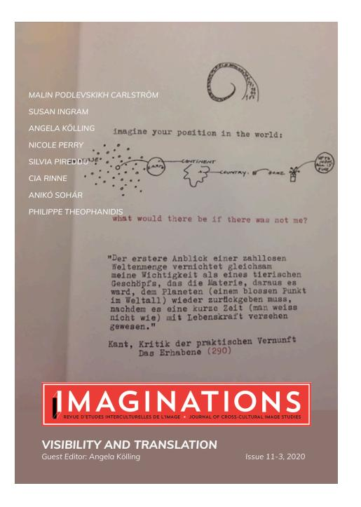
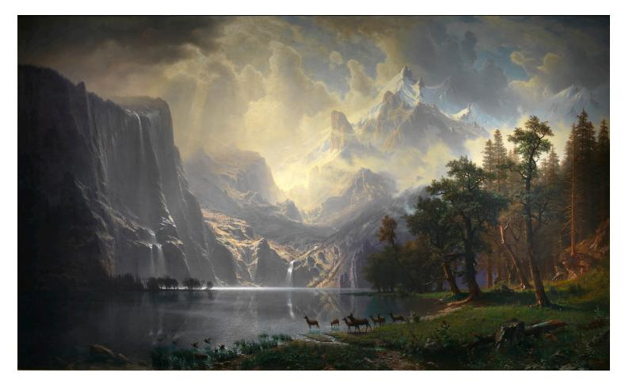
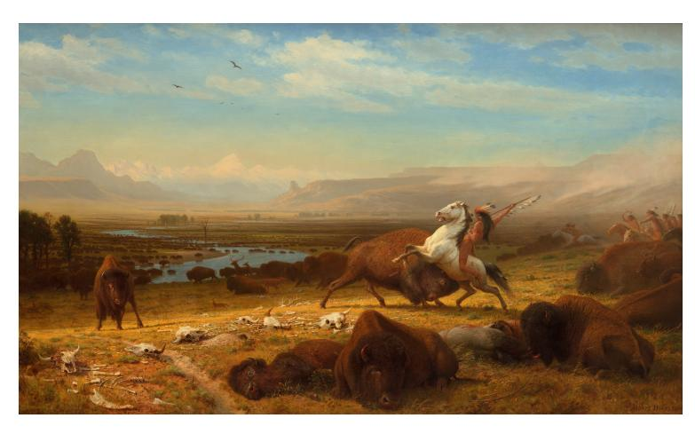

IMAGINATIONS: JOURNAL OF CROSS-CULTURAL IMAGE STUDIES | REVUE D'ÉTUDES INTERCULTURELLES DE L'IMAGE

Publication details, including open access policy and instructions for contributors: [http://imaginations.glendon.yorku.ca](http://imaginations.glendon.yorku.ca/)

# **Visibility and Translation** Guest Editor: Angela Kölling December 31, 2020

Image Credit: Cia Rinne, *Das Erhabene* (2011)

To cite this article:

Perry, Nicole. "Translating the "Dead Indian": Kent Monkman, Miss Chief Eagle Testickle, and the Painting of the American West." *Imaginations: Journal of Cross-Cultural Image Studies*, vol. 11, no. 3, Dec. 2020, pp. 79-99, doi: 10.17742/IMAGE.VT.11.3.4.

To link to this article: <http://dx.doi.org/10.17742/IMAGE.VT.11.3.4>

The copyright for each article belongs to the author and has been published in this journal under a [Creative](https://creativecommons.org/licenses/by-nc-nd/4.0/) [Commons 4.0 International Attribution NonCommercial NoDerivatives](https://creativecommons.org/licenses/by-nc-nd/4.0/) license that allows others to share for non-commercial purposes the work with an acknowledgement of the work's authorship and initial publication in this journal. The content of this article represents the author's original work and any third-party content, either image or text, has been included under the Fair Dealing exception in the Canadian Copyright Act, or the author has provided the required publication permissions. Certain works referenced herein may be separately licensed, or the author has exercised their right to fair dealing under the Canadian Copyright Act.

# **TRANSLATING THE "DEAD INDIAN": KENT MONKMAN, MISS CHIEF EAGLE TESTICKLE, AND THE PAINTING OF THE AMERICAN WEST**

NICOLE PERRY

This article examines the work of Kent Monkman, an artist of Cree ancestry, and his Indigenous interventions into art of the American West. Known for his provocative and highly sexualized genre, Monkman, along with his gender fluid alter ego and companion, Miss Chief Eagle Testickle, have been upsetting the art world for more than a decade. By using Thomas King's (Cherokee) concept of the "Dead Indian", I examine how Monkman's work revitalises Indigenous histories and places them in the centre of the paintings by the 19th-century German-American artist of the American West, Albert Bierstadt. By repurposing the scene, Monkman translates the images from anachronistic settler-colonial narratives and uses these images from the past to highlight Indigenous narratives of the American West.

Cet article examine l'oeuvre de Kent Monkman, un artiste d'origine cri, et ses interventions indigènes dans l'art de l'Ouest américain. Connu pour son genre provocateur et hautement sexualisé, Monkman, accompagné de son alter-ego et compagnon, Miss Chief Eagle Testickles dont l'identité de genre est fluide, bouleverse le monde de l'art depuis plus d'une décennie. Utilisant le concept (cherokee) de "l'Indien mort," j'examine comment l'oeuvre de Monkman revitalise les histoires indigènes et les place au centre des tableaux d'Albert Bierstadt, l'artiste américain d'origine allemande, peintre de l'Ouest américain. En changeant le message de la scène, Monkman offre une nouvelle traduction des images de narrations anachroniques des colons-immigrants et réapproprie ces images du passé pour illustrer les narrations indigènes de l'Ouest américain.

"Those who wish to study the splendour of the European Male in his original state must travel far and wide to see him."

Miss Chief Eagle Testickle, Wanderings of an Artist (2007)

C ree artist Kent Monkman is one of North America's most prolific Indigenous artists. He is also one of the most controversial. A recent painting, Hanky Panky (2020), has drawn stark commentary, both positive and negative, for his portrayal of and commentary on the missing and murdered Indigenous women and girls (MMIWG) in Canada. While lauded by some for its brazen approach—Prime Minister Justin Trudeau is pictured bent over with his pants around his knees awaiting a "consensual act"—Hanky Panky has also drawn scrutiny for its depiction of Cree women on the periphery of the painting, laughing as they watch the male-centred spectacle (Angeleti; Grabish).[1](#page-22-0) The portrayal of the women, whom he calls the okihcitâwiskwêwak, or the traditional council of Cree women law keepers, has been called disrespectful (Grabish), as has the portrayal of, and lack of clear boundaries surrounding, violent sex (Martin). His Indigenous critics belong to Indigenous trans communities, work with victims of sexual assault, and are relatives of women who have been murdered (Porter; Grabish), while prominent male supporters such as Senator Murray Sinclair have supported the painting as a reversal of the victims and victimizers (Porter). Monkman's work is polarising, it always has been, and although Hanky Panky can be considered one of his most controversial paintings, it is in keeping with the provocative, highly sexualized trajectory of his oeuvre. [2](#page-22-1) Monkman's artistic reputation rests on his pushing the boundaries of the acceptable, revisiting Western genres of art and using his work to tell a different story as he sexualizes, decolonizes, and Indigenizes the Western canon across a multitude of mediums, including painting, performance, installation, film, and video. And he works as an agent of change in the contentious political landscape surrounding the representations of North American Indigenous peoples. Through his heady and often polemical body of work, he inserts Indigenous histories and content into the Euro-American

discourse on North America, bringing Indigenous voices to the forefront so that they can be recognized.

Monkman's artistic alter ego, the gender fluid Miss Chief Eagle Testickle, who has been called a "trickster in drag" (Amos) and a "Postindian diva warrior" (McIntosh 12), has been central to his project of subverting and recasting the gaze of the coloniser. [3](#page-22-2) As an artist, Monkman sees his responsibility as twofold: to act as both the creator and translator of his work, something that can at times have unintended results, as with Hanky Panky. In order to demonstrate how Monkman uses his art to translate stories of Indigenous North America so that they can be inserted into its hegemonic art discourse and provoke uncomfortable, long overdue conversations, I examine two of Monkman's (re)paintings of the American West. Each highlights the tension between the historical legacies of the original works and Monkman's Indigenous remasterings, and each features Miss Chief. In both paintings Monkman repaints landscape scenes by the German-American Albert Bierstadt. Canonical 19th-century Western American painters such as Bierstadt, George Catlin, and the sculptor James Earle Fraser are known for creating a hegemonic version of the West, setting the tone in portrayals of Indigenous characters and predetermining the story of the American West from its beginning. Monkman's translations of Bierstadt's original scenes, which exude the serenity and vastness of the American West and showcase a Euro-American nostalgia for the supposedly soon-to-be-extinct Indigenous way of life, expose the gaps in (art) history and disrupt the anachronistic image of Indigenous peoples in North America that Thomas King (Cherokee) has named the "Dead Indian." After outlining King's "Dead Indian" argument about how canonical representations situate Indigenous subjects as neo-romantic, nostalgic images in a state of victimry, I analyze The Trappers of Men (2006), Monkman's repainting of Albert Bierstadt's Among the Sierra Nevada, California (1868), and The Death of Adonis (2009), his reimagining of Bierstadt's iconic The Last of the Buffalo (1888). I show how Monkman updates the 19th-century "Dead Indian" image for the 21st century by featuring a scene-stealing, and very much alive, Miss Chief. As Monkman recentres the gaze in his paintings to

highlight previous erasures of Indigenous histories, I argue that he is also reflecting on North America's fascination with, and need for, the "Dead Indian" as one of its founding myths and legacies. Ultimately his work demands that audiences acknowledge contemporary Indigenous peoples, thereby giving visibility and a platform to contemporary Indigenous issues.

# **THE CREATION AND MUSEALIZATION OF THE INDIAN AS IMAGE**

K ing explores the "Dead Indian" trope in his award-winning The Inconvenient Indian: A Curious Account of Native People in North America (2012). In this analysis, King identifies three types of Indian: Dead, Live, and Legal. Legal Indians are those who are recognized as being "Indians" by the Canadian and US governments (68), while Dead Indians and Live Indians are distinguished as follows: "Dead Indians are dignified, noble, silent, suitably garbed. And dead. Live Indians are invisible, unruly, disappointing. And breathing. One is a romantic reminder of a heroic but fictional past. The other is simply an unpleasant, contemporary surprise" (66, emphasis mine). Through his wit and humour, King highlights two important vectors along which Indians are categorized: visibility vs. invisibility and expectations vs. reality. His work has a synergy with Daniel Francis's 1992 The Imaginary Indian: The Image of the Indian in Canadian Culture, which summarises the sentiment of generations of Euro-American writers and artists who have critically engaged with the unstable and contradictory image of North America's Indigenous peoples. As Francis explains, "The Indian began as a White man's mistake, and became a White man's fantasy. Through the prism of White hopes, fears and prejudices, indigenous Americans would be seen to have lost contact with reality and to have become 'Indians'; that is, anything non-Natives wanted them to be" (5). He highlights that "the Indian" is a neo-romantic archetype, a flat character that reflects, first, the Enlightenment concept of Nature's gentleman and, later, in the 19th century, the ignoble savage. The image of "the Indian" thus came to embody the fatalistic view that Indigenous peoples and their way of life were not congruent with the dom-

inant North American society of colonial expansion and Manifest Destiny. While the paradigm of the noble and ignoble savage has been used to reflect, often concurrently, the hopes and fears of the dominant Euro-American societies, it has also focussed exclusively on Euro-American discourses, ignoring Indigenous worldviews, rendering Indigenous peoples as invisible by presenting an inconsistent and paradoxical notion that highlighted either the noble or the savage of the term to reflect political and societal tensions in the dominant culture. These terms lacked, and indeed worked to prevent, Indigenous agency and content. King's argument situates and builds on the works of scholars such as Gerald Vizenor (Fugitive Poses; Manifest Manners; Narrative Chance; "Trickster Discourse"), Arnold Krupat (The Turn to the Native), and Philip Deloria (Indians in Unexpected Places; Playing Indian) and their broader arguments regarding Indigenous (in)visibilities in both historical and contemporary contexts. These influential arguments paved the way for a younger generation of Indigenous scholars, including Audra Simpson (Mohawk Interuptus; Theorizing Native Studies), Leanne Betasamosake Simpson (As We Have Always Done), and Daniel Heath Justice (Why Indigenous Literatures Matter), to go beyond the simplistic binaries of visible and invisible regarding Indigenous identities and to complicate and expose narratives of settler colonial legacies and Indigenous sovereignty.

As this scholarship has also established, the "Dead Indian" image is anything but dead and is still capable of evoking a host of debilitating ideas and stereotypes. A 2019 exhibition currently ongoing at the Smithsonian National Museum of the American Indian and simply entitled Americans examines the complicated history of Indigenous (North) Americans in popular culture and the legacy of invisibility. The online portal poses the question: "How is it that Indians can be so present and so absent in American life?" (Americans). The exhibition is divided into four subsections and explores how, even though Indigenous Americans represent less than 1% of the population, Indigenous culture still permeates the United States and the legacies created that continue to function as its founding myths: from Thanksgiving and Pochahontas to the Indian Removal Act and

the Battle of Greasy Grass/ Little Big Horn (Americans). Rich C. King in his work redskins: Insult and Brand (2016) explores the problematic branding of sports teams such as the titular National Football League (NFL) team from Washington, and how these logos, epithets, imagery, and specifically, a single word can influence and damage a marginalized population. On July 13, 2020, after a review taken in the light of the racial upheaval in the United States following the murder of George Floyd by police officers in Minneapolis, Minnesota and other victims of systemic violence, the owner of the team decided to retire the derogatory name after many years of controversy and public outcry ("Statement"). The Edmonton team of the Canadian Football League (CFL) has similarly indicated that, after an internal discussion, the team will also change their name. Not only sports mascots, but the Western film genre, advertising, and marketing are examples of the use and function of the "Indian" in North American culture. The diffuseness of these tropes exposes the racist blind spot that allows for the "Dead Indian" to be both present and absent in contemporary North American life.

This tension continues to generate controversy. A plenary given at the Society for Historians of the Early American Republic (SHEAR) erupted into a twitter debate when Rebecca Goetz represented Daniel Feller as arguing that Andrew Jackson's legacy in regard to the Indian Removal Act (1830) and other acts of genocide, was not "as bad" as we think (Goetz).[4](#page-22-3) In relation to the art and art history of the American West, painters, sculptors, and photographers of the late-19th and early-20th century rushed to preserve the last remnants of the "dying" Indigenous cultures, a trope that that situates Indigenous peoples in the role of victim. Edward Curtis's photographs are a prominent and visual representation of this process. Typically dressed in traditional clothing and often posing for pictures in studios, the Indigenous people who sat for his photographs were consistently depicted as the cultural archetype of the "Dead Indian," the defeated warrior riding his tired horse west as articulated in James Earle Frasier's sculpture End of the Trail (1918). Originally understood to be a tribute to Indigenous peoples, the works of both Curtis and Frasier have contributed directly to the ahistorical image of North

American Indigenous cultures. These images clearly situate Indigenous peoples as relics of the past, and settler culture made a point of "celebrating" Indigenous society at the very moment when it was seen to have been effaced.

# **MONKMAN AND THE POSTINDIAN**

A s the Smithsonian's Americans exhibition proves, the romanticised, nostalgic, and loaded image of the "Dead Indian" remains entrenched in the American imaginary, one of "White North America's signifiers of Indian authenticity" (King 55). However, contemporary Indigenous responses have begun to reclaim the image and challenge its harmful, neo-romantic elements through a variety of multimedia platforms. Kent Monkman is one such artist. In re-appropriating the appropriation of Indigenous images, Monkman draws attention to the constructed nature of deeply rooted, cultural stereotypes. By adding his voice and creating conversations, especially controversial ones, Monkman forces his viewers to engage critically with their attitudes towards North American Indigenous peoples and contemplate how far paintings should be regarded as artefacts of history. In speaking of his work, Monkman expresses "a desire to look at history as it was written by Europeans, but to look at it through an Aboriginal lens" (qtd. in Gonick), something all the more necessary because "[m]odernity espoused a willful amnesia about the past" (Milroy 76).

Monkman plays with King's "Dead Indian" trope by exposing the gaps in, and conventions associated with, the image. King calls the trope a simulacrum that represents something that never existed. Here, he borrows from Anishinaabe scholar Gerald Vizenor, who, in coining the term "native survivance," has noted the Euro-American narrative does not recognize an Indigenous presence. Vizenor underscores the othering that is invoked with the term Indian, as it indicates an absence of natives, whereas "natives are a native creation" and thus "the stories of survivance" (Vizenor, Fugitive Poses 27). The indigene is the noble savage, passive and anachronistic while the ab-

sence of natives represents the space between and the commodification of Indigeneity.

This absence allows the "Dead Indian" to represent the needs of mainstream society, a representational void of Indigenous content. By using the coloniser's terms of indians and indigene, Vizenor emphasizes the tropes associated with ignoble and noble savagery, concepts both passively and deeply entrenched in 18th- and 19th-century discourses and ignorant of (contemporary) Indigenous issues. King's argument about the imposter-like status of "Dead Indian" culture in North America when juxtaposed with contemporary Indigenous cultures highlights the instability, inconsistencies, and even more importantly, the staying power of the "Dead Indian" image (75). Native survivance explains why artists like Monkman act as crucial agents of change in challenging these tropes. For Vizenor, the action of indicting the dominant culture is a key aspect of survivance. It "is more than survival, more than endurance or mere response; the stories of survivance are an active presence… The native stories of survivance are successive and natural estates; survivance is an active repudiation of dominance, tragedy and victimry" (Vizenor, Fugitive Poses 15). In connection with the active presence and agency of native survivance, Vizenor coined another term: postindian. The postindian is another indictment of the dominant discourse surrounding the term Indian. In Postindian Conversations (1999), Vizenor returns to the ideas expressed in Fugitive Poses regarding survivance and simulations, and in conversation with A. Robert Lee he argues that "we are long past the colonial invention of the indian" (Vizenor and Lee 84). Drawing on poststructural philosophy, Vizenor's postindian reflects an Indigenous presence, one that visibly acknowledges tribal identity, affiliations, and diversity among North American Indigenous peoples and resists artificial or blanket names given by the dominant society.

Monkman's work can be understood as an act of native survivance as he reconfigures through his Indigenous lens paintings, images, and forms from varying Euro-American art movements, including neoclassicism, American Western art, and landscape painting, to focus explicitly on Indigenous histories. But Monkman puts his own spe-

cial "post" stamp on Vizenor's postindian. Accompanying Monkman on his journey to reframe and challenge the dominant understandings of North American history is his alter-ego, the dangerously beautiful, gender fluid trickster figure, Miss Chief Eagle Testickle, whose name is a play on both the words mischief and egotistical as well as the male sex organs. Including an homage to the singer Cher, Miss Chief's name originally included Share, Monkman highlighting the "half-breed" phase of Cher's career in the 1970s (Katz 19). With Louis Vuitton quivers, raccoon jock straps, and an expensive taste in champagne, Miss Chief decolonizes postindian gender and sexuality with pomp and grandeur. In September 2017, for example, her "creative union" with the French fashion designer Jean Paul Gaultier was filmed as a wedding video at Montreal's Musée des Beaux Arts (Monkman "Another Feather in her Bonnet"). Miss Chief's gender fluidity "reminds us that the making of history is a fluid and subject process that entails constant inquiry and reevaluation," as does Monkman's work in general (Madill 28). By adding Miss Chief to the narrative, Monkman destabilizes the gaze of settler-colonial viewers. Narratives including the settling of the West are viewed from a different perspective. Gerald McMaster (Cree) observes:

We don't see the rape of the (feminine) landscape by the masculine newcomer; instead we see how Monkman, via Miss Chief/the Aboriginal male, reverses the power relations. S/he toys with the European in a sexualized way that doesn't demasculinize him but rather plays against the historic-hetero discourse. This is how we should read Monkman's work, because he embarks on a new trajectory by forcing new readings of the so-called American landscape. (McMaster 96)

This nuanced reversal of power relations forces viewers to reconsider their understandings of North American history in light of the Indigenous viewpoint. The visibility of different narratives surrounding both North America and the idea of "the West" leads to a more complex and intricate reading of histories surrounding the founding myths of North America.

# **REPAINTING THE MASTERS, TRANSLATING BIERSTADT**

M onkman's landscape-painting oeuvre is extensive, with the majority of his early work stemming from his visual retellings of the story of the 19th-century American West. While for his exhibition at the Metropolitan Museum of Art he did not repaint American West landscape paintings, Monkman did reinterpret Emanuel Leutze's Washington Crossing the Delaware (1851), a seminal portraiture of US American history. Masterfully, if ironically, his landscapes offer narratives that with the help of Miss Chief, her followers, and lovers refigure the buffalo, deer, and the "Dead Indian" in the works of the 19th-century Euro-American writers and artists, who, as we saw above, attempted to preserve and remember Indigenous peoples of North America.

Fig. 1: Bierstadt, Albert. *Among the Sierra Nevada, California*. 1868.

Monkman's 2006 [The Trappers of Men](https://www.mbam.qc.ca/en/works/43822/) is a reinterpretation of Albert Bierstadt's 1868 Among the Sierra Mountains. Bierstadt's painting, which is oil on canvas and hangs in the Smithsonian American Art Museum, was painted in his studio in Rome, Italy. Capitalizing on the European fascination with North America and the American West, Bierstadt was known for his showmanship and business acumen as

well as his work. Paintings such as Among the Sierra Mountains were romanticized conceptions of the American West intended to sell on the European market. They were also a source of inspiration for new immigrants to America, which was viewed as the land of opportunity, promise, and above all in the West: space, portrayed as wild and untamed nature, devoid of any human population. The painting does not include an Indigenous voice, nor was it meant to—it is a European romanticised notion of the American West targeting a Euro-American audience. The canvas is a peaceful, idealized landscape, and the foreground is replete with deer on the shore of a calm lake as ducks fly off into the air. To the left a large waterfall is emptying into the lake with the powerful presence of the mountains framing the background of the painting, with a smaller, secondary waterfall in the middle of the scene. The lighting contributes to the soft glow reflecting off the mountains at sunset and solidifies the romantic notions found in the painting.

Monkman's acrylic on canvas version, which is part of the Montreal Museum of Fine Arts collection, resets time and substitutes the animals from Bierstadt's painting with prominent characters in North American (art) history, emphasizing the prevailing European notion of Indigenous peoples' romanticized relationship to nature and underscoring that often Indigenous peoples were used interchangeably or synonymously with animals such as buffalo and viewed as on par with them. Monkman's painting is set at midday, which, as Melissa Elston notes, is an obvious rejection of Bierstadt's sunset, a common motif in 19th-century paintings used to symbolise the settling of the American West as the end of an era leading to the dawn of another (188). In the foreground to the right the great explorers Lewis and Clark are consulting a map, while a semi-nude cowboy seems to be helping them. The Yanktonais winter count keeper, Lone Dog, is working on the winter count that bears his name, and although not historically accurate in regard to the production of Bierstadt's painting, this winter count is from the year the Lakota defeated Custer (1876) at the battle the Lakota call of the Greasy Grass but which is more commonly known as the Battle of the Little Bighorn.[5](#page-22-4) As Monkman explains, this image displaces events deemed important

or even legendary by Europeans, which the Lakota viewed as trivial or insignificant (Timm). To the left of Lone Dog and the wayward explorers, we find Jackson Pollack and Piet Mondrian, both abstract artists but at opposite ends of the abstract art spectrum. Pollack, who was born in Cody, Wyoming, and died at the age of 44 as a result of an alcohol-related single-car accident, is shown holding a bottle of alcohol while he drags Mondrian away from the abstract painting he is working on. Or is he catching Mondrian as he faints after seeing Miss Chief? Alexander Mackenzie is to the right of the painters. Mackenzie, who completed the first crossing of America from east to west 12 years before Lewis and Clark, is trying to calm the rearing horse Whistlejacket, based on a painting by George Stubbs in 1762. Belonging to the Marquess of Rockingham, Whistlejacket was an aristocratic racehorse that Stubbs painted to perfection, highlighting the beauty of the Arabian thoroughbred (Rosenthal). By including the racehorse and the British explorer Mackenzie as he tries to control the rearing and untamed beast from the Orient, Monkman's painting calls attention to the complicated global legacies of colonialism, exoticism, and Indigeneity. The rest of the right-hand side of the canvas consists of half-naked cowboys, George Catlin and one of his portraits on the grass beside Lone Dog and then a Canadian moniker in the painting: a Hudson's Bay point blanket, resting between him and a half-naked RCMP officer along with an Indigenous man smoking a pipe. [5](#page-22-4) Edward Curtis, located front left, is taking contrived photos of two Indigenous men, who have removed their long hair and feathers but are wearing pink lipstick, indicating a fluidity of sexuality and an indictment of the hypermasculinity associated with both the "Dead Indian" and Curtis' work. But Curtis has turned from his work to view the true spectacle of the piece, Miss Chief Eagle Testicle, as she rises out of the water in a style reminiscent of Botticelli's The Birth of Venus (1485-1486). Blonde, naked, erect, and in pink high heels, Miss Chief stares seductively at the men in the front right of the painting, all of whom have stopped what they are doing to gaze at the wonder rising from the water. Miss Chief is the "Trappers of Men," a gender fluid figure whose re-enactment of The Birth of Venus is an example of Monkman's provocative playing with canonical European

art works. Unrivalled in her salacious beauty, she is representative of the other trappers of men, who, like Miss Chief, slip between the Euro-American understandings of sexuality, enticing the cowboy as he travels West. The Birth of Venus is widely understood as an iconic image embodying the essence of classic, virginal female beauty. In situating Miss Chief as the focal point of The Trappers of Men, Monkman translates the chaste, divine love the classical goddess represents into a wanton erotic appeal that departs from the heteronormative discourse traditionally found in Western art.

Monkman's canvas is large at 213.4 cm x 365.8 cm (84" x 144"), but there is no second guessing the main focal point of the scene. Surrounded by her friends, lovers, and aspiring lovers, Miss Chief commands the setting as the mountains seem to fade into the background and every character is watching in wonder at her emergence from the lake. This signals the making visible of repressed histories, both Indigenous and queer, absent in the traditional genres of art, history, and the mythology of the West. Bierstadt's painting emphasizes the absence of (white) people, showing a serene setting, waiting to be explored and settled. Unlike The Last of the Buffalo, to which I turn next, Trappers of Men does not showcase the violence and atrocities that took place in the settling of the American West. Rather, it populates the false histories Bierstadt promulgated to fulfill the expectations of viewers on the Eastern seaboard or in Europe, far removed from the realities of the American West. Trappers of Men works to subvert the mythology of the West as open and empty by recasting and reversing the gaze to subvert Euro-American norms and expectations of art history and history.

Fig.2: Bierstadt, Albert. *The Last of the Buffalo*. 1888.

The second Bierstadt painting of interest here that Monkman has reworked is the 1888 oil on canvas Last of the Buffalo, a painting that I saw when at the Buffalo Bill Center of the West in Cody, Wyoming. Immediately, I was struck by the power of the scene: the decimation and carnage of the buffalo carcasses with the arresting landscape in the background, together with the lone warrior, his spear raised as his horse is gored by one of the remaining buffalo. It represented to me the romanticisation of the American West, the understanding that the frontier was now closed, with the buffalo and warrior remnants of an era now firmly situated in the past. Called Bierstadt's "final, great, western painting" (National Gallery of Art), it is also one of Bierstadt's most famous, as well as an iconic example of 19th-century art of the American West. The title of the painting is a clear reference to the expected extinction of the plains buffalo, together with the Indigenous peoples and their traditional way of life. Buffalo were essential to the survival of many Indigenous tribes, and the settler expansion of the West coupled with excessive overhunting and the intentional destruction of the buffalo as a policy to destroy them as a source of food and clothing for Indigenous populations led to the rapid decrease in buffalo numbers and left Plains Indian tribes

decimated. Bierstadt's painting explicitly highlights the "Dead Indian" trope along with the annihilation of the buffalo, from approximately 30 million at the turn of the 19th century to 1,000 by 1888. The foreground of the painting is littered with buffalo skulls, carcases, a dead horse, and an Indigenous warrior beside a seemingly melancholy buffalo resting with its head on its hooves after killing the hunter, while another buffalo stands alone on the left watching the main action of the painting, ready to defend itself. A lone warrior on a white horse with his spear raised is ready to attack a buffalo in the process of gorging the underbelly of his horse. To the right in the background there are other figures hunting buffalo, with the same steely resolve as the protagonist of the painting. The nearly extinct buffalo and the nearly extinct hunter in his traditional dress and hunting style represent the impending closing of the frontier from a hyper-romanticized and nostalgic perspective. In the middle of the painting, buffalo are seen crossing the river, moving west away from the encroaching settler, and plentiful in number – a direct contrast to the reality of the time. In the background the plains give way to a river basin, and finally snow-capped peaks can be seen in the distance, implying the seemingly endless unoccupied space and freedom of the West itself.

Monkman's 2009 [Death of Adonis](https://www.artsy.net/artwork/kent-monkman-death-of-adonis) re-envisions this Bierstadt painting. Adonis' death is a well-utilized scene in art history with masters such as Peter Paul Ruebens (1614) and Benjamin West (1768) offering interpretations of the ancient Greek myth. Adonis was the son of Myrrha and her father, King Cinyras of Cyprus, after Aphrodite had cast a spell on Myrrha, tricking her into the liaison. Adonis was raised by Persephone, the Queen of the Underworld, and became a beautiful young man, which led Persephone and Aphrodite to fight over him. Zeus settled the matter, having Adonis spend a third of his time with Persephone, a third with Aphrodite, and the final third with whomever he pleased, which he spent with Aphrodite. One day while out hunting, Adonis was charged by a wild boar and died in Aphrodite's arms. Their tears mixed together, creating a fast-growing flower. The central idea of the myth is the death and resurrection of Adonis, which, like the flower, is representative of the change of

seasons. Monkman inserts the Greek myth into the 19th-century romanticised painting of the American West to create a sexualized subversion of both myth and painting.

Monkman's repainting of the Bierstadt canvas seemingly effortlessly recaptures the essence of the original. The buffalo carcasses and skulls remain, as do the myriad of buffalo crossing the river in the middle of the canvas and the expansive sky and snow-capped mountains in the distance. The warrior in Bierstadt's painting is replaced, however, by quite possibly a more accurate historical representation: that of a white cowboy on a horse being gorged by a buffalo. The spear is also replaced with a rifle that has been fired into the far right of the canvas as the rider loses his balance while trying not to fall off the horse, arguably shooting his comrade in the middle right of the work. This is an interesting departure from Bierstadt's painting. The warrior of the original displays expert horsemanship and resolve, as he is completely concentrated on the buffalo. Monkman's cowboys in the background seem to lack their Indigenous counterparts' skills. In the front right of Death of Adonis, the two main characters draw the viewer's eye: a cowboy holding a rifle in his right hand with his shirt open, displays his mortal wound as his lover, Miss Chief Eagle Testickle, dressed in a sheer pink loincloth and thigh-high pink stiletto boots, holds him and seems to stare regretfully at the buffalo behind her, perhaps at the one that gored her lover, almost as if she has to choose between the two. The cowboy boot laying metres from the body indicates that it was the buffalo that took his life, knocking him off his feet. The lone buffalo of Bierstadt's painting is depicted in the same aggressive stance in Monkman's reworking, prepared to charge if provoked, while the dead warrior is replaced by a calf, perhaps suggesting the continuity of life. The melancholy buffalo remains front-centre, possibly as the perpetrator of Adonis's death.

By replacing the warriors with cowboys and adding the lovers Miss Chief (Aphrodite) and Adonis, and Miss Chief's ambiguous stare at the melancholy buffalo, Monkman breathes life into a quintessential image that has traditionally been accepted as representing the demise of an entire species and way of life. Even the title Death of Adonis challenges and forces the dominant discourse to acknowledge the resilience of Indigenous peoples. The Last of the Buffalo is still considered an iconic piece, one which Monkman has translated in a way that privileges Indigenous ways of life and includes his genderfluid, postindian diva-warrior.

### **CONCLUSION**

W hat one sees in these two Monkman paintings is his sophisticated, playful approach to translation, recreating Indigenous experiences, stories, and cultures that contradict, indict, and deconstruct the dominant framework of canonical Euro-American (art) history. His work represents a shifting of the picture, a re-telling of histories, and a re-enlivening of the "Dead Indian" trope. By using European mythologies, understandings, and romanticizations of the American West, Monkman is using the colonisers' tools against them. As he creates different visualities regarding settler-indigenous relations in North America, Monkman shows the viewer how much still remains to be done to bring Indigenous histories to light and life. His work is not meant to be all-encompassing of Indigenous identities but rather to encourage further retranslations in the spirit of Miss Chief holding a mirror to settler-colonial narratives of the American West. While Monkman may have overstepped in Hanky Panky, he was quick to acknowledge that it did "fail in its message to address the victimisation of Indigenous women" (Angeleti), but this is understandable as his work has not been about translating past wrongs. Rather, as the analysis here shows, Monkman's talent for translation involves finding adequate images from the past to repurpose for the present, and doing so has the potential to relegate King's "Dead Indian" image to the past, where it belongs.

### **WORKS CITED**

Americans. National Museum of the American Indian. Smithsonian, [https://americanindian.si.edu/americans/#.](https://americanindian.si.edu/americans/) Accessed 10 July 2020.

- Amos, Robert. "Trickster in Drag Upends Colonial View." Victoria Times Colonist, 10 June 2010, [https://static1.squarespace.com/static/](https://static1.squarespace.com/static/5489c5f0e4b0cf16a8c043fd/t/548f03d7e4b0b33049349fc4/1418658775447/timescolonist-june10.pdf) [5489c5f0e4b0cf16a8c043fd/t/548f03d7e4b0b33049349fc4/](https://static1.squarespace.com/static/5489c5f0e4b0cf16a8c043fd/t/548f03d7e4b0b33049349fc4/1418658775447/timescolonist-june10.pdf) [1418658775447/timescolonist-june10.pdf.](https://static1.squarespace.com/static/5489c5f0e4b0cf16a8c043fd/t/548f03d7e4b0b33049349fc4/1418658775447/timescolonist-june10.pdf) Accessed 22 July 2020.
- Angeleti, Gabriella. "Kent Monkman Issues Apology for Painting that Depicts the 'Sexual Assault' of Canadian Prime Minister Justin Trudeau." The Art Newspaper, 26 May 2020, [https://www.theartnewspaper.com/](https://www.theartnewspaper.com/news/kent-monkman-regrets-work-showing-sexual-assault-of-canadian-prime-minister-justin-trudeau) [news/kent-monkman-regrets-work-showing-sexual-assault-of-canadi](https://www.theartnewspaper.com/news/kent-monkman-regrets-work-showing-sexual-assault-of-canadian-prime-minister-justin-trudeau)[an-prime-minister-justin-trudeau.](https://www.theartnewspaper.com/news/kent-monkman-regrets-work-showing-sexual-assault-of-canadian-prime-minister-justin-trudeau) Accessed 12 July 2020.
- Brooks, Katherine. "Kent Monkman, Aka Miss Chief Eagle Testickle, Confronts Native American Myths." Huffington Post, 17 Dec. 2017, [https://www.huffingtonpost.com/2014/05/21/kent](https://www.huffingtonpost.com/2014/05/21/kent-monkman_n_5360583.html)[monkman\\_n\\_5360583.html](https://www.huffingtonpost.com/2014/05/21/kent-monkman_n_5360583.html). Accessed 1 January 2018.
- Deloria, Philip J. Playing Indian. Yale UP, 1994.
- —. Indians in Unexpected Places. UP of Kansas, 2004.
- Elston, Melissa M. "Subverting Visual Discourses of Gender and Geography: Kent Monkman's Revised Iconography of the American West." The Journal of American Culture, vol. 35, no. 2, June 2012, pp. 181-90.
- Francis, Daniel. The Imaginary Indian: The Image of the Indian in Canadian Culture. Arsenal Pump, 1992.
- Gismondi, Melissa. "The Untold Story of the Hudson's Bay Company." Canadian Geographic, [https://www.canadiangeographic.ca/article/untold](https://www.canadiangeographic.ca/article/untold-story-hudsons-bay-company)[story-hudsons-bay-company.](https://www.canadiangeographic.ca/article/untold-story-hudsons-bay-company) Accessed 22 July 2020.
- Goetz, Rebecca Anne (@historianess). "Feller opened with comments on Trump and Jackson, with the implication that attaching AJ to Trump was distorting AJ and his context. I was willing to go along with the premise until Feller insisted that AJ's record on Native people was not as bad as we think. 4/" Twitter, 18 July 2020, 8:11 am [twitter.com/histo](https://twitter.com/historianess/status/1284459556068876289)[rianess/status/1284459556068876289.](https://twitter.com/historianess/status/1284459556068876289) Accessed 22 July 2020.
- Gonick, Noam. "Contempo Abo: Two Spirit in Aboriginal Culture." Canadian Dimension, 30 June 2009, [https://canadiandimension.com/articles/](https://canadiandimension.com/articles/view/contempo-abo) [view/contempo-abo](https://canadiandimension.com/articles/view/contempo-abo). Accessed 1 January 2018.
- Grabish, Austin. "Artist Kent Monkman's Painting of Partially Nude Trudeau with Laughing Women Creates Uproar Online." Canadian Broadcast Corporation, 21 May 2020, [https://www.cbc.ca/news/canada/manitoba/](https://www.cbc.ca/news/canada/manitoba/kent-monkman-backlash-trudeau-painting-1.5577452)

[kent-monkman-backlash-trudeau-painting-1.5577452](https://www.cbc.ca/news/canada/manitoba/kent-monkman-backlash-trudeau-painting-1.5577452). Accessed 22 July 2020.

- Justice, Daniel Heath. Why Indigenous Literatures Matter. Wilfrid Laurier Press, 2018.
- Katz, Jonathan D. "'Miss Chief is always interested in the latest European fashions.'" Interpellations: Three Essays on Kent Monkman, edited by Michèle Thérault, Concordia University and Leonard & Bina Ellen Art Gallery, 2012, pp. 15-24.
- King, C. Richard. Redskins: Insult and Brand. U of Nebraska P, 2016.
- King, Thomas. The Inconvenient Indian: A Curious Account of Native People in North America. Anchor Canada, 2012.
- Krupat, Arnold. The Turn to the Native: Studies in Criticism and Culture. U of Nebraska P, 1996.
- Madill, Shirley J. "Intelligent Mischief: The Paintings of Kent Monkman." Kent Monkman: The Triumph of Miss Chief, edited by David Liss. Art Gallery of Hamilton, 2007.
- Martin, Nick. "The Provocations of Kent Monkman." The New Republic, 22 May 2020, https://newrepublic.com/article/157742/provocations-kentmonkman. Accessed 12 July 2020.
- McIntosh, David. "Kent Monkman's Postindian Diva Warrior: From Simulacral Historian to Embodied Liberator." Fuse Magazine, vol. 29, no. 3, 2006, pp. 12-23.
- McMaster, Gerald. "The Geography of Hope." Kent Monkman: The Triumph of Miss Chief, edited by David Liss, Art Gallery of Hamilton, 2007, pp. 95-102.
- Milroy, Sarah. "Historic Drag: Kent Monkman's New Show Redresses Colonial Art." The Walrus. 22 April 2014, <https://thewalrus.ca/historic-drag/>. Accessed 14 July 2020.
- Monkman, Kent. "Hanky Panky Apology." Instagram, 18 May 2020, [https://www.instagram.com/p/](https://www.instagram.com/p/CAWuv6ugzVN/?igshid=1x9vb9v4jlaoc) [CAWuv6ugzVN/?igshid=1x9vb9v4jlaoc](https://www.instagram.com/p/CAWuv6ugzVN/?igshid=1x9vb9v4jlaoc). Accessed 15 July 2020.
- —. "Another Feather in her Bonnet." Online video clip. YouTube, 24 January 2019. [https://www.youtube.com/watch?v=8gMwwf1xFpc&ab\\_chan](https://www.youtube.com/watch?v=8gMwwf1xFpc&ab_channel=KentMonkmanStudio)[nel=KentMonkmanStudio.](https://www.youtube.com/watch?v=8gMwwf1xFpc&ab_channel=KentMonkmanStudio) Accessed 20 July 2020.

- Morgensen, Scott Lauria. Spaces between Us: Queer Settler Colonialism and Indigenous Decolonization. U of Minnesota P, 2011.
- Porter, Catherine. "'Genius' or 'Amoral'? Artist's Latest Angers Indigenous Canadians." The New York Times, 28 May 2020, [https://www.ny](https://www.nytimes.com/2020/05/28/world/canada/painting-canada-monkman-trudeau-indigenous.html)[times.com/2020/05/28/world/canada/painting-canada-monkman](https://www.nytimes.com/2020/05/28/world/canada/painting-canada-monkman-trudeau-indigenous.html)[trudeau-indigenous.html](https://www.nytimes.com/2020/05/28/world/canada/painting-canada-monkman-trudeau-indigenous.html). Accessed 22 July 2020.
- Rosenthal, Tom. "George Stubbs, Painter, by Judy Egerton." The Independent, 27 November 2007, [https://www.independent.co.uk/arts-entertain](https://www.independent.co.uk/arts-entertainment/books/reviews/george-stubbs-painter-by-judy-egerton-760030.html)[ment/books/reviews/george-stubbs-painter-by-judy](https://www.independent.co.uk/arts-entertainment/books/reviews/george-stubbs-painter-by-judy-egerton-760030.html)[egerton-760030.html](https://www.independent.co.uk/arts-entertainment/books/reviews/george-stubbs-painter-by-judy-egerton-760030.html). Accessed 22 July 2020.
- Simpson, Audra. Mohawk Interuptus: Political Life Across the Borders of Settler States. Duke UP, 2014.
- Simpson, Audra, and Andrea Smith, editors. Theorizing Native Studies. Duke UP, 2014.
- Simpson, Leanne Betasamosake. As We Have Always Done: Indigenous Freedom through Radical Resistance. U of Minnesota P, 2017.
- "Statement from the Washington Football Team." Redskins, 13 July 2020, [https://www.redskins.com/news/washington-redskins-retiring-name](https://www.redskins.com/news/washington-redskins-retiring-name-logo-following-review)[logo-following-review.](https://www.redskins.com/news/washington-redskins-retiring-name-logo-following-review) Accessed 22 July 2020.
- Timm, Jordan. "Landscape with Sexy Transvestite." Maclean's, 31 December 2007, https://archive.macleans.ca/article/2007/12/31/landscape-withsexy-transvestite. Accessed 12 July 2020.
- Vizenor, Gerald. "Trickster Discourse." Narrative Chance: Postmodern Discourse on Native American Literature, edited by Gerald Vizenor. U of Oklahoma P, 1993, pp.187-212.
- —, ed. Narrative Chance: Postmodern Discourse on Native American Literature. U of Oklahoma P, 1993.
- —. Manifest Manners: Postindian Warriors of Survivance. Wesleyan UP, 1994.
- —. Fugitive Poses: Native American Indian Scenes of Absence and Presence. U of Nebraska P, 1998.
- and Lee, A. Robert. Postindian Conversations. U of Nebraska P, 1999.

## **IMAGE NOTES**

Fig. 1: Bierstadt, Albert. Among the Sierra Nevada, California. 1868. Oil on canvas. Smithsonian American Art Museum, Washington, DC. [https://amer](https://americanart.si.edu/artwork/among-sierra-nevada-california-2059)[icanart.si.edu/artwork/among-sierra-nevada-california-2059.](https://americanart.si.edu/artwork/among-sierra-nevada-california-2059) Accessed December 21, 2020.

Fig. 2: Bierstadt, Albert. The Last of the Buffalo. 1888. Oil on canvas. National Gallery of Art, Washington, DC. [https://www.nga.gov/collection/art-object](https://www.nga.gov/collection/art-object-page.124525.html)[page.124525.html](https://www.nga.gov/collection/art-object-page.124525.html). Accessed December 21, 2020.

# **NOTES**

- 1. Monkman issued an apology on his Instagram account, acknowledging that he did not make the elements of consent clear enough. He removed any reference to the okihcitâwiskwêwak from his painting (Monkman).[↲](#page-3-0)
- 2. Two of the most recent examples, aside from Hanky Panky, are from his Great Hall commission "mistikôsiwak Wooden Boat People" at the Metropolitan Museum of Art in New York, NY, Welcoming the Newcomers (2019) and Resurgence of the People (2019).[↲](#page-3-1)
- 3. The evolution of Miss Chief has been accompanied by multiple labels and terms such as berdache, two-spirit, and most recently gender fluid to expose the inaccuracies of different Indigenous histories found in the dominant discourse. Berdache, for example, is a problematic term that Indigenous activists towards the end of the 1980s called "an erroneous colonial term that represented Native peoples in primordial and generalizing terms, while projecting masculinism and sexualisation onto them" (Morgensen 81). Painters such as George Catlin often chose to ignore two-spirit figures as they were in striking contrast to the heteronormative paradigm of Christian culture, and so they tried to write, or in Catlin's case, paint them out of history.[↲](#page-4-0)
- 4. This passage has been amended from a previous version for clarification.[↲](#page-7-0)
- 5. Yanktonais is one of three language groups that make up Sioux.[↲](#page-13-0)
- 6. The Hudson's Bay point blanket was the Hudson's Bay Company's most traded good when it was at the height of its power in North America. As the HBC expanded west, the blankets were often traded with Indigenous communities and contributed directly to the exposure to diseases such as small pox, from which Indigenous communities were not immune (Gismondi).↲