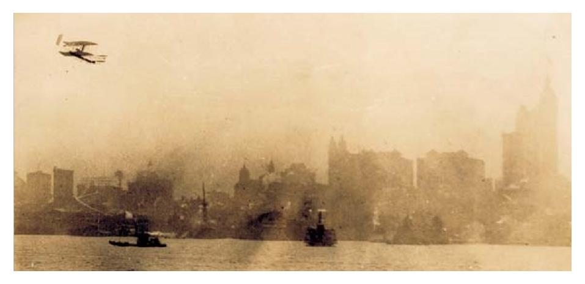
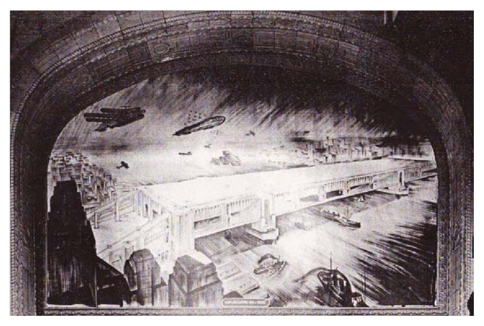
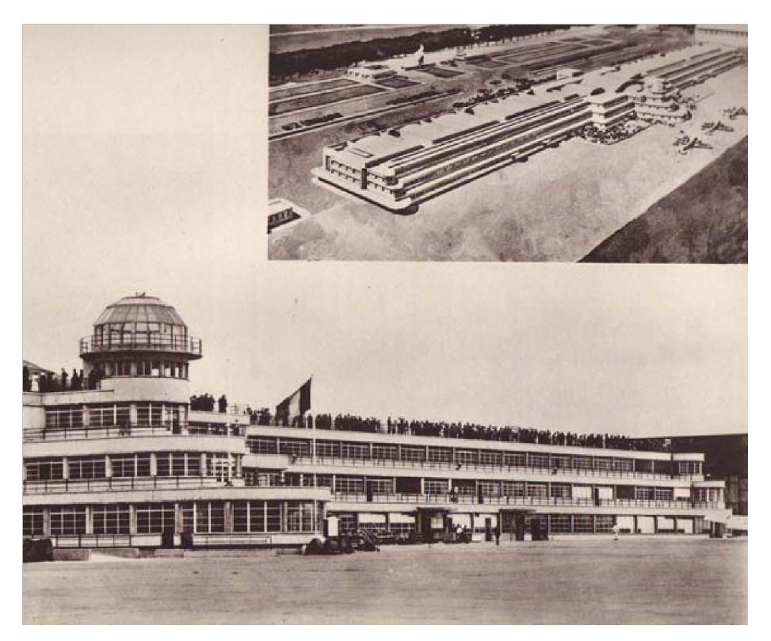
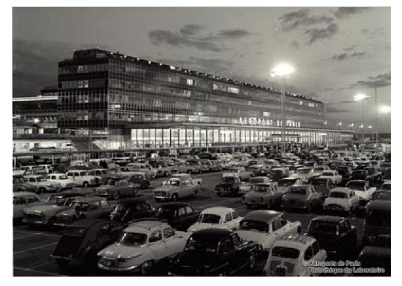
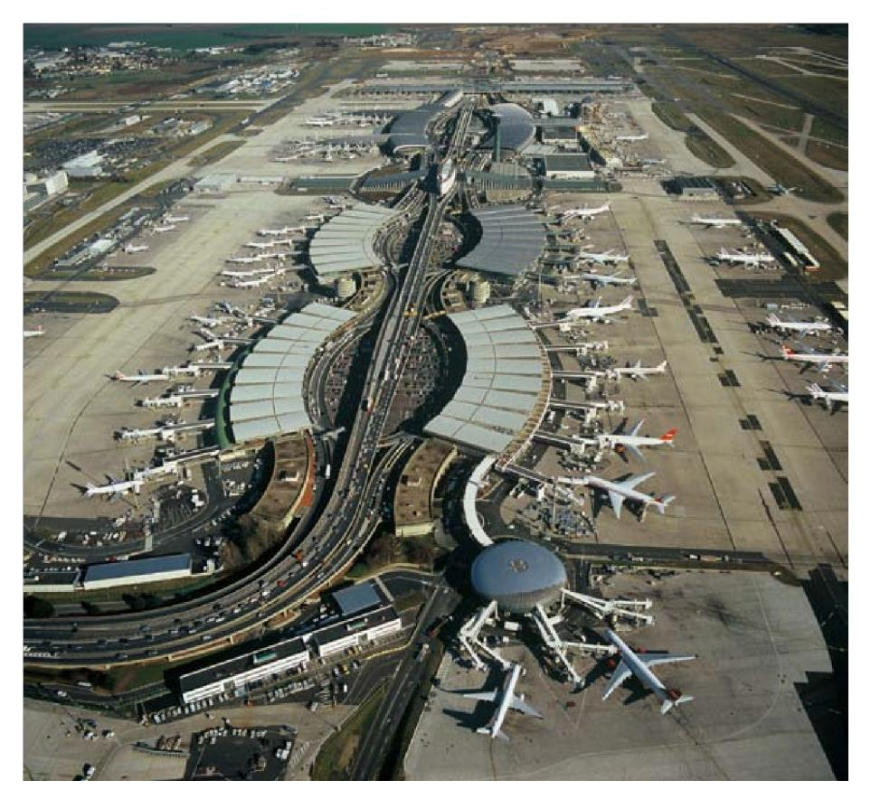
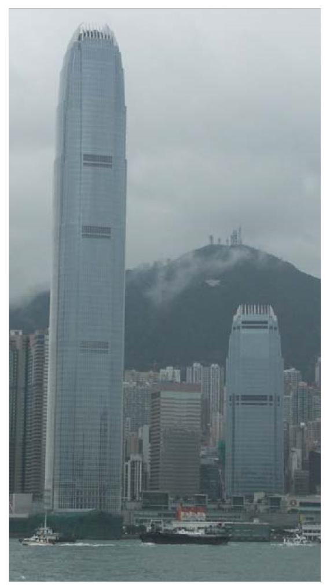
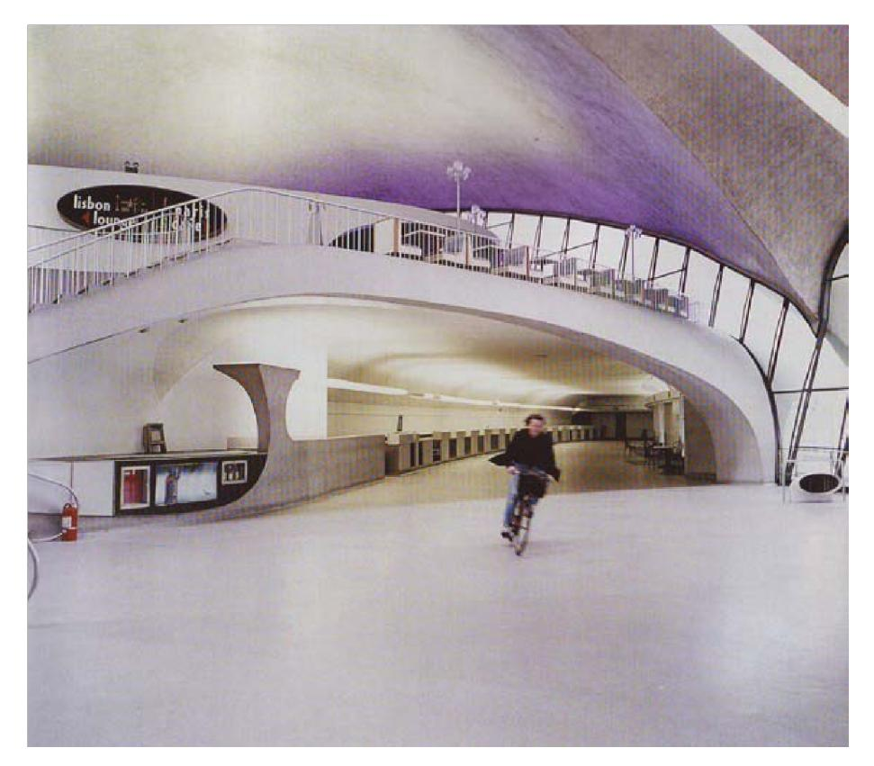

# **Airports as urban narratives. Towards a cultural history of global infrastructures**

Nathalie Roseau

# **To cite this version:**

Nathalie Roseau. Airports as urban narratives. Towards a cultural history of global infrastructures. Transfers, 2012, 2 (1), pp.32-54. ff10.3167/trans.2012.020104ff. ffhal-00734353ff

# **HAL Id: hal-00734353 <https://enpc.hal.science/hal-00734353v1>**

Submitted on 11 Nov 2021

**HAL** is a multi-disciplinary open access archive for the deposit and dissemination of scientific research documents, whether they are published or not. The documents may come from teaching and research institutions in France or abroad, or from public or private research centers.

L'archive ouverte pluridisciplinaire **HAL**, est destinée au dépôt et à la diffusion de documents scientifiques de niveau recherche, publiés ou non, émanant des établissements d'enseignement et de recherche français ou étrangers, des laboratoires publics ou privés.

Version postprint de : Nathalie Roseau. **Airports as urban narratives. Towards a cultural history of global infrastructures**. *Transfers*, Berghahn Journals, 2012, 2 (1), pp.32- 54. ⟨10.3167/trans.2012.020104⟩.

# Airports as Urban Narratives Toward a Cultural History of the Global Infrastructures Nathalie Roseau *Université Paris Est, École des Ponts ParisTech*

#### **Abstract**

This article focuses on the process of the design of airports and how in particular the urban context has shaped their specific histories. Far from being merely pure technical or functional equipment, they have been mirrors for contemporary expectations, just as they informed the modern urban imaginary. According to this perspective, an urban history of airports can be traced from the first aerodromes dedicated to large urban publics to the development of spectacular airports driven by the massive recent routinization of air transport so intricately bound up with globalization. Based on research on specific cases of the design and building of New York and Paris airports, this article aims to resist the temptations to dehistoricize the airport topic, and to introduce a narrative mode of thinking about these specific and concrete spaces.

## **Keywords**

aeromobility, airport, design, future, historicity, obsolescence, spatiality, urban imagery

#### **Introduction**

This paper focuses on the relations between the city fabric and the development of aerial mobility, and their particular interaction through the design and the building of material urban artifacts such as airport infrastructures. We know that travel modes in general have radically transformed spatiality.1 As well as triggering a metamorphosis of cities themselves, transport transforms perceptions of space and recasts our modes of representation. However, as Marc Bloch has stressed, "The invention is not everything. It also has to be accepted and taken up by society and this is where the technique itself ceases to be the only factor in controlling its own destiny."2 Bloch was outlining the permanent hybridization process along which technology and society interact, enlarging the key issue of causality in history as more complex and multiform. Since the 1960s, the "social construction of technology" has developed and expanded as a field of research, leading to the advent of Science and Technology Studies.3 For scholars examining the city, the turn to technology—and following more recently the turn to mobility4 —led to a renewal in urban studies, and an affirmation that the city fabric was the result of complex interactions between society and technology. Within this general frame, this paper focuses on the black box of the spatial fabric, investigating how aerial mobility has been domesticated by, even as it has transformed the urban environment. To detail this symbiotic relationship between urbanism and aerial mobility, the article will look in particular at how airports have been designed and built in relation to their urban context.5

# **Airport and the City: (Ir)resistible Temptations for Ahistoricity and Aspatiality?**

While they already boast eighty years of history and figure among cities' most emblematic buildings, airports paradoxically are often considered only in the immediacy of the present. A few books dedicated to airports have been published over the last fifteen years, some of them historically oriented, and most covering the global diffusion of airports,6 and celebrating them as flamboyant technical and architectural achievements. However, the current mainstream discourse most often figures the airport either in a futuristic perspective that includes both fear and fascination (as can be seen from the comments on the recent gigantic and spectacular projects in Asia or the United Arab Emirates, for example) or in a present perspective that analyzes with both criticism and perplexity the existing chaotic airport environment. This apparent amnesia of the historical thickness of the airport may be primarily explained by the fact that airports now represent perfectly legitimate research topics inasmuch as the rapid development of airport zones over the past few decades has raised key questions about the content, purpose and limits of the "urbanism of flows" and is closely bound up with globalization. The subject of fascination and bitter criticism in equal measure—they have even been described as urban, technical, or social dystopias—the airport is often used to illustrate the "space of flows" (Castells) or "global cities" (Sassen) paradigms. According to Saskia Sassen, contemporary airports also emphasize the intrinsic duality of the global city. As she aptly puts it, within this space "decision-makers without borders encounter workers without (working) papers."7 Manuel Castells raises another structural dialectic, using airports to enlighten his concept of "space of flows"—a fluid and virtual space

allowing us to be here and nowhere—which he confronts to what he calls the "space of places"—a visible and material form of the built environment conducive to the experience of a local place.8

Airports also have variously been termed "generic cities" or "nonplaces." The anthropologist Marc Augé has introduced this last term through the narrative of a road journey to and through Roissy, which according to him epitomizes the highly disembodied environment of the contemporary society.9 The architect Rem Koolhaas also opens his manifesto on the "generic city" with an airport reference that illuminates his reflections on Bigness and the large scales of architecture. However, Koolhaas does not seem to share the conclusions of Augé on the standardization of all contemporary designs, such as airports, high-speed railway stations or shopping centers; on the contrary, the architect sees in airports a new arena of differentiation: "Once manifestations of ultimate neutrality, airports now are among the most singular, characteristic elements of the Generic City, its strongest vehicle of differentiation."10

As we can see, airports have become, over the past twenty years, one of the subjects of predilection of researchers tasked with analyzing all things urban. As hybrids of the transnational and the local, of gigantism and microcosm, of intensity and dispersal, of ubiquity and immobility, of introversion and exteriority, of transcendence and failure, airports now seem to embody a sort of critical lesson whereby, like a distorting mirror, they reflect the crucial issues in our contemporary environment. But they also function as a sort of liminal area between the urban and the non-urban, as they appear to bring the thorniest urban issues to the fore without necessarily being accorded the noble status of prized urban spaces. Consequently, to the ahistoricity of airports' current representations, we may also add an "aspatiality" trend, doubtless resulting from this hybrid position, neither inside the city nor outside.

#### **Urban Narratives as a Way to Recontextualize Airport History**

Actually, airports' supposed ahistoricity and aspatiality may be accounted for by the fact that airports have very often been conceived of in relation to the future. This orientation has tended to prevent their framing in historical time and space. What must be emphasized is that there has always been an ongoing dialogue between cities and their airports, and that, instead of being merely pure functional or technical equipment, airports and their processes of construction have been formidable instruments for projecting *in vivo* urban fictions. They have been the focus of heightened and contradictory expectations, and have reflected utopian and critical projects back onto their host cities. Therefore, the urban condition of

the airport as a "future present," confers it with a particular historical character as its cultural construction can ultimately be understood in terms of a succession of projections of the future.11 Analyzing the history of airports through this retrospective of "past futures" narratives, we can outline their progressive stratification, and understand the way visions and designs aggregated, mutated, consolidated a palimpsest of images and discourses, and finally partly shaped the manner in which we view these places.

The airport also exhibits a natural extra-urban status, as it can also be regarded as a space that has sought to emancipate itself from its host city. While the numerous reasons for this "distancing" may appear obvious, this extraterritoriality is also the result of a permanent process of design and planning that has nearly always placed aerial infrastructure at the very edge of urban territory. However, this specific position on a constantly moving frontier does not necessarily designate the airport an anonymous non-place. Airports differ from one city to another; mere observation testifies to this fact. Moreover, spatial transformation processes highlight major disparities in airports undergoing construction, renovation or enlargement. Models' constant evolution is subject to local variants that shape their future. Within this frame, this article militates against seeing airports as simply evidence of the standardization wrought by globalization, and aims instead to relocalize airports in their specific cities' histories. To this end, viewing airports as urban narratives—a chronotope, Mikhail Bakhtin would say12—can be understood as a way to recontextualize the airports topic both in a temporal and spatial urban framing.

The specific case studies of New York and Paris illustrate my claims. These two cities have been emblematic in the history of aviation, as well as symbolic examples of the expanding and renewing modern metropolis. Spectacular exploits, heroism, grandiosity as well as catastrophe, characterize these two large cities and their airports, which have been alternately celebrated and stigmatized. However, though Paris and New York are specific situations, they are not atypical. One of the peculiarities of the history of aviation and the urban imaginary connected to it is internationalization (or transnationalization), even though national and local variation of broader visions remained. Based on an archival research on the process of design, building and public reception of the New York and Paris airports, informed by sources from airport professional representations, and from popular visual culture—cinema and illustrated press in particular—this paper tries to resist the temptations of globalizing the airport typology. Instead, it asserts each airport to be a specific construction with its own place in history. Enlightened by a few other illustrative references, the central examples of the New York and Paris airports allow us to see precisely how transnational visions are implemented locally, and how the processes of imagining and building airports are tied to specific urban narratives surrounding "aeromobility."13

## **Narrative 1: The Spectacle of Aeromobility**

In the early days of aviation, the business community did not immediately perceive the technical, military or strategic benefits or even the utility of air travel. As the historian Emmanuel Chadeau has written, the airplane was an "uncalled-for invention"14 and, unlike the automobile, its birth was followed by a relatively long period in which it struggled to break through the decisive threshold required before mass travel could take place.

The years between the actual invention of the airplane and its dissemination saw the organization of a number of public displays intended to give media coverage to the invention. 1909 marked a turning point in the history of these spectacular events, which involved thrills, spills, crashes, and the emergence of new heroes,15 all intended to inspire modern audiences and provide food for thought. Cities and their peripheries were generally the sites for these huge meetings, which were given maximum exposure in the mass media. Therefore, the manner in which the exploits were put on display reinforced the remarkable nature of what was on show.

In France, event organizers erected enormous race-course or circustype outdoor stands, usually with the full support of the local municipality. Juvisy Port Aviation was the first aerodrome settled in Paris Region; a large public air meeting opened there on May 23, 1909. Three months later, at the end of August, several hundred thousand spectators attended the *Semaine de l'Aviation de la Champagne* (Champagne Aviation Week) held at Bétheny near Reims. Enormous makeshift stands, opening on to large fields, had been erected in a few weeks, creating a new kind of distance between the spectators and the aviators. That September, in Paris, the first large aerial locomotion exhibition opened at the Grand Palais. Later the same month, it was New Yorkers' turn to be captivated by the series of flights made by Wilbur Wright to commemorate the 300th anniversary of the arrival of Henry Hudson to the harbor. On September 29, the aviator flew up the Hudson, over the assembled steamboat flotillas and around by the Statue of Liberty before returning towards Governors Island. The entire flight lasted only five minutes, but its impact was enormous. Excitement reached fever pitch as Wright's plane rounded the emblem of the City, just as the assembled masses feared that he would crash into it. One million people witnessed the exploit, watching from places where it was possible to see it: large parks, islands, quays and rooftops.16

**Figure 1.** Last Wilbur Wright flight in New York, during the Hudson-Fulton celebrations, October 4, 1909.

*Courtesy of Special Collections and Archives, Wright State University.*

The illustrated press gave front-page coverage to the event in the mass circulation dailies. The New York papers that had planned to give precedence to military parades organized to commemorate the Port's tercentennial celebrations, quickly switched to Wright's remarkable aviation exploits.17 The Paris-based magazine *L'Illustration* also capitalized on the spectacular dimension of aerial meetings, publishing the extraordinary photographs snapped by Léon Gimpel at Bétheny from a dirigible. The photographer had audaciously captured both aviator and the watching crowd below in a single shot.18 Meanwhile, the early Pathé and Gaumont newsreels managed to capture the cinematographic dimension of the spectacle of flight. Indeed, such images constituted the most immediate and radical vector for spreading news of these exploits and the excitement generated by urban flights and virtuoso exploits across international borders, conferring the aerial stage with a status that was both understood and shared by all.

# **Narrative 2: The Metropolis of the Future**

The mechanical conquest of the air did not turn the airport into the only intermediary between aviation and the urban milieu. Of course, aerodromes (small airfields) sprouted up with the beginnings of aviation. Some were even imagined as part of a future "Aéropolis,"19 as coined in a project imagined in 1910 for a new aerodrome located four kilometers from the Paris fortifications, in Le Bourget! However, despite being sites

of incredible exploits in front of huge crowds, aerodromes or airfields— *Flugfelder* in Germany—were at this time simple fields equipped with a runway, a hangar, and a bar to welcome the pilots. The relatively ephemeral character of this early aerial infrastructure occasioned an international debate about the manner in which the city would be recast through this new form of emerging mobility. This debate was all the more exacerbated by the showcasing, through aerial meetings and the illustrated media coverage, of the switch from the impossible to the plausible. A shift was then taking place, in which the "aerial cities" depicted in the fantastic literature of Albert Robida, Herbert Wells and Jules Verne20 began to transmute in the plans of architects, urban planners and engineers.21

Such visions raised the possibility of a structural transformation of the urban milieu. As it inserted itself into the city fabric, the airplane inspired innovative explorations of new programs and extensions of the urban sphere in the third dimension. In 1910, the French architect-engineer Eugène Hénard imagined "Les Villes de l'Avenir" ("Cities of the Future").22 At a time when the last Parisian city walls were the subject of prospective developments, Hénard was reflecting on enlarging the capital. As this debate over "Greater Paris" was just beginning, Hénard, fully convinced of aeromobility as a future transport mode, imagined an urban universe where buildings would feature lift-garages containing cars and planes, the latter which he actually termed "aerial motor cars." Hénard built up his vision gradually, his city becoming nearly an aerialbased system. From the smallest to the grandest, the nature of aerial traffic was in relation to the respective functions of the successive peripheral extensions planned around the city centre. New, quasiimmaterial perimeters, dotted with lighthouse-style towers or with "aerial buoys," marked boundaries and helped orient the aviators. Roof terraces and landing peaks traced a new architecture of urban ridges.

In his vision of a concentric city, Eugène Hénard sought to organize the Paris metropolitan area along regional lines while the New York City architects harnessed air mobility to conceive of an "upper city" superimposed on the existing city and making the urban substratum denser still. Among them was Harvey Wiley Corbett, a professor at Columbia University and a partner in one of the major New York architectural firms, who very early proved to have a passionate interest in aviation. Facing increasing urban congestion in Manhattan, he studied, together with the renowned architectural draftsman Hugh Ferriss, rational solutions which sought to tackle hyperdensity. Sketched in 1925 by Paul, a New York-based artist, much appreciated by Corbett, a drawing of Manhattan entitled "How you may live and travel in the city of 1950," lent his reflections a new edge and developed this idea of superposed, autonomous spaces. In his proposed sketch, terrestrial mechanical systems, pneumatic tubes and electric trains were all pushed underground, while urban functions, housing, recreational areas, schools, offices, and restaurants were all superposed vertically above ground. Right at the top of the drawing, a roof platform looks down onto a skyscraper bearing the legend "Aircraft landing fields" and containing a group of airplanes ready for take-off.23

The First World War had allowed aviation more visibility, as it played an emerging role in the conflict.24 After the war, aviation was now set up as an industry and commercial transport. The first regular line between Paris and London was settled in 1919, carrying fewer than fifteen passengers. This specific situation of a visible transport, though still in its infancy, stimulated new urban visions as urban development grew more robust. In 1925, the Beaux Arts Institute of Design in New York launched an architectural competition among its students for the design of "An Aeroplane landing in a Metropolis" stressing "the necessity of finding a method of landing aeroplanes in a large city." The three winning projects were all by students from Corbett Studio, and were based exclusively on a direct relationship between air transport and the constitutive underlying metropolitan forms: "Airplane platform over a building," "Airplane landing over a bridge" and "Airplane landing over docks all placed the landing pad at the apex of

**Figure 2.** Raymond P. Hughes, "Airplane landing over a bridge", 1925, winner of competition held by the New York Beaux Arts Institute of Design *An aeroplane landing in a Metropolis.*

Source: Drawings and archives, Avery Architectural And Fine Arts Library. Columbia University, New York.

the surrounding skyline, built atop or suspended over existing buildings.25 Here proposals did not invent totally new configurations, but rather, legitimated already incubated ideas, that Corbett and his colleagues Raymond Hood and Hugh Ferriss were exploring through their visionary projects and exhibitions on the *Metropolis of Tomorrow*. 26

Despite their marked differences in vision, images and articles produced and circulated in the 1920s depicted a future of airplanes without airports. From Eugène Hénard to Le Corbusier, from Harvey Corbett to Hugh Ferriss, from the Italian futurists to the Russian suprematists, architects were inventing new systems of aerial platforms to bring aircraft directly in and out of the alreadyexisting built environment of the city. In 1929, Francis Keally, who also worked with Corbett, published in the journal *American Architect* a vision entitled *Aerial City*, which imagined the city as an immense chessboard, punctuated by landing roofs or mooring masts.27 This first era of formal planning to bring airplanes into cities conceived new superimposed urban strata, such as highrise canopies or extensive suburban grids, recasting existing structures and tracing the contours of the city of the future.

# **Narrative 3: The Flagship Monument**

This prospective work conducted around the "aerial city" did not preclude reflections on the airport per se. A number of configurations co-existed that explored future mobility possibilities and related infrastructure. But these links were also to be all the more marked insofar as some of the "aerial city" visionaries, such as Hugh Ferriss, became key players in the design of certain major international airports.28 This formative period29 spawned a collection of plausible images, programs, and approaches that would guide future airport design.

There was a turn in the early 1930s, when the key actors in this burgeoning transport sector began focusing increasingly on creating the conditions for successful commercial aviation. Advocates of aeromobility needed to both impress and reassure a skeptical public, who remained fearful of the perils and discomfort of aerial transportation. Luckily, the advocates' wish to promote aerial infrastructure as a means of showcasing commercial aviation dovetailed with cities' desire to strut their state-ofthe art modernity, catapulting the airport issue to the top of the agenda even though air transport itself was still in its infancy.

The organization of architectural competitions represented a first step. In the U.S., a competition was organized in late 1929 by the Lehigh Portland Cement Company, which was very interested in the proposed infrastructures, including parkways feeding the future airports. The competition took on an international dimension: over 250 entries were received.30 And while all four winning projects broke with the idea of a structural overhaul of downtown areas, they all nevertheless incorporated a new territorial "gateway" to the city with the idea of an epicenter replete with attractive urban amenities and creature comforts. Located on the urban periphery, this conception of the airport prefigured the city's extension and marked it out both as a part of the city and its outer frontier. The airport as envisioned in these plans was often linked by rail or metro, and was surrounding by parks and urban amenities trade fairs, hotels, shops, aviation schools, sports grounds, and so on—which were all linked by a plaza.

Here, prevailing discourse harnessed abundant rhetoric and a host of urban references that reflected the imaginary aerial city. From its position on the outer city limits, the airport took on all of the city's attributes and extrapolated these within a peripheral space based around new models that simultaneously reflected the latest new ideas: distension—of the urban grid, building, or open space; consolidation of functions by superimposing or combining these within a single place; the emergence of a new eccentric centrality; being part of a system; and the definition of a strong identity.

Competitions and designs facilitated the transfer of a certain number of emerging ideas, but also acted as vectors for in situ experiments. Both the converging realties of a nascent mode of transport and increasingly important promotional objectives were reflected in a number of major urban events in the late 1930s that were to boost the development of the first international airports. As part of the celebrations to mark the 700th anniversary of Berlin as well as the newly installed Nazi regime, Tempelhof Airport was extensively rebuilt in 1937. The new airport featured a colossal terminal building with a roof terrace to welcome up to 80,000 spectators.31 In France, the International Exhibition of 1937 was the catalyst for the complete redesign of Paris' Le Bourget Airport by the Rome prize-winning architect Georges Labro. This project also featured a monumental air terminal building.32 Meanwhile, New York's new La Guardia Airport was inaugurated to coincide with the International Exhibition of 1939– 1940.33 As the flagships of capital cities and celebratory beacons placed at their gates, airports became linchpins of the modernization strategies of the great cities in the 1930s.

Obviously, the transition from the ideal to the real did not take place without numerous shifts in emphasis. Because airports had to break free of the symbolic "heart" of the city, in the meantime they tended to crystallize urban values within their new frontiers. However, the airport soon revealed numerous ambiguities, caught between a forward-looking and a commemorative perspective.34 The "monumentalization" of airports would appear to have replaced the reforming spirit that underpinned the images of the airplanecentric city with a grandstanding approach designed to project a city's power and pride.

r

**Figure 3.** Le Bourget Terminal Building, Paris, 1937, View of the building and terrace from the runway.

Source : Aéroports, *Transports en Commun*, Éditions Albert Morancé , 1937, p 76

# **Narrative 4: The Urban Showcase**

The Second World War was a further watershed that pointed up both the emergence of a formidable aviation industry and the realization that aircraft also constituted a weapon of mass destruction. It also progressively ended the dream of individualized and Edenic air transport35 and signaled fairly clearly that the future lay in collective transport with more and more constraints attached. At the same time, there was a definitive shift from the ideal city recast around aerial mobility—the "aerial city"—to the quest for an airport figured as an urban alternative, the "airport city."

One of the key events of the immediate postwar period was the emergence of the Paris and New York airport authorities, frequently in the wake of bitter turf wars between existing actors. Founded in 1921, the Port Authority of New York and New Jersey wrested in 1947 the

concessions to run the major New York airports from the New York and Newark municipalities.36 In France, the creation of *Aéroport de Paris* as an autonomous government-owned corporation (*établissement public autonome*) in 1945 was the brainchild of Alain Bozel, who had spent the war in London alongside General de Gaulle, as well as the outcome of a fierce struggle between the ministers of the provisional postwar government.37 The status and goals of the new Authority were intensively discussed, along with new airport concepts, within the frame of the quest for the *Redressement National*.

While this process of increasing institutional autonomy for airports was not as pronounced in Paris as in other major capitals,38 it still marked out airports' emergence as a world per se, particularly as they began to take up residence outside of the limits of the host city. From then, the emergence of airports outside of the city walls was to boost reflections on urban matters around what would soon be known as "air cities." With their outsize dimensions—as reflected in the numerous parallels drawn between the dimensions of projected airports and their host cities— airports became testing grounds for unbridled suburban experimentation as city boundaries experienced unprecedented growth.39 New York's new Idlewild Airport, fully operational from 1958, was known as *Terminal City*, the urban concept of which was designed by Hugh Ferriss and Wallace K. Harrison, Chief Urban Planner for the United Nations New York headquarters. Idlewild (renamed after slain President John F. Kennedy in 1963) was monument, showcase and event, all in one.40 Paris's Orly Sud megastructure, inaugurated by General De Gaulle in 1961 and designed by Henri Vicariot and Jean Prouvé, deployed a radically new glass structure

**Figure 4.** Orly Sud, Paris, The airport *Megastructure*, 1963*. Courtesy of Aéroports de Paris.*

(particularly the curtain-walling of the building), as well as roof terraces, viewing areas and restaurants with panoramic views.41

What stands out most in this postwar period are the massive promotional campaigns that accompanied the opening of the major international airports. These campaigns sought to welcome a public largely comprising of daytrippers who came to see a new type of entertainment: the airport in movement. Now it was not just the planes but the airport as a whole that was getting media attention and being turned into a suburban attraction and a "must" on people's itineraries. Replete with cinemas, theatres, stores, leisure amenities (even Turkish baths!) and all the hallmarks of suburbia, these new complexes became a never-ending celebration of abundance and mobility that consolidated the entire airport-related "imaginary." They resembled the theme parks that had also sprung up during this era: the stars passed through them, journalists reported on them, tourists and locals enjoyed weekend "skyrides" through them, and they even served as sites for many an inauguration.42

## **Narrative 5: A Prototype for Uncertainty**

By the 1960s, cinematic references to airports, which marked them out as emblematic places in the popular imagination, were routine. Airportrelated fictions tended to explore the ambiguity of modernity (Jacques Tati, *Playtime*, 1967), the anticipatory dimension of the airport place (Chris Marker, *La Jetée*, 1962) or its catastrophic power (*Airport*, adapted from Arthur Hailey's 1968 novel43). Even if the public's penchant for Sunday trips out to Orly or JFK would not last very long, the reciprocal connection between the visual arts and modern airports remained powerful. The 1970s, when aviation entered the era of mass transport, witnessed the beginning of a chronic crisis in aviation and its infrastructures. The arrival of the Jet Age, growth in traffic, complex new procedures, oil price shocks, environmental degradation, and terrorism all undermined the model of the perfect showcase airport and made apparent the issue of uncertainty as a key component in the airport development equation. This was a turning point for the reflection on the fourth airport in New York,44 as the original Idlewild *Terminal City*, conceived as a closed diadem of unique flagship buildings, would prove to be difficult to reenact in a period of new and increasing political, structural, economic and traffic obstacles.

The history of Paris' new Roissy Airport illustrates the problems airport authorities have faced and will face in building high-performance infrastructure in times of uncertainty. The first sketches of the new airport made in the mid-1960s were part of the ambitious plans conceived by Paul Delouvrier and his team to redevelop the entire Greater Paris region.45

Roissy 1 terminal was designed by Paul Andreu using radically new architecture that drew on interacting flows, flexible spaces and a dynamic and global modus operandi for the entire building. But the goalposts rapidly shifted before the airport was even opened. Passenger traffic grew and larger jets hampered the desired free movement of aircraft around the Roissy 1 terminal. These functional considerations, combined with the new economic situation thrown up by the 1973 oil price shocks were to alter the original blueprint, which called for five more terminals identical to the existing Roissy 1 terminal.

Consequently, the construction of the Roissy 2 terminals was subject to new considerations.46 The sequential pattern according to which this string of air terminals was built between 1982 and the present was a result of both the investment difficulties experienced by Aéroports de Paris

**Figure 5.** Aerial view of Roissy Terminal 2, Paris, 2005. *Courtesy of Aéroports de Paris.*

and uncertainty over the future of growth of air transport. The attempt to implement a phased airport building program even as the first air terminal was going up resulted in a segmented, incremental development strategy. Four modules of the terminal were built prior to the arrival of the future *TGV* (highspeed train) station in 1994, marking a changeover to a hubbased conception. This was the approach gradually adopted by the major airlines in the wake of deregulation of the industry and "open skies" as a means of getting the most out of their fleets by centralizing them at a number of large hubs.

These factors, combined with the growing complexity of passenger transport formalities, safety issues and expectations, undermined the principle of splitting up airports into smaller terminal buildings. It became necessary to "recentralize" facilities. Fifteen years after Roissy opened, a third generation of terminals was designed along the lines of Terminal 2F, which was finally completed in 1998, and, with the growth in air traffic, the infrastructure was rounded out by two elongated satellite buildings. Airports are in a constant state of evolution; indeed, as Paul Andreu has claimed, "each project is both self-contained and complete, while at the same time only representing a small part of a broader ensemble that is recast on an ongoing basis."47

## **Narrative 6: A "Metapolitan" Archetype**

While they remain experimental spaces in urban development, this is now related more to exploring new forms of spatiality and innovative urban production techniques, in a context of an uncertain future. Moreover, the new airport forms gradually emerging are the result of an urban repositioning of the airport structure. It no longer lies outside of the built city but inside a constantly changing metropolis. It no longer showcases the city of the future but provides a testing ground for contemporary urban issues. As an integrated exchange platform at the epicenter of the "city of flows," accumulating more and more functions and services, the airport now receives traffic and flows from the entire city and its role in the metropolization of these same agglomerations is gradually making it one of the dominant institutions in global cities. As they get bigger, airport authorities both anticipate and cause the distension of urban space. They eat into swathes of outlying territories that are in turn invested with a mix of architecture, urban forms and infrastructure. Contemporary airports entail sprawling complexes of air terminals and hangars as well as transport and engineering networks, all of them increasingly exurban.

Nonetheless, moving all of these new amenities further away from the city centre only increases the necessity of forging physical links between

**Figure 6.** Hong Kong. View of the Central Airport Express Station dominated by the highest skyscraper of the city, 2005, Photography Nathalie Roseau

them and the airport. Designers and city planners have constantly strived to compress or even ignore this intermediate space between the two attracting poles in order to counter the effects of placing the airport in exurban space. High-speed transportation infrastructures play a key role in this constant quest for suppressing this physical distance and ignoring the intermediate space between the city and the airport. These could include either unrealized projects such as the *aérotrain—*designed by the engineer Jean Bertin and originally proposed in the mid-1960s to link some strategic new suburban nodes, including airports,48 or actually deployed projects such as the 250km/hour Shanghai-Maglev magnetic levitation train now operational since 2003 from Pudong to the airport. The "hide-thathorriblesuburb-so-we-don't-have-to-see-it" reaction prevalent around

the time of the Paris-Le Bourget link and the 1937 Exhibition49 was already symptomatic of the authorities' embarrassment at the run-down areas surrounding the new symbols of Parisian modernity. And the more recent debates over the "CDG express" high-speed link to Roissy Airport, for which the project backers militated against a stop in the deprived neighborhood of Seine Saint Denis, have helped to reactivate this chronic pathology.

Contemporary airport design has also refocused on urban air terminals. The developments at Les Invalides in Paris or New York's 42nd Street were precursors in this regard. The recent wave of downtown air terminals (at which travelers receive boarding passes and check baggage) such as Hong Kong's terminals, achieved in the wake of the new refoundation of the global city harbor, have accelerated the return of functions that had been banished to the outer city limits. Physical distancing and the sheer size of airports have been offset by the return of air terminals in downtown areas, offering everything you would expect to find in an airport apart from planes! While cities develop "aircraftless airports" in their downtown areas, airport authorities strive to urbanize the airport using various signs and urban codes. Both situations civilization of airports on the one hand, and *aeroportization* of cities on the other hand—reflect the extent to which the two spaces are still inextricably linked in a relationship of ambiguity and hybridization. Diffusing the airport within the host city, or designing it as a whole new frontier city, or trying to compress the time-space distance which divides airport from city: airports exist as a sort of metastructure which both challenges and renews the whole metropolis.

# **Future Narrative: Learning from the Heritage Issue**

If this diachronic perspective shows airports to be powerful instruments for exploring the urban future, it also reveals their unfinished and elusive nature. The phenomenon of chronic airport obsolescence, already identified as early as 1962 by Reyner Banham,50 is all the more acute as it is compounded by the airport's prototypal dimension. In particular, this issue of obsolescence in airport design process, helps us to understand the current conflicts in controversies over the future of "airport heritage." In a context where project temporalities abound with uncertainty, the notion of heritage is difficult to circumscribe. Indeed, any mention of the past where airports are concerned frequently condemns them to uselessness in view of their predestined eternal youth. How could we preserve monuments and entire complexes wholly dedicated to a future that is now in the past? By the turn of the twenty-first century, the era of the megaterminal was inaugurated by JFK airport, leading to the disappearance of the original *Terminal City*  completed in the 1960s. A new complex has been built over this "forty-year old ruin," moving the author of a monograph devoted to the airport to declare "Terminal City is dead, long live the new JFK."51 From then, the landmark TWA Terminal designed by Eero Saarinen became the focus of a conflict between airport authorities and preservation groups, and crystallized the whole issue of obsolescence. However, the two perceptions of the terminal building—alternatively condemned as obsolete or defended as an icon of paradise lost—still appear inadequate to nurture a debate around its renewal; the building's status remains uncertain.52

Roissy Airport, on the other hand, cultivates a stratification approach that has tended towards accumulation. Construction and renovation has proceeded over a thirty-five-year period that has witnessed the changeover from elite to mass passenger transport and the creation of an exurban territory followed by the airport's re-absorption into the regional Greater Paris. This development has also produced a highly

**Figure 7.** *Terminal 5* exhibit, Eero Saarinen TWA terminal, New York, 2004 Photography Dean Kaufman Source: Dean Kaufman

original architectural ensemble that includes the recently restored Roissy 1 terminal and the colossal glass and concrete cathedrals of the Roissy 2F and 2E terminals. This living heritage constantly negotiates the terms of its own transformation in light of the relentless demands of air transport. For its part, the airport authority, faced with challenges to perform efficiently, reflect hypermodern aesthetics, and reintegrate the airport into the urban sphere, now also has to contend with the challenges of sustainability.

# **Conclusion: Understanding the Airport City as a Local Urban** *U-topos*

The concept of the "airport" must be understood through a diachronic perspective, which looks back to the first aerial public urban meetings settled in ephemeral *Aeropolis*, followed by the *Aerial Cities* visions depicted in the 1920s, the *Air Cities* celebrated as the weekend hotspots of the postSecond World War boom period, and more recently the exurban *Airport Cities* emerging at the turn of the 1990s as new huge metropolitan fragments. Whether located in, on top of, near, outside, or far from its "host city," the airport always develops in symbiotic relation to the urban environment in which it is situated, which it serves and on which it depends.

This diachronic perspective contextualizes airports and roots them in time and space, as well as emphasizing their hybridization with and emancipation from the city. Metropolitan gateway, institutional boundary, suburban laboratory, structural prototype: airport design and implementation formalize boundaries that circumscribe *and* transcend the contours of the host city, even as they invoke localized urban issues. This position at the extremity also explains why the transnational corpus of reflections on the aerial or airport city reveals differentiation. Designers on both sides of the Atlantic do not project the same places: the prism provided by the primarily global dimension of aerial mobility is more an opportunity to reflect upon the future of their specific cities in terms of their particular qualities and crises.

Viewed through these urban narratives, which replicate and amplify, as well as deform and distend the airport's own urban context, the airport should not be considered less a "non-place" than an *u-topos*, a spatial perspective on the outside looking in and questioning, extrapolating and crystallizing the acute tensions present in the contemporary city. In this sense, the airport is a place of mediation of contemporary urban issues, either in promoting experimentation or occasioning controversies. As such it suggests a megaevent, which may also explain why it has developed such direct links with the mass visual arts, such as photography, cinema and advertising.

The diachronic retrospective also helps highlight the successive imaginary structures that have forged airports from the outset, their status as the result of a complex alchemy superimposing both past and present representations and practices.53 Analyzing airports through this narrative mode gives fuller account of their design and realization, their limitations and their transformations within cultural, political, and economic structures, but also within their urban and metropolitan context. By reflecting the way they have been shaped, this sub-narrative can also shed light on the conditions underpinning their transformation.

## **Notes**

- 1. Marc Desportes, *Paysages en mouvement, Transports et perception de l'espace, XVIIIè-XXè siècle* (Paris: Gallimard, 2005).
- 2. Marc Bloch, "Technique et évolution sociale: réflexions d'un historien," Europe, 1938, in *Mélanges historiques*, vol. 2 (Paris: S.EV.P.E.N., 1963), 837–838.
- 3. Pioneers of these studies have been, in particular, Wiebe E. Bijker, Th. P. Hughes and Trevor J. Pinch, *The Social Construction of Technological Systems: New Directions in the Sociology and History of Technology* (Cambridge, MA: MIT Press, 1987); see also the actor-network theory drawn by Michel Callon and Bruno Latour. Bruno Latour, *Science in Action: How to Follow Scientists and Engineers through Society* (Cambridge, MA: Harvard University Press, 1987). See also the works driven by Patrice Flichy and Antoine Picon, eds., *Technique et Imaginaire* (Hermès Science, 2001).
- 4. John Urry and Mimi Sheller, "The New Mobilities Paradigm," *Environment and Planning*, A38 (February 2006), 207–226.
- 5. The following argumentation is taken from my doctoral research: Nathalie Roseau, *L'imaginaire de la ville aérienne*, 2 volumes (Ph.D. diss., University Paris East, 2008). Forthcoming book, *Aerocity, Quand l'avion fait la ville* (Marseille: Editions Parenthèses, 2012).
- 6. See, for example, John Zukowsky, ed., *Building for Air Travel, Architecture and Design for Commercial Aviation* (New York: The Art Institute of Chicago and Prestel Verlag, 1996); Marcus Binney, *Airports Builders* (London: John Wiley, Academy Editions, 1999); Manuel Cuadra, *World Airports* (Hamburg: Deutsches Architektur Museum, Junius Verlag et Dam, 2002); Alastair Gordon, *Naked Airport*: *A Cultural History of the World's Most Revolutionary Structure* (New York, Metropolitan Books, 2004); Hugh Pearman, *Airports: A Century of Architecture* (UK, Laurence King Publishing, 2004).
- 7. Saskia Sassen, *Urbanisme*, no. 345 (December 2005): 71.
- 8. Manuel Castells, *La société en réseaux, L'ère de l'information* [1996] (Paris: Fayard, 2001), 473–530.
- 9. Marc Augé, *Non-lieux, Introduction à une anthropologie de la surmodernité* (Paris: Seuil, 1992), 7–13.
- 10. Rem Koolhaas, "La ville générique," in *Mutations: Harvard Project on the City* (Bordeaux: Arc en rêve Centre d'architecture, ACTAR, 2001), 726.

- 11. In a similar vein to *Delirious New York* in which Rem Koolhaas outlines a retroactive Manifesto for Manhattan; Rem Koolhaas, *Delirious New York: A Retroactive Manifesto for Manhattan* (London: Academy Editions, 1978).
- 12. Mikhail Bakhtin, "Form of Time and Chronotope in the Novel," *The Dialogic Imagination: Four Essays*, ed. Michael Holquist (Austin: UTOP, 1981), 84–258.
- 13. For specific research on the local history of airports framed in a global context, see in particular Marc Dierikx and Bram Bouwens, *Building Castles of the Air: Schiphol Amsterdam and the Development of Airport Infrastructure in Europe, 1916–1996* (SDU, 1997).
- 14. Emmanuel Chadeau, *Le rêve et la puissance, L'avion et son siècle* (Paris: Fayard, 1996), 41–43.
- 15. For an overview of the long line of epic airshows since the eighteenth century, see Marie Thébaud-Sorger, "Le spectacle de l'envol, Mobilités aériennes (1783– 1909)," in *De L'histoire des transports à l'histoire de la mobilité*, eds. Mathieu Flonneau and Vincent Guigueno (Rennes, Presses Universitaires de Rennes, 2009), 235–245.
- 16. John Sanford, "The First Aerial Canoe: Wilbur Wright and the Hudson-Fulton Flights," paper presented at the international conference *Following in the Footsteps of the Wright Brothers, Their Sites and Stories*, held in Wright State University, Dayton, Ohio, September 28, 2001.
- 17. "Above Ship on Hudson River," *New York Evening Mail*, September 29, 1909, 1; "Wright in Daring Flights Rounds Liberty Statue," *The Globe*, September 29, 1909, 1.
- 18. "La grande semaine de Champagne," *L'Illustration*, no. 3471 (September 4, 1909): 153–164.
- 19. "Aéropolis, un aérodrome à 4 kilomètres des fortifications," supplement to *L'Aéronaute*, March 26, 1910.
- 20. Albert Robida, *Le Vingtième siècle* (Paris: G. Decaux, 1883), 38–53, 89–98; Jules Verne, *Robur le conquérant* (Paris: Hetzel, 1886); Herbert G. Wells, *The War in the Air* (London: G. Bell and Sons, 1908).
- 21. Nathalie Roseau, "Reach for the Skies: Aviation and Urban Visions circa 1910," *The Journal of Transport History*, 30, no. 2 (December 2009): 121–140.
- 22. Eugène Hénard, *Les villes de l'Avenir* [*The Cities of the Future*], paper delivered at the Town Planning Conference held at the Royal Institute of British Architects on October 14, 1910, subsequently published in *L'Architecture*, November 13, 1910, 383–387.
- 23. Paul, "How you may live and travel in the city of 1950." Published in *Popular Science Monthly* (August 1925). Source: Archives of Harvey Wiley Corbett, Box 4:1, Drawings and archives, Avery Architectural and Fine Arts, Library, Columbia University, New York.
- 24. Chadeau, *Le rêve et la puissance*, 86–99.
- 25. "An Aeroplane landing in a Metropolis," *The Bulletin of the Beaux Arts Institute of Design* (July 1925), 5–10 and Harry B. Brainerd, "An aeroplane landing in a metropolis," *American City*, no. 34 (February 1926), 187–190.
- 26. *The Metropolis of Tomorrow* was a large exhibition held in New York in 1929. Written and illustrated by Hugh Ferriss, a famous New York architectural draftsman, a book based on his sketches drawn over a period of ten years was also published. Hugh Ferriss, *The Metropolis of Tomorrow* (New York: Ives Washburn Publisher, 1929).

- 27. Francis Keally, "How Airports Will Affect Zoning Laws," *American Architect* (December 1929): 20–21, 100, 102.
- 28. Roseau, *L'imaginaire de la ville aérienne*, 119–121.
- 29. This term is inspired by Janet Bednarek, *America's Airports: Airfield Development, 1918–1947* (College Station: Texas A&M University Press, 2001), 178–181; see also Deborah Douglas' dissertation, *The Invention of Airports: A Political, Economic and Technological History of Airports in the United States, 1919–1939* (Ph.D. diss., University Of Pennsylvania, 1996).
- 30. The US\$10,000 offered in prize money was attributed to four projects in the following order: A.C. Zimmerman and William H. Harrison (Los Angeles); C. Gifford Rich (Chicago); Odd Nansen (East Orange, New Jersey) and Latham C Suire (New York); Will Rice Amon (New York). *American Airport Designs*, Lehigh Portland Cement Company (New York: American Institute of Architects Press, 1990). Republication of documents initially published in 1930 after the competition was held. See also "The Lehigh Airports Competition," *Architectural Forum* (January 1930), 75–106.
- 31. Lars Olof Larsson, *Albert Speer, le plan de Berlin, 1937–1943* (Bruxelles, Archives d'Architecture Moderne, 1983).
- 32. "Le concours de l'aéroport du Bourget," *Architecture d'Aujourd'hui* (February 1936), 4–5.
- 33. See a later paper on the criticism of La Guardia's *Folly*, from Florence Teets, "The Little Flower's Folly," *Pegasus* (October 1954), 1–15.
- 34. For an overview of the airports built in Europe and United States during this period, see the volume "Aéroports," *Transports en commun* (Paris: Editions Albert Morancé, 1937).
- 35. On the story of the flying cars dreams and prototypes, see from Patrick J. Gyjer, *Les voitures volantes, Souvenirs d'un futur rêvé* (Lausanne: Favre, 2005).
- 36. Jameson W. Doig, *Empire on the Hudson: Entrepreneurial Vision and Political Power at the Port Authority* (New York: Columbia University Press, 2001), 247– 314.
- 37. Alain Bozel, *L'Aéroport de Paris* (published privately), November 1944. Source: Archives of Aéroports de Paris.
- 38. In London, airports remained under military rule in this period. BAA was not created until 1966.
- 39. Between 1950 and 1960, the number of inhabitants living in the New York Metropolitan Area increased by five million (out of a total population of eighteen million) while the population of the more central Greater New York area stagnated at around eight million.
- 40. Wallace K. Harrison, Presentation of the *Terminal City* project for the Port Authority, February 16, 1955, Wallace K. Harrison Archives, Box 3, Drawings and Archives, Avery Architectural and Fine Arts Library, Columbia University, New York. *Terminal City* was also the name given to the new refurbished Manhattan Grand Central Station, achieved in 1913.
- 41. "Une véritable ville, consacrée au transport aérien," *Le Parisien*, February 23, 1961; or "Idlewild et Orly … L'une et l'autre sont de véritables cités," *Paris Presse*, August 27, 1964, source: Archives of Aéroports de Paris.
- 42. And promoted in articles such as "Your Weekend Guide Visits: Idlewild Airport," *The New Haven Register*, August 25, 1962, 32.
- 43. 43. Arthur Hailey, *Airport* (New York: Doubleday, 1968).

- 44. See "An Offshore 4th Jetport Is Suggested by Lindsay," *The New York Times*, January 9, 1971, 57.
- 45. Artist perspectives of Roissy were published by *Paris Match* in one of the two exclusive issues edited for the promotion of the new plans for the Paris Region. "Paris en l'an 2000," *Paris Match*, no. 952, July 8, 1967.
- 46. The earliest designs for Roissy 2 date from 1969 and were first published in 1971 at the same time as the studies and work in-progress for the Roissy 1 terminal. "Roissy en France," *Architecture d'Aujourd'hui*, no. 156 (June–July 1971): 25.
- 47. Paul Andreu, June 10, 2002, www.paul.andreu.com.
- 48. Vincent Guigueno, "Building a High Speed Society, France and the Aérotrain, 1962–1974," *Technology and Culture*, 49 (January 2008): 21–40.
- 49. "Le problème des liaisons urbaines avec les têtes de lignes aériennes internationales, Quatre solutions-types: Londres, Paris, Berlin et Marseille," *Urbanisme* 66 (October-November 1938): 280–281.
- 50. Reyner Banham, "The Obsolescent Airport," *Architectural Review* (October 1962), 250–253.
- 51. Mark Blacklock, *Recapturing the Dream: A Design History of New York's JFK Airport* (London: Mark Blacklock, 2005), 4.
- 52. Nathalie Roseau, "The Obsolescence of the Monument, the Future of Airport Icons," in *The Challenge of Change: Dealing with the Legacy of the Modern Movement*, eds. D. van den Heuvel, M. Mesman, W. Quist, B. Lemmens (Amsterdam: IOS Press, 2008), 87–92.
- 53. Jocelyn de Noblet, "Le futur n'est plus ce qu'il était," in "Rêves de futur," *Culture Technique*, ed. Joseph Corn, no. 28 (1993): 8–13.