# **Chapter 1 The Eye Versus Chemistry? From Twentieth to Twenty-First Century Connoisseurship**

#### **Anna Tummers and Robert G. Erdmann**

**Abstract** This essay traces the evolution of connoisseurship in the Netherlands from the early twentieth century to current and future challenges. In the twentieth century, the attitude of art historians towards chemistry varied from extreme distrust to extreme optimism about the possibilities of the discipline to provide conclusive evidence in authentication matters. While the chemical methods and technical means to research paintings have developed at an unprecedented pace in the twentyfrst century, some of the key questions crucial to classifying works of art remain largely the same (e.g. how much consistency to expect in an artist's brushwork, painting technique and choice of materials?). However, other questions are new (e.g. how to interpret vast amounts of new data?) and call for a fundamentally different approach: for a cross-pollination of (technical) art history, chemistry and data science. While surveying recent developments, this essay discusses the merits and drawbacks of several modern analytical techniques (including as MA-XRF, HIS/ RIS, isotope analysis and GC-MS) as well as the potential of digital aids (smart tools). The focal point of this essay is on the Netherlands since advances in the scientifc investigation of works of art have repeatedly transformed the practice of connoisseurship here.

**Keywords** Connoisseurship · analytical methods · paintings · digital techniques

A. Tummers (\*)

R. G. Erdmann Rijksmuseum, Amsterdam, the Netherlands e-mail: [R.Erdmann@rijksmuseum.nl](mailto:R.Erdmann@rijksmuseum.nl)

© The Author(s) 2022 3

M. P. Colombini et al. (eds.), *Analytical Chemistry for the Study of Paintings and the Detection of Forgeries*, Cultural Heritage Science, [https://doi.org/10.1007/978-3-030-86865-9\\_1](https://doi.org/10.1007/978-3-030-86865-9_1#DOI)

Leiden University Centre for the Arts in Society, Leiden, the Netherlands e-mail: [j.c.tummers@hum.leidenuniv.nl](mailto:j.c.tummers@hum.leidenuniv.nl)

# **1.1 Connoisseurship, the Humanities and Some Recent Insights from Cognitive Psychology**

Determining who painted what and when is one of the most diffcult tasks of the art historian. Connoisseurship (i.e. the evaluation of the characteristic qualities, the dating and the attribution of works of art) involves estimating variabilities that can be tantalizingly diffcult to determine. How much consistency can one expect in an artist's inventions, style and technique, choice of materials and workshop practice? Did the artist use one particular style that gradually developed over time or, instead, different manners at the same time? To what extent did he/she involve workshop assistants and was he/she consistent in doing so (or not doing so)? Even when secure evidence is scarce or missing, the art expert has to form a mental image –consciously or subconsciously– of what is characteristic of the artist in order to make a decision. Evidently, the validity of an attribution hinges on the correctness of the expert's assumptions.

Moreover, the determination of authorship also usually involves assessing the quality of the art work. Although key to the artist's goals and to the reception of the art work, the question how to defne (high) quality is notoriously hard to tackle from an academic perspective.[1](#page-1-0) For old master paintings, given the guild regulations and possible workshop assistance, the question is not just what level of quality can be expected of work by the master's hand but also –and perhaps more importantly– what level of quality the master demanded in the paintings he/she deemed worthy of carrying his/her name (Tummers [2011:](#page-41-0) 81–112). Here again, the issue of consistency is relevant: how much variation did the master allow in paintings produced in his/her workshop? And did the artist –as many old masters did– consciously produce works of different quality levels, that were priced accordingly?

In short, judging a picture is far from simple, no matter how swiftly the judgment is sometimes made. It involves myriad questions that touch on different academic disciplines, including art history and materials science. Moreover, the inherent complexity of the task entails a risk. As the psychologist and Nobel laureate Daniel Kahneman has shown, the human brain works with two different systems: a quick sub-conscious way of assessing (often referred to as 'intuitive') and a slower, conscious thought-process (Kahneman [2011](#page-40-0)). In daily life, the brain tends to simplify, thereby delegating the mental process to a sub-conscious part of our brain. When confronted with complex questions, the brain commonly substitutes a complex question with an easier one (Kahneman [2011](#page-40-0)). Though in many cases effective and effcient -and occasionally even better than conscious decisions- our intuitive tendency to simplify can also lead to dangerous biases and oversights in the decision-making process (Gladwell [2005:](#page-40-1) 48ff; 263–264 (example of a racial bias); see also Dijksterhuis [2007](#page-39-0)).

1One of the few scholars who attempted to answer this question is Jakob Rosenberg in his book *On Quality in Art* (Rosenberg [1967](#page-41-1)).

Given these insights into the workings of the brain (Kahneman [2011](#page-40-0); Gladwell [2005\)](#page-40-1), it is not surprising that there have long been discussions about the nature of connoisseurship among art experts. Throughout the twentieth century there have been two opposing views as to what should have the most weight in the attribution process: the connoisseur's intuition, that is, the sudden insight that the connoisseur experiences without fully grasping its origin (Kahneman's 'system 1'), or rational, communicable arguments (Kahneman's 'system 2'; Tummers [2011:](#page-41-0) 30–60). Although both aspects can be considered part of the same decision-making process, their different nature has long caused tension in both theory and practice.

The complexity of the decision-making process and the danger of oversimplifcations may also explain the ferce criticism connoisseurs have often received. Already in the eighteenth century, the French scholar and theologist l'Abbé Du Bos dismissed 'the art of predicting the author of a painting by recognizing the master's hand' as 'the most faulty of all the arts, apart from medicine' (Du Bos 1719 [ed. [1993\]](#page-39-1), 296). In the twentieth century, the attribution of paintings was reviled as subjective and intuitive, and as tainted by the market (Chapman and Weststeijn [2019:](#page-39-2) 10–15). Consequently, the term 'connoisseur' has acquired negative connotations, conjuring up the image of a presumptuous, outdated and inadequate judge of pictures –an attractive target for ridicule (Fig. [1.1\)](#page-2-0).

As a result, academic art history repeatedly attempted to avoid connoisseurship at the start of the twentieth century, claiming it would not be quite 'theoretical' and

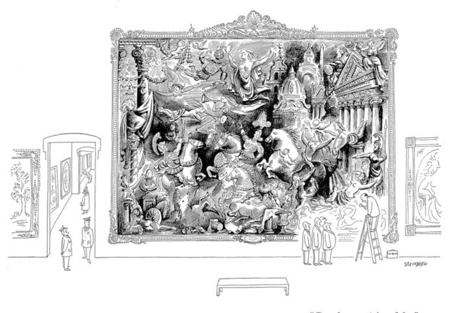

**Fig. 1.1** Saul Steinberg, 'Gentlemen, it's a fake!', cartoon published in *The New Yorker*, 6 May 1950

'scholarly' enough to be worthy of serious academic attention (Muthesius [2013;](#page-41-2) Martin [1904\)](#page-41-3). Avoiding connoisseurship did not solve the issue, however; it merely left academics vulnerable to the reproach that their discipline lacked a frm foundation (Pächt 1986 (ed. [1999\)](#page-41-4): 66–67). For the history of art cannot be written without a basic classifcation of who created what and when. Therefore, other art experts chose the opposite strategy and attempted to mend the situation by creating a more 'objective' and 'scientifc' connoisseurship. In the Netherlands the conservator Maurits van Dantzig in particular set out to develop a concrete (verifable) method to attribute paintings based on rational arguments that could be checked (Van Dantzig 1936, 1978).[2](#page-3-0) Despite his efforts, however, art historians remained divided. Even the prestigious Rembrandt Research Project (the largest and most advanced research project dedicated to sorting out the oeuvre of one single painter, pioneering several advanced scientifc techniques) did not believe that the intuitive component could or should be taken out of the decision making process, as we will see (Bruyn et al., vol. 1, [1982:](#page-39-3) XVII; see below and note 22).

Meanwhile, another blow to the connoisseur's reputation came from the feld of philosophy. In the 1950s and 1960s Arthur Koestler and Alfred Lessing argued that it made no aesthetic difference whether a painting is forged or not. Therefore, the person who pays a large sum of money for an original but would have no interest in a reproduction or imitation which he could not tell from the original, or worse, who prefers an aesthetically inferior original over an excellent forgery, is said to be at best confused and at worst a snob (Koestler [1955](#page-40-2); Lessing [1965\)](#page-41-5). It raised the question why connoisseurs should bother to tell originals and forgeries apart at all.

Although Koestler's and Lessing's claims were effectively refuted by the philosophers Nelson Goodman and Denis Dutton in the late 1960s and 1970s (see below), the fact that the validity of connoisseurship was questioned in this way, is telling. It is hard to imagine that a similar claim would be made for any other feld of study (i.e. that it would make no difference if an expert's analysis and appreciation is based on an authentic or a forged piece of evidence). For example, should one value real and counterfeit money in the same manner if one cannot tell the difference? Should historians interpret and appreciate real and forged historical artefacts such as Hitler's diary or pieces of the dead sea scrolls in the same way if they cannot tell these apart? It is the emphasis on the *aesthetic* properties of course that makes the difference here. Yet the question was if the aesthetic properties could be separated entirely from any cultural or historical context.[3](#page-3-1)

Goodman argued that since the exercise, training and development of our powers of discriminating among works of art are plainly aesthetic activities, the aesthetic

2The frst one to devise concrete method to attribute paintings was the Italian art expert Giovanni Morelli. Although Van Dantzig did not refer back to him, his method seems indebted to his wellknown Italian predecessor. See Tummers [2011](#page-41-0): 30 ff.

3According to Goodman the idea that one should strip oneself of all the vestments of knowledge and experience when encountering a work of art derives from the Tingle-Immersion Theory which was developed around 1800 and has since then become part of the fabric of what Goodman calls our 'common nonsense' (Goodman [1983:](#page-40-3) 102).

properties of a picture include not only those found by looking at it but also those that determine how it is to be looked at (Goodman [1969:](#page-40-4) 111–112). In his view, the knowledge that a picture is an original and not a copy, imitation or forgery is a critical and valid factor in our response to it. [Indeed, the impact of such knowledge has recently been confrmed by neuroscientifc research (see Huang et al. [2011;](#page-40-5) Wolz and Carbon [2014\)](#page-42-0).]

Denis Dutton made a similar point but arrived at it differently. He stated that all visual art is necessarily performative, as it represents an achievement within a certain cultural and historical context. It is this achievement that determines its value as an art work (and makes it relevant to art history). Therefore, if our understanding of this achievement alters drastically when a work of art is exposed as a forgery, in his view it is no longer the same object, in so far as its position as a work of art is concerned (Dutton [1979:](#page-39-4) 314).

Although philosophers thus underscored the importance of connoisseurship, many academic art historians stayed clear of in-depth visual analysis and moved instead towards contextual and historical approaches in the 1970s and 1980s. Iconography, social history and socio-economic perspectives gained ground, causing art historians to rely heavily on verbal and contextual evidence rather than on their eyes. In an effort to change this, Harvard Professor and drawings expert Henri Zerner wrote an engaging essay on connoisseurship's bad reputation in 1987. "Ours is a logocentric culture", he stated: "We trust the written document much more than our visual understanding of an image. This must be changed and we must attend to visual clues if we want to get something out of our visual legacy" (Zerner [1987](#page-42-1): 290).

While major research projects dedicated to individual artists such as Rembrandt, Rubens and Van Gogh greatly expanded our visual understanding of these masters at the end of the twentieth century, the advances in connoisseurship hardly impacted the academic curriculum. In 2009, Paul Craddock sharply observed: "the subject of authenticity does not seem to be seriously studied or taught to prospective art historians/curators, much less to materials scientists […] an honorable exception being the centre for study of forgery with its own museum at the University of Salerno" (Craddock [2009](#page-39-5): 6). This lack of academic attention is disconcerting and yet somewhat understandable. Connoisseurship and authentication skills require arduous practice including extensive frst-hand observation and in-depth study of important art works, copies and imitations, which not all universities can provide.

Nevertheless, the twenty-frst century witnessed a renewed academic interest in connoisseurship as well as a theoretical refnement in thinking about issues of authenticity. Prominent academics who had not themselves dedicated their lives to sorting out the oeuvres of artists started to underscore the importance of this specifc type of visual knowledge. David Freedberg eloquently argued that it was not just fundamental to art history but also potentially a 'core discipline in the humanities' as connoisseurship shared its 'evidential paradigm' with other types of scholarly detective work involving the interpretation of clues, symptoms and pictorial marks (Freedberg [2006;](#page-39-6) see also Ginzburg [1980](#page-40-6)). Stephanie Dickey stated that the continuing value of connoisseurship could be claimed both on theoretical and practical grounds: "Broad historical theories that build on works of art as evidence fall like a house of cards if assumptions about the authenticity of those works prove incorrect" (Dickey [2015](#page-39-7): 5). In 2019 the Dutch art historical yearbook was even dedicated entirely to connoisseurship, which is framed as the 'history of visual knowledge since the Renaissance'. According to Chapman and Weststeijn, connoisseurship is now widely understood as 'an essential and ever-evolving art-historical method'. Moreover, there is an 'enhanced rigor, [an] interdisciplinary reliance on materials science and neuroscience, and [a] new theoretical awareness' that represent a departure from the past (Chapman/Weststeijn [2019:](#page-39-2) 7).

This essay takes a closer look at the interaction between connoisseurs and chemists throughout the twentieth century, as well as at the current interdisciplinary character of authenticity research and its challenges. The main line of enquiry focuses on how advances in the scientifc investigation of art works have repeatedly transformed the practice of connoisseurship in the Netherlands and on what is needed to effectively face future challenges.

## **1.2 The Eye Versus Chemistry: Early Interactions Between Connoisseurs and Chemists**

No incident illustrates the deep distrust of an early twentieth century art expert towards chemical evidence better than a curious booklet of 89 pages with the title *Real or fake? Eye or Chemistry?,* dated 1925. It is written by Cornelis Hofstede de Groot, then one of the leading art historians and the author of a ten-volume survey book on Dutch seventeenth-century painting (Hofstede de Groot [1908–1927\)](#page-40-7)*.* He published the booklet in response to the lawsuit *Fred Muller & Co. vs H.A. de Haas*, the frst court case in the Netherlands in which chemical evidence was brought to bear in an attribution matter. The bone of contention was the attribution of a small painting: the *Laughing Cavalier* (Fig. [1.2](#page-6-0)). Cornelis Hofstede de Groot had recognized it as an authentic Frans Hals (1582/83–1566) in 1923 and provided a certifcate of authenticity. Both the certifcate and painting had subsequently come into the possession of a certain H.A. de Haas, who had sold it via the auction house Fred Muller & Co. to a private collector for f. 50.000,- (at the time the equivalent of fourteen years' salary for the average ma[n4](#page-5-0) ). A few months afterwards, however, the buyer demanded to be reimbursed claiming that the painting was in fact a forgery. The auction house looked into the matter, agreed with the buyer, reimbursed him, and subsequently asked Hofstede de Groot to cover a third of the damages suffered (circa f.16.666,-). Hofstede de Groot refused to do so. He indicated that in his view he could not be held accountable for the prices fetched by paintings he had authenticated, and he offered to research the painting anew. After a second inspection, however, he concluded once again that in his view the painting was by Frans Hals.

4The equivalent is taken from Lopez [2008](#page-41-6): 46

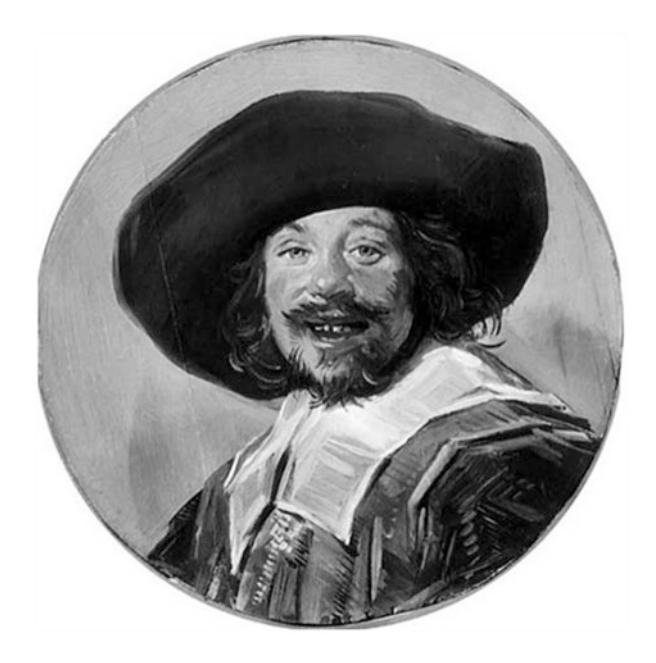

**Fig. 1.2** Anonymous, *Laughing Cavalier*, ca. 1923, pastiche in the style of Frans Hals, current location unknown

The auction house then subpoenaed the seller, Mr. de Haas on the 9th of December 1923. Muller and Co. demanded that the purchase contract be annulled and that the purchase amount be reimbursed including interest as well as their litigation expenses. The burden of proof that the auction house presented was substantial. The painting had been researched by a team of experts who had jointly written a report: Sir Charles Holmes, director of the National Gallery in London, Prof. dr. Wilhelm Martin, director of the Royal Cabinet of Paintings, The Mauritshuis, in the Hague and Prof. dr. F.E.C. Scheller, chair of Inorganic Chemistry at Delft University of Technology.[5](#page-6-1) Especially the materials science part of the investigation was disconcerting. Only the frst test had yielded a positive result: the paint layer did not dissolve when treated with the usual 96% alcohol solution, which agrees with what one would expect of a seventeenth-century painting. However, when touched lightly with a cotton ball soaked in water, the paint became soft; with a soft brush and water the paint layer could even be entirely removed. Moreover, the researchers found artifcial ultramarine in several locations throughout the painting, a pigment that had only been discovered in 1826. Furthermore, the researchers observed cobalt blue (through the microscope) in several locations in the background, a pigment that was not manufactured commercially until the early nineteenth century[.6](#page-6-2) A chemical

5The report was published in its entirety as an appendix in Hofstede de Groot [1925:](#page-40-8) 74ff.

6According to the experts consulted during the trial, cobalt blue was frst produced commercially around 1820/1830 (Hofstede de Groot [1925:](#page-40-8) 84); nowadays we believe it was somewhat earlier in 1807.

analysis of the white used in the painting identifed it as zinc white, a pigment that has only been available since 1781. Also, a radiography of the picture revealed two nails that had been hammered into the picture from the front; these were machinemade and could therefore not have been produced before the nineteenth century. The conclusion was obvious: the painting could not be by Frans Hals or a contemporary; it was made by a modern forger or imitator.

The lawsuit received much press coverage and constituted a serious blow to the reputation of Cornelis Hofstede de Groot. After an impressive career as deputy director of the Royal Picture Gallery the Mauritshuis (1891–1896) and director of the Print Room at the Rijksmuseum (1896–1898) and dozens of prestigious publications, he lived as an independent art historian mostly from the certifcates of authenticity that he provided (Ekkart [1979](#page-39-8)). When the court case had dragged on for one and a half years, he suddenly brought it to a halt, presumably in an attempt to prevent further damage to his reputation. Before the judge could reach a verdict, Hofstede de Groot purchased the contested painting for the full amount of f. 50.000,-, which made the law suit redundant. He then defended his point of view in his publication *Real or Fake?* In a nutshell, he argued that his expert eye should outweigh the chemical evidence presented in court. It is a position one can hardly imagine taking nowadays, and therefore an interesting benchmark in our study of the development of connoisseurship. For what criteria did Cornelis Hofstede de Groot use to substantiate his attribution? And how did he come to dismiss 'chemistry' so radically?

Although Hofstede de Groot hardly defnes criteria for assessing paintings, the way in which he attacks his opponents is revealing. Hofstede de Groot points his arrows mostly at Professor Wilhelm Martin, who is said to base himself too often on his 'feeling for style' (*stijlgevoel*)[.7](#page-7-0) Interestingly, Hofstede de Groot does not dismiss such a 'feeling for style' as a valid criterium; he just did not think Professor Martin possessed it. To Hofstede de Groot it seems to have been self-evident that an expert had a certain 'feeling' for the characteristic style of a painter, which enabled him to judge attributions better than a layman, an intuitive kind of insight that would normally not require much explanation. Given the circumstances, however, he felt obligated to refute the claims of his adversaries. Therefore, he wrote his argument in the form of a *negatio* (a denial of the contrary), a rebuttal of the expertise that had been used against him in court.

In doing so, he did not shy away from technical evidence. In particular, the discovery of modern nails in the picture and the solubility of the paint layer seem to have worried him. Therefore, he had confronted the painter and restorer who had asked him to assess the painting in 1923: Theo van Wijngaarden (1874–1952), nowadays better known as the mentor and business associate of master forger Han van Meegeren (1889–1947). Van Wijngaarden immediately admitted that he had hammered modern nails into the painting. These would not be situated underneath the paint layer, however; he claimed that he himself had covered their heads with tiny

7Hofstede de Groot [1925](#page-40-8): 28–29.

retouches. He also provided an explanation for the solubility of the paint layer: he was in the possession of a product –invented by himself but kept a secret– that could render any old master painting in oil soluble in water, which he demonstrated on the spot on another seemingly old painting. Ignorant of the massive swindling for which van Wijngaarden would later become known, Hofstede de Groot did not raise further questions. He mentioned Van Wijngaarden in good faith in his publication and indicated that the restorer was willing to demonstrate his product on any old master painting (Hofstede de Groot [1925:](#page-40-8) 13).

Having thus 'refuted' the chemical evidence, Hofstede de Groot then proceeded to counter Martin's style analysis. In the expert report, Martin had indicated that he recognized a certain similarity to Hals' oeuvre (notably elements that seemed to have been copied from Hals's famous *Jolly Toper*), but that he did not encounter the distinctive characteristics of Hals' own hand, which he had described in rather broad terms as a 'playfulness of spirit' (*dartelheid van geest*), a 'secure hand' (*zekerheid van voordracht*), a '*virtuoso* manner of painting' (*gave schilderwijze*) and 'a lighthearted mobility in head and body' (*luchtige bewegelijkheid in hoofd en lichaam*) (Hofstede de Groote [1925:](#page-40-8) 82–83). Several elements in particular deviated from what Martin would have expected of Hals: the stockiness of the shoulder area in relation to the head, the rough indication of the left cheek and neck which did not show the underlying structure, the course defnition of the hair roots, the way in which the mouth and teeth were depicted and the light refection on the lower lip.

According to Hofstede de Groot, however, a 'secure hand' was a rather 'subjective feeling'. Although this remark seems to imply that he believed that Martin's criteria were perhaps not objective or clear enough, he merely objects to Martin's application of the criteria. Hofstede de Groot argues that the disputed picture does in fact show 'a secure hand'. He also believes that 'playfulness of spirit' is a valid criterium, but he claims that it does not apply to all Hals's works. Hals's late regent group portraits, for example, are far from playful in his view, thereby touching indirectly on the ambivalence of the term. For did it allude to a certain playfulness in the subject depicted or rather in handling of the brush? Moreover, in Hofstede de Groot's view, the coarse brushwork was not unusual for Hals, and neither was the stockiness of the shoulder area; he provides no fewer than 20 comparative examples to substantiate his claim(s). Ironically, one of the reference works he uses has the same provenance as the contested *Laughing Cavalier*: it is picture of a boy smoking that Theo van Wijngaarden had also asked him to assess in 1923 and that Hofstede de Groot had like so much that he had purchased it for himself. The similarities were not coincidental: the picture appears to be a forgery by the same hand, presumably by someone from Theo van Wijngaarden's workshop, possibly Han van Meegeren (Kraaijpoel and Van Wijnen [1996:](#page-40-9) 49; Lopez [2008:](#page-41-6) 24).

Many of Hofstede de Groot's reference works have been de-attributed since then. He thus did not just lack clear criteria to distinguish between an authentic Hals and an imitation, but also a clear frame of reference. Wilhelm Valentiner's oeuvre catalogue of the artists from 1923 lists 322 paintings as by the master without (much) further explanation (which is about 25% more than today's most positive estimate, see Slive 2014). It brings to mind how broadly Hals's oeuvre was defned at the beginning of the twentieth century and how much the paintings ascribed to Hals's hand varied in quality.

While this unclear frame of reference gave Hofstede de Groot some leeway for new attributions, the chemical analyses did not leave room for doubt. If the painting had indeed been made with modern materials, it could not possibly be by Hals. Like an alley cat, and perhaps against his better judgment, Hofstede de Groot opted for the frontal attack: the samples taken would not be from the original paint layer but exclusively from later retouches. The Professor in chemistry had not understood what exactly he had been researching. In the introduction he explained that his defense was directed mostly at Professor Martin, not at Prof. F.E.C. Scheffer "for one cannot argue with a chemist about art. In painting the eye has to hold the highest authority, just like the ear does in matters of music. Here not the tuning fork; there not the test tube." (Hofstede de Groot [1925:](#page-40-8) 5)

The fact that Hofstede de Groot did not bother to have the paint layer that he believed to be original tested by a chemist, gives the impression that he must have at least suspected something was wrong. For the outside world, his booklet did not put an end to speculations about the status of the *Laughing Cavalier*. Shortly after its publication, a rumor spread that the picture was a forgery by Leo Nardus (1868–1955) or Han van Meegeren, a claim that Hofstede de Groot -once againdenied frmly and publicly. In an interview with the newspaper *Het Vaderland* of 10th of June 1926, he exclaimed: "they would wish they could paint like that!" Over the following decades, however, scientifc evidence was no longer dismissed so radically by art historians; it became something to be reckoned with.

Two more forgery trials contributed to create a turning point in the history of connoisseurship. Just a few years after the trial about the *Laughing Cavalier* ended abruptly, a larger trial in Berlin in 1932 underscored importance of chemical evidence. The court case concerned 33 paintings in the style of Vincent van Gogh (Fig. [1.3](#page-10-0)). The dealer Otto Wacker stood on trial for fraud, falsifcation of documents and breach of contract (Charney [2015:](#page-39-9) 26–27; Koldehoff [2002\)](#page-40-10). The paintings had been confscated when the organizers of a commercial exhibition at Paul Cassirer in 1928, Grete de Ring and Walter Feilchenfeldt, had recognized four works as forgeries and grew suspicious of the other works supplied by Wacker. Before the lawsuit several prominent Van Gogh experts had provided certifcates of authenticity for Wacker's Van Gogh pictures, including Jacob Baart de la Faille, Julius Meier-Graefe, H.P. Bremmer and Hans Rosenhagen. In anticipation of the court case, however, their opinions started to change. De la Faille published a book in which he dismissed all 33 paintings as forgeries: *Les Faux Van Gogh* (*The Van Gogh Forgeries*, De la Faille [1930](#page-39-10)).

During the trial, the experts continued to revise their opinions and were ultimately unable to reach a consensus. On the witness stand Baart de la Faille declared that he believed fve of the 33 paintings to be genuine after all. Meier-Graefe, on the other hand, believed all works to be forgeries; Rosenhagen thought that fourteen works which he had previously authenticated were inferior works but nevertheless genuine; and H.P. Bremmer believed eight of the pictures were genuine and eight forgeries (Feilchenfeldt [1989](#page-39-11): 294–295). Possibly, the fact that these same experts

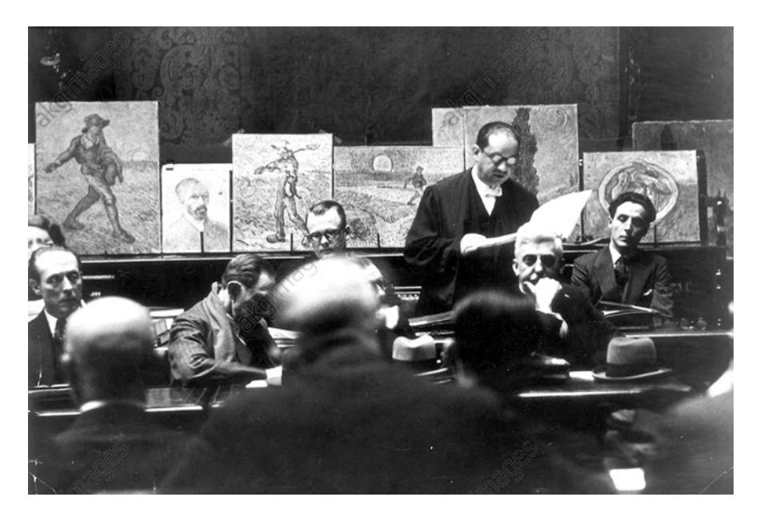

**Fig. 1.3** Otto Wacker on trial with the suspected Van Gogh forgeries in the background, 1932

had previously provided certifcates of authenticity for (some of) these works may have infuenced their judgment. Their behavior resembles a curious phenomenon described by Daniel Kahneman and Amos Tversky as the *sunk cost fallacy*: investors who have already lost money on a project several times are nevertheless likely to re-invest in the project (Kahneman and Tversky [1979](#page-40-11))[.8](#page-10-1) In any case, the court also invited a more independent expert to weigh in on the matter: Professor Ludwig Justi, director of the Nationalgalerie in Berlin, who had just exhibited Van Gogh paintings from the Kröller-Müller collection in the Kronprinzenpalais in December 1928 and used the occasion to compare these with ten of the Wacker Van Gogh pictures, which were hung nearby in his study. His conclusions were straightforward: all the Wacker pictures were "forgeries beyond any doubt"; each lacked the signs of the artist's struggle with his subject and they were, moreover, of varying quality in his view (Feilchenfeldt [1989:](#page-39-11) 295).

Furthermore, the court also consulted other specialists, including the Dutch chemist and restorer Martin de Wild, who had recently completed a PhD dissertation on the scientifc analyses of paintings (De Wild [1928](#page-42-2)), and the German restorer Kurt Wehlte. De Wild tested the oil paint in the contested pictures and found some unusual components: resin and lead had been mixed in with the oil, presumably to

8The *sunk cost fallacy* may also explain Hofstede de Groot's perseverance in the Hals controversy described above. He had invested both his reputation and actual money in his attribution of the *Laughing Cavalier* and the *Boy Smoking*.

make it dry faster.[9](#page-11-0) He had never encountered these chemicals in his analyses of securely attributed Van Gogh paintings and the chemical evidence was therefore persuasive. Wehlte made a close comparison of the painting technique based on x-radiographs of a Wacker painting and a reference work, demonstrating how the build-up of the paint layers differed noticeably. Ironically, the reference work he used has been de-attributed in 1970 and even labeled a forgery (De la Faille [1970:](#page-39-12) 594).[10](#page-11-1)

In hindsight, Wehlte's analysis therefore underscores –once again– the necessity of a clear frame of reference. Chemical evidence such as a x-radiographs proved very useful to study the build-up of paintings; however, without suffcient and secure reference data, no valid conclusion could be drawn. Likewise, De Wild's scientifc analysis was –to a large extent– a matter of interpretation. He could prove –without a doubt– the presence of resin and lead, but these were not anachronistic materials, as in the case of the Hals forgery[.11](#page-11-2) The validity of his conclusion thus hinged on his expert knowledge of reference works (which he had researched in depth for his dissertation). In this respect, his analysis was rather similar to the approach of Ludwig Justi, who compared a large number of genuine Van Gogh paintings with a very secure provenance to ten contested works (see above). Such a side by side comparison of securely attributed works and contested pictures was quite rare at the time (and it still is – due to the limited accessibility of the high value original works); art experts usually had to rely heavily on their visual memory (Wallert and Van de Laar [2011](#page-42-3): 70–71). Having secure reference material in suffcient quantity available greatly facilitated the interpretation. Only in this manner could one begin to answer crucial questions such as: How much consistency can one expect in an artist's inventions, style and technique, choice of materials and workshop practice?

Yet there was a sharp contrast between De Wild's observations and Justi's. While De Wild's data was clear and could be checked, Justi's observations remained more implicit. Like Hofstede de Groot and (Wilhem) Martin before him, Justi seems to have relied rather strongly on his intuitive insights, which he did not explain extensively. According to Justi one could recognize a genuine Van Gogh by studying the brushwork; each stroke 'has a very clear signifcance, because of its size and direction, its surface structure and colour, and also because of its relation to the surrounding brushstrokes'. He did not specify how exactly the brushwork deviated in the

9These elements had already been encountered in 1929 during a chemical analysis at the Nationalgalerie (*Die Kunstauktion*, 10 February 1929; *De Telegraaf*; Tromp 2006: 58 note 40). Presumably, the analysis was done by E. Täubner, chemist at the German National Museums, who declared in 1932 that he had researched 5 or 6 paintings at the Nationalgalerie, half of which were genuine and the others forgeries. Tromp 2006: 58.

10The work has gone missing during the Second World War, preventing further technical research. It can only be researched on the basis of photographs.

11Although de Wild is usually credited with the discovery of resin and lead (Charney [2015:](#page-39-9) 27), the presence of these elements was published already in 1929, see note 11.

Wacker paintings, stressing merely how 'obvious' it was to the eye. One 'had to be blind *not* to see it'! (Justi [1929;](#page-40-12) Feilchenfeldt [1989](#page-39-11))

It was precisely this absence of rational, communicable arguments that was a thorn in the side of the Dutch restorer Maurits van Dantzig. In 1937 he published a book entitled *Frans Hals: Echt of vals? (Frans Hals: Genuine or Fake?)* in response to the frst ever overview exhibition of paintings by Frans Hals in Haarlem (Van Dantzig [1937\)](#page-39-13). In the introduction he sharply criticizes art experts 'who have the habit of answering every question relating to the value of an artwork with the Yes! Or No! of their aesthetic feeling' and their refusal to make the experiences that underpin their aesthetic judgement explicit.[12](#page-12-0) In his view clear and verifable criteria were needed to determine if a painting was an original, copy, imitation, forgery or other type of work. He developed a new method, which he would later call 'pictology' (Van Dantzig [1947;](#page-39-14) Van Dantzig [1973\)](#page-39-15). On the basis of his own observations of the well-documented and securely attributed core oeuvre of Frans Hals, he made a list of 44 traits that he deemed characteristic of the artist. He subsequently applied the criteria to the 116 works on display and reached a devastating conclusion: only 33 were authentic works by Frans Hals in his view, 5 doubtful, 42 were wrongly attributed and 36 paintings were even forgeries in his opinion[.13](#page-12-1)

Van Dantzig's harsh conclusions initially met with a lot of resistance in Dutch art community. Trained as a restorer, Van Dantzig had no formal art historical training and was mocked by academic art historians. Tellingly, the frst Professor in Art History in the Netherlands, Wilhem Vogelzang (1875–1954), donated a copy of Van Dantzig's book to the Utrecht University library with the inscription: 'Handed over as an example of shoddy literature'[.14](#page-12-2) Indeed, Van Dantzig's conclusions were far reaching and some of the works he dismissed are nowadays seen as undisputed originals, such as *Jasper Schade* (National Gallery, Prague) and *Laughing Boy* (Mauritshuis, The Hague). Nevertheless, his insistence that clear rational arguments were needed, constituted an important step forward in history of connoisseurship. Moreover, his careful observations of the works of Frans Hals, Rembrandt and Van Gogh (for each of which he eventually compiled a list of over 100 visual characteristics) are still of great value to art historians (Van Dantzig 1978; Hendriks and Hughes 2009).

In his lists Van Dantzig made no reference to his intuitive expertise or 'feeling for style' (contrary to predecessors such as Martin and Hofstede de Groot). Instead, he wrote down in great detail what he had observed. He noted, for example, how Frans Hals had a habit of depicting his fgures in relaxed, natural poses, with limbs in angular constellations with each other and with the picture plane. "That is not coincidental. […] An angular position breaks through the picture plane and creates a connection with the viewer" (Van Dantzig [1937](#page-39-13): 7). He also had a sharp eye for the

12Van Dantzig [1937:](#page-39-13) 2.

13Van Dantzig [1937](#page-39-13): 3. Van Dantzig indicates in the introduction that he had seen more exhibitions that comprised doubtful works but this particular one exceeded all the others in his view: Van Dantzig [1937:](#page-39-13) 1.

14Storm van Leeuwen 1977: 89, note 3.

peculiarities of the brushwork: how Hals blended his fnal touches wet-in-wet with both foreground and background; and how he both painted and drew at the same time, indicating colours and shapes simultaneously, for example by depicting the highlight on the nose in the shape of the curvature of the nose. His systematic analysis of the oeuvre of Frans Hals constituted the frst step in developing his new method. The central idea is that attributions should be quantifed: buttressed by a large number of clearly and explicitly described characteristics, which could be checked and corrected by later scholars (Tummers [2011:](#page-41-0) 33 ff).[15](#page-13-0) Given his emphasis on objective criteria that could be checked, it is interesting that Van Dantzig does not mention the potential of chemical analyses when discussing forgeries. Although chemical evidence had started to play a signifcant role in court cases, it was far from usual in the regular authentication practice. When one of Van Dantzig's most talented pupils, Storm van Leeuwen, evaluated his master's legacy in 1977 he mentioned this oversight as an important lacuna (Storm van Leeuwen [1977\)](#page-41-7). It explained some of the resistance Van Dantzig had encountered in his view; he had dismissed paintings too quickly as forgeries, ignoring the potential of chemical analyses to confrm his suspicions.

While art experts were thus slow to incorporate chemical analyses in the authentication process, forgers were quick to use the chemical evidence presented in the different court cases to improve their skills (Wallert and Van de Laar [2011](#page-42-3)). They developed new techniques to make sure their paint layer would not dissolve when tested and they were more careful to select materials that were not anachronistic. Master forger Han van Meegeren, for example, started working with a new binding medium: he mixed fugitive oils with phenol-formaldehyde, also known as 'bakelite'. Using an oven to speed up the drying process, he created a paint layer that was just as hard as a naturally aged oil paint. Moreover, it allowed him to create a convincing pattern of cracks – which constituted another notoriously diffcult challenge for forgers. Furthermore, he started to paint forgeries on top of actual seventeenth century canvases and made great efforts to obtain pigments that were consistent with the period (Fig. [1.4\)](#page-14-0). Ironically, one of the most expensive pigments he purchased, natural lapis lazuli or ultramarine blue, later turned out to have been diluted with a cheaper modern blue (cobalt).[16](#page-13-1) It was an oversight that amused the later master art forger Eric Hebborn, who had the advantage of knowing the outcome of the Van Meegeren trial in 1945–47 (Hebborn [1991:](#page-40-13) 121–122).

15His method is reminiscent of the method pioneered by his famous Italian predecessor, Giovanni Morelli (1816-1891), who also insisted on closely describing visual clues (although Van Dantzig never mentioned Morelli in his writings, see Storm van Leeuwen 1979). See also above, note 2.

16According to his own saying Van Meegeren paid 5000 guilders (current value circa 35.500 euros) for 100 grams of natural lapis lazuli, see Wallert and Van de Laar [2011](#page-42-3): 79; see also Wallert and Van de Laar [2018](#page-42-4).

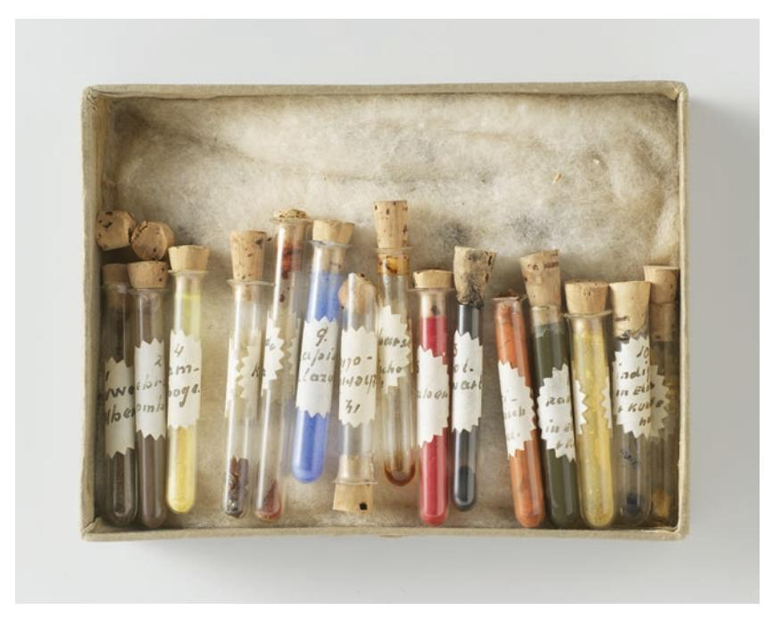

**Fig. 1.4** Tubes with pigments confscated in Van Meegeren's workshop in Nice and entered as evidence in the Van Meegeren trial, Rijksmuseum Amsterdam

# **1.3 The Van Meegeren Scandal: A Turning Point**

The Van Meegeren trial constitutes a defnitive turning point in the history of connoisseurship. After having created forgeries of old master paintings with tremendous success for over a decade, Van Meegeren was arrested at the end of the Second World War. The charge did not concern the forgeries, however, but a far more serious crime: treason through collaboration with the Germans. He was accused of having sold a crucial part of the Dutch cultural heritage, a painting by Johannes Vermeer, *The Adulteress*, to the German marshall Herman Göring without the necessary export permission. Caught between a rock and a hard place, Van Meegeren decided to reveal his deceit: he defended himself by stating that he had not sold an authentic Vermeer painting but, instead, a forgery by his own hand. Moreover, he claimed authorship of six other paintings in the styles of Pieter de Hooch and Vermeer, including the well-known *Christ and his Disciples at Emmaus* at the Boijmans Museum in Rotterdam. It resulted in a highly unusual court case, in which the forger was keen to prove his guilt, as it would free him of more serious accusations (Fig. [1.5\)](#page-15-0).

Despite an overwhelming amount of evidence, it was hard to accept the deceit for some of the art experts who had authenticated, bought or praised the paintings before. They had invested in the paintings in a material or immaterial way, and

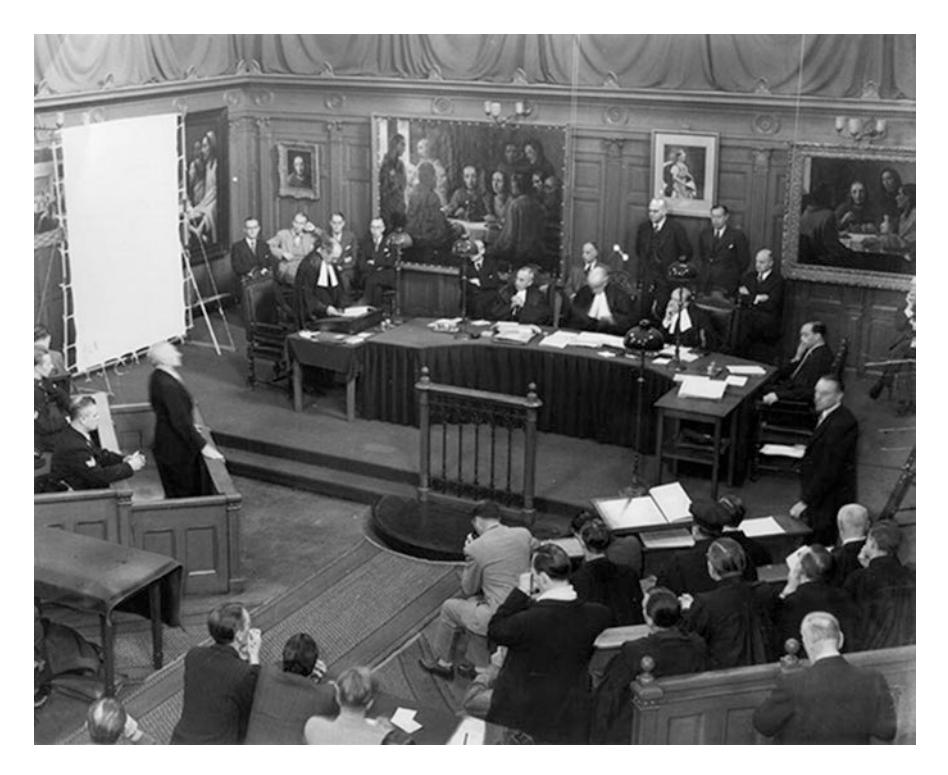

**Fig. 1.5** Court case against Han van Meegeren (lower left, on the accused bench) 29 October 1947 (featuring his forgery *Christ and his Disciples at Emmaus* in the background at the right)

therefore seem to have been prone to the so-called *sunk cost fallacy* (see above and Kahneman and Tversky [1979](#page-40-11)). For example, when the trial had already started Federica Bremmer still included the painting *Christ and his Disciples at Emmaus* in a revised edition of her survey of art history, stating: 'As my personal opinion I would like to state that it is completely unacceptable that this work, which has no equal in the expression of a deep religious emotion, could have been painted by a cowardly cheater […] If this work is indeed old, Vermeer would be the only painter who could have created it. After serious consideration, we have therefore decided to keep the painting in its place for the time being' (Bremer [1945:](#page-39-16) foreword).

After the trial reached a conclusion, it had become virtually impossible to deny Van Meegeren's claim[.17](#page-15-1) Not only had the police found evidence of the forgeries he had created in his workshop in France, Van Meegeren had demonstrated how he

17Nevertheless, Dirk Hannema, the director of the Boijmans Museum who had purchased the painting, would continue to believe in its authenticity until his death in 1984, and so did D.G. van Beuningen, owner of one of the Vermeer forgeries (*The Last Supper*). Moreover, the Flemish art dealer Jean Decoen tried to disprove the chemical evidence presented in the court case by Professor Coremans in several publications and Van Beuningen repeatedly threatened to sue Coremans over the matter (Decoen [1951](#page-39-17); Van de Brandhof [1979:](#page-39-18) 9–10). In 1968 Bernard Keisch published new

created his forgeries by making a new one in prison. Moreover, an elaborate expert report confrmed that the pictures could not possibly date from the seventeenth century. It was written by seven prominent paintings experts: Prof. dr. Paul Coremans, head of the Central Laboratory of Belgian Museums, Dr. Wiebo Froentjes, a chemist working for the Dutch Ministry of Justice, Dr. Harold J. Plenderleith, Keeper of the Research Laboratory of the British Museum in London, F. Ian G. Rawlins, Assistant Keeper of the National Gallery in London, Prof. dr. I.Q. van Regteren-Altena, Professor in art history at the University of Amsterdam, Dr. H. Schneider, former director of the National Institute for Art Historical Documentation (RKD) and Dr. Martin de Wild, the chemist and restorer who had also been consulted by the Berlin court during the Wacker trial.

The strongest evidence concerned the new binding medium Han van Meegeren had used. As we have seen, Van Meegeren painted his forgeries on top of authentic seventeenth century canvases and made great efforts to obtain pigments that were consistent with the period. In departure from seventeenth-century practice, however, he employed a modern binding medium, phenol-formaldehyde, which allowed him to imitate the cracked and hardened surface of centuries-old oil paintings. With two different tests involving a sulphuric acid solution and an ammonia solution, which caused yellow and blue discolourations, the chemists were able to demonstrate its presence throughout in the contested works (Huussen [2009](#page-40-14): 99; Tummers et al. [2019b:](#page-41-8) 999). Phenol-formaldehyde had only been invented in 1907; thus, these paintings could not have been created before the twentieth century. [Furthermore, the presence of cobalt blue also pointed to a later date, see above.]

The stylistic analysis of the paintings written for the court emphasized many shortcomings which -according to the experts- did not agree with an attribution to Vermeer, such as the unclear defnition of the space and the unhealthy fesh colour of the faces (Schneider [1947](#page-41-9)). For the purpose of legal proof it was not necessary to delve deeply into the stylistic interpretations. But it was certainly curious that the paintings had been described in radically different ways before and after Van Meegeren's confession, especially *Christ and his Disciples at Emmaus*. Both before and immediately after the trial, art historians described the picture in quite generic terms strongly infused with value judgments (Weerdenburg [1988\)](#page-42-5). Before the trial the painting was said to be 'Vermeer's best work' (Bredius [1937](#page-39-19)); the composition was said to be well-balanced, the colors exquisite, the still life better than any other from the period, Christ's face was 'flled with secrecy' (Knuttel [1938](#page-40-15)) and the maid 'perhaps the most beautiful one Vermeer ever painted' (Van Thienen [1939\)](#page-41-10). After the trial, the composition was seen as unbalanced and rather forced, the colors too gray, Christ's face decidedly effeminate (Kilbracken [1967](#page-41-11)), the maid cross-eye and bald, and her lips too thick (Van Dantzig [1947\)](#page-39-14)[.18](#page-16-0)

scientifc proof confrming the status of both these Van Meegeren paintings as forgeries based on the radioactivity of the lead (Keisch [1968\)](#page-40-16).

18 In attribution matters it is often striking how differently the quality of paintings is judged when their attribution changes, even when the same expert re- or de-attributes the work. Though this could be done maliciously to massage the evidence in order to convince the reader of one's judg-

The mistaken attribution was perhaps somewhat understandable. Van Meegeren had created such a convincing pattern of cracks that even the restorer who cleaned the painting for the Boijmans Museum failed to notice that the work did not date from the seventeenth century (Van Dantzig [1947](#page-39-14): 63). In art-historical terms, the situation was not clear-cut. *Christ and his Disciples at Emmaus* had been recognized as an early work by the art historian who discovered the painting, Abraham Bredius, and in his early period, Vermeer varied his style and technique considerably.[19](#page-17-0) Moreover, the reference material Bredius and others were using had been 'polluted' as similar forgeries had already been accepted as authentic (Wallert and Van der Laar [2011\)](#page-42-3).

Nevertheless, the Van Meegeren trial exposed a serious shortcoming in connoisseurship. A large number of experts had clearly been unable to distinguish between an authentic old painting and a forgery. Moreover, they had even celebrated a forgery as one of Vermeer's best works. This painful conclusion not only affected the reputation of connoisseurs in the feld of Dutch painting more than any previous error had done, it also heightened the awareness of the diffculties involved in attributing and dating paintings. In the aftermath of the court case, scholars became more cautious when authenticating and dating pictures. Attributions based on the intuition of an expert without much explanation were no longer acceptable. From now on arguments were needed. As Arie Bob de Vries, then director of both the Mauritshuis and the National Institute for Art Historical Documentation (RKD), put it: 'every attribution must be supported by evidence, insofar as one can provide proof in the thorny feld of such conclusions' (De Vries 1939 [ed. 1948]: 71). De Vries, who had published a Vermeer oeuvre catalogue just before the start of the Second World War in 1939, revised his book considerably in 1948, bringing down the number of paintings he categorized as authentic Vermeers from 43 to 35 – a selection that has hardly been debated or altered since then (Tummers [2011:](#page-41-0) 27–29).

## **1.4 Excessive Optimism: The Potential and Limitations of Scientifc Techniques**

After the Van Meegeren scandal, art historians did not only specify in much greater detail what visual observations, archival and documentary evidence led to their attributions, but also gradually started to expand their visual analysis by systematically integrating scientifc techniques. In Belgium, a National Centre for Research of the Flemish Primitives was established in 1949, which resulted in the publication

ment or save one's reputation, it could also be the effect of (altered) subconscious associations and expectations, which can truly make us look differently. It would be a fascinating subject for further research.

19Compare Johannes Vermeer, *Christ in the House of Martha and Mary*, c. 1655, National Gallery of Scotland, Edinburgh; Johannes Vermeer, *Diana and her Companions*, c. 1655-56, Royal Picture Gallery Mauritshuis, The Hague.

of numerous technical studies, including Prof. Coremans' technical analysis of Jan and Hubert van Eyck's famous *Ghent Altarpiece* in 1953 (Coremans [1953\)](#page-39-20). Although early technical studies concentrated mostly on x-radiography and pigment analyses of paint samples, these were soon expanded with new techniques (Ainsworth [2005\)](#page-38-0). Van Asperen de Boer, a physicist in the art history department at the University of Groningen in the Netherlands, was the frst to develop infrared refectography (IRR) for the study of paintings, a technique which proved particularly useful for examining early Netherlandish pictures as it exposed detailed underdrawings in these works (Van Asperen de Boer [1969\)](#page-38-1).

In the feld of seventeenth century paintings, the Rembrandt Research Project, founded in 1968, constituted a major step forward. At the initiative of Bob Haak, curator of old masters at the Amsterdam Historical Museum, a team of fve leading Rembrandt experts set out to redefne Rembrandt's entire painted oeuvre: Josua Bruijn, Professor of art history at the University of Amsterdam, Haak himself, Simon Levie, the director of the Amsterdam Historical Museum, Pieter van Thiel, curator of old master paintings at the Rijksmuseum and Ernst van de Wetering, staff member of the Central Research Laboratory of Objects of Art and Science. At the start of the project, many connoisseurs were doubtful about the validity of existing attributions to Rembrandt. For example, Horst Gerson, professor of art history at Groningen University, noted in the introduction to his 1968 monograph on Rembrandt that he largely agreed with what British collectors tended to say about Dutch old masters, namely that 'nearly half of the old masters are wrongly attributed and the others are not old at all' (Gerson [1968](#page-39-21): 160). He also pointed out that no Rembrandt scholar had ever even seen all possibly authentic Rembrandt paintings in real life (Tummers [2011](#page-41-0): 40).

The members of the Rembrandt Research Project were the frst to do so. In pairs of two they traveled the world, observed over 600 potential Rembrandt paintings in real life, described these in painstaking detail, and decided on the attributions as a group. Moreover, they tested a variety of scientifc techniques systematically as to their merit in sorting out Rembrandt's oeuvre. Whereas previous generations of art historians had been hesitant and sometimes even skeptical about incorporating chemical research, the members of the Rembrandt Research Project signaled rather an excessive optimism: a relatively widespread belief that science held the answers and could potentially replace the eye in matters of attribution (Bruyn et al. [1982–](#page-39-3), vol. I: XIIIff). However, their systematic application of technical research methods proved otherwise.

Dendrochronology proved useful in dating the oak panels Rembrandt used for his early paintings. By determining the approximate year in which the tree used to make the panel was felled, the technique provides a 'terminus post quem' that is, dates after which the painting had to have been made. Tests executed by Peter Klein and his team at the Ordinariat für Holzbiologie at the University of Hamburg provided surprising results when applied to paintings that the Rembrandt Research Project had originally considered later imitations (Bruyn et al. [1982](#page-39-3)–, vol. I: XII). Most of these turned out to be done on authentic seventeenth-century panels, which in combination with other observations eventually led to the conclusion that the works *did* date from Rembrandt's time.

X-radiographs proved to be valuable in reconstructing Rembrandt's working process in terms of how he laid out his compositions and the order in which he executed various parts of a painting. X-ray images show especially lead-containing pigments very clearly, and since canvases were usually primed with a leadcontaining coating, X-radiographs also allowed the group to study the structure and density of the original canvases on which the paintings were created (Van de Wetering [1986](#page-42-6)). This was important information that could not be acquired with the naked eye, since the canvas of most seventeenth-century paintings has since been covered by a second, more recent canvas. The Rembrandt Research Project's study of these canvases led to several striking conclusions, especially when the works had been cut down, or when the same faw was found in the weaving of more than one painting, showing that they had been painted on canvas from the same bolt. Findings of that kind made it seem likely that the canvases had been bought in one batch and had all been used in Rembrandt's studio.

Ultraviolet radiation and photographs and infrared refectographs proved less informative. The former can be helpful in identifying later retouches, though its use depends largely on the condition of the varnish, making it a rather inconsistent source of information. Infrared refectography, which is mostly used to study carbon-containing underdrawings, did not yield a large amount of information, as no underlying drawing in an absorbent material was discovered in Rembrandt paintings. For this reason, the Rembrandt Research Project decided against investing in this technique[.20](#page-19-0)

Neutron activation autoradiography yielded insights about the master's working method, but was too costly to be used on a large scale. Most signifcant in this respect was the investigation by the Metropolitan Museum of Art in New York in the early 1980s, the results of which were also studied by the Rembrandt project (Ainsworth et al. [1982\)](#page-38-2). By making several paintings temporarily radioactive and subsequently recording the radiation of the various pigments in a number of photographic plates, a clear picture emerged of the areas in which the different pigments had been used. This gave scholars information on paint layers below the surface that could barely, if at all, be detected with other techniques.

Lastly, samples of the paint and ground layers gave mixed results. Rembrandt's pigments were found not to differ much from those of pupils and contemporaries, or even from those used by his followers. Analyses of paint samples were therefore hardly of any use when trying to identify the master's hand. Only in the rare instances when a pigment was found to have gone in or out of use at a certain moment did a paint sample give an indication as to when a painting was made. For example, the presence of lead-tin yellow made it likely that a painting was made

20Further research might still yield some interesting insights, as some information about the various paint layers can also be seen in infrared refectographs and increasingly refned cameras make it possible to recognize thin underdrawings which earlier models cannot distinguish.

before 1750, as the pigment fell out of use at that point.[21](#page-20-0) As to the ground layer, only one component was found to be signifcant for authentication purposes: after decades of study, the chemist Karin Groen discovered that the grounds in paintings by Rembrandt and his studio contain quartz from 1642 onwards, an element she had not encountered in other grounds from the period (Groen [2005\)](#page-40-17). Presumably, Rembrandt trained his studio to prepare his own grounds when he was working on the *Nightwatch* and his studio continued to do so afterwards.

Gradually it became evident that technical examination seldom provided absolute certainty concerning attributions. While a technical or chemical analysis *can prove* that a work is *not authentic* by demonstrating, for example, that the materials used are anachronistic, a positive attribution cannot be done without a visual analysis. For if the materials are consistent with the period, one still needs to analyze the particular 'handwriting' of the artist in order to determine if the attribution is correct, to differentiate between different types of workshop products, contemporary copies and imitations. In practice, the researchers identifed only one potential forgery among the more than 600 paintings they studied (Bruyn et al. [1982:](#page-39-3) XX, C12); the evidence was rarely conclusive.

Furthermore, regarding their methodology, the Rembrandt Research Project concluded: 'It is a mistake to think that even the most meticulous argument for or against the authenticity of a painting covers the whole of the visual experience that led to that opinion' (Bruyn et al. [1982–](#page-39-3), vol. 1: XV).[22](#page-20-1) Although the team members had made great efforts to make their arguments explicit, they did not think it covered all of their implicit knowledge (in other words, they had used both Kahneman's systems 1 and 2, see above). Nevertheless, their elaborate, systematic approach contributed signifcantly to refning the attribution process. Their lengthy and very detailed descriptions made it possible to analyze and check attributions, their underlying assumptions and possible biases to a much greater extent than had been possible before.

In the late twentieth century, technical art research came into its own as a signifcant new area of study that came to be known as 'technical art history'. The term was coined in the 1990s by David Bomford, senior paintings conservator at The National Gallery in London, who also called technical art history 'new school connoisseurship'. Bomford himself contributed signifcantly to the feld, especially through the *Art in the Making* series, which he wrote together with conservation scientist Ashok Roy and curator Christopher Brown. This type of research was done mostly in a museum context as a collaboration between conservators, conservation scientists and curators, and commonly focused on a few related works of art rather than on sorting out an entire oeuvre. An excellent early example is the technical study of Rembrandt paintings at the Mauritshuis in The Hague which appeared a few years before the frst *Corpus* volume was published (De Vries et al. [1978](#page-42-7)).

21When Van Meegeren created his forgeries, lead-tin yellow had not been discovered yet, so this fnding was also useful for the identifcation of forgeries, see Wallert and Van der Laar [2011](#page-42-3): 90 ff. 22On the changes in the project and its methodology throughout the years, see Tummers [2011](#page-41-0): 39–50. See also Van de Wetering et al. [2005](#page-42-8): XIII.

Bomford described the goal of this 'new school connoisseurship' as the study of all the processes for making art and the technical and documentary means which throw light on those processes. It is principally concerned with the physical material and structures of works of art but also charts the stages of invention, development, elaboration and revision (Bomford [2008\)](#page-39-22). Like the members of the Rembrandt Research Project, Bomford was well aware of the limitations of the technical research for authentication purposes, and stated that 'new school connoisseurship is old school connoisseurship with technology'[.23](#page-21-0)

The usefulness of the various techniques varied somewhat from one master to the next. For example, Vermeer seemed more distinct in his use of specifc pigments, particularly in the use of the expensive lapis lazuli mixed in with other pigments to create background colours (Sheldon and Costaras [2006](#page-41-12)); and infrared refectograms of works by one Rembrandt's most talented pupils, Carel Fabritius, gave some spectacular results in that these revealed the artist's signature in several darkened backgrounds (Duparc [2006\)](#page-39-23). Nevertheless, many of the key questions for authenticating works of art remained the same, notably the question how much consistency one could expect in the masters technique, choice of materials and workshop practice. Only in the case of anachronistic materials, chemistry and other scientifc analyses could provide conclusive evidence and expose forgeries or misattributions. In all other cases, the authentication or attribution process remained a matter of interpretation; it rather resembled detective work, combining circumstantial evidence and probabilities.

## **1.5 Paradigm Change and Myriad New Techniques**

In the late twentieth and early twenty-frst century an important paradigm change took place in the humanities that has far reaching consequences for the art authentication, especially in the feld of old master paintings. Since the 1980s, there had been a growing concern that the twentieth-century practice of classifying old master paintings may be at odds with early modern categories of thought. Ernst van de Wetering, the leader of the Rembrandt Research Project (RRP), raised the issue most poignantly in 1992, when he gave a lecture entitled 'The Search for the Master's hand: An Anachronism?' at the 28th International Art History Congress in Berlin (Van de Wetering [1992](#page-42-9)). He wondered if the core mission of the RRP, namely to distinguish between the master's own hand and those of pupils, assistants and imitators, agreed with seventeenth-century workshop practice. Would early modern viewers have expected a 'Rembrandt' to be purely autograph? It was indeed a crucial issue, with serious implications for attribution issues. For how could one recognize the master's hand by studying the brushwork in a variety of details, if that

23Lecture 2013 at Bard Graduate Center in New York, 10 September 2013; cited in Chapman and Weststeijn [2019](#page-39-2): 17.

brushwork was not necessarily executed by the master himself but possibly by a pupil or assistant?

According to Van de Wetering, not enough research was done to draw any conclusions with certainty. Nevertheless, several authors believed that early modern painters, such as Rembrandt, consciously produced paintings that give the effect of individuality without necessarily painting the pictures entirely by themselves (Alpers [1990](#page-38-3); Kirby-Talley [1989](#page-40-18); Grimm [1993\)](#page-40-19). The debate highlighted the need for contextual knowledge.

In the early twenty-frst century several larger studies yielded insights into early modern views on quality and authenticity, while raising awareness of various types of workshop collaborations (Tummers [2011](#page-41-0); Guichard [2014\)](#page-40-20). Gradually it became clear that old masters often had more than one style and working method (Gifford and Glinsman [2017](#page-39-24)). Their style and technique could vary considerably depending on the price of the painting, its subject, function and location. Furthermore, ingenious masters sometimes deliberately varied their styles to showcase their virtuosity, including notably Goltzius and Rembrandt (Van Mander [1604,](#page-41-13) fol. 284v; Melion [1990;](#page-41-14) Leefang and Luijten (eds.) [2003:](#page-41-15) 210–215; Van de Wetering et al. [2005:](#page-42-8) 166). Moreover, there were many different types of workshop products and quality levels. What exactly a master painter deemed of high enough quality to carry his/her name, varied from one painter to the next, and could also vary over the course of an artist's career. Rubens, for example, distinguished between fve different types of paintings produced in his workshop and prices these according to their quality, witness a letter by him dated 28 April 1618 (Rosenberg (ed.) 1888: 42 ff). Occasionally, master painters even sold pictures that were entirely by workshop assistants as their own. If the quality level was suffcient, the master painter had the right to do so according to guild regulations. Interestingly, some masters even used different signatures to indicate different quality levels – a practice that was long forgotten but must have been quite common in early modern times (Tummers [2011:](#page-41-0) 79–111, esp. 94–97).

In short, the very notion of what constituted 'authenticity' was redefned. As result, authentication decisions became more complex. In order to judge the authenticity and quality of a painting, one had to know what these terms meant at the time in which the painting was made and familiarize oneself with the then current categories of thought as well as with the specifc master's workshop practice. An authentic Rembrandt could not be simply judged with the same criteria as an authentic Van Gogh (which one can reasonably expect to be autograph). A detailed understanding of the context in which a picture was created, provides insight as to what to look for and what not to look for. For example, seventeenth century experts had a rather hierarchical way of looking; they made a clear distinction between key elements and so-called 'bywork' and had developed nuanced terms for identifying mastery – which are useful when assessing paintings from this period. When judging pictures from this period, a simple binary perspective (either by the master or not) did no longer suffce.

While the framework for thinking about issue of authenticity within the humanities thus became increasingly nuanced, the technical means and chemical methods to research paintings developed at an unprecedented pace. As we have seen, early

twentieth century connoisseurs relied heavily on their visual memory when authenticating paintings (see Sect. [1.2](#page-5-1)). Since then, photographic material has become much more readily available, and its quality and resolution have improved dramatically, especially in the last decades. Moreover, numerous new analytical techniques were developed for the study of paintings. Especially macro x-ray-fuorescence scanning (MA-XRF) and hyperspectral imaging (HSI, also called refectance image spectroscopy or RIS) are currently revolutionizing the feld.

Macro x-ray-fuorescence scanning (MA-XRF) is a relatively new technique that allows for the visualisation of the distribution of elements in a fat sample, such as an easel painting, in a non-destructive manner. This is achieved by scanning the surface of the sample with a focused X-ray beam, and analysing the emitted fuorescence radiation. As the X-ray beam scans the whole painting, it produces thousands, sometimes millions, of data points. These can be plotted on elemental distribution maps, which may be interpreted as pigment distribution images (Alfeld et al. [2011](#page-38-4), [2013\)](#page-38-5). The technique is much more precise than x-radiography as it is able to distinguish between different chemical elements and therefore allows for a much more precise understanding of a painter's working process and the build-up of his pictures.

Hyperspectral imaging (HSI/RIS) is a technique that combines two-dimensional visualisation of the painting by optical imaging (such as photography) with optical spectroscopy. It is done in such a way that each pixel of the image is made to represent a complete spectrum of that pixel. Whereas a regular camera records three different wavelengths of the electromagnetic spectrum (corresponding to the colours red, blue and green), modern hyperspectral cameras can easily differentiate between hundreds of wavelengths, resulting in very precise digital images or 'data cubes' (see the article by John Delaney in this book). It is particularly useful for identifying the distribution of specifc paint mixtures throughout a painting, although it can also be used to identify specifc chemical elements.

Both MA-XRF and HSI proved useful to enhance our understanding of Frans Hals' hallmark techniques and materials, to give just one example (Tummers et al. [2019a](#page-41-16)). Furthermore, the insight MA-XRF provided in Hals' painting technique was also helpful for the identifcation of a potential forgery in style of Hals, rumored to be by Han van Meegeren (Tummers et al. [2019b\)](#page-41-8). In the latter case, the son of the master forger had claimed that the painting was forgery by his father, but could be proven wrong with modern analytical techniques. Initially, GC-MS (a method of separating and identifying complex mixtures of organic molecules) seemed to prove that the binding medium did not contain phenol-formaldehyde, but when the same test also gave a negative result for a well-documented (and phenol-formaldehyde containing) Van Meegeren forgery in the style of Frans Hals, the test could not be seen as conclusive. A lead isotope analysis by Gareth Davies and Paolo d'Imporzano of the Geochemical Laboratory for Ultra-Low Isotopic Analyses in Amsterdam *did* provide solid evidence in combination with secure reference data gathered in the context of the NWO project *Frans Hals/not Frans Hals project* (2016–2018). The analyses indicated that the lead ores in the lead white used by Van Meegeren came from a completely different location than Hals's lead white (on this technique, see also the essay by Davies and d'Imporzano's in this book). The lead isotopes ratios in the contested painting were consistent with those found in Hals paintings, not at all with those found in a Van Meegeren forgery: the painting could not possibly be by Van Meegeren. Subsequently, an in-depth analysis of the style, build-up and painting materials (using observations done with the naked eye, a dino-lite microscope, MA-XRF scans and an occasional paint sample) strengthened the attribution to Hals and his workshop, including Hals's distinctive use of indigo blue (identifed with Raman spectroscopy).

In short, in this particular case, documentary evidence turned out to be unreliable and a modern analytical technique provided a false negative. Nevertheless, the range of possibilities in the attribution issue was greatly reduced with the aid of modern analytical techniques. Especially when combined with a visual analysis, in-depth technical research has great potential for art authentication.

Although technical art history has expanded enormously, especially in pioneering museum studies, in practice surprisingly little technical research is used for most attributions. In prominent oeuvre catalogues and scholarly attributions, it is often not used at all (Dumas et al. [2020](#page-39-25)). On the market, well-known auction houses use technical research only rarely to strengthen attributions (eg. Ginzburgh et al. [2019\)](#page-40-21) – although its use is increasing since auction house Sotheby's founded a scientifc department in 2016.[24](#page-24-0) By far most well-known masters' oeuvres have not been researched yet with (all) the newest techniques and therefore the chances of discovering signifcant discrepancies between original paintings and forgeries and misattributions are currently high. Obviously, forgers and imitators from a different period cannot have mimicked specifc materials and techniques, if these materials and techniques were not known to them.

In some instances, research into a specifc artist's oeuvre with the newest techniques makes the creation of new forgeries virtually impossible. A good example is the project *REVIGO: Reassessing Vincent van Gogh* (2013–2017), a collaboration between researchers from the Van Gogh Museum, Tilburg University, Delft University of Technology, the Cultural Heritage Agency of the Netherlands and the Rochester Institute for Technology in New York, funded by the Dutch Science Foundation (NWO).[25](#page-24-1) Because of the natural ageing and discoloration of Van Gogh drawings, recent forgeries are bound to fall short: either the ink contains the right pigment(s) and has the wrong colour or the ink has the right colour but not the right pigments. In most other cases, however, the situation is not so clear-cut, and additional research, reference data and analytical tools are urgently needed.

24 Ironically, while serious in-depth technical studies for attributions are relatively rare, highly dubious paintings are often accompanied by questionable 'scientifc' reports, as every active curator in the feld knows. These reports are commonly presented as 'proof' for a concrete attribution on the basis of a logical fallacy: no anachronistic elements were discovered in the painting therefore it must be by the artist.

25 [https://www.vangoghmuseum.nl/en/about/knowledge-and-research/completed-research](https://www.vangoghmuseum.nl/en/about/knowledge-and-research/completed-research-projects/revigo)[projects/revigo](https://www.vangoghmuseum.nl/en/about/knowledge-and-research/completed-research-projects/revigo)

# **1.6 The Digitally Enhanced Eye: Connoisseurship and Smart Tools**

While only a small fraction of the paintings of well-known masters have been subject to in-depth technical research, the data gathered is nevertheless substantial and increasingly rapidly. Especially the data collected with advanced photography and scanning methods such as MA-XRF and HSI/RIS is considerable. We have entered a digital age that comes with entirely new challenges and potential. How to manage and properly interpret vast amounts of data? In what way and to what extent can digital techniques facilitate art authentication?

In the early twenty-frst century, various computer scientists have been developing computer programs with the intention of facilitating the attribution process, focusing in particular on brushstroke analysis. For example, at the end of 2004, a team from Dartmouth College in Hannover, New Hampshire, developed a method to analyze pen lines and brushstrokes, based on an algorithm that proved useful in court for the identifcation of manipulated photographs (Lyu et al. 2005/06). With the aid of so-called 'wavelets', Siwei Lyu, Daniel Rockmore and Hany Farid were able to isolate pen- and brushstrokes and analyze their direction, scale and relation to surrounding strokes. They assumed that every artist had a unique way of applying ink and paint to the surface, which results in a kind of virtual signature that can be analyzed by a computer without analyzing the subject matter. Since subject matter is however likely to affect the variability of the strokes, they only compared works with similar subjects.

The program they developed successfully confrmed existing attributions in a training set, and so did several other programs (Johnson et al. [2008;](#page-40-22) Hendriks and Hughes 2009; Li et al. 2012; Van Noord et al. [2015\)](#page-41-17). However, thus far such programs have not been used to make new attributions or to confrm or exclude attributions in court – which is related to the complexity of such decisions. Complicating factors include, among other things, the condition of the painting studied (for example, old master paintings virtually always include restorations and later retouches which 'muddy' the data). Also, as we have seen, artists sometimes deliberately varied their styles and techniques, and/or used assistants in the execution of their works, which further complicates the analysis. In short, computer programs that can make decisions in the connoisseur's place remain -thus far- elusive. As of yet, it is unclear if these can be realized in the near future; the need for contextual knowledge may prove too formidable a hurdle.

However, digital techniques have shown great potential in facilitating in-depth comparisons. Based on Erdmann's work in this area over the past ten years and the ongoing NICAS project *21st Century Connoisseurship* we will discuss some of our main conclusions regarding the merits, challenges and potential of a number of digital techniques aimed to facilitate comparison below. These pioneering tools are currently mostly in use at the Rijksmuseum; the aim, however, is to open these up for wider use in the future.

Given the situation in which we now fnd ourselves, with an overabundance of data coming from a variety of sources, with an emphasis on imaging data, there is a strong need to process the data in a way that promotes honest comparisons. These comparisons rely heavily on accuracy and consistency since fundamentally, we must ensure that when the viewer sees differences between images artworks it is because they are in fact different, and not due to differences arising in the capture or subsequent processing of the imaging data. Furthermore, given the importance of materiality for judging both the condition and the attribution of paintings, imaging should strive to capture as much of the materiality of the artworks as practically possible. The following principles, while not comprehensive, serve as prescriptive guidelines for enhancing the utility of digital tools for authentication purposes:

- *Consistent high-resolution imaging*: Modern digital cameras and lens systems are capable of capturing images with extremely high spatial sampling resolutions, so that even small artworks can be captured with many overlapping tiles of high-resolution photographs. The value of such photographs is immense since they reveal microstructural details that are hidden at normal resolutions: paint pigment particles, cracks, retouches, areas of abrasion, nuances of brushstrokes or pen lines, subtle or small-scale pentimenti (corrections) and other details of artistic technique, details of the support, and many other aspects of the materiality of the artwork. In the absence of an ability to physically inspect all relevant artworks side-by-side, consistent sharp, and well-lighted digital photos are the best available option.
- *Consistent color management and processing*: Images collected by different photographers, with different light sources, or at different institutions will invariably display differences due to imaging technique. To the degree possible, these differences in equipment and technique should be minimized. Even so, differences will remain, but these variations can be minimized by performing careful color management during the processing of the raw photos. The variations in lighting and wavelength-dependent pixel sensitivity are minimized by always photographing a colorimetric standard (e.g., an XRite ColorChecker SG color card) as part of a standard workfow, so that a color profle can be made which will adjust the as-captured colors to their correct values. Imaging guidelines such as the Metamorphoze Guideline[s26](#page-26-0) or the FADGI Guidelines[27](#page-26-1) have proven useful in defning best practices and criteria for acceptable image quality.
- *Careful state-of-the art processing:* The use of high-resolution imaging generally leads to a collection of images spanning the artwork, and the use of additional technical imaging techniques such as radiography, infrared refectography, or refectance imaging spectroscopy further leads to multiple images describing any given point on the object. Among the desirable features of such a system are

26 [https://www.metamorfoze.nl/sites/default/files/publicatie\\_documenten/Metamorfoze\\_](https://www.metamorfoze.nl/sites/default/files/publicatie_documenten/Metamorfoze_Preservation_Imaging_Guidelines_1.0.pdf) [Preservation\\_Imaging\\_Guidelines\\_1.0.pdf](https://www.metamorfoze.nl/sites/default/files/publicatie_documenten/Metamorfoze_Preservation_Imaging_Guidelines_1.0.pdf), accessed 2021-03-04

27 [http://www.digitizationguidelines.gov/guidelines/FADGI%20Federal%20%20Agencies%20](http://www.digitizationguidelines.gov/guidelines/FADGI%20Federal%20%20Agencies%20Digital%20Guidelines%20Initiative-2016%20Final_rev1.pdf) [Digital%20Guidelines%20Initiative-2016%20Final\\_rev1.pdf](http://www.digitizationguidelines.gov/guidelines/FADGI%20Federal%20%20Agencies%20Digital%20Guidelines%20Initiative-2016%20Final_rev1.pdf), accessed 2021-03-04.

the following: (a) it should respect the details of human color perception since naive averaging of RGB pixel values does not result in perceptually averaged colors; (b) it should avoid any tears or duplications when assembling the component tiles in a single whole-artwork image; (c) it should use high-order interpolation kernels to avoid introducing blurring or ringing artifacts when performing the inevitable resampling of the images during the stitching; and (d) it should ensure subpixel precision when performing registration among the different imaging modalities, so that data from one imaging modality is fused with the data from another modality at the same physical location on the artwork. Erdmann ([2016a](#page-39-26), [b\)](#page-39-27) developed such a system as part of a comprehensive campaign of imaging and study of the oeuvre of Hieronymus Bosch, and this system is now in permanent use at the Rijksmuseum.

## *1.6.1 The Curtain Viewer*

Meaningful comparisons between artworks or between different areas of an artwork are essential to the connoisseur's judgement. Even with a collection of consistent color-managed high-resolution images, traditional image-editing tools such as Photoshop are ill-suited to making frictionless comparisons among many works or among different imaging modalities of a single work. The problem is exacerbated when the images themselves are very large; 20 μm/pixel resolution (1270 ppi) 16-bit color imaging consumes 15 GB/m2 , so large-format paintings such as Hals' militia company portraits or Rembrandt's Nightwatch consume hundreds of gigabytes each. Side-by-side comparisons of such artworks may then be practically impossible using standard image-editing software due to memory limitations. Furthermore, such an approach makes it very diffcult to save a comparison for later review, and collaborative inspections are impractical.

In response to these diffculties, in 2012 Erdmann developed an internet-based viewer for very high-resolution images with an explicit design goal of enabling frictionless comparisons between images. As with other web-based image viewers, the viewer, which he named the Curtain Viewer, utilizes image pyramids so that a cascade of image resolutions is pre-computed and stored on the server as small tiles to enable immediate on-demand zooming and panning without the need to pre-load large images.

The Curtain Viewer enables comparisons using a variety of modes, several of which are shown in Fig. [1.6:](#page-28-0) A "gallery mode" allows the user to juxtapose an unlimited number of viewing panes, each of which is unconstrained. Constraints can be placed among the panes in a "sync mode", so that they zoom or pan the same way simultaneously. The way an artist depicts a detail is strongly dependent on the scale of the depiction, so this feature enables a user to zoom in to a pair of details in different artworks while ensuring that each is presented at the correct scale, and by synchronizing their scales they can zoom out to compare their contexts or zoom in to compare their details without fear of being deceived by scale differences.

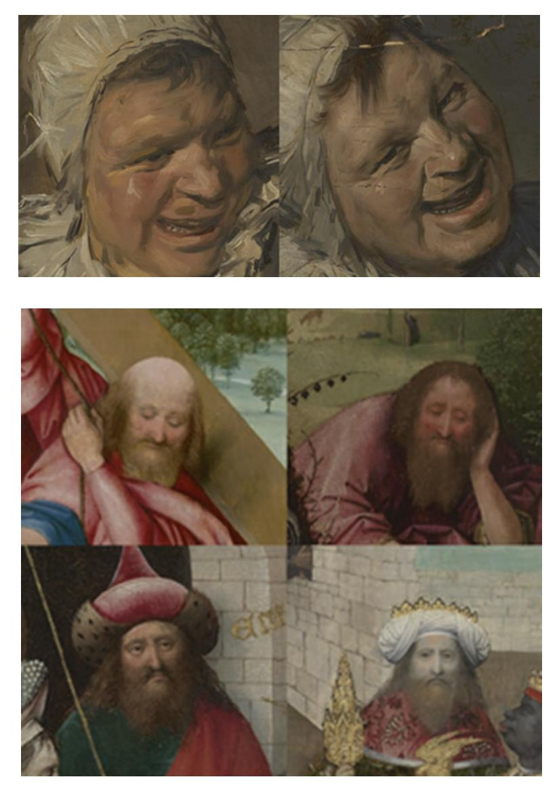

**Fig. 1.6** The Curtain Viewer utilized in several of its viewing modes. (**a**) Hals' *Malle Babbe* (Gemäldegalerie) and Van Meegeren's forged version (Rijksmuseum); (**b**) a study of several similar fgures appearing in the oeuvre of Bosch; (**c**) precisely co-registered high-resolution visible photograph, transmitted-light photograph, and raking light photographs from the left and above of Rembrandt's drawing *Young Woman Sitting by a Window (Saskia?)* (Rijksmuseum); (**d**) fadingmode fusion of 8 raking light images of Van Gogh's *Sunfowers* (F453, Van Gogh Museum) showing the texture of the artist's brush strokes around his signature; (**e**) curtain mode view of Bosch's John the Baptist in the Wilderness, using visible-light photography, infrared refectography, radiography, and infrared photography, revealing a hidden fgure behind the fruit and the underdrawing for John the Baptist

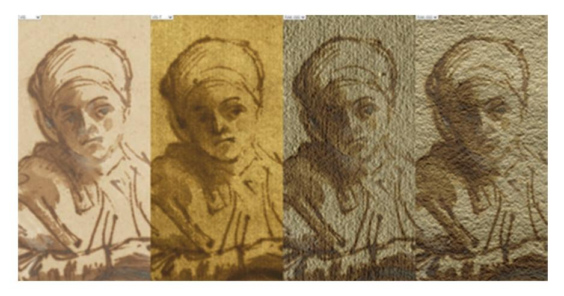

**Fig. 1.6** (continued)

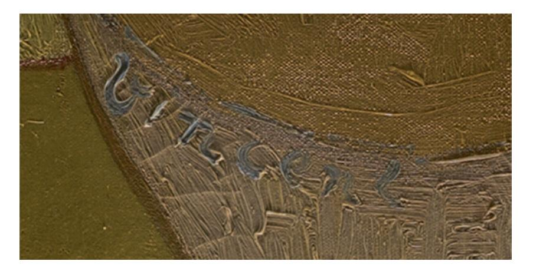

**Fig. 1.6** (continued)

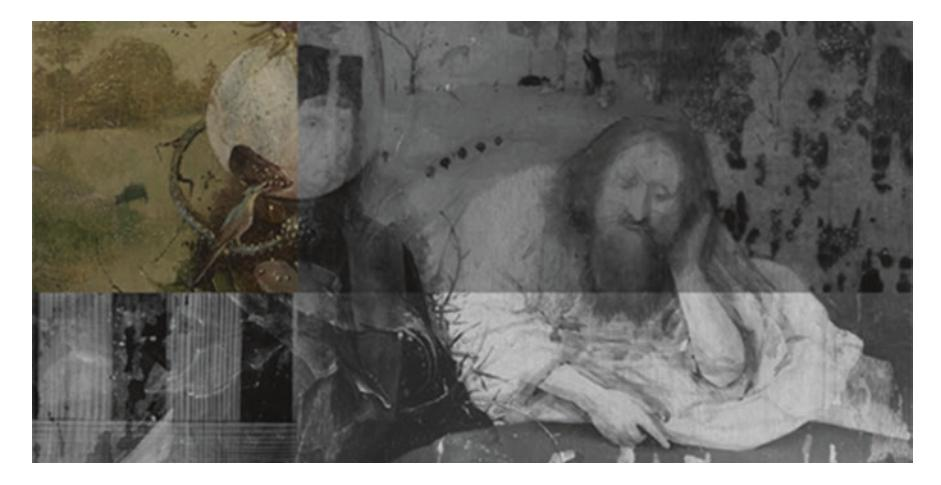

**Fig. 1.6** (continued)

The sync mode is also useful in comparing different image modalities, since it is often diffcult, for example, to associate a feature in a radiograph with the same feature in a visible-light photograph.

A "fade mode" enables an overlay of two or more panes, with relative opacities computed based on the position of the mouse. The fade mode has been used to create hybrid images such as those mixing visible-light and infrared photos, and has also been used to simulate a moving light source attached to the mouse by fading among a collection of raking-light images collected with the light source at different positions.

The Curtain Viewer is named after the "curtain mode", in which a single pane is split into multiple regions at the location of the mouse cursor, with a different imaging modality or artwork shown in each region. The movement of the mouse pointer thus gives an impression of "pulling back the curtain" or of "lifting the curtains" as it reveals additional imaging modalities. The system is designed to enable the user to focus carefully on an area of interest on the artwork and to repeatedly brush over it to show the exact relation among the features revealed by different imaging modalities. A traditional side-by-side view has been used to make these kinds of comparisons, but it induces a kind of "visual context switching" in which the user is forced to change focus from one location to another, diminishing the effectiveness of the comparison due to our limited visual memory. In contrast, the "curtain mode" enables the user to remain fxed on the same location in an artwork while comparing the different modalities.

The avoidance of visual context switching is another one of the major design goals of the Curtain Viewer system. Unlike other image viewers, its interface is not cluttered with visually distracting overlays such as logos, viewer control buttons, magnifcation sliders, and the like. The user is thus able to focus exclusively on studying the art without the visual noise of user interface elements. Furthermore, switching between modes is always done in a smooth way, with image panes animating their positions and opacities gradually to promote object constancy; the user is never forced to break their focus to reestablish their bearings in a new viewing confguration.

The Curtain Viewer also features a system where every aspect of the view is encoded in the URL, enabling easy bookmarking of an exact confguration for later study or for sharing and collaboration. As a demonstration of the technology, every fgure from the Bosch Catalogue Raisonné (Ilsink et al. [2016\)](#page-40-23), is also presented online (Erdmann et al. 2016) using the Curtain Viewer, enabling readers to understand the exact context and details of every featured detail.

As the book fgures show, the Curtain Viewer's URL scheme allows for the design of displays that rely heavily on what Tufte [\(1990](#page-41-18)) calls "small multiples":

At the heart of quantitative reasoning is a single question: Compared to what? Small multiple designs, multivariate and data bountiful, answer directly by visually enforcing comparisons of changes, of the differences among objects, of the scope of alternatives. For a wide range of problems in data presentation, small multiples are the best design solution.

These small multiple visualizations are crucial for connoisseurship since they ease and promote the fundamental act of comparison across scales, imaging modalities, and artworks.

## *1.6.2 Morelli's Vision*

Facilitating fast and meaningful comparisons among small details from one or more artworks is the design goal of Erdmann's "Morelli's Vision" technique. It was named in honor of Giovanni Morelli, an art historian who advocated for the careful study of small habitually-painted details to discern the characteristic "handwriting" of an artist (see also note 2 and 15). It is driven by a system of user- or computergenerated rectangular selections on artworks which are given a semantic tag such as "ear" or "hand". The display is web-based and interactive: when a user clicks on a particular tag, the individual thumbnail images are dynamically sorted according to the pairwise similarity between the clicked image and all other images, placing the clicked tag frst in the list with all the others sorted in decreasing order of their similarity to the clicked one. The pairwise similarity is computed as a cosine similarity between image features that are computed by a convolutional neural network. The system can be tuned to give different weights to semantic content, palette, texture, and other elements of style by giving different emphasis to the intermediate layers of the network.

The consequence for the connoisseur is that they can see as many comparisons in a single feld of view as possible. Every detail can be easily compared with every other detail. The system also allows the selection of a subset of interesting details (shown in the fgure outlined in blue) and to instantly launch a Curtain Viewer in "sync mode" to show the selected details side by side, zoomable and in high resolution. As an example of its use, consider its application to investigating attribution for paintings putatively by Bosch by studying the rendering of hands (Fig. [1.7\)](#page-32-0). The user has selected a set of distinctive hands for further study, which they then use to launch a custom Curtain Viewer that enables studying the details in context. Zooming out completely from each detail reveals that they are actually all from the same painting, lending additional evidence to an argument that the picture was not painted by Bosch.

## *1.6.3 Draper*

The Curtain Viewer affords great freedom to confgure complex views involving multiple artworks, multiple imaging modalities, and a variety of viewer modes in terms of synchronization and display, all of which is captured in a human-readable URL. However, this fexibility comes at the price of complexity. The solution is an additional tool to help precisely confgure a desired Curtain Viewer display, dubbed

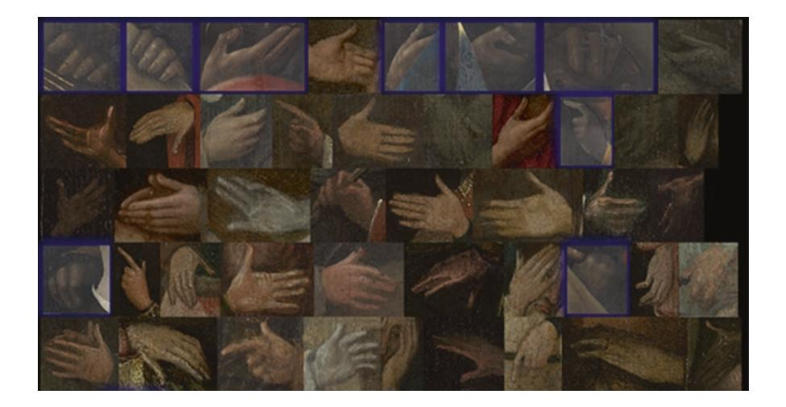

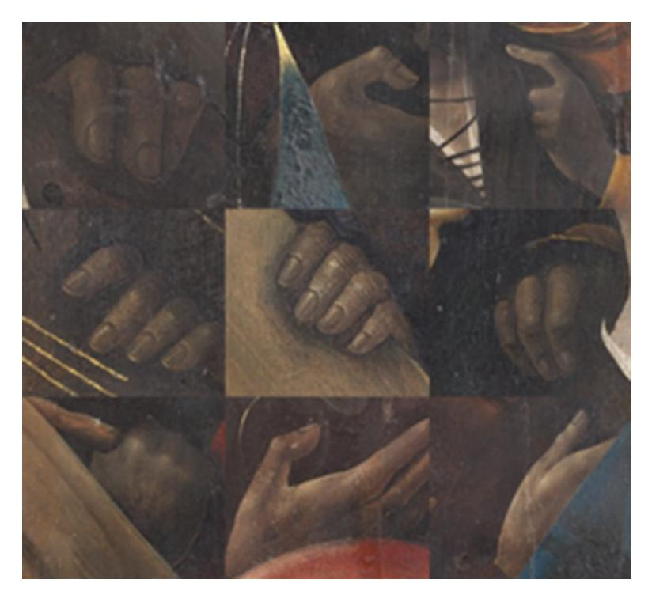

**Fig. 1.7** (**a**) The "Morelli's Vision" technique applied to a collection of painted hands from Bosch and followers of Bosch. The user has selected thumbnails of interest after using the system's dynamic sorting ability to group similar thumbnails. (**b**) a custom synchronized Curtain Viewer created automatically from the thumbnails. (**c**) zooming out of the details reveals that they all come from the same painting last images not sharp!

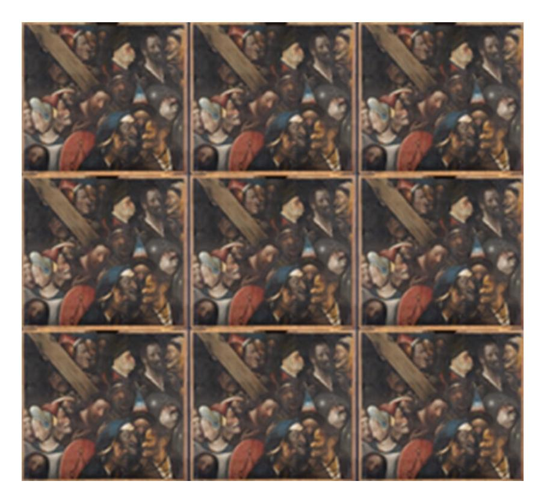

**Fig. 1.7** (continued)

as the "Draper" (one who makes curtains) by the author (RE). The tool consults a database of technical images for a specifed artwork and fnds those which are coregistered with each other, presenting the user with a menu of different technical images. The resulting images can be arranged into a desired confguration via a drag-and-drop interface, and additional Curtain Viewer options can be specifed. A live viewer preview at the bottom allows immediate exploration and tweaking of the viewer parameters (Fig. [1.8\)](#page-34-0).

The consequence for the connoisseur is that it becomes basically frictionless to quickly answer complex questions about image collections that can easily occupy several terabytes on disk. For example, did Hals consistently use the rather costly red pigment vermillion for all the faces and hands of the 88 militia men he portrayed in his fve prestigious large-scale militia group portraits? It also dramatically eases the process of documenting a judgement with supporting evidence.

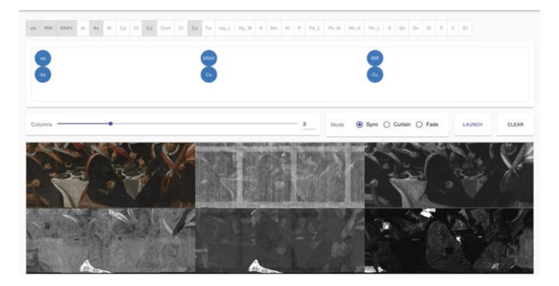

**Fig. 1.8** The Draper applied to a Frans Hals militia company portrait as part of the NWO-funded *21st Century Connoisseurship* project. Precisely co-registered images from a visible-light photograph, a radiograph, an infrared refectogram, and the arsenic, cobalt, and copper lines from MA-XRF scans are arranged into a desired confguration and Curtain Viewer viewing modality and previewed live in the bottom pane

## *1.6.4 PixelSwarm*

The PixelSwarm tool is an online interactive tool to allow the user to draw insights from high-dimensional data arising from multimodal imaging of artworks. A visible-light photograph associates fve numbers with each pixel: the three components of the color (RGB, e.g.), and two coordinates of its location in the painting. In this framing, every pixel can be conceived of as occupying a fve-dimensional space. A pair of pixels close to each other on the painting and with similar colors will be near each other in this fve-dimensional space, and large collections of similar pixels form clusters and complex topological structures there. When additional coregistered images are added, such as the many element maps arising from MA-XRF scanning, the dimensionality of the space grows because then every pixel has many elemental compositions, each of which corresponds to a separate axis in the highdimensional space. Clusters and other structures in these high-dimensional elemental composition spaces form from areas of similar layer buildup, so visualizing them can help to make sense of the deluge of data.

Our solution to this problem of overwhelming amounts of data is allow the user to explore any combination of projections and colorings of the space interactively. In this approach, each pixel is drawn individually, and changes to the positions of the pixels are animated. Elemental compositions or colors can be used to position the pixels directly, or dimension-reduction techniques such as PCA, t-SNE (Van der Maaten and Hinton [2008\)](#page-41-19), or UMAP (McInnes and Healy [2018](#page-41-20)) can be used to

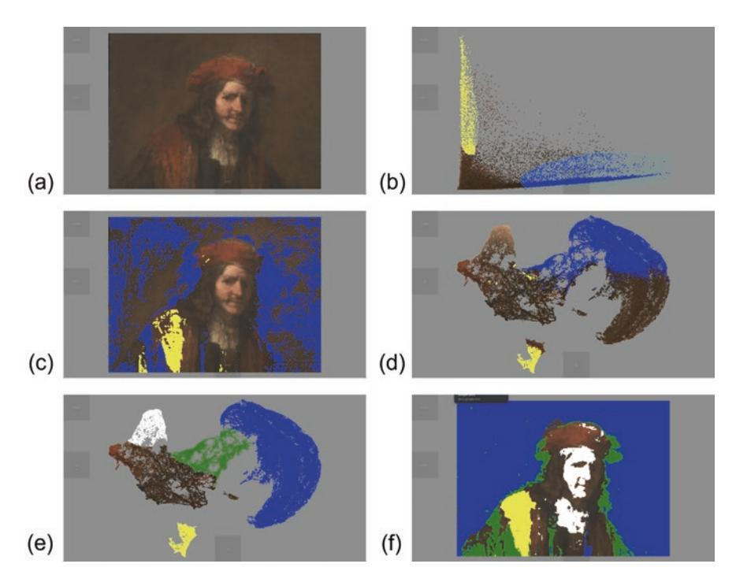

**Fig. 1.9** (**a**)–(**f**): Screen captures of a sequence from a typical session with the PixelSwarm tool applied to the upper half of Rembrandt's (?) *Man with a Red Cap* (Boijmans Museum). Explanations of the sequence appear in the text.

cluster the pixels according to their composition or other criteria. In any confguration, the user is able to "lasso" points and temporarily color them so that they can be easily tracked from one view to another. The iterative projection-lasso-coloringreprojection sequence thus allows the user to build up an understanding of the layer buildup and painterly technique that cannot easily be obtained by inspecting the individual technical images of the painting.

Figure [1.9](#page-35-0) shows a sequence of states from a typical use in an investigation of the attribution of the Man with a Red Cap in the Boijmans Museum. In (a), the initial display shows the pixels of the upper half of the painting in their normal positions with normal colors. In (b) the display is animated to position the pixels according to their cobalt and arsenic concentrations on the x- and y-axes, after which the user temporarily lassoes pixels in the cobalt-rich branch (likely containing smalt particles) in blue and the arsenic-rich branch (likely containing orpiment or realgar) in yellow. In (c), the swarm of pixels is animated back to their initial positions, maintaining their colored tags from step (b), thereby revealing a background rich in smalt and portions of the jacket apparently rich in orpiment or realgar. Also, the outlines of a smaller hat are easily visible here. In (d), further insight is gained by positioning the pixels according to the frst two components of a UMAP dimension reduction on the elemental compositions, where it is seen that the pixels are broadly grouped into two main lobes with a connecting isthmus. The compositional distinctiveness of the arsenic-rich pixels is seen from their appearance as a separate island in the cluster plot. In (e), upon seeing that a large fraction of the right lobe is tagged with blue from step (b), the user hypothesizes that the right lobe corresponds to background pixels, the left lobe corresponds to foreground pixels, and the isthmus corresponds to pixels that have components typical of both, possibly due to overpainting of a painted background that was not originally held out. They then reset the tagging and freshly lasso the right lobe in blue, the isthmus in green, and the island in yellow. Additionally, the left lobe appears to have a distinctive clustered structure around the light-colored pixels, so the user tags those pixels in white. Finally, in step (f) the user again positions the pixels according to their original positions. There, it is seen that the light-colored foreground of the man's face is compositionally similar to the man's shirt, and that a large triangle in his jacket is compositionally distinct and contains orpiment or realgar. The visualization reveals that the widening of the hat corresponds to areas that are compositionally both foreground- and backgroundlike, suggesting that they may be late-stage changes to the composition, made at the same time as changes to the pose of the man. Thus, the PixelSwarm tools allows the connoisseur to understand the materiality of the painting as it relates to painterly technique and to subsequently use this understanding in making judgements on attribution.[28](#page-36-0)

## **1.7 Concluding Remarks: Challenges and Opportunities**

Throughout the twentieth century, connoisseurship of old master and modern paintings evolved greatly in the Netherlands. From the implicit knowledge (or intuitive insight) of one specialist it became a predominantly evidence-based practice building on specialist insights of many different experts. Although implicit knowledge still plays a signifcant role in the authentication process, it is no longer accepted at face value; instead, the rational arguments underpinning authentication decisions have taken centre stage.

Chemical evidence was frst introduced in court in 1925 to help settle a forgery dispute. Since then, chemical analyses have become increasingly integrated in the decision-making process. Having triggered both distrust and excessive optimism, chemical analyses and their potential in authentication issues were systematically assessed in several large-scale research projects aimed at sorting out the oeuvre of a specifc artist, notably Rembrandt and Van Gogh.

In the late twentieth century, it gradually became clear that chemical evidence seldom yielded conclusive evidence concerning attributions. Only in the case of anachronistic materials, analytical chemistry could provide conclusive evidence and expose forgeries or misattributions. In all other cases, the authentication or

28The attribution of this particular painting is complicated by the fact that a previous owner of the work, the painter Joshua Reynolds (1723–1792) may have partially overpainted the work (which highlights the need for an in-depth assessment of the condition of the work and possible early overpaintings). With thanks to Katja Kleinert and Claudia Laurenze-Landsberg for this observation.

attribution process remained a matter of interpretation. Like detectives, art experts combine circumstantial evidence and probabilities. Signifcantly, no positive attribution (i.e. an attribution *to* a certain painter) can be done without a visual analysis. For even if the materials are consistent with the period and the specifc painter's workshop practice, one still needs to analyze the particular 'handwriting' of the artist in order to determine if the attribution is correct, to differentiate between different types of workshop products, contemporary copies and imitations.

This latter task, the visual analysis, has become both more challenging and easier in the early twenty-frst century, due to a paradigm shift in the humanities, myriad new technical possibilities and advanced digital tools. Within the humanities, the very notion of what constituted 'authenticity' was redefned, especially in the feld of old master painting. As result, art experts moved away from a simple binary perspective (either by the master or not), became more aware of the complex range of possibilities, and started introducing more nuanced categories of thought.

With the aid of new analytical techniques, in particular MA-XRF scanning and HSI/RIS, pioneering teams of experts (often including conservators, conservations scientists and curators) have gained a deeper understanding of the art works they studied. Although their projects commonly focus on just a few works of art, the (digital) data thus generated is nevertheless substantial, and (increasingly) require digital tools to aid with the interpretation. The knowledge thus gained often helps to signifcantly reduces the number of possible attributions and occasionally yields unique insights that make the creation of new forgeries virtually impossible (as in the case of Van Gogh drawings). Moreover, there is currently a relatively high chance of discovering discrepancies when closely comparing originals with forgeries or imitations from a different time period. Most painters' oeuvres have not been researched yet with (all) the newest techniques, and it is unlikely that forgers and imitators mimicked specifc materials and techniques, if these materials and techniques were not known to them.

Given the quantity of data already generated and the new data that will be generated in the near future, one of the main challenges of twenty-frst century connoisseurship is to manage and process all the information and to effectively select the most relevant parts. While early twentieth-century connoisseurs heavily relied on their visual memory when judging attributions, their twenty-frst-century equivalents face a different reality. Digital tools are increasingly facilitating one of their core tasks: making effective comparisons. Although various computer programs have been developed with more ambitious goals, namely to substitute the connoisseur's analysis of brushstrokes or overall visual assessment, these have not proven to be effective (yet) in practice (which must be due to the complexity of such decisions). By contrast, algorithms with more modest goals (namely simply facilitating comparisons) have a powerful impact on the feld. For the frst time, these tools make it possible to make precise in-depth comparison not just of the visible surface of paintings but also of the chemical properties of deeper layers in a heartbeat, zooming in and out from an overall view of a large-size painting to microscopic observation in less than a second, changing seamlessly from visible light to different

wavelengths, x-radiography, IRR and various elemental maps, while juxtaposing comparable elements in shape and size and material composition.

Although there is a relatively wide gap between pioneering authentication studies (using the newest techniques and tools) and the everyday attribution practice in the feld, it is to be expected that connoisseurship will be become increasingly sophisticated as the techniques, tools and gathered data will become more widely available, and new techniques and tools will be developed. As in the past, the correct interpretation of both visual clues and chemical evidence will continue to require suffcient and secure reference data. For a positive attribution to a painter, an indepth understanding of both the period in which a painting was made, and the specifc master's characteristic habits and workshop practice, will undoubtedly remain indispensable (to best estimate of the amount of consistency one can expect in a master painter's style, technique and use of materials). For the detection of forgeries, a more widespread use of technical analyses is likely to make a signifcant difference, while the development of increasingly advanced methods is likely to facilitate the identifcation of anachronistic materials and other relevant discrepancies. As materiality tends to be harder to forge than it is to analyze nowadays, this might well tip the balance in favour of connoisseurs in the continuous arms race between forgers and art experts.

**Acknowledgements** The authors wish to thank Robert van Langh for his encouragement to write this chapter and his thoughtful comments on an earlier version of this text, Carlijn Vos for her copy editing and the Leiden University Centre for the Arts in Society for their generous support for writing this article. A substantial part of the research used in this article was done in the context of the NICAS Seed Money Project *21st Century Connoisseurship* (2018-2022) led by the authors and funded by the Dutch Science Foundation (NWO). The authors wish to thank the Frans Hals Museum, Haarlem and the Rijksmuseum, Amsterdam for supporting this project.

## **References**

- Ainsworth, M.W.: From connoisseurship to technical art history: the evolution of the interdisciplinary study of art. Conserv. Getty Conserv. Inst. Newsl. **20**(1), 4–10 (2005)
- Ainsworth, M.W., Haverkamp-Begemann, E., Brealev, J., Meyers, P., et al.: Art and Autoradiography: Insights into the Genesis of Paintings by Rembrandt, Van Dyck, and Vermeer. Metropolitan Museum of Art, New York (1982)
- Alfeld, M., Janssens, K., Dik, J., de Nolf, W., van der Snickt, G.: Optimization of mobile scanning macro-XRF systems for the in-situ investigation of historical paintings. J. Anal. At. Spectrom. **26**, 899–909 (2011)
- Alfeld, M., Pedroso, J.V., van Eikema Hommes, M., Van der Snickt, G., Tauber, G., Blaas, J., et al.: A mobile instrument for in situ scanning macro-XRF investigation of historical paintings. J. Anal. At. Spectrom. **28**, 760–767 (2013)
- Alpers, S.: Rembrandt's Enterprise: The Studio and the Market. University of Chicago Press, Chicago (1990)
- Asperen de Boer, van J.R.J.: Refectography of Paintings using an infrared vidicon television system. Stud. Conserv. **14**, 96–118 (1969)

- Bomford, D.: Forbes Prize Lecture. International Institute for Conservation of Historic and Artistic Works annual congress, London (2008)
- Brandhof, M.: van de. Een vroege Vermeer uit 1937: achtergronden van leven en werken van de schilder:vervalser Han van Meegeren. Het Spectrum, Utrecht/Antwerp (1979)
- Bredius, A.: A New Vermeer. Burlingt. Mag. **71**, 210–211 (1937)
- Bremer, F.: Inleiding tot de kunstgeschiedenis, 5th edn. Elsevier, Amsterdam/Brussels (1945)
- Bruyn, J., et al.: A Corpus of Rembrandt Paintings (vols. I–III). Springer, The Hague/Boston (1982, 1986, 1989)
- Chapman, H.P., Weststeijn, T.: Connoisseurship as knowledge: an introduction. In: Chapman, H.P., Weststeijn, T., Meijers, D. (eds.) Connoisseurship and the Knowledge of Art, pp. 6–41. Brill Academic Publishers (2019)
- Charney, N.: The Art of Forgery: The Minds, Motives and Methods of Master Forgers. Phaidon Press, New York/London (2015)
- Coremans, P.: L'Agneau Mystique au laboratoire: Examen et traitement. De Sikkel, Antwerp (1953)
- Craddock, P.: Scientifc Investigation of Copies, Fakes and Forgeries. Elsevier Ltd, Oxford (2009) Dantzig, van M.: Frans Hals: echt of onecht. Amsterdam/Paris (1937)
- Dantzig, van M.: Johannes Vermeer, de Emmausgangers en de Critici. Sijthof, Leiden (1947)
- Dantzig, van M.: Pictology: An Analytical Method for Attribution and Evaluation of Pictures. E.J. Brill, Leiden (1973)
- Decoen, J.: Terug naar de waarheid, twee authentieke schilderijen van Vermeer. Donker, Rotterdam (1951)
- Dickey, S.: The art of connoisseurship. In: Podedworny, C., et al. (ed.) The Unvarnished Truth. Exploring the Material History of Paintings. McMaster University Museum of Art (2015). https://theunvarnishedtruth/mcmaster.ca. Accessed 1 Mar 2021
- Dijksterhuis, A.P.: Het slimme onbewuste. Prometheus, Leiden (2007)
- Du Bos, A.: Réfexions critiques sur la poésie et la painture. Jean Mariette, Paris (1719). cited ed. Paris: énsb-a (1993)
- Dumas, C., Ekkart, R., van de Puttelaar, C. (eds.): Connoisseurship: Essays in Honour of Fred F. Meijer. Primavera Press, Leiden (2020)
- Duparc, F.: Results of the recent art-historical and technical research on Carel Fabritius's early works. Oud Holland. **119**(2-3), 76–89 (2006)
- Dutton, D.: Artistic Crimes: The Problem of Forgery in the Arts. Br. J. Aesthet. **19**(4), 302–314 (1979)
- Ekkart, R.: Hofstede de Groot, Cornelis (1863–1930). In: Biografsche Woordenboek van Nederland, pp. 248–249. Martinus Nijhoff, The Hague (1979)
- Erdmann, R.G.: Image processing for the Bosch research and conservation project. In: Hoogstede, L., Spronk, R., Erdmann, R.G., Klein Gotink, R., Ilsink, M., Koldeweij, J., Nap, H., Veldhuizen, D. (eds.) Hieronymus Bosch, Painter and Draughtsman, Technical Studies, pp. 31–51. Yale University Press, Brussels (2016a)
- Erdmann, R.G.: Bosch project (2016b).<http://boschproject.org/#/book/>. Accessed 4 Mar 2021
- Faille, de la J.B.: Les faux Van Gogh. Impr. Arrault et Cie, Paris/Brussels (1930)
- Faille, de la J.B.: The Works of Vincent van Gogh: His Paintings and Drawings. Reynal and Company, Amsterdam (1970)
- Feilchenfeldt, W.V.: Gogh fakes: the Wacker affair, with an illustrated catalogue of the forgeries. Simiolus. **19**(4), 289–316 (1989)
- Freedberg, D.: Why Connoisseurship matters. In: van der Stigghelen, K. (ed.) Minuscula Amicorum: Contributions on Rubens and his colleagues in honour of Hans Vlieghe, pp. 29–43. Brepols, Turnhout (2006)
- Gerson, H.: Rembrandt Paintings. Translated from the German by Heinz Norden and edited by Gary Schwartz. Harrison House, New York (1968)
- Gifford, M., Glinsman, L.D.: Collective style and personal manner: materials and techniques of high life genre painting. In: Waiboer, A., et al. (eds.) Vermeer and the Masters of Genre Paintings, pp. 65–83. Yale University Press, Paris/Dublin/Washington, DC (2017)

- Ginsburgh, V., Radermecker, A., Tommasi, D.: The effect of experts' opinion on prices of art works: the case of Peter Brueghel the Younger. J. Econ. Behav. Organ. **159**(C), 36–50 (2019). <https://doi.org/10.1016/j.jebo.2018.09.002>
- Ginzburg, C.: Morelli, Freud and Sherlock Holmes: Clues and scientifc method. Hist. Work. **9**, 5–36 (1980)
- Gladwell, M.: Blink: The Power of Thinking without Thinking. Little, Brown and Company, New York (2005)
- Goodman, N.: Languages of Art. Oxford University Press, Oxford (1969)
- Goodman, N.: Art and authenticity. In: Dutton, D. (ed.) The Forger's Art: Forgery and the Philosophy of Art, pp. 93–115. University of California Press, Berkerley/Los Angeles/London (1983)
- Grimm, C.D.: Frage nach der Eigenhändigkeit und die Praxis der Zuschreibung. In: Thomas, W. (ed.) Künstlerische Austausch/Artistic Exchange: Akten des XXVIII. Internationalen Kongresses für Kunstgeschichte, Berlin, 15–20 juli 1992. Berlin, pp. 631–648 (1993). [https://](https://doi.org/10.11588/artdok.00004294) [doi.org/10.11588/artdok.00004294](https://doi.org/10.11588/artdok.00004294)
- Groen, K.: Grounds in Rembrandt's workshop and in paintings by his contemporaries. In: van de Wetering, E. (ed.) A Corpus of Rembrandt Paintings (IV). Springer., pp. 318–334, 660–667, Dordrecht (2005)
- Guichard, C. (ed.): De l'authenticité: Une histoire des valeurs de l'art (XVIe-XXe siècle). Publications de la Sorbonne, Paris (2014)
- Hebborn, E.: Drawn to Trouble: The Forging of an Artist. Mainstream Publishing Projects, Edinburgh (1991)
- Hofstede de Groot, C.: Beschreibendes und kritisches Verzeichnis der Werke der hervorragendsten holländischen Maler des XVII. Jahrhunderts (vols 1–10). Paul Neff Verlag/F. Kleinberger/ MacMillan & Co, Esslingen/Paris/London (1908–1927)
- Hofstede de Groot, C.: Echt of Onecht? Oog of Chemie? van Stockum, The Hague (1925)
- Huang, M., Bridge, H., Martin, J., Kemp, M.J., Parker, A.J.: Human cortical activity evoked by the assignment of authenticity when viewing works of art. In: Frontiers in Human Neuroscience (2011). <https://doi.org/10.3389/fnhum.2011.00134>
- Hughes, H., Hughes, E., Hughes, S.: Van Gogh's Brushstrokes: Marks of Authenticity? In: Proceedings of "Art, Conservation, and Authenticities: Material, Concept, Context", pp. 143–151. Archetype Publications, Scotland (2009)
- Huussen, A.H. (ed.): Cahiers uit het Noorden XX: Henricus (Han) Antonius van Meegeren (1889– [1945]): documenten betreffende zijn leven en strafproces. Huussen, Zoetermeer (2009)
- Ilsink, M., Koldeweij, J., Spronk, R., Hoogstede, L., Erdmann, R.G., Klein Gotink, R., Nap, H., Veldhuizen, D.: Hieronymus Bosch, Painter and Draughtsman, Catalogue Raisonné. Mercatorfonds, Brussels (2016) ISBN 978-94-6230-113-9
- Jia, L., Yao, L., Hendriks, E., Wang, J.Z.: Rhythmic Brushstrokes distinguish van Gogh from his contemporaries: fndings via automated Brushstroke extraction. IEEE Trans. Pattern Anal. Mach. Intell. **34**(6), 1159–1176 (2012). <https://doi.org/10.1109/TPAMI.2011.203>
- Johnson, C.R., Hendriks, E., Berezhnoy, I., et al.: Image processing for artist identifcation. IEEE Signal Proces. Mag. **25**(4), 37–48 (2008)
- Justi, L.: Van Gogh, die Kenner und Schriftsteller. Vossische Zeitung (1929)
- Kahneman, D.: Thinking Fast and Slow. Farrar, Straus and Giroux, New York (2011)
- Kahneman, D., Tversky, A.: Prospect theory: an analysis of decision under risk. Econometrica. **47**, 263–291 (1979)
- Keisch, B.: Dating works of art through their natural radio-activity: improvements and applications. Science. **160**, 413–415 (1968)
- Kirby-Talley, M.: Connoisseurship and the rembrandt research project. Int. J. Mus. Manag. Curatorship. **8**, 175–214 (1989)
- Knuttel, D.G.: Nederlandsche Schilderkunst van Van Eyck tot Van Gogh. Becht, Amsterdam (1938) Koestler, A.: The Anatomy of Snobbery. Anchor Rev. **1**, 1–25 (1955)
- Koldehoff, S.: The Wacker forgeries: a catalogue. Van Gogh Mus. J. **20**, 138–149 (2002)
- Kraaijpoel, D., van Wijnen, H.: Han van Meegeren. Waanders Uitgevers, Zwolle (1996)

- Leefang, H., Luijten, G. (eds.): Hendrick Goltzius (158–1617): Drawings, Prints and Paintings. Exh.cat. Waanders, Amsterdam/London (2003)
- Lessing, A.: What is wrong with a forgery? J. Aesthet. Art Critic. **23**(4), 461–471 (1965). [https://](https://doi.org/10.2307/427668) [doi.org/10.2307/427668](https://doi.org/10.2307/427668)
- Lopez, J.: The Man Who Made Vermeers: Unvarnishing the Legend of Master Forger Han van Meegeren. Harcourt, Inc., Orlando/Austin/New York/San Diego/London (2008)
- Lord Kilbracken, J.G.: Van Meegeren: Master Forger. Scribner, London/Bristol (1967)
- Lyu, S., Rockmore, D., Farid, H.: A digital technique for art authentication. Proc. Natl. Acad. Sci. **101**(49), 17006–17010 (2004)
- Maaten, van der L.J.P., Hinton, G.E.: Visualizing high-dimensional data using t-SNE. J. Mach. Learn. Res. **9**, 2579–2605 (2008)
- Mander, van K.: Het Schilder-boeck. Paschier van Wesbusch, Haarlem (1604)
- Martin, W.: Kunstwetenschap in theorie en practijk. Martinus Nijhoff, The Hague (1904)
- McInnes, L., Healy, J.: UMAP: uniform manifold approximation and projection for dimension reduction. ArXiv. **1**, 1–63 (2018)
- Melion, W.S.: Hendrick Goltzius's project of reproductive engraving. Art Hist. **13**(4), 458–487 (1990)
- Muthesius, S.: Towards an 'exakte Kunstwissenschaft'(?), Part II: the new German Art history in the nineteenth century: a summary of some problems. J. Art Hist. **9**, 1–16 (2013)
- Noord, van N., Hendriks, E., Postma, E.: Toward discovery of the artist's style: learning to recognize artists by their artworks. IEEE Trans. Pattern Anal. Mach. Intell. **32**(4), 46–54 (2015)
- Pächt, O.T.: Practice of Art History: Refections on Method (1986). Translated by Britt D. Harvey Miller Publishers, London (1999)
- Rosenberg, J.: On Quality in Art: Criteria of Excellence in Past and Present (The A.W. Mellon Lectures in the Fine Arts 1964). Princeton University Press, Princeton (1967)
- Schneider, H., Regteren-Altena, J.Q.: Rapport van het stilistisch/aesthetisch onderzoek van zeven schilderijen welke een Vermeer-signatuur dragen of aan Jan Vermeer van Delft zijn toegeschreven en twee schilderijen die op den naam van Pieter de Hoogh staan en het merk PDH 1658 vertonen. Amsterdamse Rechtbank, Amsterdam (1947)
- Seymour, S.: Frans Hals. Phaidon Press, London (2014)
- Sheldon, L., Costaras, N.: Johannes Vermeer's 'Young Woman Seated at a Virginal'. Burlingt. Mag. **148**, 89–97 (2006)
- Storm van Leeuwen, J.: The Concept of Pictology and its Application to Works by Frans Hals. In: Authentication in the Visual Arts: A Multi-Disciplinary Symposium, Amsterdam, 12th of March 1977, pp. 57–92. B.M. Israël, Amsterdam (1977)
- Thienen, van F.: Vermeer. Palet-serie, Amsterdam (1939)
- Tromp, H.: De Strijd om de Echte Vincent van Gogh: De kunstexpert als brenger van een onwelkome boodschap 1900–1970. Dissertation, Mets & Schilt, Amsterdam (2006)
- Tufte, E.: Envisioning Information. Graphics Press, Cheshire (1990) ISBN 978-0961392116
- Tummers, A.: The Eye of the Connoisseur, Authenticating Paintings by Rembrandt and His Contemporaries. Amsterdam University Press/Getty Publications, Amsterdam/Los Angeles (2011)
- Tummers, A.: Connoisseurship in the Western World, developments since 1980. In: Grove Dictionary of Art, Oxford Art Online (2018). [https://www.oxfordartonline.com/groveart/](https://www.oxfordartonline.com/groveart/view/10.1093/gao/9781884446054.001.0001/oao-9781884446054-e-7000019062) [view/10.1093/gao/9781884446054.001.0001/oao-9781884446054-e-7000019062](https://www.oxfordartonline.com/groveart/view/10.1093/gao/9781884446054.001.0001/oao-9781884446054-e-7000019062).
- Tummers, A., Jonckheere, K. (eds.): Art Market and Connoisseurship: A Closer Look at Paintings by Rembrandt, Rubens and Their Contemporaries. Amsterdam University Press, Amsterdam (2008)
- Tummers, A., Wallert, A., Kleinert, K., Hartwieg, B., Laurenze-Landsberg, C., Dik, J., Groves, R., Anisimov, A., Papadakis, V., Erdmann, R.: Supplementing the eye: the technical analysis of Frans Hals's Paintings – I. Burlingt. Mag. **161**, 934–941 (2019a)
- Tummers, A., Wallert, A., de Keyser, N.: Supplementing the eye: the technical analysis of Frans Hals's Paintings – II. Burlingt. Mag. **161**, 996–1003 (2019b)

- Vries, de A.B., Frountjes, W., Tóth-Ubbens, M.: Rembrandt in the Mauritshuis: An Interdisciplinary Study. Sijthoff & Noordhoff, The Hague (1978)
- Wallert, A., van de Laar, M.: Werkwijzen, trucs, materialen en technieken: vervalsingen op het hoogste niveau. In: Lammertse, F., Garthoff, N., van de Laar, M., Wallert, A., van Es, J. (eds.) De Vermeers van Van Meegeren, Kennerschap en de techniek van het vervalsen, pp. 66–99. Boijmans studies, Rotterdam (2011)
- Wallert, A., van de Laar, M.: Expertise in the Van Meegeren case: the contributions by Coremans, Froentjes and De Wild. In Proceedings of the Coremans Symposium. Brussels, pp. 202–214 (2018)
- Weerdenbrug, S.: De Emmausgangers: een omslag in Waardering. MA thesis. University of Utrecht (1988)
- Wetering, van de E.: The canvas support. In: Bruijn, J., et al. (eds.) A Corpus of Rembrandt Paintings, vol. 2, pp. 15–43. Springer, The Hague/Boston (1986)
- Wetering, van de E.: The search for the master's hand: an anachronism? (A summary). In: Thomas, W. (ed.) Künstlerische Austausch / Artistic Exchange: Akten des XXVIII. Internationalen Kongresses für Kunstgeschichte, Berlin, 15–20 juli 1992. Berlin, pp. 627–630 (1993)
- Wetering, van de E., et al.: A Corpus of Rembrandt Paintings (vols IV–VI). Dordrecht: Springer (2005, 2010, 2014)
- Wild, de M.: Het natuurwetenschappelijk onderzoek naar schilderijen. Dissertation. TH Delft (1928)
- Wolz, S.H., Carbon, C.: What's wrong with an art fake? Cognitive and emotional variables infuenced by authenticity status of artworks. Leonardo. **47**(5), 467–473 (2014)
- Zerner, H.: What gave connoisseurship its bad name? In: Strauss, W., Felker, T. (eds.) Drawings Defned, pp. 289–290. Abaris Books, New York (1987)

**Open Access** This chapter is licensed under the terms of the Creative Commons Attribution 4.0 International License (<http://creativecommons.org/licenses/by/4.0/>), which permits use, sharing, adaptation, distribution and reproduction in any medium or format, as long as you give appropriate credit to the original author(s) and the source, provide a link to the Creative Commons licence and indicate if changes were made.

The images or other third party material in this chapter are included in the chapter's Creative Commons licence, unless indicated otherwise in a credit line to the material. If material is not included in the chapter's Creative Commons licence and your intended use is not permitted by statutory regulation or exceeds the permitted use, you will need to obtain permission directly from the copyright holder.

