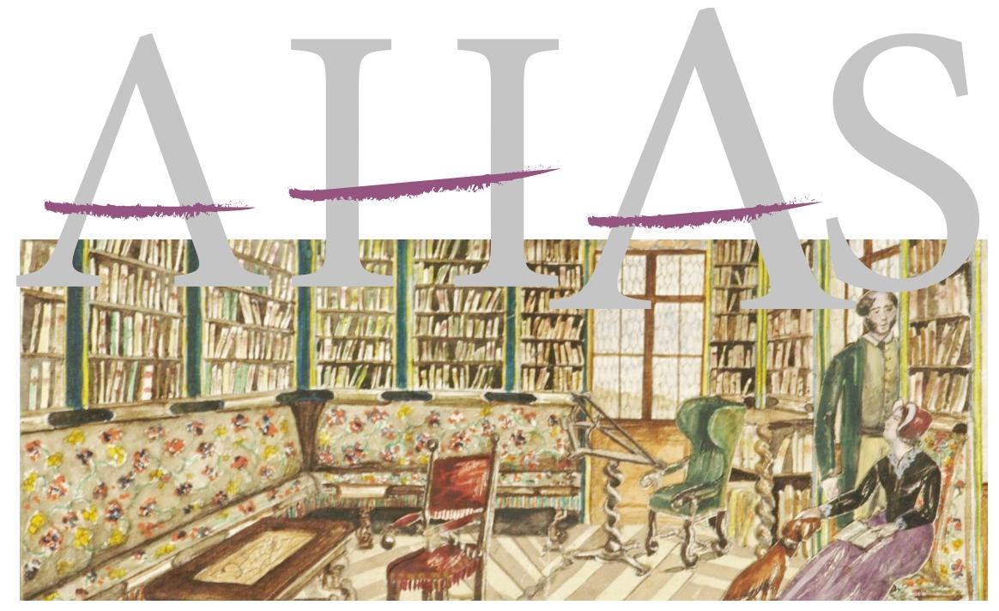

# ACTA HISTORIAE ARTIS SLOVENICA

Artistic and Architectural Heritage of the Nobility Between Old and New Regimes

Umetnostna in arhitekturna dediščina plemstva med starimi in novimi režimi

ZRC SAZU, Umetnostnozgodovinski inštitut Franceta Steleta ZRC SAZU, France Stele Institute of Art History

# ACTA HISTORIAE ARTIS SLOVENICA

# 28|2 • 2023

Artistic and Architectural Heritage of the Nobility Between Old and New Regimes

Umetnostna in arhitekturna dediščina plemstva med starimi in novimi režimi

LJUBLJANA 2023

#### **Acta historiae artis Slovenica, 28/2, 2023**

Artistic and Architectural Heritage of the Nobility Between Old and New Regimes Umetnostna in arhitekturna dediščina plemstva med starimi in novimi režimi

Znanstvena revija za umetnostno zgodovino / Scholarly Journal for Art History ISSN 1408-0419 (tiskana izdaja / print edition) ISSN 2536-4200 (spletna izdaja / web edition)

Izdajatelj / Issued by ZRC SAZU, Umetnostnozgodovinski inštitut Franceta Steleta / ZRC SAZU, France Stele Institute of Art History

Založnik / Publisher Založba ZRC

Urednice / Edited by Tina Košak, Renata Komić Marn, Helena Seražin

Uredniški odbor / Editorial board Renata Komić Marn, Tina Košak, Katarina Mohar, Mija Oter Gorenčič, Blaž Resman, Helena Seražin

Mednarodni svetovalni odbor / International advisory board Günter Brucher (Salzburg), Ana María Fernández García (Oviedo), Hellmut Lorenz (Wien), Milan Pelc (Zagreb), Sergio Tavano (Gorizia-Trieste), Barbara Wisch (New York)

Lektoriranje / Language editing Oliver Currie, Kirsten Hempkin, Darja Gabrovšek Homšak, Patricia Anne Odber de Baubeta

Prevodi / Translations to Slovene Renata Komić Marn, Tina Košak, Helena Seražin, Borut Praper

Oblikovna zasnova in prelom / Design and layout Andrej Furlan

Naslov uredništva / Editorial office address Acta historiae artis Slovenica Novi trg 2, p. p. 306, SI -1001 Ljubljana, Slovenija ahas@zrc-sazu.si; https://ojs.zrc-sazu.si/ahas

Revija je indeksirana v / Journal is indexed in Scopus, ERIH PLUS, EBSCO Publishing, IBZ, BHA

Letna naročnina / Annual subscription: 35 € Posamezna enojna številka / Single issue: 25 € Letna naročnina za študente in dijake: 25 € Letna naročnina za tujino in ustanove / Annual subscription outside Slovenia, institutions: 48 €

Naročila sprejema / For orders contact Založba ZRC Novi trg 2, p. p. 306, SI-1001, Slovenija E-pošta / E-mail: zalozba@zrc-sazu.si

AHAS izhaja s podporo Javne agencije za znanstvenoraziskovalno in inovacijsko dejavnost Republike Slovenije. / AHAS is published with the support of the Slovenian Research and Innovation Agency.

Tisk / Printed by Present d.o.o., Ljubljana Naklada / Print run: 400

Revija AHAS je takoj po izidu prosto dostopna pod pogoji licence CC BY-NC-ND. To ne velja za slikovno gradivo, označeno z znakom © in imenom lastnika avtorskih pravic.

AHAS Journal is freely available immediately upon publication under the terms of the CC BY-NC-ND licence. This does not apply to images marked with the © symbol and the name of the copyright holder.

## **Ca' Rezzonico in the 19th Century**

### **The Dispersal of its Collections and the New Uses of the Palace**

### **Valeria Paruzzo**

Valeria Paruzzo, PhD, University of Trento, Department of Humanities, Via Tommaso Gar 14, 38122 Trento, valeria.paruzzo@unitn.it, [ORCID ID: 0000-0002-8454-5168](https://orcid.org/0000-0002-8454-5168)

#### Abstract: **Ca' Rezzonico in the 19th Century: The Dispersal of its Collections and the New Uses of the Palace**

#### 1. 01 Original scientific article

In the wider phenomenon of the reception and readaptation of aristocratic architectural heritage in post-revolutionary Europe, the repurposing of former aristocratic palaces in Venice after the Fall of the Serenissima in 1797 constitutes a preeminent example. The paper takes as a case study Ca' Rezzonico, one of the most splendid palaces along the Grand Canal, which has housed, since 1936, the illustrious Museum of 18th-century Venice (*Museo del Settecento veneziano*). After the Rezzonico family died out in 1810, the palace was gradually stripped of its art historical treasures and has served the most diverse purposes. From being the seat of the Austrian Tobacco Administration to housing dealers' galleries, from hosting the ateliers of stage designers and international painters to being the home of renowned intellectuals and aesthetes, Ca' Rezzonico's rooms and walls have witnessed the profound changes in art, taste, and culture that rang through Europe during the long 19th century. The paper offers a comprehensive reconstruction of the palace's 19th-century history, drawing from both published and unpublished sources.

Keywords: nobility, bourgeoisie, architectural heritage, collecting, display, art market, Venice, Ca' Rezzonico, 19th century, artists' ateliers

#### Izvleček: **Ca' Rezzonico v 19. stoletju. Usoda zbirke in nove namembnosti palače**

#### 1.01 Izvirni znanstveni članek

Prenove in nove ureditve opreme plemiških palač v Benetkah po padcu Beneške republike leta 1797 predstavljajo poseben vidik raziskav recepcije in novih funkcij plemiške arhitekturne dediščine v postrevolucionarni Evropi. V prispevku je kot študija primera analizirana usoda Ca' Rezzonica, ene najlepših palač ob Velikem kanalu, v kateri so leta 1936 uredili znameniti Muzej beneške umetnosti 18. stoletja (*Museo del Settecento veneziano).* Na podlagi analize arhivskih virov in literature je podrobno rekonstruiran historiat preureditev in sprememb njene namembnosti. Po izumrtju rodbine Rezzonico leta 1810 so iz palače odpeljali domala vse umetnine in opremo, njene namembnosti pa so bile zelo raznolike, med drugim je bila sedež avstro-ogrske tobačne uprave, v njej so uredili prostore trgovcev z umetninami in ateljeje tujih slikarjev in oblikovalcev gledaliških kulis ter domovanja intelektualcev. Palača Ca' Rezzonico je izkusila izrazite spremembe v umetnostni opremi, okusu in meščanski bivalni kulturi dolgega 19. stoletja.

Ključne besede: plemstvo, meščanstvo, arhitekturna dediščina, zbirateljstvo, razstavljanje, umetnostni trg, Benetke, Ca Rezzonico, 19. stoletje, umetniški ateljeji

#### **The Early History of the Palace and the Rise of the Rezzonico Family**

Around 1662 the architect Baldassare Longhena (1597–1682), the leading proponent of the Baroque architectural style in Venice, received the commission to design and build a monumental palace for the Bon family on the grounds of two pre-existing properties situated where the Rio di San Barnaba meets the Canal Grande. Longhena's design for the Bon Palace—in which he re-employed the monumental style of the new Procuratie in Piazza San Marco—foresaw a three-storey edifice with two *piani nobili* of similar height, a water façade punctuated by a continuum of arched windows, and an attic with elliptical openings (fig. 1). To the more traditional structure of the Venetian 16th-century *palazzo*, grouped around the *portego* (the longitudinal room overlooking the Canal Grande), Longhena added a courtyard and a mainland entrance through a grand staircase.1 However, the architect's death in 1682 and the precarious financial situation of the Bon family impeded the completion of the palace, which remained incomplete for seven decades, as depicted in Canaletto's *View of the Grand Canal from Palazzo Rezzonico to palazzo Balbi* (Woburn Abbey) from the early 1730s.2

Only in 1751 did the Bon family manage to sell the unfinished palace to Giovanbattista Rezzonico (1671–1756), a member of a wealthy family originally from Como, ennobled in the Venetian *patriziato* in 1687 by virtue of its immense financial fortune.3 Carlo Rezzonico (1693–1769), Giovanbattista's second eldest son, had been named Cardinal and Bishop of Padua, and the family, striving for social recognition as new members of the nobility, needed a more representative property in the city in addition to the *palazzi* (Fontana and Sagredo) they were renting.4 Thus, Giovanbattista commissioned architect Giorgio Massari (1687–1766), who had restored the family's *villa* in Bassano del Grappa,5 to finish Longhena's project. Massari kept the original design, but substantially changed the orientation of the *palazzo*: he demolished the ceiling in the west wing and redesigned the palace's monumental staircase, so that it would lead into a new, two-storey high ballroom (figs. 2–3).6 The sumptuous hall, a rarity in Venice, replaced the more traditional *portego* as the representative space of the palace—in line with the gradual functional and structural changes that Venetian palaces had experienced since the second half of the 17th century.7 The ballroom also stands out for the quality of

2 The palace had been elevated up until the first floor and covered by means of a temporary wooden roof. The same construction state is visible in a later view by Bernardo Bellotto, painted ca. 1736–1740 (Musée des Beaux-Arts, Lyon), based upon his uncle's original, as well as in further contemporary paintings and etchings.

3 Because the literature on the Rezzonico family history is extensive, see (with further bibliography) the proceedings in Nante, Cavalli, and Gios, *Carlo Rezzonico*, and the accurate reconstruction in Goldhahn, *Von der Kunst*, who also explored the members' activity as collectors and maecenases.

1 The palace's history and the museum display have been the subject of several studies, all subsequently re-edited: Lorenzetti, *Ca' Rezzonico*; Pignatti, *Tesori di Ca' Rezzonico*; Mariacher, *Ca' Rezzonico*; Romanelli, *Ca' Rezzonico*; more recently: Pedrocco, *Ca' Rezzonico*. For the architecture of the palace, see Bassi, *Palazzi di Venezia*, 114–22, and the additions in Goldhahn, *Von der Kunst*, 136–60. For Longhena's design for Palazzo Bon, see Frank, *Baldassarre Longhena*, 242–49; Hopkins, *Baldassare Longhena* 1597–1682, 208–19; Hopkins, *Baldassare Longhena*, 192–204.

4 Goldhahn, *Von der Kunst*, 145.

5 For the Villa Rezzonico in Bassano, see Noè, "Rezzonicorum cineres," 192–201, 222–32; Goldhahn, *Von der Kunst*, 88–113.

6 For a detailed discussion of Massari's additions, see Massari, *Giorgio Massari*, 100–07, and the addendae by Goldhahn, *Von der Kunst,* 153–57.

7 For a discussion of this progressive shift in architecture and interior decoration, and for further examples, see Fontana, "Dal portego al salone," 115–23; Fontana, "Scaloni e sale," 103–22; Frank, "From Ephemeral to Permanent," 119–38; Frank, "Der Funktionswandel," 74–78.

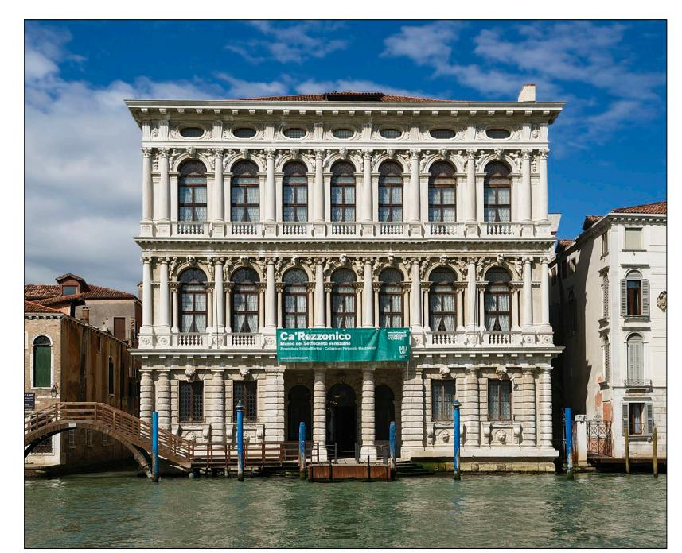

*1. Ca' Rezzonico, water façade on the Canal Grande (photo: © Didier Descouens)*

its fresco decoration, executed by Giambattista Crosato and the *quadraturista* Girolamo Mengozzi Colonna. The wedding of Ludovico Rezzonico (1726–1787) to Faustina Savorgnan in 1757 presented an occasion to commission further exquisite fresco decorations for the ceilings of the *piano nobile* facing south, executed by the most acclaimed *frescanti* at the time: Gaspare Diziani, Jacopo Guarana with Piero Visconti, and, of course, Giambattista Tiepolo with Crosato.8

Carlo Rezzonico's election to the papal throne as Clement XIII in 1758 sealed the incredibly rapid economic, social and political rise of the family. Seven years later, in 1765, his nephew Abbondio Rezzonico (1742–1810) was appointed to the princely office of Senator of Rome.9 Although both of them resided in Rome, the opulent *palazzo* in the lagoon city became the physical representation of the family's power, where the aforementioned Ludovico (now Procuratore di San Marco) and Faustina welcomed members of European aristocratic and royal families for celebrations, banquets and concerts. Over the years, the family enriched the palace with paintings, statues, and refined furniture, although we have access to little information concerning their display. The first art collection had been assembled in the second half of the 17th century by Aurelio (1609–1682), the first Rezzonico in the lagoon, in Palazzo Sagredo. This gallery, consisting in particular of contemporary, 17thcentury pictures, had been further expanded by Aurelio's nephew Quintiliano (1651–1727). After the acquisition and renovation of Palazzo Bon (later Rezzonico), the paintings were relocated there; however, after Senator Abbondio's appointment in Rome, many of them, along with drawings, jewels

8 On the palace's fresco decorations, see, among others, Gemin and Pedrocco, *Giambattista Tiepolo*, 179, 451; Ton, *Giambattista Crosato*, 113–17, 341–54; Goldhahn, *Von der Kunst*, 161–74.

9 Carlo Rezzonico was repeatedly portrayed by Anton Raphael Mengs, while Abbondio is depicted an exquisite portrait by Pompeo Batoni, acquired in 2016 by the Italian State for the Gallerie Nazionali di Arte Antica (Palazzo Barberini) in Rome.

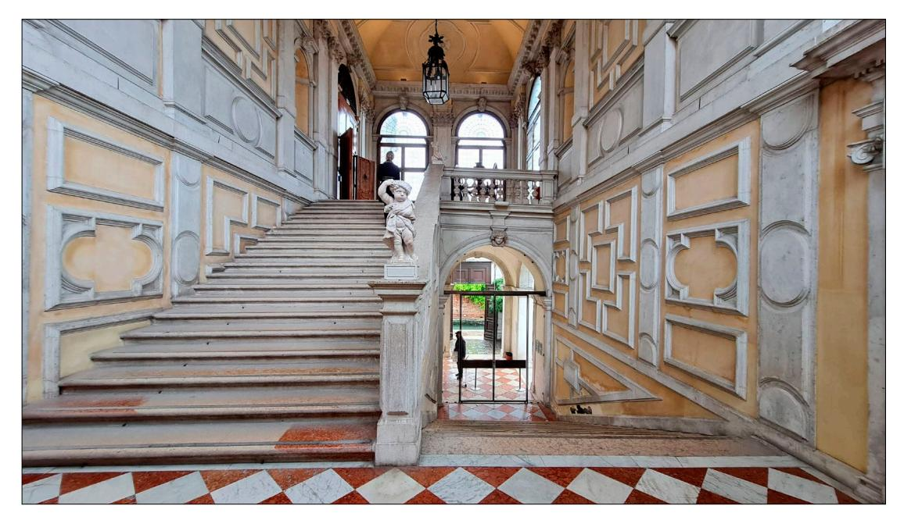

*2. Ca' Rezzonico, monumental staircase (photo: © Derbrauni)*

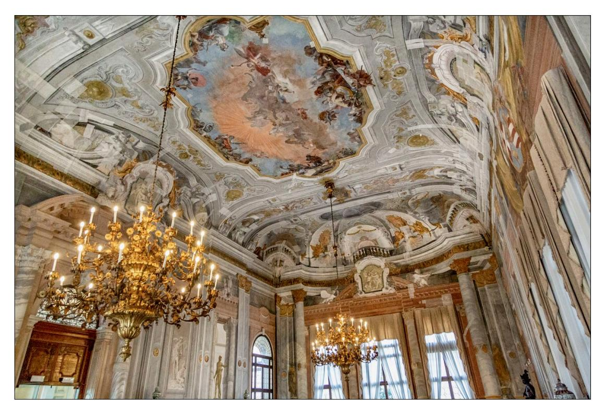

*3. Ca' Rezzonico, ballroom (photo: © Eliana Intruglio)*

and other precious objects, were transferred to his lodgings in Campidoglio.10 Ludovico was left with few works from the original nucleus of the collection, as evidenced by the inventory compiled after his death—although there are notable exceptions, as we will see shortly.

#### **The Dispersal of the Collections: The Widmann and Pindemonte Families**

As quickly as the success of the Rezzonico family had escalated over the course of relatively few generations, just as rapidly came its disappearance. In 1810, Abbondio Rezzonico passed away childless, and the family died out. His brother-in-law Ludovico Widmann, husband of his sister Quintilia (1722–1784), and later their son Antonio Widmann Rezzonico inherited his estate, which included the Venetian palace. The transfer of ownership from the Rezzonico to the Widmann-Rezzonico took place during the profound crisis that hit the Venetian *patriziato* after 1797. The Fall of the *Serenissima* and the Napoleonic and Habsburg rules over Venice (1797–1866) disrupted the—already precarious—status of the old Venetian nobility. After Napoleon, and later the Austrian Emperors, abolished the privileges of the old *patriziato*, their widespread decline took different forms: political, due to their gradual, *de facto* exclusion from political life (whereas previously they were the only ones who could access it); social, with their equalization to the mainland nobility; economic, mainly due to the long-standing indebtedness of numerous families and the rulers' harsh fiscal policies.11 Napoleon's definitive abolition of the fideicommissum, while allowing some families to remedy a situation of indebtedness through the division of assets, caused, in many cases, the dispersion of important estates and art collections formed in Venice through centuries of meticulous assemblage.12 This was also the case for the Widmanns, who split their collection of paintings from 1808 onwards.13

Therefore, it is reasonable to assume that, when Antonio Widmann Rezzonico inherited the large palace in 1810, the family's dire need for liquidity, along with the ownership of other properties, induced them to rent out the palace rather than inhabit it. During the *Serenissima*, it was not uncommon for *patrizi* to rent out or lease for themselves palaces or individual floors therein;14 the Rezzonico themselves had done it. Also the French and Austrian administrations consigned several secularized buildings to administrative purposes, but were also well aware that more than a few palaces on the Canal Grande were slowly falling into disrepair and could be rented, or even bought, for little sums.15 Hence, it is not surprising that, as early as September 30, 1814, Widmann

10 It is not possible to retrace here the entire history of the family collections and commissions. For an overview, see Noè, "Rezzonicorum cineres;" Pavanello, "I Rezzonico," 86–111; Cecchini, "Aurelio Rezzonico," 308; Goldhahn, *Von der Kunst*.

11 On this matter, see Davis, *The Decline*; Derosas, "Dal patriziato," 333–63; Derosas, "Aspetti economici," 80–132; Hunecke, *Il patriziato veneziano*; more recently Dal Cin, *Il mondo nuovo*.

12 On the abolition of the fideicommissum, see Derosas, "Aspetti economici." On the fideicommissum during the *Serenissima*, see Lanaro, "Fidecommesso" (with bibliography); Lanaro, "Les stratégies patrimoniales;" Woolf, "L'Ottocento," 11.

13 Magani, "Il collezionismo;" Pavanello, *Gli inventari*, 166–67.

14 See Megna, "Comportamenti abitativi."

15 For example, in 1818, searching for extra storehouses for the paintings from the newly opened Pinacoteca Accademica, the Viennese administration described Venice as a city in which "über 4000 Häuser Eigenthum des Staats sind, und wo die prächtigsten Paläste um eine weit geringere Summe erkauft werden können" quoted from: Baumgartner, "Riflessioni," 70, n. 11.

leased the palace to Johann Baron Waldstätten, counsellor to the Austrian emperor Francis I, as a seat for the General Tobacco Revenue Administration (*Amministrazione Generale della Finanza Tabacchi*).16 This can be deduced from a contract in the Pindemonte-Rezzonico family archival fond, which preserves numerous rental agreements for the Rezzonico Palace, stipulated between 1814 and 1857. Such contracts are useful not only because they provide information about the palace's tenants, but also by virtue of the attached consignment states (*stati di consegna*), which often describe in great detail the appearance of the palace's rooms, as well as the furniture and artworks within. For instance, the above-mentioned contract from 1814 specifies that the rooms could be freely repurposed as offices, but that the owner planned to gather and collect "tutti i mobili […], quadri, spec[c]hi, statue, fornimenti, tappezzerie". To this end the "sala grande"—possibly the ballroom— remained for Widmann's private use, in order to "ponervi dentro tutti quei mobili che credesse opportuno di raccogliere, e custodire."17 This suggests that Ca' Rezzonico was still completely furnished at that point. A few months later, Waldstätten issued a public notice that on February 1, 1815, an auction selling Albanian tobacco would be taking place in the palace.18 Although a duration of twenty years had been proposed, the lease with the Amministrazione Generale della Finanza Tabacchi only lasted one year, as per the decision of the administration in Vienna.19

After Antonio's passing in 1816, an inventory of the palace was drawn up in 1817.20 While it still describes a number of valuable furnishings in the rooms (mirrors, tables, armchairs, etc.), only very few paintings are listed. However, the inventory does not include a description of the ballroom, where, as we have seen, Antonio intended to gather all the "precious things." After the death of his brother Francesco Widmann Rezzonico (1753–1825) in 1825, the Rezzonico assets passed onto their nephew Carlo Pindemonte Rezzonico (1790–1834), son of Vittoria Maria Widmann Rezzonico and Giovanni Pindemonte.21 Carlo, who lived in Verona, must have had precise intentions for the inherited estate: it does not seem accidental that, in September 1825, a sale of the Rezzonico painting collection is reported. It is mentioned in two letters written by Giovanni Querci della Rovere, an art dealer active in Venice at the time, whom we will meet again later.22 Querci della Rovere was well-informed on the matter, not only thanks to his profession, but possibly also because he had been in contact in his youth with a branch of the Widmann Rezzonico family in Verona.23 In an hitherto unpublished letter from October 1825, Querci della Rovere, outraged, described to

16 The lease contract between Antonio Widmann Rezzonico and Johann Waldstätten, September 30, 1814, fond Pindemonte-Rezzonico, b. 11, Archivio di Stato di Verona (ASVr). The archival collection is well-known to the studies, although the 19th-century documents have received somewhat less scholarly attention than the older ones.

17 The contract between Antonio Widmann Rezzonico and Johann Waldstätten, September 30, 1814, fond Pindemonte-Rezzonico, b. 11, ASVr.

18 *Collezione di leggi*, 1: 18.

19 See the note by Baron Waldstätten, January 15, 1815, fond Pindemonte-Rezzonico, b. 11, ASVr.

- 20 The inventory was published and transcribed, along with two undated inventories of paintings from the villa in Bassano, in Foscari Widmann Rezzonico, "Beni mobili."
- 21 See Pavanello, "I Rezzonico," 104, n. 70.
- 22 For Querci della Rovere, see Paruzzo, "Giovanni Querci della Rovere;" Paruzzo, "Tra Venezia e Brescia."
- 23 Some twenty years later, in 1841, Querci della Rovere wrote to Marquise Lucrezia Giovanelli, wife of Carlo Pindemonte Rezzonico, from whom he rented the second floor of the palace, that "sono 40 e più anni che frequentavo costì in Verona la sua famiglia," reminding her that when he moved to Venice, countess Vittoria Widmann Rezzonico (1763–1823) introduced him to her sister-in-law Elisabetta Duodo Widmann, wife of her brother Giovanni (1748–1805). See letter of Giovanni Querci della Rovere to Lucrezia Giovanelli, July 23, 1841, fond Pindemonte-Rezzonico, b. 59, ASVr.

collector Paolo Tosio the picture gallery's alienation a month prior by Carlo—who, according to him, "did not need the daily lunch"—as a "solemn bestiality:"

Un mese fa certo Sig. Marchese Pindemonte di Verona erede della Galleria Rezzonico, senza aver bisogno del pranzo giornaliero, fece la solenne bestialità di vendere la sua galleria copiosa, che dei soli scarti, qui in parte venduti a dei negozianti hanno ricavato la somma dei 12000 franchi che importò la totalità di detta vendita. Le restano dodici capi d'opera, che a conti fatti verificheranno centomila franchi almeno. Fu acquistata da certo Monsieur Scevrin [Sivry] qui di Venezia, e da Antonio Sanquirico di Milano.24

The description as "galleria copiosa" does not seem to coincide with the picture of the halfempty palace inventoried in 1817. Either the paintings were really stored in the ballroom, or they had been moved out of the *palazzo* to another property of the Widmann family. Either way, according to the dealer, not all pictures were sold on this occasion. Among the "twelve masterpieces" kept by the family there might have been the handsome *Portrait of Nikolaus Körbler* by Paris Bordon (Liechtenstein Princely Collections, Vienna-Vaduz), one of the few artworks that belonged with certainty to Aurelio Rezzonico's original collection and that, as late as 1872, was bought from Countess Adriana Widmann Rezzonico by Prince Johann II of Liechtenstein.25 The two dealers mentioned, "Monsieur Scevrin", that is, Auguste-Louis de Sivry, and Antonio Sanquirico, were two of the most successful dealers in the lagoon at that time. The formulation seems to suggest that the sale of the pictures had been handled privately, not as a public auction. This seems to be confirmed by the fact that, one year later, an uninformed Giovanni Widmann Rezzonico wrote to Querci della Rovere, inquiring about the collection of his ancestors: the merchant, after judging the sale prices to be too low, provided further names of the fellow art dealers involved, informing the count that some of the paintings had been sent for sale to Milan and London:

[…] sono a confermar Le quanto L'espressi a voce sulla vendila dei quadri del fu Principe Rezzonico e d'altri oggetti preziosissimi di mosaici, etc., venduti al più vil prezzo del mondo, tanto gli uni che gli altri. Avendo inteso che cinque dei più distinti quadri furono spediti da certo signor Alvise Albrizzi a Londra che furono colà venduti per tremila Zecchini. Altri simili quadri furono venduti a Milano per grosse somme, ed uno solo del celebre Sasso Ferrato di cinque figure che fu venduto da certo Monsieur Luigi di Scevrin [Sivry] ai due fratelli Barbini negozianti di quadri per quattromila svanziche, come è noto a tutta Venezia, ricercando al presente il prezzo di mille zecchini del anzi detto quadro.26

The dispersion of the *galleria* after the sale in September 1825, or perhaps even Alvise Albrizzi's shipping to the British capital, might be related to the subsequent sale at Williams in London, in June 1827, of a group of paintings, among which six were described as "formerly the property of Cardinal Rezzonico": a small landscape on copper by Paul Bril, a pair by Michiel Sweerts (an *Interior* and a *Painter's Study*), a *David Pointing to Goliath's Head* attributed to Guercino, and two small landscapes by Salvator Rosa.27

24 Letter from Giovanni Querci della Rovere to Paolo Tosio, October 4, 1825, b. 57, fasc. 66, nr. 9, fond Avogadro del Giglio-Tosio, Archivio di Stato di Brescia (ASBs).

25 See Noè, "Rezzonicorum cineres," 181.

26 The letter dated December 10, 1826, was published in Rezzonico, "Beni mobili e quadri," 75–76.

27 See *Collection of Capital Pictures*, lots. 5, 7, 9, 16, 21–22. Sweert's *Artist's Studio* (Detroit Institute of Arts) and

Seven years later, on June 4, 1832, the Pindemonte-Rezzonico organized a voluntary public auction to sell off, it seems, all the furnishings that remained in the palace (fig. 4).28 The lots included antiquities, sculptures, and, notably, eight bas-reliefs by Antonio Canova, 27 drawings by Giovanni Battista Piranesi for the new choir in the Basilica of San Giovanni in Laterano (commissioned by pope Rezzonico), and 42 drawings by the architect Giacomo Quarenghi.29 Indeed, the aforementioned Abbondio Rezzonico had been a collector, art enthusiast, and patron in Rome of various Italian and foreign artists, such as Piranesi, from whom he commissioned drawings and designs for interiors and furniture, and was, in turn, also deeply influenced by the artist's taste.30 In 1777 Abbondio asked Quarenghi to design a Sala della Musica in Campidoglio, inaugurated in 1779, and some years later, when the architect was already in Saint Petersburg, the Senator invited him to present designs (never executed) for a city theatre in Bassano.31 Abbondio's closest relationship was with Antonio Canova, whom he had met and befriended in 1778, and to whom, along with his brothers, he had entrusted

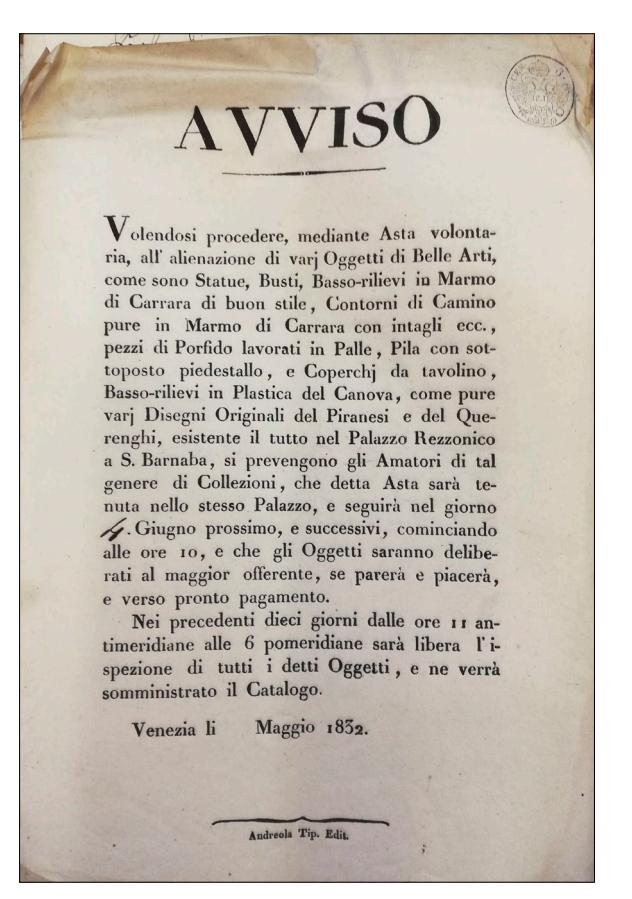

*4. Public notice for a voluntary auction of artworks in Palazzo Rezzonico, May 1832, Archivio di Stato di Verona (© Ministero della Cultura, Archivio di Stato di Verona)*

the execution of the funerary monument (1787–1792) for his uncle Clemens XIII in Saint Peter's Basilica. Possibly during this commission, the sculptor began to work for Abbondio on a series of thirteen plaster bas-reliefs, depicting personified allegories, and episodes inspired from the *Iliad*, the *Odyssey*, Socrates' *Phaedo*, as well as two scenes of Mercy (today Fondazione Cariplo) (fig. 5).32 They all entered the villa in Bassano between 1793 and 1795, and, as already mentioned, at least

the *Interior* (now titled *Old Man and Boy by a Brazier or Allegory of Winter*, private collection) were recorded in an 1808 inventory of paintings belonging to Antonio Widmann, see Detroit Institute of Arts, accessed January 15, 2023, https://dia.org/collection/studio-63102 (with bibliography). It is not possible to determine at present whether the Guercino is the one now in the collections of the Museum Boijmans Van Beuningen in Rotterdam.

- 28 See Noè, "Rezzonicorum Cineres," 288–89.
- 29 For Quarenghi's drawings see Noè, "Rezzonicorum cineres," 285.
- 30 See Noè, "Rezzonicorum cineres," 241–48; Pasquali, "Roma veneziana?" 55–57 (with bibliography).
- 31 See Corradini, "Giacomo Quarenghi."
- 32 For the series, today displayed in Milan, Gallerie d'Italia-Piazza Scala, see Pavanello, "Antonio Canova;" Mazzocca, *Antonio Canova*.

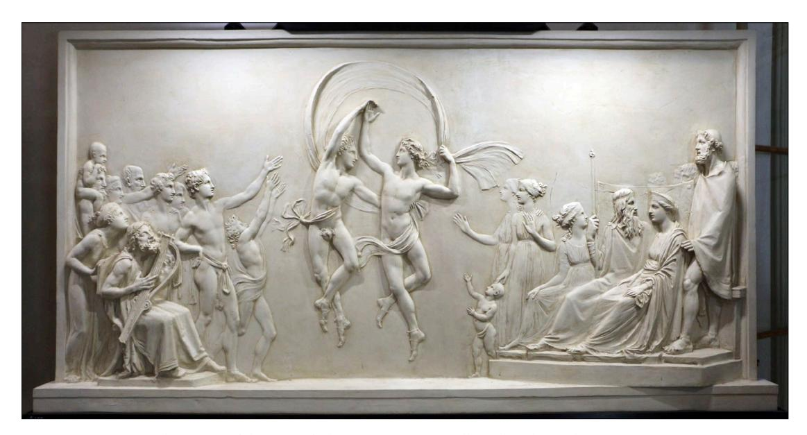

*5. Antonio Canova: The Dance of the Sons of Alcinous, 1790/92, Gallerie d᾿Italia, Milan (© Archivio Patrimonio Artistico Intesa Sanpaolo)*

eight of them were listed as lots in the 1832 auction held in Venice. We know that in 1836 all thirteen reliefs were in the possession of a Paduan collector, the lawyer Antonio Piazza,33 so it is possible that he, or an intermediary, acquired them at this auction.

A newspaper article from 1931 by the art critic Ugo Ojetti, on the occasion of the acquisition of the Rezzonico Palace by the municipality, recalls also a previous auction, supposedly held in 1831 in San Teodoro.34 It was not possible, however, to glean any further information on this first sale. It may have taken place at the former Scuola Grande di San Teodoro, which at that time housed the commercial enterprise of the art dealer Antonio Sanquirico, who, as we have seen, had already been involved in the acquisition of the paintings from the Rezzonico gallery in 1825 and whose catalogue of lithographs illustrated, among others, also ancient Roman busts pertaining to the *Museo Rezzonico* in Venice.35

Not incidentally, from 1834 onwards, when—after Carlo Pindemonte Rezzonico's death, the administration of the family's estate passed onto his wife, Marquise Lucrezia Giovanelli Pindemonte—we find an uninterrupted sequence of lease contracts between the *marchesa* and various individuals, who mostly rented one floor of the building. From 1834 to 1836, perhaps even later, the *piano nobile* and the *mezzanino* were leased to the British Colonel and architect Robert Smith (1787–1873), who had spent many years in India in the employ of the East India Company, before returning to Europe and settling for a time in Venice.36 From the accurate description of the

35 See Perry, "Antonio Sanquirico," 72–73.

33 After being in the possession of Piazza (1772–1844), who displayed them in his home, the bas-reliefs passed onto the counts of San Bonifacio, before entering the collection of the Cassa di Risparmio delle Provincie Lombarde in 1991.

34 Ojetti, "Il palazzo Rezzonico," 3.

36 See the lease contract between Lucrezia Giovanelli Pindemonte and Robert Smith, November 6, 1834, and the additional contract for the *mezzanino* from October 20, 1836, fond Pindemonte-Rezzonico, b. 11, ASVr. Not

furnishings in the consignment state, one infers that various artworks were still in the palace. Besides a few unspecified paintings in the "small room" of the first floor, for which Giovanelli reserved the right to have inspected and to take measures for their preservation37 or the two *Telamoni* by Alessandro Vittoria (still in the palace today), particularly noteworthy are four oil paintings attributed to Luca Giordano in the *portego* of the first floor. The subjects are described as: "1. S. Andrea in croce - 2. La Morte di Archimede - 3. Teseo che scuopre la Testa di Medusa - 4. Centauro ferito in atto di rapire una donzella." The first and second painting measured, after conversion, ca. 255 x 301 cm, whereas the third and fourth painting ca. 255 x 356 cm.38

It should be noted that two paintings attributed to Luca Giordano hung in 1682 in the *portego* of Palazzo Sagredo after Aurelio Rezzonico's death, whose testament registers a "Sant'Andrea morto levato di Croce da Manigoldi" and an "Archimede ucciso da Soldati."39 In the inventory recently uncovered by Almut Goldhahn from 1686, we know that Quintiliano enriched the uncle's *quadreria* and hung in the same *portego* two further paintings by Giordano, possibly even commissioned by himself: a "Guerra de Lapeti" and a "Testa di Medusa con Perseo."40 We find the same four paintings described in the *portego* of Palazzo Rezzonico (probably transferred from Palazzo Sagredo once the new residence was completed) in the inventory of 1767 (1766 *more veneto*), drawn up after Abbondio's move to Rome,41 and also in the one from 1786, after Ludovico Rezzonico's death.42 Indeed, as noted by Pavanello, the Giordano were not among the paintings chosen by Abbondio to be moved to Rome because they were framed in the *portego* walls by plaster moldings.43 It is meaningful that, possibly for the same reason—and in spite of the transfers, auctions and sales—we find them still in the *portego* in 1834, at least until 1853, when the legal representative of the Marquise Giovanelli Pindemonte in Venice wrote to her about an offer made for the acquisition of the four paintings.44

The subjects of the first two are to be understood as the *Deposition of Saint Andrew From the Cross* and *Archimedes' Death.* Their identical measurements, as well as the common death theme,

much was known about Robert Smith's time in Venice. See James, "A Fairy Palace," 286. Smith and his wife must have remained in the lagoon for about a decade because in the Seminario Patriarcale, in the second cloister on the left, Contarini, *Lapidi sepolcrali*, 269, listed a tombstone with a commemorative inscription for the tragic death of their three children in 1843: "A memoria di Giovanni – Edoardo – Maria Smith vaghi e graziosi bambini che di soli pochi mesi morte ne rapì all'amore degli affettuosi genitori Roberto Smith Colonnello di S. M. Brittanica Cav. dell'illustr. Ordine del Bagno d'Inghilterra, ecc. ecc. e Giulietta nob. Vitton dolenti i congiunti questa posero il V. maggio MDCCCXLIII."

- 37 See the lease contract cited above, n. 36.
- 38 The measurements in Venetian *piedi* and *once* for the first two are 7 feet and 4 inches high x 8 feet and 8 inches wide; the other two were 7 feet and 4 inches high x 10 feet and 3 inches wide.
- 39 See Noè, "Rezzonicorum cineres," 176.
- 40 See Goldhahn, *Von der Kunst*, 61.
- 41 In 1766 they are described in the first Portico: "Quattro quadri grandi incassati con stucchi nel muro formano quattro facciate, uno rapresenta la morte di Archimede in Siracusa; l'altro la morte di S. Andrea Appostolo; il terzo la Favola di Perseo con la testa di Medusa; il quarto un rato di Cintauri: tutti quattro di Luca Giordano." See Pavanello, "I Rezzonico," Doc. A., nr. 5.
- 42 In 1786 they are listed, along with a few other paintings from Aurelio's original collection, once again in the *portego* of the first floor as "Quattro quadri grandi incassati nelli stucchi di Luca Giordano." See Noè, "Rezzonicorum cineres," 257.
- 43 Pavanello, "I Rezzonico," 96, n. 19.
- 44 See the letter of Marco Pellini to Lucrezia Giovanelli Pindemonte, October 5, 1853, fond Pindemonte-Rezzonico, b. 59, ASVr.

do speak for their conception as *pendants*. The same could be said for the third and the fourth painting, considering the subjects derived from Greek mythology: *Perseus Beheading Medusa*, and the *Battle Between the Lapiths and Centaurs* (indeed, the "wounded centaur" could be Eurytion, and the "damsel" the abducted Hippodamia). Hence, the tradition according to which Luca Giordano's four paintings in Ca' Rezzonico in the 19th century were of religious subject45 is only partly correct, since one depicted a historic subject and two of them mythological ones. Also, even though they bear the same authorship in the inventories, they were two distinct pairs, and entered the collection at different times. Although these themes are present in Giordano's *oeuvre*, 46 no certain association can be drawn with known paintings by the Neapolitan master, nor painters of similar style. Nevertheless, the newly found measurements in the contract's consignment state—which were not specified in any of the collections' inventories—along with their presence in the palace until 1853 offer valuable indications for possible future identifications and may rule out some of the suggestions proposed so far.47

Meanwhile, in the same period, from 1836 onwards, Lucrezia Giovanelli was renting out the third (and last) floor of the palace (the so-called *camerini*) and two rooms on the second floor to the young Giuseppe Bertoja (1803–1873).48 A student of Francesco Bagnara, Bertoja would go on to become, along with his son Pietro, one of the most celebrated set designers in Venice. He mainly worked for the Fenice and for other Venetian theatres—notably designing the sets for the premieres of several operas by Giuseppe Verdi—but produced designs also for the Royal Theatre in Turin and the Scala in Milan.49 Because the Venetian *Guida Commerciale* of 1846 lists his studio in "Palazzo Rezzonico,"50 he must have resided there for at least a decade. Thus, Bertoja was surely acquainted with another tenant in Ca' Rezzonico: Giovanni Querci della Rovere (1770–1865), the art dealer, who, as we have already seen, some fifteen years prior was well-informed about the sale of the Rezzonico collection. In 1841, he managed to persuade Lucrezia Giovanelli, not without difficulty, to let him rent the second floor of the palace.51 Intending to remain in Venice permanently—after years of travelling from Venice to royal courts, museums, fairs and collectors' houses throughout Europe—the art dealer, probably making use of the capital he had accumulated and helped by his first-born Federico, was looking for the right location for his commercial gallery, as well as for a new house for his large family.52 In the splendid setting of the *portego* of the second floor,

45 See, for example, Pedrocco, *Ca' Rezzonico*, 42.

46 See Ferrari and Scavizzi, *Luca Giordano.*

47 For instance, the long-standing identification of one of the four pictures with the *Death of Archimedes* by Giovan Battista Langetti (private collection), first suggested by Giuseppe Fiocco (see Noè, "Rezzonicorum cineres," 184– 85), seems less convincing. Not only do the measurements not seem to coincide, but, even though Langetti's painting bears a provenance from Palazzo Widmann Foscari, the four canvasses, as mentioned earlier, remained until 1854—and perhaps even later—in the Rezzonico Palace, at a time when it was no longer owned by the Widmanns, but had already passed onto the Pindemonte.

48 See the lease contract between Lucrezia Giovanelli Pindemonte and Giuseppe Bertoja, September 10, 1836, fond Pindemonte-Rezzonico, b. 11, ASVr.

49 For Bertoja, see Muraro and Biggi, *Giuseppe e Pietro Bertoja*.

50 *Guida Commerciale*, 304.

51 See lease contracts between Lucrezia Giovanelli Pindemonte and Giovanni Querci della Rovere, September 14, 1841, and August 24, 1843, in b. 11, as well as their extensive correspondence in b. 59, fond Pindemonte-Rezzonico, ASVr.

52 See Paruzzo, "Giovanni Querci della Rovere," 28–29.

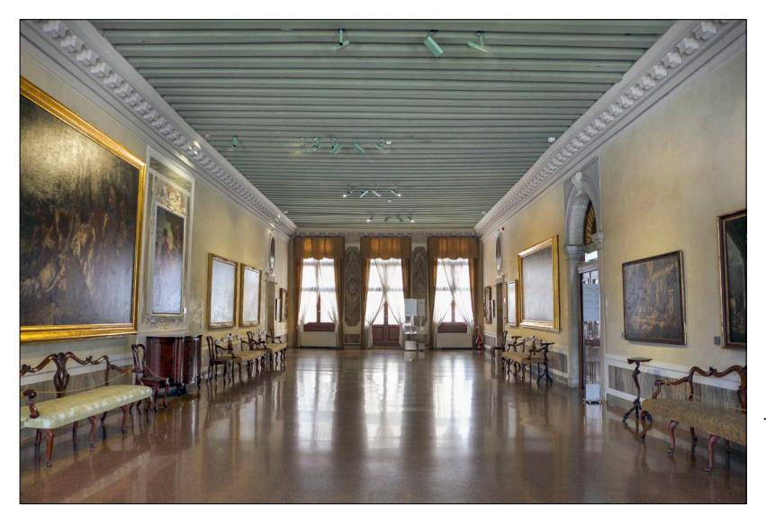

*6. Ca' Rezzonico, Venice, the portego on the second floor where Querci della Rovere displayed his commercial gallery from 1841 (photo: © Sailko)*

overlooking the Grand Canal, Giovanni and Federico displayed their paintings, just like in a true aristocratic gallery (fig. 6). The Della Rovere collection was acclaimed in several guidebooks and newspaper articles described the numerous, precious paintings displayed.53 One could try to trace his Guercino, Caravaggio, Carracci, Tiepolo, Canaletto, Veronese and Titian, but it is impossible, for example, he owned the paintings Gianjacopo Fontana described as coming from the Magistrato del Sale or the Chiesa dei Servi.54 The provenance information and the attributions, in all probability relayed to the authors by the dealer himself, should thus be taken *cum grano salis*. According to Fontana, Giovanni and Federico's gallery also contained paintings that were once in the Rezzonico villa in Bassano.55 Again, there is no data to substantiate this claim.56

The dealers' desire to embellish the provenance of their paintings goes hand in hand with the popular custom, in Austrian Venice, of renting palaces floors to display commercial galleries. Such venues were probably aimed at ennobling the antiquarians' collections. Socially, politically, and culturally characterized places, which had once been the physical representation of the social prestige and political power of their former aristocratic owners (such as the Rezzonico) and of the lost *Serenissima*, the settings were able to legitimize the collections of the tenants on a par with the many, scattered collections of the *patriziato*. 57

Whatever Querci della Rovere's intentions might have been, the presence of his gallery, along with Giuseppe Bertoja's studio, anticipated the type of artistic settings Ca' Rezzonico would host in the second half of the century particularly. But the ateliers needed to wait. In fact, all tenants, not long after, had to leave the palace. From 1847 until 1858, Marquise Giovanelli rented the building to Duke Francesco V of Modena (1819–1875) through the intermediation of Taddeo Wiel, the Estense

53 See, among others, Lecomte, *Venise*, 293; Binzer, *Venedig*, 366; Pulissi, "Pinacoteca," 181–82.

54 As rightly pointed out by the editor in Fontana, *Venezia monumentale*, 36, n. 7. Fontana's original edition was written in the 1840s.

55 Fontana, *Venezia monumentale*, 33–36.

56 There seems to be no overlapping so far between the paintings described or recorded in their possession with the ones registered in the Bassano inventories of 1817.

57 On the subject, see Paruzzo, "Antiquari e gallerie" (forthcoming).

Consul in the lagoon city.58 Over the years, in the Rezzonico Palace—though sporadically—his sister Maria Beatrice d'Austria-Este (1824–1906) resided, with her husband Juan Carlos de Borbon (1822–1887), and their son Carlos.

#### **The Sale to Zieliński in 1857 and the Artists' Studios**

In 1857 (not 1837),59 Lucrezia Giovanelli Pindemonte sold the palace to "Ladislao Zelenski," probably to identify with the Polish nobleman Władysław Zieliński (1836–1895).60 A native of Lviv, Zieliński, after a youth spent in the army, dedicated himself to the study of literature, historiography and heraldry.61 According to his autobiography, which tellingly opens with the exclamation "Wenecya!" ("Venice!"), Zieliński visited the lagoon city for the first time in 1853, at the age of 17, and instantly fell in love with it.62 When he volunteered to fight as a cadet in the Imperial army, he took part in the Italian campaigns in the 1850s and the acquisition of the palace might date back to this period, though one must note the relatively young age of the count in 1857. Equally puzzling is how Zieliński seems to have never lived in the palace: he travelled to the lagoon city more than once during his life, but in the long and detailed descriptions of Venice, its attractions (churches, palaces, Piazza San Marco), its history, and traditions, contained in his memoirs *Ze wspomnień żołnierza* ("Memories of a Soldier"), Ca' Rezzonico is never once mentioned, nor does he ever recount even seeing it or being there.63 Nevertheless, we know by now it was not uncommon to rent out a palace and never reside there, as the Widmann and Pindemonte families' habits have shown.

After Zieliński's acquisition, the rooms of Palazzo Rezzonico seem to have been leased to several artists to be employed as ateliers. Indeed, it was not uncommon for artists in Venice during Austrian rule to buy or rent floors or rooms of former aristocratic palaces to host their studios for both short and long periods of time. Many examples could be mentioned: Francesco Hayez' and Ludovico Lipparini's studios in Palazzo Moro Lin, Natale and Felice Schiavoni's in Palazzo Giustiniani dei Vescovi, or Friedrich Nerly's, among many others, in Palazzo Pisani in Santo Stefano, which, after the tragic suicide of the painter Léopold Robert in 1835, had become a sort of "Romantic pilgrimage site" in Venice.64 This phenomenon seems to have increased after Venice's annexation to the newly founded Kingdom of Italy in 1866, which coincided with an increased presence of foreign—especially American—artists, travellers, collectors, and residents in the city. While not all rooms in Venetian palaces were particularly luminous, as one still sees today, they probably provided more light than the ground floors in the maze of narrow *calli*, and the much needed physical

63 See Zieliński, *Ze wspomnień żołnierza*.

58 See the lease contract between Lucrezia Giovanelli Pindemonte and Taddeo Wiel, April 11, 1847, fond Pindemonte-Rezzonico, b. 11, ASVr.

59 A mistake probably caused by a *lapsus calami* at some point*,* but still repeated in much literature concerning Ca' Rezzonico.

60 On April 22, 1857; see papers in fond Pindemonte-Rezzonico, b. 11, ASVr. Zieliński first had to provide a settlement of 75.000 Austrian lire to the Jesuits, so they would renounce their rights over the palace conceded to them by Antonio Widmann Rezzonico's will of 1816.

61 See Buonocore, "Witold Władysław Kornelius Zieliński," 162–65.

62 See Zieliński, *Ze wspomnień żołnierza*.

64 The definition is by Myssok, "Friedrich Nerly", 55 (with bibliography). For Schiavoni's studio, see Stringa, "Un palazzo."

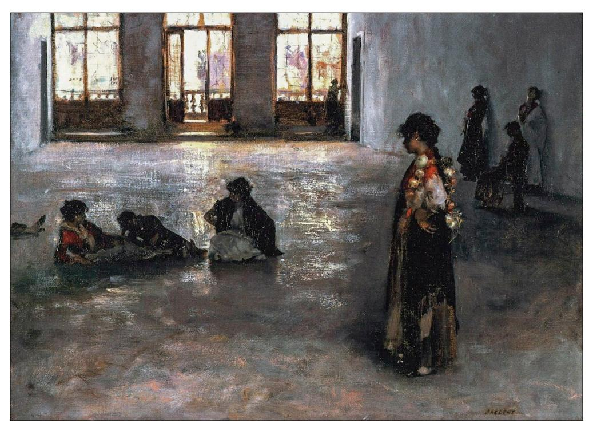

*7. John Singer Sargent: Venetian Women in the Palazzo Rezzonico, ca. 1880/81, private collection (© private collection)*

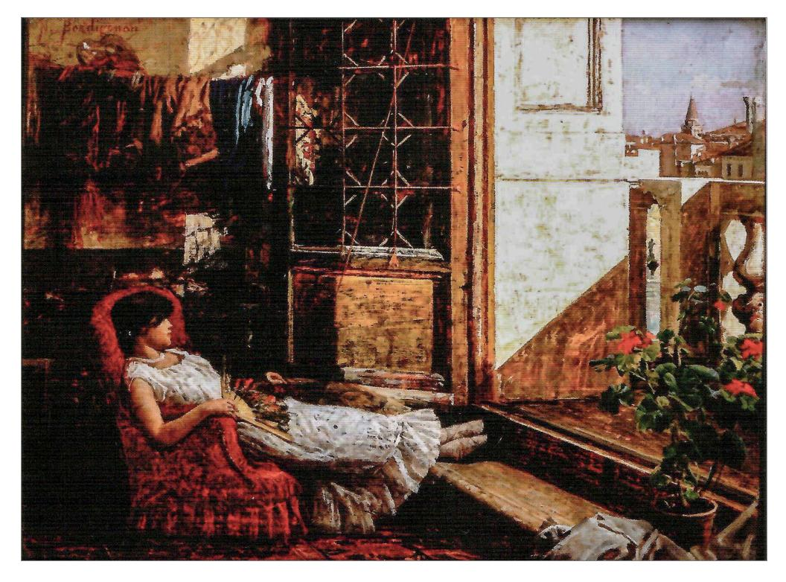

*8. Noè Bordignon: A model, 1883, private collection (© private collection)*

space and room height that artists needed and which were somewhat scarce in Venice. Particularly, Ca' Rezzonico offered the advantage of a courtyard that illuminated the *portego* from the west side as well, so that the windows on the Canal Grande were not its only source of light.

In a recent essay, Vittorio Pajusco has excellently reconstructed Ca' Rezzonico's history of tenancy in the 1870s–1880s, discussing the presence of ateliers of international and Italian painters, and publishing known, as well as previously unpublished, paintings and historic photographs reproducing its interiors.65 As early as the 1870s, the German painters Anselm Feuerbach and Leopold Carl Müller's ateliers are documented in the palace.66 From 1879 to 1882 also James Abbott McNeill Whistler, Giovanni Boldini, and John Singer Sargent rented rooms to host their studios.67 Particularly, Sargent's *Venetian Women in the Palazzo Rezzonico* (ca. 1880/81), depicting the women modelling for the artists during a break, offers a view of the *portego* on the second floor (fig. 7). As Pajusco rightly noted, the hall looks completely stripped of its furnishings at this point. On the contrary, the room north of the *portego* (today's "Sala del Parlatorio"), in which the painter Noè Bordignon a couple of years later sets another depiction of a model (fig. 8),68 stands out for its warmth: the flowers, the carpet, the furniture, the drapes hanging by a thread on the background wall, and the girl sprawled limply in an armchair convey an air of bohemian tranquillity. Her fan and light dress, the windows opened to let the bright, warm light enter the room, convey how a serene spring or summer day in the ateliers of Ca' Rezzonico may have felt. Bordignon established his studio in the palace in 1883, followed shortly after by Pietro Fragiacomo. In the following years, during the 1880s, Emanuele Brugnoli, Luigi Cima, Vittorio Tessari, Paul Tilton and Fausto Zonaro also joined them, establishing somewhat of a small serene colony in the palace, around which gravitated painters who also resided in the vicinity.69

#### **The Sale to Barrett Browning (1888) and Hierschel de Minerbi (1906)**

In 1888 the palace was acquired and restored by Robert Barrett Browning (son of the poets Robert Browning and Elizabeth Barrett) and his wife, the American Fannie Coddington, heir to a large fortune.70 Italy had been a life-long source of inspiration for his parents and Barrett Browning, himself a painter, was probably fascinated with the atelier-like setting of the Venetian palace at that time. So much so, that some of the furnishings remained the same: as Pajusco pointed out, in a previously unpublished photograph we see the same sofa (and even carpet!) that Bordignon had painted a few years prior (fig. 9).71 The spacious room featured artworks and mixed furniture from various eras, but still retained some surviving pieces of the palace's original 18th-century decor,

- 65 Pajusco, "Bordignon a Venezia," 30–32, 35.
- 66 See Pajusco, "Bordignon a Venezia," 43, n. 6.
- 67 Pajusco, "Bordignon a Venezia," 30 (with the bibliography cited in n. 8–10).
- 68 This painting is also published and discussed in Pajusco, "Bordignon a Venezia," 30–31.
- 69 Pajusco, "Bordignon a Venezia," 32, and n. 16–18.
- 70 See, for example, Pedrocco, *Ca'Rezzonico*, 11. The bibliography on the Barrett Brownings is, again, too extensive. It will suffice to refer to the well-documented Ryals, "Robert Browning."
- 71 Pajusco, "Bordignon a Venezia," 30. The photograph is kept by Wellesley College Library, Special Collections, MS Browning H231, portfolio donated by Fannie Coddington Browning, ca. 1888. I wish to thank Mariana Oller, associate curator of special collections at Wellesley College, for her kind assistance.

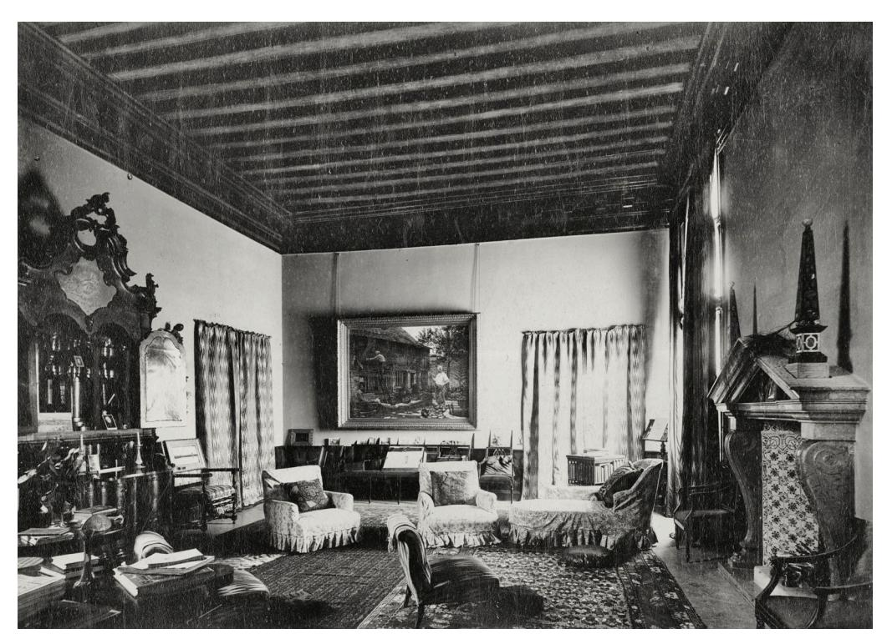

*9. Interior of today's "Sala del Parlatorio", ca. 1888, Wellesley College Library, Wellesley (© Reproduction courtesy of Wellesley College Library, Special Collections)*

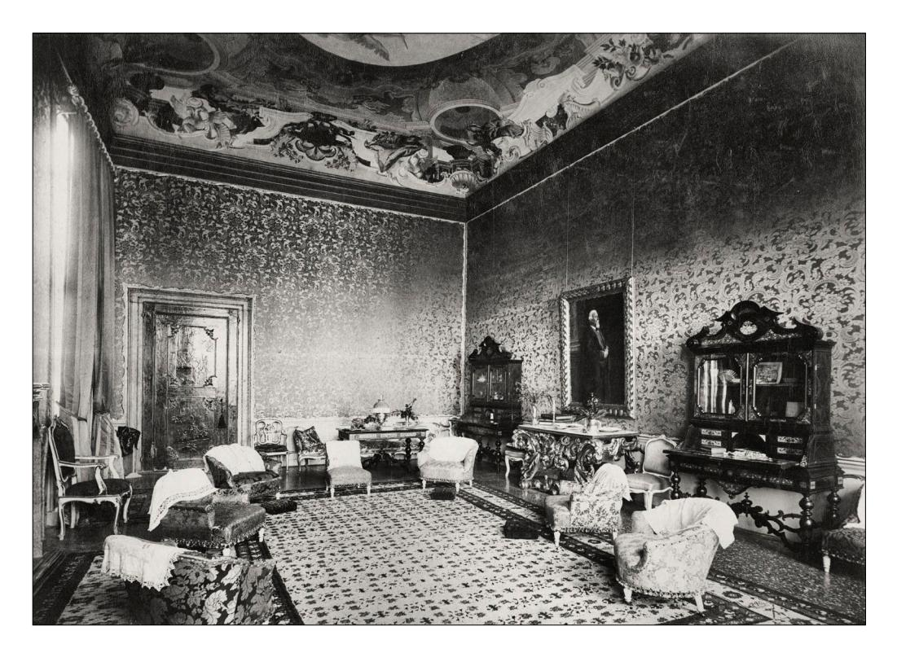

*10. Interior view of today's "Sala del Trono", ca. 1888, Wellesley College Library, Wellesley (© Reproduction courtesy of Wellesley College Library, Special Collections)*

particularly the handsome and imposing flap dresser with mirrored, two-door riser on the left.72 Similarly, another photograph from the same portfolio shows the late 19th-century appearance of today's "Sala del Trono" on the first floor (fig. 10). Here, too, we can see how, under Tiepolo's fresco, the Barrett Brownings had juxtaposed to the exquisite 18th-century carved tables, the flap bureaus with riser, and the fine chinoiserie laquered door (one of the four which originally separated the rooms of Ludovico Rezzonico and Faustina Savorgnan's apartment on the first floor73) also 19thcentury pieces, chief among them a portrait by Robert Barrett Browning of his famous father, executed in May 1889 and now displayed in the Armstrong Browning Library & Museum at Baylor University in Texas. Indeed, Robert Browning, who visited his son and daughter-in-law in Venice repeatedly, died in the palace in December 1889, shortly after composing his last work, *Asolando.* 

Ignoring Emperor Wilhelm II of Germany's offer to purchase the palace, Barrett Browning, having settled in Asolo on the mainland, sold the palace in 1906 to count Lionello von Hierschel de Minerbi. A nobleman of Jewish origins, Minerbi was an eclectic character: tennis and soccer champion, majored in engineering, he was also a real estate and agriculture entrepreneur, a Member of Parliament in Rome from 1909 to 1919, and an art dealer. During his thirty-year-long stay at Ca' Rezzonico, he refurbished the palace, in line with his unique taste, holding masquerade parties, nocturnal receptions, and *belle époque* serenades by torchlight; "signorilità elegante e sfarzo opulento e *grossier* si scontravano violentemente sotto i celebri affreschi di Giambattista Tiepolo", as noted by Filippo Pedrocco.74 I do not believe, however, Hierschel de Minerbi's activity, especially as a *marchand-amateur*, has received sufficient scholarly attention, and it is hoped this will one day be remedied. Along with the palace, it should be noted that he also owned pieces of furniture, as well as a few artworks from the original Rezzonico collection. For instance, *The Consecration of Cardinal Rezzonico in the Church of S.S. Apostoli*, a large canvas attributed to Giovanni Paolo Panini, was still in the palace in 1929, but later somehow came onto the art market.75 Research on Hierschel de Minerbi's activity may thus provide further insight into the last phase of the dispersion of the Rezzonico art treasures.

In the early 1930s, Minerbi, due to financial difficulties and the harsh political climate, began to discuss the sale of the palace with the Venetian municipality. After five-year-long negotiations, in 1935 Ca' Rezzonico was acquired by the Municipality, in order to exhibit its illustrious and large 18th-century collection of paintings, detached frescoes, sculptures, furniture, and objects of applied

72 The dresser (ca. 1740/60) is still in the collection of the Musei Civici, see Fondazione Musei Civici, accessed August 3, 2023, https://www.archiviodellacomunicazione.it/sicap/OpereArte/7533/?WEB=MuseiVE.

73 The refined doors—possibly designed by Giambattista or Giandomenico Tiepolo in the late 1750s in connection with the apartment's fresco decoration—were evidently still in situ in the 1880s. They were sold by Hierschel de Minerbi (see below) to Adolph Loewi before the palace was transferred to the Municipality in 1935. Loewi donated one to the Gallerie dell'Accademia, today exhibited in Ca' Rezzonico. See Santini, *Mille mobili veneti*, 3: 320–23 (with bibliography). The three remaining doors are scattered today in various international collections. The one shown in this photograph was split by Loewi, who sold the shutter visible here—featuring a European rider in the upper panel and a Chinese gentleman below—to the architect and collector John Yeon. It was lastly exhibited at *Quest for Beauty: The Architecture, Landscapes, and Collections of John Yeon*, Portland Art Museum, May 13 – September 3, 2017. Loewi offered the other shutter to The Art Institute of Chicago (inv. 1953.461). I thank Mairead Horton for her fundamental help in retracing the object's history.

74 Pedrocco, *Ca' Rezzonico*, 11.

75 For the painting, first published by Vittorio Moschini in 1929, see now Finocchi Ghersi's catalogue entry in Nante, Cavalli, and Pasquali, *Clemente XIII Rezzonico*, 79–81 (with bibliography). Cf. also the annotations in scheda nr. 62811, Fototeca Federico Zeri, Università di Bologna. The canvas was in London with Chaucer Fine Arts by 2003, was auctioned at Sotheby's in 2021 (*Old Masters Day Sale*, July 8, 2021, lot 186), and is currently (2023) with the Cesare Lampronti Art Gallery.

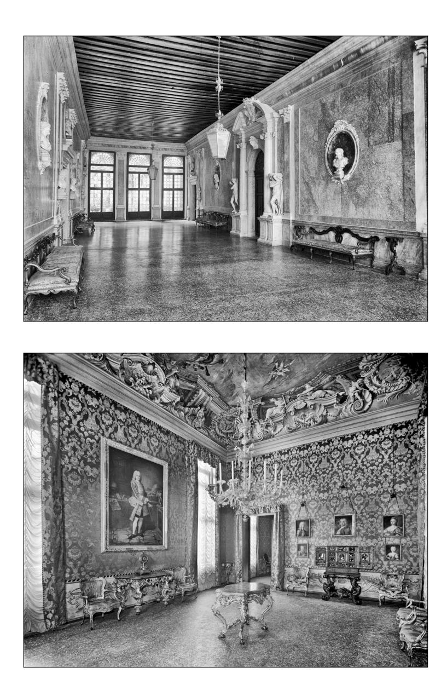

*11. Barbantini and Lorenzetti's display in the portego of the first floor of Ca' Rezzonico after the inauguration of the Museo del Settecento, 1936 (© Archivio fotografico del Comune di Venezia)*

*12. Barbantini and Lorenzetti's display in the "Sala dei Pastelli" of Ca' Rezzonico, 1935 (© Archivio fotografico del Comune di Venezia)*

arts originally pertaining to Ca' Rezzonico, as well as to other Venetian palaces. The *Museo del Settecento veneziano*, with a display curated by Nino Barbantini and Giulio Lorenzetti, opened to the public in July 1936. Various historic photographs by the Giacomelli agency document the duo's original museographic concept (figs. 11–14).76 The museum's opening took place in the context of the critical revaluation of 18th-century art and culture. Indeed, a few years prior, Barbantini and Lorenzetti had jointly set up the influential exhibition *Il Settecento italiano* (1929) in the Biennale's premises and would go on to organize in Ca' Rezzonico, between 1936 and 1939, a series of yearly exhibitions dedicated to Venetian 18th-century applied arts.77

76 The Fondo Archivio Fotografico Giacomelli, which consists of photographic material belonging to Reale Fotografia Giacomelli, one of the most important Italian photographic agencies of the 20th century, is owned by the Municipality of Venice.

77 See Tomasella, "Venezia 1929."

*13. Barbantini and Lorenzetti's display in the "Sala del Trono" of Ca' Rezzonico, 1935 (© Archivio fotografico del Comune di Venezia)*

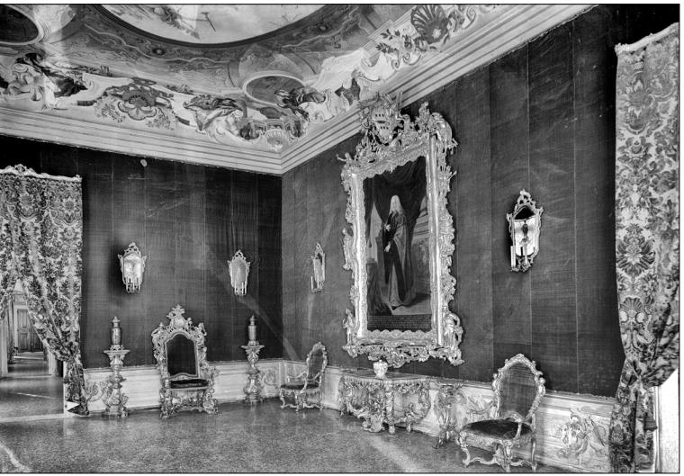

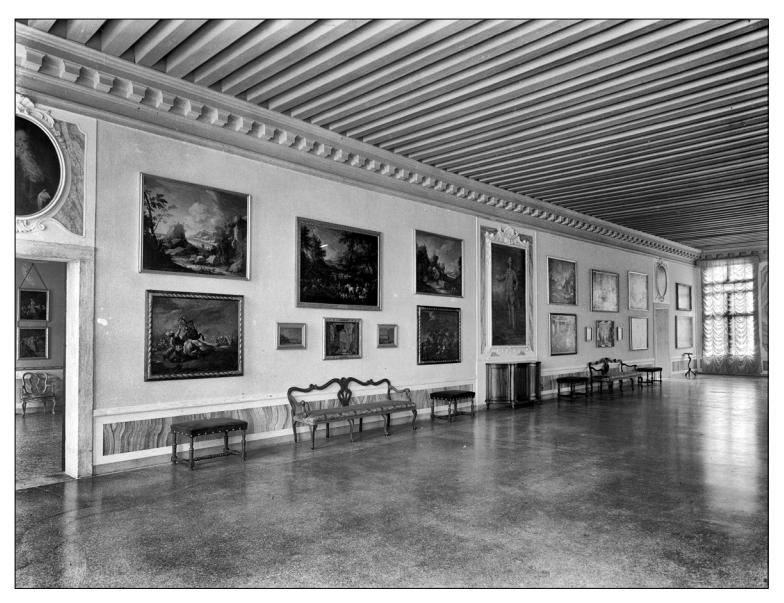

*14. Barbantini and Lorenzetti's display in the "Portego dei Dipinti" on the second floor of Ca' Rezzonico, 1936 (© Archivio fotografico del Comune di Venezia)*

• ․ •

Today, Ca' Rezzonico contains rare ensembles (such as Giandomenico Tiepolo's frescoes for the *villa* in Zianigo) and has been enriched by subsequent donations, among which Ferruccio Mestrovich's and Egidio Martini's art collections are displayed in the palace in especially dedicated rooms. Due to the municipality's careful refurbishment, the building bears few signs of its tumultuous 19th-century vicissitudes, but instead offers today a glimpse into the life of aristocratic Venice in the 18th-century and the splendour of the epoch in which the Rezzonico family once flourished.78

78 The author wishes to thank the conference organizers for providing a fruitful opportunity to encounter and exchange views in Ljubljana, as well as Vittorio Pajusco and the anonymous reviewers for their insightful comments on an earlier draft of this article.

#### **Bibliography**

Bassi, Elena. *Palazzi di Venezia: Admiranda urbis Venetae*. Venezia: La stamperia di Venezia, 1976.

Baumgartner, Eva Maria. "Riflessioni sulle vicende conservative di opere d'arte a Venezia durante la seconda dominazione austriaca." In *La cultura del restauro: Modelli di ricezione per la museologia e la storia dell'arte*, edted by Maria Beatrice Failla, Susanna Adina Meyer, Chira Piva, and Stefania Ventra, 61–72. Roma: Campisano, 2013.

Binzer, August. *Venedig im Jahre 1844*. Pesth, 1845.

Buonocore, Marco. "Witold Władysław Kornelius Zieliński (1836–1895) e Francesco Foucalt di Daugnon (1836–1920): In margine alle relazioni italo-polacche di fine Ottocento." In *Un intellettuale polacco sulle strade d'Europa: Studi in onore di Jan Władysław Woś*, edited by Antonello Biagini and Francesco Dante, 147–65. Roma: Edizioni Nuova Cultura, 2010.

Cecchini, Isabella. "Aurelio Rezzonico." In *Il collezionismo d'arte a Venezia: Il Seicento*, edited by Linda Borean and Stefania Mason, 308. Venezia: Marsilio, 2007.

*Collection of Capital Pictures: The Genuine Property of a Gentleman Going Abroad. June 2, 1827*. London 1829.

- *Collezione di leggi, avvisi, sentenze, notificazioni, vendite, acquisti, offerte, progetti, aste e di tutte le altre carte derivanti dalle autorità di questa centrale e suo dipartimento cominciante dal primo gennajo di quest'anno 1815*. Vol. 1. Venezia, 1815.
- Contarini, Giovanni Battista. *Lapidi sepolcrali erette nel nostro secolo a' morti.* Venezia, 1844.
- Corradini, Corrado. "Giacomo Quarenghi: La Sala della musica in Campidoglio." *Studi romani* 3–4 (2004): 463–74.
- Davis, James Cushman. *The Decline of the Venetian Nobility as a Ruling Class*. Baltimore: Johns Hopkins Press, 1962.
- Dal Cin, Valentina. *Il mondo nuovo: L'élite veneta fra rivoluzione e restaurazione (1797–1815)*. Venezia: Edizioni Ca' Foscari – Digital Publishing, 2019. http://doi.org/10.30687/978-88-6969- 313-7.
- Derosas, Renzo. "Aspetti economici della crisi del patriziato veneziano tra fine Settecento e primo Ottocento." In *Veneto e Lombardia tra rivoluzione giacobina ed età napoleonica: Economia, territorio, istituzioni*, edited by Giovanni Luigi Fontana and Antonio Lazzarini, 80–132. Milano: Cariplo, 1992.
- Derosas, Renzo. "Dal patriziato alla nobiltà: Aspetti della crisi dell'aristocrazia veneziana nell'Ottocento." In *Les noblesses européennes aux XIXe siècle: Actes du colloque de Rome; 21–23 novembre 1985*, edited by Gérard Delille, 333–63. Rome: École Française de Rome, 1988.
- Ferrari, Oreste, and Giuseppe Scavizzi. *Luca Giordano: L'opera completa*. Napoli: Electa, 1997.
- Fontana, Gianjacopo. *Venezia monumentale: I palazzi*. Venezia: Filippi, 1967.
- Fontana, Vincenzo. "Dal portego al salone: Proporzioni e armonie dell'architettura civile veneziana fra Sei e Settecento." In *Giambattista Tiepolo nel terzo centenario dalla nascita*: *Atti del convegno internazionale di studi; Venezia, Vicenza, Udine, Parigi, 1996*, edited by Lionello Puppi, vol. 1, 115–23. Padova: Il Poligrafo, 1998.
- Fontana, Vincenzo. "Scaloni e sale da musica, alcove e ridotti: Il rinnovamento dei palazzi veneziani fra il Sei e il Settecento." In *Atlante tematico del Barocco in Italia*: *Il sistema delle residenze nobiliary*; *Italia settentrionale*, edited by Marcello Fagiolo, 103–22. Roma: De Luca, 2009.
- Foscari Widmann Rezzonico, Antonio. "Beni mobili e quadri delle raccolte Rezzonico pervenuti per successione nelle raccolte Widmann." *Notiziario degli amici dei musei e dei monumenti di Bassano del Grappa* 22–23 (2000): 70–84.
- Frank, Martina. *Baldassarre Longhena*. Venezia: Istituto Veneto di Scienze, Lettere ed Arti, 2004.

- Frank, Martina. "Der Funktionswandel venezianischer Palazzi um 1700." In *Deckenmalerei um 1700 in Europa: Höfe und Residenze*n, edited by Stephan Hoppe, Heiko Lass, and Herbert Karner, 68–81. München: Hirmer, 2020.
- Frank, Martina. "From Ephemeral to Permanent Architecture: The Venetian Palazzo in the Second Half of the Seventeenth Century." In *Architectures of Festival in Early Modern Europe*: *Fashioning and Re-fashioning Urban and Courtly Space*, edited by J. Ronnie Mulryne, Krista De Jonge, Pieter Martens, and Richard L. M. Morris, 119–38. London: Routledge, 2018.
- Gemin, Massimo, and Filippo Pedrocco. *Giambattista Tiepolo*: *I dipinti; Opera completa*. Venezia: Arsenale, 1993.
- Goldhahn, Almut. *Von der Kunst des sozialen Aufstiegs: Statusaffirmation und Kunstpatronage der venezianischen Papstfamilie Rezzonico*. Köln: Böhlau, 2017.
- *Guida Commerciale di Venezia per l'anno 1846*. Venezia: Coi Tipi di Francesco Andreola, 1846.
- Hopkins, Andrew. *Baldassare Longhena: 1597–1682*. Milano: Electa, 2006.
- Hopkins, Andrew. *Baldassare Longhena and Venetian Baroque Architecture*. New Haven: Yale University Press, 2012.
- Hunecke, Volker. *Il patriziato veneziano alla fine della Repubblica: 1646–1797; Demografia, famiglia, ménage*. Roma: Jouvence, 1997.
- James, Diane. "A Fairy Palace in Devon: Redcliffe Towers Built by Colonel Robert Smith (1787–1873), Bengal Engineers." In *The East India Company at Home: 1757–1857*, edited by Margot Finn and Kate Smith, 277–97. London: UCL Press, 2018. https://doi.org/10.2307/j.ctt21c4tfn.23.
- Lanaro, Paola. "Fidecommesso, doti, famiglia: La trasmissione della ricchezza nella Repubblica di Venezia (XV–XVIII secolo); Un approccio economico." *Mélanges de l'École française de Rome: Italie et Méditerranée* 124 (2012): 519–31.
- Lanaro, Paola. "Les stratégies patrimoniales familiales de l'élite vénitienne au XVIIIe siècle." *Annales de démographie historique* 134, no. 2 (2017): 151–72.
- Lecomte, Jules. *Venise ou Coup-d'Oeil*. Paris: Hippolyte Souverain, 1844.
- Lorenzetti, Giulio. *Ca' Rezzonico*. Venezia: Ferrari, 1936.
- Magani, Fabrizio. *Il collezionismo e la committenza artistica della famiglia Widmann, patrizi veneziani, dal Seicento all'Ottocento*. Venezia: Istituto Veneto di Scienze, Lettere ed Arti, 1989.
- Mariacher, Giovanni. *Ca' Rezzonico: Guida illustrata*. Venezia: Alfieri, 1966.
- Massari, Antonio. *Giorgio Massari architetto veneziano del Settecento*. Vicenza: Neri Pozza, 1971.
- Mazzocca, Fernando. *Antonio Canova e i bassorilievi della collezione Rezzonico*. Milano: Cariplo, 1993.
- Megna, Laura. "Comportamenti abitativi del patriziato veneziano (1582–1740)." *Studi Veneziani* 22 (1992): 253–324.
- Muraro, Maria Teresa, and Maria Ida Biggi. *Giuseppe e Pietro Bertoja scenografi alla Fenice, 1840–1902: L*᾿*immagine e la scena*. Venezia: Marsilio, 1998.
- Myssok, Johannes. "Friedrich Nerly in Venedig." *MDCCC 1800* 1 (2012): 55–66.
- Nante, Andrea, Carlo Cavalli, and Pierantonio Gios, eds. *Carlo Rezzonico: La famiglia, l*᾿*episcopato padovano, il pontificato; Atti della giornata di studi*. Padova: Istituto per la Storia Ecclesiastica Padovana, 2013.
- Nante, Andrea, Carlo Cavalli, and Susanna Pasquali, eds. *Clemente XIII Rezzonico: Un papa veneto nella Roma di metà Settecento*. Cinisello Balsamo: Silvana Editoriale, 2008.
- Noè, Enrico. "Rezzonicorum cineres: Ricerche sulla collezione Rezzonico." *Rivista dell'Istituto Nazionale di Archeologia e Storia dell'Arte* 3 (1980): 173–306.
- Ojetti, Ugo. "Il palazzo Rezzonico è del Comune di Venezia." *Corriere della Sera*, November 14, 1931.
- Pajusco, Vittorio. "Bordignon a Venezia: Da Ca᾿ Rezzonico alle prime Biennali (barbaramente respinto)." In *Noè Bordignon 1841–1920: Dal Realismo al Simbolismo*, edited by Fernando Mazzocca, Elena Catra, and Vittorio Pajusco, 30–45. Genova: SAGEP, 2021.

- Paruzzo, Valeria. "Antiquari e gallerie commerciali nella Venezia asburgica." *Predella: Journal of Visual Arts* 54 (2023, forthcoming).
- Paruzzo, Valeria. "Giovanni Querci della Rovere (1770–1865): Dealer of Old Masters in and beyond Austrian Venice." In *Beyond Borders: The Key for Art Market Power*, edited by Vera Mariz and Léa Saint-Raymond, 13–34. Lisboa: Caleidoscópio (forthcoming).
- Paruzzo, Valeria. "Tra Venezia e Brescia: Questioni di gusto e collezionismo nella corrispondenza tra Giovanni Querci della Rovere e Paolo Tosio." In *Arte e carte nella Brescia dell'Ottocento: Fonti per il collezionismo e il mecenatismo*, edited by Sara Tonni, 57–90. Brescia: Archivio di Stato di Brescia, 2022.
- Pasquali, Susanna. "Roma veneziana? La città, il pontificato Rezzonico e Giovanni Battista Piranesi." In *Clemente XIII Rezzonico: Un papa veneto nella Roma di metà Settecento*, edited by Andrea Nante, Carlo Cavalli, and Susanna Pasquali, 53–59. Cinisello Balsamo: Silvana Editoriale, 2008.
- Pavanello, Giuseppe. "Antonio Canova: I gessi ῾Rezzonico᾿." *Bollettino del Museo Civico di Padova* 73 (1984): 145–62.
- Pavanello, Giuseppe. "I Rezzonico: Committenza e collezionismo fra Venezia e Roma." *Arte Veneta* 52 (1998): 86–111.
- Pavanello, Giuseppe, ed. *Gli inventari di Pietro Edwards nella Biblioteca del Seminario Patriarcale di Venezia*. Sommacampagna: Cierre, 2006.
- Pedrocco, Filippo. *Ca' Rezzonico: Museo del Settecento veneziano*. Venezia: Marsilio, 2001.

Perry, Marilyn. "Antonio Sanquirico, Art Merchant of Venice." *Labyrinthos* 1–2 (1982): 67–111.

Pignatti, Terisio. *Tesori di Ca' Rezzonico*. Milano: Martello Editore, 1965.

Pulissi, Domenico. "Pinacoteca Querci della Rovere." *Il Vaglio*, June 8, 1844, 181–82.

- Romanelli, Giandomenico. *Ca' Rezzonico*. Milano: Electa, 1986.
- Ryals, Clyde de L. "Robert Browning (1812–1889)." In *Oxford Dictionary of National Biography*, 2004. Accessed October 3, 2022, https://doi.org/10.1093/ref:odnb/3714.
- Santini, Clara. *Mille mobili veneti: L'arredo domestico in Veneto dal sec. XV al sec. XIX;* Vol. 3, *Venezia*. Modena: Artioli, 2002.
- Stringa, Nico. "Un palazzo per artisti nella Venezia dell'Ottocento: Natale e Felice Schiavoni a Ca' Giustinian dei Vescovi." In *Ca' Foscari: Palazzo Giustinian; Uno sguardo sul cortile*, edited by Francesca Bisutti and Guido Biscontin, 47–59. Crocetta del Montello: Terra Ferma, 2012.
- Tomasella, Giuliana. "Venezia 1929: La Mostra del Settecento italiano." In *Il cielo, o qualcosa di più: Scritti per Adriano Mariuz*, edited by Elisabetta Saccomani, 220–28. Padova: Bertoncello Artigrafiche, 2007.
- Ton, Denis. *Giambattista Crosato: Pittore del Rococò europeo*. Venezia: Fondazione Giorgio Cini; Verona: Scripta, 2012.
- Woolf, Stuart. "L'Ottocento: 1797–1918; Introduzione." In *Storia di Venezia: L'Ottocento e il Novecento*, edited by Mario Isnenghi and Stuart Woolf, 1–41. Roma: Istituto della Enciclopedia Italiana, 2002.

Zieliński, Władysław K. *Ze wspomnień żołnierza*. Warszawa: Naklad Filipa Sulimierskiego, 1880.

### **Ca' Rezzonico v 19. stoletju Usoda zbirke in nove namembnosti palače**

#### *Povzetek*

Prispevek na podlagi objavljenih in arhivskih virov analizira historiat zbirke v Ca' Rezzonico, eni najimpozantnejših palač ob beneškem Velikem kanalu. Spremembe v namembnosti historičnih palač starejšega plemstva v Benetkah po padcu *Serenissim*e leta 1797 predstavljajo poseben vidik pri raziskavah recepcije in novih funkcij plemiške arhitekturne dediščine v postrevolucionarni Evropi. Rezzonico, ena najuglednejših beneških plemiških rodbin, je z izvolitvijo Carla Rezzonica na papeški prestol kot Klemna XIII, je – čeprav so bili poplemeniteni relativno pozno – prišla do izjemnega političnega vpliva tako v Benetkah kot v Rimu. Njihovo palačo na obrežju Velikega kanala je zasnoval arhitekt Baldassare Longhena, dokončal pa jo je Giorgio Massari. Z impozantno, s freskami okrašeno slavnostno dvorano in izbrano razkošno opremo je bila utelešenje rodbinskega uspeha in moči. Po izumrtju rodbine Rezzonico leta 1810, je Ca' Rezzonico podedovala rodbina Widmann-Rezzonico, za njo pa Rezzonico-Pindemonte, ki sta stavbo postopoma izpraznili, prostore pa oddali različnim najemnikom. Leta 1857 je palačo kupil poljski grof Władysław Zieliński, leta 1888 slikar Robert Barret Browning, 1906 pa je njen lastnik postal podjetnik Lionello Hierschel De Minerbi. Stavba je v tem obdobju služila različnim namenom; bila je sedež Avstrijske tobačne uprave, v njej so bili urejeni umetniški ateljeji in prodajne galerije umetnin, ateljeji scenografov, pa tudi stanovanja uglednih intelektualcev in estetov. Sobane in stene Ca Rezzonico so bile priča korenitim transformacijam evropske umetnosti, okusa in kulture v dolgem 19. stoletju. Leta 1935 je palačo od Minerbija kupila beneške mestna občina, v njem uredila muzej beneške umetnosti 18. stoletja (Museo del Settecento veneziano) in razstavila zbirko umetnin, umetnoobrtnih izdelkov in pohištva 18. stoletja, katerih historiat je povezan konkretno s Ca Rezzonicom in z drugimi beneškimi plemiškimi palačami. S skrbno prenovo stavbe je občina uspešno izbrisala sledove sekundarnih posegov v burnem 19. stoletju in poskrbela za rekonstrukcijo njene podobe v poznobaročnem obdobju, v času vrhunca moči in blišča rodbine Rezzonico.